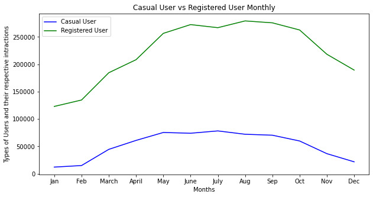
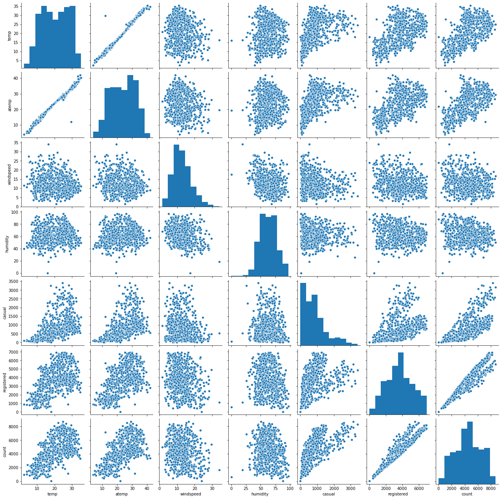

<h1 align = 'center'> Boom Bikes


    


### Problem Statment:

A US bike-sharing provider BoomBikes has recently suffered considerable dips in their revenues. They have contracted a consulting company to understand the factors on which the demand for these shared bikes depends. Specifically, they want to understand the factors affecting the demand for these shared bikes in the American market.

##### The company wants to know :
- Which variables are significant in predicting the demands for shred bikes.
- How well those variables describe the bike demands.

###  Importing required modules


```python
import numpy as np
import pandas as pd
import matplotlib.pyplot as plt
import seaborn as sns
import warnings 
warnings.filterwarnings('ignore')
```

### Importing statsmodel to get the detailed statistics summary of the trained model


```python
import statsmodels.api as sm
from statsmodels.stats.outliers_influence import variance_inflation_factor
```

### Importing sklearn required modules for performing Linear Regression


```python
import sklearn
from sklearn.linear_model import LinearRegression
from sklearn.model_selection import train_test_split
from sklearn.preprocessing import MinMaxScaler
from sklearn.metrics import r2_score, mean_squared_error,mean_absolute_error
```


```python
#  Reading Dataset
df = pd.read_csv('day.csv')
df.head()
```


<div>

<table border="1" class="dataframe">
  <thead>
    <tr style="text-align: right;">
      <th></th>
      <th>instant</th>
      <th>dteday</th>
      <th>season</th>
      <th>yr</th>
      <th>mnth</th>
      <th>holiday</th>
      <th>weekday</th>
      <th>workingday</th>
      <th>weathersit</th>
      <th>temp</th>
      <th>atemp</th>
      <th>hum</th>
      <th>windspeed</th>
      <th>casual</th>
      <th>registered</th>
      <th>cnt</th>
    </tr>
  </thead>
  <tbody>
    <tr>
      <th>0</th>
      <td>1</td>
      <td>01-01-2018</td>
      <td>1</td>
      <td>0</td>
      <td>1</td>
      <td>0</td>
      <td>6</td>
      <td>0</td>
      <td>2</td>
      <td>14.110847</td>
      <td>18.18125</td>
      <td>80.5833</td>
      <td>10.749882</td>
      <td>331</td>
      <td>654</td>
      <td>985</td>
    </tr>
    <tr>
      <th>1</th>
      <td>2</td>
      <td>02-01-2018</td>
      <td>1</td>
      <td>0</td>
      <td>1</td>
      <td>0</td>
      <td>0</td>
      <td>0</td>
      <td>2</td>
      <td>14.902598</td>
      <td>17.68695</td>
      <td>69.6087</td>
      <td>16.652113</td>
      <td>131</td>
      <td>670</td>
      <td>801</td>
    </tr>
    <tr>
      <th>2</th>
      <td>3</td>
      <td>03-01-2018</td>
      <td>1</td>
      <td>0</td>
      <td>1</td>
      <td>0</td>
      <td>1</td>
      <td>1</td>
      <td>1</td>
      <td>8.050924</td>
      <td>9.47025</td>
      <td>43.7273</td>
      <td>16.636703</td>
      <td>120</td>
      <td>1229</td>
      <td>1349</td>
    </tr>
    <tr>
      <th>3</th>
      <td>4</td>
      <td>04-01-2018</td>
      <td>1</td>
      <td>0</td>
      <td>1</td>
      <td>0</td>
      <td>2</td>
      <td>1</td>
      <td>1</td>
      <td>8.200000</td>
      <td>10.60610</td>
      <td>59.0435</td>
      <td>10.739832</td>
      <td>108</td>
      <td>1454</td>
      <td>1562</td>
    </tr>
    <tr>
      <th>4</th>
      <td>5</td>
      <td>05-01-2018</td>
      <td>1</td>
      <td>0</td>
      <td>1</td>
      <td>0</td>
      <td>3</td>
      <td>1</td>
      <td>1</td>
      <td>9.305237</td>
      <td>11.46350</td>
      <td>43.6957</td>
      <td>12.522300</td>
      <td>82</td>
      <td>1518</td>
      <td>1600</td>
    </tr>
  </tbody>
</table>
</div>


```python
df.shape
```


    (730, 16)


```python
df.info()
```

    <class 'pandas.core.frame.DataFrame'>
    RangeIndex: 730 entries, 0 to 729
    Data columns (total 16 columns):
     #   Column      Non-Null Count  Dtype  
    ---  ------      --------------  -----  
     0   instant     730 non-null    int64  
     1   dteday      730 non-null    object 
     2   season      730 non-null    int64  
     3   yr          730 non-null    int64  
     4   mnth        730 non-null    int64  
     5   holiday     730 non-null    int64  
     6   weekday     730 non-null    int64  
     7   workingday  730 non-null    int64  
     8   weathersit  730 non-null    int64  
     9   temp        730 non-null    float64
     10  atemp       730 non-null    float64
     11  hum         730 non-null    float64
     12  windspeed   730 non-null    float64
     13  casual      730 non-null    int64  
     14  registered  730 non-null    int64  
     15  cnt         730 non-null    int64  
    dtypes: float64(4), int64(11), object(1)
    memory usage: 91.4+ KB
    

 ### Data Cleaning
 - All the columns contains 0 null values
 - dteday columns needs to get converted into datatime format as well as the name of the column should also be standardised
 - instant columns cantains the pre-populated index, we can drop this column as it is of no use
 - Season and year need to be converted into its actuall categorical value at first


```python
df.drop('instant', axis=1, inplace=True)
```


```python
df.dteday = pd.to_datetime(df.dteday)
```

### Maping the numerical values to its respective description
- season : season (1:spring, 2:summer, 3:fall, 4:winter)
- yr : year (0: 2018, 1:2019)
- mnth : (1:Jan,2:Feb,3:Mar,...,12:Dec)
- weekdays : days(1:'Monday',2:'Tuesday',3:'Wednesday',....,0:'Sunday')
- weathersit : climate(1:'Clear', 2:'Cloudy', 3:'LightSnow Rain', 4:'HeavysSnow Rain')


```python
# Year
df.yr = df.yr.map({1: 2019, 0 : 2018})
# Season
df.season = df.season.map({1:'spring', 2:'summer', 3:'fall', 4:'winter'})
# Month
df.mnth = df.mnth.map({1:'Jan',2:'Feb',3:'March',4:'April',
                            5:'May',6:'June',7:'July',8:'Aug',9:'Sep',
                            10:'Oct',11:'Nov',12:'Dec'})
# weekday
df.weekday =df.weekday.map({1:'Monday',2:'Tuesday',3:'Wednesday',4:'Thrusday',
                                  5:'Friday',6:'Saturday',0:'Sunday',})
```

### weathersit : 
- 1: Clear, Few clouds, Partly cloudy, Partly cloudy
- 2: Mist + Cloudy, Mist + Broken clouds, Mist + Few clouds, Mist
- 3: Light Snow, Light Rain + Thunderstorm + Scattered clouds, Light Rain + Scattered clouds
- 4: Heavy Rain + Ice Pallets + Thunderstorm + Mist, Snow + Fog


```python
df.weathersit =df.weathersit.map({1:'Clear', 2:'Cloudy', 3:'LightSnow Rain', 4:'HeavysSnow Rain'})
```


```python
print("Season :- {}".format(df.season.unique()))
print("Years :- {}".format(df.yr.unique()))
print("Months :- {}".format(df.mnth.unique()))
print("Weekday :- {}".format(df.weekday.unique()))
print("Weather Situation :- {}".format(df.weathersit.unique()))

```

    Season :- ['spring' 'summer' 'fall' 'winter']
    Years :- [2018 2019]
    Months :- ['Jan' 'Feb' 'March' 'April' 'May' 'June' 'July' 'Aug' 'Sep' 'Oct' 'Nov'
     'Dec']
    Weekday :- ['Saturday' 'Sunday' 'Monday' 'Tuesday' 'Wednesday' 'Thrusday' 'Friday']
    Weather Situation :- ['Cloudy' 'Clear' 'LightSnow Rain']
    

#### Looking to the weather situation we can say that the rider never rented a boom bike during a heavy rain or during storm which was expected 


```python
df.head()
```


<div>
<table border="1" class="dataframe">
  <thead>
    <tr style="text-align: right;">
      <th></th>
      <th>dteday</th>
      <th>season</th>
      <th>yr</th>
      <th>mnth</th>
      <th>holiday</th>
      <th>weekday</th>
      <th>workingday</th>
      <th>weathersit</th>
      <th>temp</th>
      <th>atemp</th>
      <th>hum</th>
      <th>windspeed</th>
      <th>casual</th>
      <th>registered</th>
      <th>cnt</th>
    </tr>
  </thead>
  <tbody>
    <tr>
      <th>0</th>
      <td>2018-01-01</td>
      <td>spring</td>
      <td>2018</td>
      <td>Jan</td>
      <td>0</td>
      <td>Saturday</td>
      <td>0</td>
      <td>Cloudy</td>
      <td>14.110847</td>
      <td>18.18125</td>
      <td>80.5833</td>
      <td>10.749882</td>
      <td>331</td>
      <td>654</td>
      <td>985</td>
    </tr>
    <tr>
      <th>1</th>
      <td>2018-02-01</td>
      <td>spring</td>
      <td>2018</td>
      <td>Jan</td>
      <td>0</td>
      <td>Sunday</td>
      <td>0</td>
      <td>Cloudy</td>
      <td>14.902598</td>
      <td>17.68695</td>
      <td>69.6087</td>
      <td>16.652113</td>
      <td>131</td>
      <td>670</td>
      <td>801</td>
    </tr>
    <tr>
      <th>2</th>
      <td>2018-03-01</td>
      <td>spring</td>
      <td>2018</td>
      <td>Jan</td>
      <td>0</td>
      <td>Monday</td>
      <td>1</td>
      <td>Clear</td>
      <td>8.050924</td>
      <td>9.47025</td>
      <td>43.7273</td>
      <td>16.636703</td>
      <td>120</td>
      <td>1229</td>
      <td>1349</td>
    </tr>
    <tr>
      <th>3</th>
      <td>2018-04-01</td>
      <td>spring</td>
      <td>2018</td>
      <td>Jan</td>
      <td>0</td>
      <td>Tuesday</td>
      <td>1</td>
      <td>Clear</td>
      <td>8.200000</td>
      <td>10.60610</td>
      <td>59.0435</td>
      <td>10.739832</td>
      <td>108</td>
      <td>1454</td>
      <td>1562</td>
    </tr>
    <tr>
      <th>4</th>
      <td>2018-05-01</td>
      <td>spring</td>
      <td>2018</td>
      <td>Jan</td>
      <td>0</td>
      <td>Wednesday</td>
      <td>1</td>
      <td>Clear</td>
      <td>9.305237</td>
      <td>11.46350</td>
      <td>43.6957</td>
      <td>12.522300</td>
      <td>82</td>
      <td>1518</td>
      <td>1600</td>
    </tr>
  </tbody>
</table>
</div>


#### Changing name of the columns as desired 


```python
df.rename(columns = {'dteday':'date','yr':'year','mnth':'month','hum':'humidity','cnt':'count'}, inplace = True)
```

#### Let see the dataset information


```python
df.info()
```

    <class 'pandas.core.frame.DataFrame'>
    RangeIndex: 730 entries, 0 to 729
    Data columns (total 15 columns):
     #   Column      Non-Null Count  Dtype         
    ---  ------      --------------  -----         
     0   date        730 non-null    datetime64[ns]
     1   season      730 non-null    object        
     2   year        730 non-null    int64         
     3   month       730 non-null    object        
     4   holiday     730 non-null    int64         
     5   weekday     730 non-null    object        
     6   workingday  730 non-null    int64         
     7   weathersit  730 non-null    object        
     8   temp        730 non-null    float64       
     9   atemp       730 non-null    float64       
     10  humidity    730 non-null    float64       
     11  windspeed   730 non-null    float64       
     12  casual      730 non-null    int64         
     13  registered  730 non-null    int64         
     14  count       730 non-null    int64         
    dtypes: datetime64[ns](1), float64(4), int64(6), object(4)
    memory usage: 85.7+ KB
    

**As we can see that the categorical columns have been changed from integer type to object type as well as the date data type has been changed to Datetime data type**


```python
# Statistical Summary
df.describe()
```


<div>

<table border="1" class="dataframe">
  <thead>
    <tr style="text-align: right;">
      <th></th>
      <th>year</th>
      <th>holiday</th>
      <th>workingday</th>
      <th>temp</th>
      <th>atemp</th>
      <th>humidity</th>
      <th>windspeed</th>
      <th>casual</th>
      <th>registered</th>
      <th>count</th>
    </tr>
  </thead>
  <tbody>
    <tr>
      <th>count</th>
      <td>730.000000</td>
      <td>730.000000</td>
      <td>730.000000</td>
      <td>730.000000</td>
      <td>730.000000</td>
      <td>730.000000</td>
      <td>730.000000</td>
      <td>730.000000</td>
      <td>730.000000</td>
      <td>730.000000</td>
    </tr>
    <tr>
      <th>mean</th>
      <td>2018.500000</td>
      <td>0.028767</td>
      <td>0.683562</td>
      <td>20.319259</td>
      <td>23.726322</td>
      <td>62.765175</td>
      <td>12.763620</td>
      <td>849.249315</td>
      <td>3658.757534</td>
      <td>4508.006849</td>
    </tr>
    <tr>
      <th>std</th>
      <td>0.500343</td>
      <td>0.167266</td>
      <td>0.465405</td>
      <td>7.506729</td>
      <td>8.150308</td>
      <td>14.237589</td>
      <td>5.195841</td>
      <td>686.479875</td>
      <td>1559.758728</td>
      <td>1936.011647</td>
    </tr>
    <tr>
      <th>min</th>
      <td>2018.000000</td>
      <td>0.000000</td>
      <td>0.000000</td>
      <td>2.424346</td>
      <td>3.953480</td>
      <td>0.000000</td>
      <td>1.500244</td>
      <td>2.000000</td>
      <td>20.000000</td>
      <td>22.000000</td>
    </tr>
    <tr>
      <th>25%</th>
      <td>2018.000000</td>
      <td>0.000000</td>
      <td>0.000000</td>
      <td>13.811885</td>
      <td>16.889713</td>
      <td>52.000000</td>
      <td>9.041650</td>
      <td>316.250000</td>
      <td>2502.250000</td>
      <td>3169.750000</td>
    </tr>
    <tr>
      <th>50%</th>
      <td>2018.500000</td>
      <td>0.000000</td>
      <td>1.000000</td>
      <td>20.465826</td>
      <td>24.368225</td>
      <td>62.625000</td>
      <td>12.125325</td>
      <td>717.000000</td>
      <td>3664.500000</td>
      <td>4548.500000</td>
    </tr>
    <tr>
      <th>75%</th>
      <td>2019.000000</td>
      <td>0.000000</td>
      <td>1.000000</td>
      <td>26.880615</td>
      <td>30.445775</td>
      <td>72.989575</td>
      <td>15.625589</td>
      <td>1096.500000</td>
      <td>4783.250000</td>
      <td>5966.000000</td>
    </tr>
    <tr>
      <th>max</th>
      <td>2019.000000</td>
      <td>1.000000</td>
      <td>1.000000</td>
      <td>35.328347</td>
      <td>42.044800</td>
      <td>97.250000</td>
      <td>34.000021</td>
      <td>3410.000000</td>
      <td>6946.000000</td>
      <td>8714.000000</td>
    </tr>
  </tbody>
</table>
</div>


### Data Exploration

##### Do we have any repetative date in the Dataset? 


```python
df.groupby('date').agg({'date':'count'}).shape
```


    (730, 1)


So, the total no's of rows comes out to be 730 after grouping on the date column which is same as the nos of rows in the actual dataset so we don't have any repetative dates in our dataset

Summarizing the date column in the dataset


```python
print('dataset starting date = {}'.format(df.date.min().date()))
print('dataset ending date = {}'.format(df.date.max().date()))
s = df.date.min().date()
e = df.date.max().date()
print("No's of days between max and min date = {}".format((e-s).days))
```

    dataset starting date = 2018-01-01
    dataset ending date = 2019-12-31
    No's of days between max and min date = 729
    


```python
total_days = df.groupby(['weathersit','workingday']).agg({'workingday':'count'})
total_days.rename(columns={'workingday':'count of days'}, inplace = True)
```


```python
total_days.pivot_table(index=['weathersit','workingday'],
               margins=True,
               margins_name='total',  # defaults to 'All'
               aggfunc=sum)
# total_days
```


<div>

<table border="1" class="dataframe">
  <thead>
    <tr style="text-align: right;">
      <th></th>
      <th></th>
      <th>count of days</th>
    </tr>
    <tr>
      <th>weathersit</th>
      <th>workingday</th>
      <th></th>
    </tr>
  </thead>
  <tbody>
    <tr>
      <th rowspan="2" valign="top">Clear</th>
      <th>0</th>
      <td>156</td>
    </tr>
    <tr>
      <th>1</th>
      <td>307</td>
    </tr>
    <tr>
      <th rowspan="2" valign="top">Cloudy</th>
      <th>0</th>
      <td>70</td>
    </tr>
    <tr>
      <th>1</th>
      <td>176</td>
    </tr>
    <tr>
      <th rowspan="2" valign="top">LightSnow Rain</th>
      <th>0</th>
      <td>5</td>
    </tr>
    <tr>
      <th>1</th>
      <td>16</td>
    </tr>
    <tr>
      <th>total</th>
      <th></th>
      <td>730</td>
    </tr>
  </tbody>
</table>
</div>


Earlier while looking into the unique values of the weather situation we stated that the riders don't use the bike rental service during storm or heavy Rain which seems to be right as expected but on looking to the total no's of days on which the bike has been rented we can say that the firm never faced the Heavy Rain or storm situation

So, we don't have enough data for the heavy rain situation to conclude any statement but ideally the providers should avoid renting out their bikes during this situation also take an additional steps to face this situation in the future

#### lets see the spread of the renters data across different weather situation using bee swarm plot


```python
plt.figure(figsize=(16,6))
sns.swarmplot(x="weathersit", y="count", hue="workingday",
                   data=df, palette="Set1", dodge=True)
plt.title('Climatic Condition Vs Count of the Renters')
plt.show()
```


From above plot we can state that during clear weather the numbers of riders renting the Bikes are more as compare to the Mist/Cloudy weather
- we can see that the riders use to access the services more during Mist/cloudy or Clear weather
- during light snow/light rain and the user won't prefer to avail the services if it's non-working day but during working days they do have rented the bike a very few nos of times

Now let's analysed on which week day the sevices has been used more with in combination of weathear


```python
#  Though we have seen the spread of the data lets also explore its density 
df.weathersit.value_counts(normalize=True)
```


    Clear             0.634247
    Cloudy            0.336986
    LightSnow Rain    0.028767
    Name: weathersit, dtype: float64


##### Though the spread across the weekdays was seemed to be the same but the density and user preference lies towards Clear weather


```python
df.weekday.value_counts(normalize=True).apply(lambda x:str(round(x*100,2))+'%')
```


    Monday       14.38%
    Sunday       14.38%
    Saturday     14.38%
    Friday       14.25%
    Thrusday     14.25%
    Tuesday      14.25%
    Wednesday    14.11%
    Name: weekday, dtype: object


```python
%matplotlib inline

fig, axes = plt.subplots(1, 2,sharey=True,figsize=(15,8))
plt.suptitle('WEEKDAYS VS SPREAD OF RENTERS')


sns.swarmplot(x="weekday", y="count", hue='weathersit',
                   data=df[(df['weathersit']!= 'LightSnow Rain') & (~df['weekday'].isin(['Saturday', 'Sunday']))], 
              palette=['Green','Blue'], dodge=True,ax=axes[0])


sns.swarmplot(x="weekday", y="count", hue='weathersit',
                   data=df[(df['weathersit']!= 'LightSnow Rain') & (df.weekday.isin (['Saturday', 'Sunday']))],
              palette=['Blue','Green'], dodge=True ,ax=axes[1])
plt.xlabel('Weekend')

plt.show()
```


There is not significant increase in the numbers but if we compare the weekends as compare to any days of the weekdays excluding friday(day=5) the numbers of the user renting the bikes have been increase and among weekdays the friday is the most populous day irrespective of the weather

##### The count variable has been derived by summing up the registered users and the casual users. So, lets see the contribution of each class of users


```python
rented_user = df.groupby('month', as_index =False,sort=False).agg({'count':'sum','registered':'sum','casual':'sum'})
rented_user
```


<div>
 
</style>
<table border="1" class="dataframe">
  <thead>
    <tr style="text-align: right;">
      <th></th>
      <th>month</th>
      <th>count</th>
      <th>registered</th>
      <th>casual</th>
    </tr>
  </thead>
  <tbody>
    <tr>
      <th>0</th>
      <td>Jan</td>
      <td>134933</td>
      <td>122891</td>
      <td>12042</td>
    </tr>
    <tr>
      <th>1</th>
      <td>Feb</td>
      <td>149518</td>
      <td>134620</td>
      <td>14898</td>
    </tr>
    <tr>
      <th>2</th>
      <td>March</td>
      <td>228920</td>
      <td>184476</td>
      <td>44444</td>
    </tr>
    <tr>
      <th>3</th>
      <td>April</td>
      <td>269094</td>
      <td>208292</td>
      <td>60802</td>
    </tr>
    <tr>
      <th>4</th>
      <td>May</td>
      <td>331686</td>
      <td>256401</td>
      <td>75285</td>
    </tr>
    <tr>
      <th>5</th>
      <td>June</td>
      <td>346342</td>
      <td>272436</td>
      <td>73906</td>
    </tr>
    <tr>
      <th>6</th>
      <td>July</td>
      <td>344948</td>
      <td>266791</td>
      <td>78157</td>
    </tr>
    <tr>
      <th>7</th>
      <td>Aug</td>
      <td>351194</td>
      <td>279155</td>
      <td>72039</td>
    </tr>
    <tr>
      <th>8</th>
      <td>Sep</td>
      <td>345991</td>
      <td>275668</td>
      <td>70323</td>
    </tr>
    <tr>
      <th>9</th>
      <td>Oct</td>
      <td>322352</td>
      <td>262592</td>
      <td>59760</td>
    </tr>
    <tr>
      <th>10</th>
      <td>Nov</td>
      <td>254831</td>
      <td>218228</td>
      <td>36603</td>
    </tr>
    <tr>
      <th>11</th>
      <td>Dec</td>
      <td>211036</td>
      <td>189343</td>
      <td>21693</td>
    </tr>
  </tbody>
</table>
</div>


```python
plt.figure(figsize=(10,5))
sns.lineplot(rented_user.month,rented_user.casual,color='b',label='Casual User',sort=False)
sns.lineplot(rented_user.month,rented_user.registered,color='g',dashes='-',label='Registered User',sort=False)
plt.ylabel('Types of Users and their respective intractions')
plt.xlabel('Months')
plt.title('Casual User vs Registered User Monthly')
plt.show()
```





Clearly the the Booms Bike get rented by the registered user more frequently as compared to the their casual users
on the same note, the cnt of casual user is also good in numbers and can contribute or affect the firms revenue directly.

Also, the firm can increase the margin of price for the non-registered user to earn the extra penny

<h6 align = 'center'>The Box plot unlike the Boxes
    
_____

    On which month the wind is blowing and in what direction my bees are flying?


```python
plt.figure(figsize=(16,6))
# sns.lineplot(x="mnth", y="cnt", data=df, color='red')
sns.violinplot(x="month", y="count", data=df)
sns.boxplot(x="month", y="count", data=df)
plt.title("Renters Density Across Months")
plt.show()
```


`Consider the the renter as bees and tail representing the lower density of the renters and the head showing the higher density of the renters and more stable on the flowers bed(June, July)....`

So, basically the users to take off in the month of Jan and attains the few heights in Feb and in March the firm suffers from bad weather situation and observed the varied spread of the renters but still able to manage the higher heights than its previous months and takes an entire april to stablised the count of renters and to change its direction and finally keeps on moving into the upward direction till the month 

May to Oct has high median while in Jan it is lowest then it is gradually increasing till july then again going down in winter months.
It means cnt increase in higher temperature months

##### Exploring the correlation between different numerical features


```python
#Pairplot for numeric variables
sns.pairplot(df, vars=["temp",'atemp', 'windspeed',"humidity",'casual','registered','count'])
plt.show() 
```





temp and atemp are highly correlated
Casual, registered have good correlation with count variable as the count gets derived on summing the casual and registered Users value

### Let's analyzed for the Year variable and how the behaviour gets changed across it
###### Pairplot for numeric variables


```python
sns.pairplot(df, x_vars=["temp",'atemp', 'windspeed',"humidity",'casual','registered'],y_vars=['count'],hue='year')
plt.show() 
```


From above pairplot we can infer that the no's of casual users are getting increased as compared to the previous year while the registered user show slightly downward trend as compared to the previous year

#### Correlation Heat Map


```python
corr = df.corr()
# Generate a mask for the upper triangle
mask = np.triu(np.ones_like(corr, dtype=bool))

# Set up the matplotlib figure
f, ax = plt.subplots(figsize=(11, 9))

# Draw the heatmap with the mask and correct aspect ratio
sns.heatmap(corr, mask=mask, cmap='YlGnBu', annot = True)

plt.show()
```


#### Inference
- `temp and atemp` both have the same correlation coefficient as well as they are `highly correlated` to each other. So, it need to analyzed while building model and need to drop one variable while building the model to avoid `multicolinearity` using `VIF and p-value`
- On the other hand, `year and casual users, and registered users are positively correlated to the count variable`
- Also, the target variable gets derived from the casual and registered feature so moving forward we will not consider these columns 

#### Drop the unnecessary variables from the dataset
We can see the dataset has some variables that are not required. We can drop `date, casual, registered, atemp`


```python
#drop unnecessary columns
df=df.drop(['date','casual', 'registered','atemp'], axis=1)
df.head()
```


<div>
 
</style>
<table border="1" class="dataframe">
  <thead>
    <tr style="text-align: right;">
      <th></th>
      <th>season</th>
      <th>year</th>
      <th>month</th>
      <th>holiday</th>
      <th>weekday</th>
      <th>workingday</th>
      <th>weathersit</th>
      <th>temp</th>
      <th>humidity</th>
      <th>windspeed</th>
      <th>count</th>
    </tr>
  </thead>
  <tbody>
    <tr>
      <th>0</th>
      <td>spring</td>
      <td>2018</td>
      <td>Jan</td>
      <td>0</td>
      <td>Saturday</td>
      <td>0</td>
      <td>Cloudy</td>
      <td>14.110847</td>
      <td>80.5833</td>
      <td>10.749882</td>
      <td>985</td>
    </tr>
    <tr>
      <th>1</th>
      <td>spring</td>
      <td>2018</td>
      <td>Jan</td>
      <td>0</td>
      <td>Sunday</td>
      <td>0</td>
      <td>Cloudy</td>
      <td>14.902598</td>
      <td>69.6087</td>
      <td>16.652113</td>
      <td>801</td>
    </tr>
    <tr>
      <th>2</th>
      <td>spring</td>
      <td>2018</td>
      <td>Jan</td>
      <td>0</td>
      <td>Monday</td>
      <td>1</td>
      <td>Clear</td>
      <td>8.050924</td>
      <td>43.7273</td>
      <td>16.636703</td>
      <td>1349</td>
    </tr>
    <tr>
      <th>3</th>
      <td>spring</td>
      <td>2018</td>
      <td>Jan</td>
      <td>0</td>
      <td>Tuesday</td>
      <td>1</td>
      <td>Clear</td>
      <td>8.200000</td>
      <td>59.0435</td>
      <td>10.739832</td>
      <td>1562</td>
    </tr>
    <tr>
      <th>4</th>
      <td>spring</td>
      <td>2018</td>
      <td>Jan</td>
      <td>0</td>
      <td>Wednesday</td>
      <td>1</td>
      <td>Clear</td>
      <td>9.305237</td>
      <td>43.6957</td>
      <td>12.522300</td>
      <td>1600</td>
    </tr>
  </tbody>
</table>
</div>


 <h2 align = 'center'> Model Building

### 1. Data Preparation


```python
print('The columns which we have are')
print(list(df.columns))
```

    The columns which we have are
    ['season', 'year', 'month', 'holiday', 'weekday', 'workingday', 'weathersit', 'temp', 'humidity', 'windspeed', 'count']
    

#### 1.1 Introduction of Dummy Variables
- columns **[ 'season', 'Year', 'month', 'weekday','weathersit' ]** contains a categorical string variable
- We need to convert these variables into integers according to their levels
- For this, we will use something called `dummy variables`.


```python
print('Checking the levels of each columns')
print(df.select_dtypes(include='object').nunique().sort_values())
```

    Checking the levels of each columns
    weathersit     3
    season         4
    weekday        7
    month         12
    dtype: int64
    

<h6 > Total Dummy Variables will be created as : ((3-1)+(4-1)+(7-1)+(12-1)) = 22


```python
# Season
print('storing season dummy variables into cat1')
cat1 = pd.get_dummies(df.season, drop_first = True)
cat1.head()
```

    storing season dummy variables into cat1
    


<div>
 
</style>
<table border="1" class="dataframe">
  <thead>
    <tr style="text-align: right;">
      <th></th>
      <th>spring</th>
      <th>summer</th>
      <th>winter</th>
    </tr>
  </thead>
  <tbody>
    <tr>
      <th>0</th>
      <td>1</td>
      <td>0</td>
      <td>0</td>
    </tr>
    <tr>
      <th>1</th>
      <td>1</td>
      <td>0</td>
      <td>0</td>
    </tr>
    <tr>
      <th>2</th>
      <td>1</td>
      <td>0</td>
      <td>0</td>
    </tr>
    <tr>
      <th>3</th>
      <td>1</td>
      <td>0</td>
      <td>0</td>
    </tr>
    <tr>
      <th>4</th>
      <td>1</td>
      <td>0</td>
      <td>0</td>
    </tr>
  </tbody>
</table>
</div>


```python
# month
print('storing month dummy variables into cat2')
cat2 = pd.get_dummies(df.month,drop_first=True)
cat2.head()
```

    storing month dummy variables into cat2
    


<div>
 
</style>
<table border="1" class="dataframe">
  <thead>
    <tr style="text-align: right;">
      <th></th>
      <th>Aug</th>
      <th>Dec</th>
      <th>Feb</th>
      <th>Jan</th>
      <th>July</th>
      <th>June</th>
      <th>March</th>
      <th>May</th>
      <th>Nov</th>
      <th>Oct</th>
      <th>Sep</th>
    </tr>
  </thead>
  <tbody>
    <tr>
      <th>0</th>
      <td>0</td>
      <td>0</td>
      <td>0</td>
      <td>1</td>
      <td>0</td>
      <td>0</td>
      <td>0</td>
      <td>0</td>
      <td>0</td>
      <td>0</td>
      <td>0</td>
    </tr>
    <tr>
      <th>1</th>
      <td>0</td>
      <td>0</td>
      <td>0</td>
      <td>1</td>
      <td>0</td>
      <td>0</td>
      <td>0</td>
      <td>0</td>
      <td>0</td>
      <td>0</td>
      <td>0</td>
    </tr>
    <tr>
      <th>2</th>
      <td>0</td>
      <td>0</td>
      <td>0</td>
      <td>1</td>
      <td>0</td>
      <td>0</td>
      <td>0</td>
      <td>0</td>
      <td>0</td>
      <td>0</td>
      <td>0</td>
    </tr>
    <tr>
      <th>3</th>
      <td>0</td>
      <td>0</td>
      <td>0</td>
      <td>1</td>
      <td>0</td>
      <td>0</td>
      <td>0</td>
      <td>0</td>
      <td>0</td>
      <td>0</td>
      <td>0</td>
    </tr>
    <tr>
      <th>4</th>
      <td>0</td>
      <td>0</td>
      <td>0</td>
      <td>1</td>
      <td>0</td>
      <td>0</td>
      <td>0</td>
      <td>0</td>
      <td>0</td>
      <td>0</td>
      <td>0</td>
    </tr>
  </tbody>
</table>
</div>


```python
# weekday
print('    storing weekday dummy variables into cat3')
cat3 = pd.get_dummies(df.weekday,drop_first=True)
cat3.head()
```

        storing weekday dummy variables into cat3
    


<div>
 
</style>
<table border="1" class="dataframe">
  <thead>
    <tr style="text-align: right;">
      <th></th>
      <th>Monday</th>
      <th>Saturday</th>
      <th>Sunday</th>
      <th>Thrusday</th>
      <th>Tuesday</th>
      <th>Wednesday</th>
    </tr>
  </thead>
  <tbody>
    <tr>
      <th>0</th>
      <td>0</td>
      <td>1</td>
      <td>0</td>
      <td>0</td>
      <td>0</td>
      <td>0</td>
    </tr>
    <tr>
      <th>1</th>
      <td>0</td>
      <td>0</td>
      <td>1</td>
      <td>0</td>
      <td>0</td>
      <td>0</td>
    </tr>
    <tr>
      <th>2</th>
      <td>1</td>
      <td>0</td>
      <td>0</td>
      <td>0</td>
      <td>0</td>
      <td>0</td>
    </tr>
    <tr>
      <th>3</th>
      <td>0</td>
      <td>0</td>
      <td>0</td>
      <td>0</td>
      <td>1</td>
      <td>0</td>
    </tr>
    <tr>
      <th>4</th>
      <td>0</td>
      <td>0</td>
      <td>0</td>
      <td>0</td>
      <td>0</td>
      <td>1</td>
    </tr>
  </tbody>
</table>
</div>


```python
# weathersit
print('storing weathersit dummy variables into cat4')
cat4 = pd.get_dummies(df.weathersit,drop_first=True)
cat4.head()
```

    storing weathersit dummy variables into cat4
    


<div>
 
</style>
<table border="1" class="dataframe">
  <thead>
    <tr style="text-align: right;">
      <th></th>
      <th>Cloudy</th>
      <th>LightSnow Rain</th>
    </tr>
  </thead>
  <tbody>
    <tr>
      <th>0</th>
      <td>1</td>
      <td>0</td>
    </tr>
    <tr>
      <th>1</th>
      <td>1</td>
      <td>0</td>
    </tr>
    <tr>
      <th>2</th>
      <td>0</td>
      <td>0</td>
    </tr>
    <tr>
      <th>3</th>
      <td>0</td>
      <td>0</td>
    </tr>
    <tr>
      <th>4</th>
      <td>0</td>
      <td>0</td>
    </tr>
  </tbody>
</table>
</div>


```python
print('original dataset')
```

    original dataset
    


```python
#year
df.year = df.year.map({2018:0,2019:1})
df.head()
```


<div>
 
</style>
<table border="1" class="dataframe">
  <thead>
    <tr style="text-align: right;">
      <th></th>
      <th>season</th>
      <th>year</th>
      <th>month</th>
      <th>holiday</th>
      <th>weekday</th>
      <th>workingday</th>
      <th>weathersit</th>
      <th>temp</th>
      <th>humidity</th>
      <th>windspeed</th>
      <th>count</th>
    </tr>
  </thead>
  <tbody>
    <tr>
      <th>0</th>
      <td>spring</td>
      <td>0</td>
      <td>Jan</td>
      <td>0</td>
      <td>Saturday</td>
      <td>0</td>
      <td>Cloudy</td>
      <td>14.110847</td>
      <td>80.5833</td>
      <td>10.749882</td>
      <td>985</td>
    </tr>
    <tr>
      <th>1</th>
      <td>spring</td>
      <td>0</td>
      <td>Jan</td>
      <td>0</td>
      <td>Sunday</td>
      <td>0</td>
      <td>Cloudy</td>
      <td>14.902598</td>
      <td>69.6087</td>
      <td>16.652113</td>
      <td>801</td>
    </tr>
    <tr>
      <th>2</th>
      <td>spring</td>
      <td>0</td>
      <td>Jan</td>
      <td>0</td>
      <td>Monday</td>
      <td>1</td>
      <td>Clear</td>
      <td>8.050924</td>
      <td>43.7273</td>
      <td>16.636703</td>
      <td>1349</td>
    </tr>
    <tr>
      <th>3</th>
      <td>spring</td>
      <td>0</td>
      <td>Jan</td>
      <td>0</td>
      <td>Tuesday</td>
      <td>1</td>
      <td>Clear</td>
      <td>8.200000</td>
      <td>59.0435</td>
      <td>10.739832</td>
      <td>1562</td>
    </tr>
    <tr>
      <th>4</th>
      <td>spring</td>
      <td>0</td>
      <td>Jan</td>
      <td>0</td>
      <td>Wednesday</td>
      <td>1</td>
      <td>Clear</td>
      <td>9.305237</td>
      <td>43.6957</td>
      <td>12.522300</td>
      <td>1600</td>
    </tr>
  </tbody>
</table>
</div>


```python
df_model = pd.concat((df,cat1,cat2,cat3,cat4), axis=1)
```


```python
df_model.drop(['season', 'month', 'weekday', 'weathersit'], axis =1, inplace = True)
```


```python
print('Conctenating the cat1 ,cat2,cat3,cat4 & droping  table as well as droping unwanted repeated columns')
df_model.nunique().sort_values()

```

    Conctenating the cat1 ,cat2,cat3,cat4 & droping  table as well as droping unwanted repeated columns
    


    year                2
    Wednesday           2
    Tuesday             2
    Thrusday            2
    Sunday              2
    Saturday            2
    Monday              2
    Sep                 2
    Oct                 2
    Nov                 2
    May                 2
    March               2
    June                2
    Cloudy              2
    July                2
    Feb                 2
    Dec                 2
    Aug                 2
    winter              2
    summer              2
    spring              2
    workingday          2
    holiday             2
    Jan                 2
    LightSnow Rain      2
    temp              498
    humidity          594
    windspeed         649
    count             695
    dtype: int64


```python
print('The Final Model Dataset')
```

    The Final Model Dataset
    


```python
df_model.head()
```


<div>
 
</style>
<table border="1" class="dataframe">
  <thead>
    <tr style="text-align: right;">
      <th></th>
      <th>year</th>
      <th>holiday</th>
      <th>workingday</th>
      <th>temp</th>
      <th>humidity</th>
      <th>windspeed</th>
      <th>count</th>
      <th>spring</th>
      <th>summer</th>
      <th>winter</th>
      <th>...</th>
      <th>Oct</th>
      <th>Sep</th>
      <th>Monday</th>
      <th>Saturday</th>
      <th>Sunday</th>
      <th>Thrusday</th>
      <th>Tuesday</th>
      <th>Wednesday</th>
      <th>Cloudy</th>
      <th>LightSnow Rain</th>
    </tr>
  </thead>
  <tbody>
    <tr>
      <th>0</th>
      <td>0</td>
      <td>0</td>
      <td>0</td>
      <td>14.110847</td>
      <td>80.5833</td>
      <td>10.749882</td>
      <td>985</td>
      <td>1</td>
      <td>0</td>
      <td>0</td>
      <td>...</td>
      <td>0</td>
      <td>0</td>
      <td>0</td>
      <td>1</td>
      <td>0</td>
      <td>0</td>
      <td>0</td>
      <td>0</td>
      <td>1</td>
      <td>0</td>
    </tr>
    <tr>
      <th>1</th>
      <td>0</td>
      <td>0</td>
      <td>0</td>
      <td>14.902598</td>
      <td>69.6087</td>
      <td>16.652113</td>
      <td>801</td>
      <td>1</td>
      <td>0</td>
      <td>0</td>
      <td>...</td>
      <td>0</td>
      <td>0</td>
      <td>0</td>
      <td>0</td>
      <td>1</td>
      <td>0</td>
      <td>0</td>
      <td>0</td>
      <td>1</td>
      <td>0</td>
    </tr>
    <tr>
      <th>2</th>
      <td>0</td>
      <td>0</td>
      <td>1</td>
      <td>8.050924</td>
      <td>43.7273</td>
      <td>16.636703</td>
      <td>1349</td>
      <td>1</td>
      <td>0</td>
      <td>0</td>
      <td>...</td>
      <td>0</td>
      <td>0</td>
      <td>1</td>
      <td>0</td>
      <td>0</td>
      <td>0</td>
      <td>0</td>
      <td>0</td>
      <td>0</td>
      <td>0</td>
    </tr>
    <tr>
      <th>3</th>
      <td>0</td>
      <td>0</td>
      <td>1</td>
      <td>8.200000</td>
      <td>59.0435</td>
      <td>10.739832</td>
      <td>1562</td>
      <td>1</td>
      <td>0</td>
      <td>0</td>
      <td>...</td>
      <td>0</td>
      <td>0</td>
      <td>0</td>
      <td>0</td>
      <td>0</td>
      <td>0</td>
      <td>1</td>
      <td>0</td>
      <td>0</td>
      <td>0</td>
    </tr>
    <tr>
      <th>4</th>
      <td>0</td>
      <td>0</td>
      <td>1</td>
      <td>9.305237</td>
      <td>43.6957</td>
      <td>12.522300</td>
      <td>1600</td>
      <td>1</td>
      <td>0</td>
      <td>0</td>
      <td>...</td>
      <td>0</td>
      <td>0</td>
      <td>0</td>
      <td>0</td>
      <td>0</td>
      <td>0</td>
      <td>0</td>
      <td>1</td>
      <td>0</td>
      <td>0</td>
    </tr>
  </tbody>
</table>
<p>5 rows × 29 columns</p>
</div>


### 2. Splitting data into Train and Test


```python
df_model_train, df_model_test = train_test_split(df_model, train_size = 0.7, test_size = 0.3, random_state = 100)
```


```python
print('Shape of Train Dataset {}'.format(df_model_train.shape))
df_model_train.head()
```

    Shape of Train Dataset (510, 29)
    


<div>
 
</style>
<table border="1" class="dataframe">
  <thead>
    <tr style="text-align: right;">
      <th></th>
      <th>year</th>
      <th>holiday</th>
      <th>workingday</th>
      <th>temp</th>
      <th>humidity</th>
      <th>windspeed</th>
      <th>count</th>
      <th>spring</th>
      <th>summer</th>
      <th>winter</th>
      <th>...</th>
      <th>Oct</th>
      <th>Sep</th>
      <th>Monday</th>
      <th>Saturday</th>
      <th>Sunday</th>
      <th>Thrusday</th>
      <th>Tuesday</th>
      <th>Wednesday</th>
      <th>Cloudy</th>
      <th>LightSnow Rain</th>
    </tr>
  </thead>
  <tbody>
    <tr>
      <th>653</th>
      <td>1</td>
      <td>0</td>
      <td>1</td>
      <td>19.201653</td>
      <td>55.8333</td>
      <td>12.208807</td>
      <td>7534</td>
      <td>0</td>
      <td>0</td>
      <td>1</td>
      <td>...</td>
      <td>1</td>
      <td>0</td>
      <td>0</td>
      <td>0</td>
      <td>0</td>
      <td>0</td>
      <td>1</td>
      <td>0</td>
      <td>0</td>
      <td>0</td>
    </tr>
    <tr>
      <th>576</th>
      <td>1</td>
      <td>0</td>
      <td>1</td>
      <td>29.246653</td>
      <td>70.4167</td>
      <td>11.083475</td>
      <td>7216</td>
      <td>0</td>
      <td>0</td>
      <td>0</td>
      <td>...</td>
      <td>0</td>
      <td>0</td>
      <td>0</td>
      <td>0</td>
      <td>0</td>
      <td>0</td>
      <td>1</td>
      <td>0</td>
      <td>0</td>
      <td>0</td>
    </tr>
    <tr>
      <th>426</th>
      <td>1</td>
      <td>0</td>
      <td>0</td>
      <td>16.980847</td>
      <td>62.1250</td>
      <td>10.792293</td>
      <td>4066</td>
      <td>1</td>
      <td>0</td>
      <td>0</td>
      <td>...</td>
      <td>0</td>
      <td>0</td>
      <td>0</td>
      <td>1</td>
      <td>0</td>
      <td>0</td>
      <td>0</td>
      <td>0</td>
      <td>1</td>
      <td>0</td>
    </tr>
    <tr>
      <th>728</th>
      <td>1</td>
      <td>0</td>
      <td>0</td>
      <td>10.489153</td>
      <td>48.3333</td>
      <td>23.500518</td>
      <td>1796</td>
      <td>1</td>
      <td>0</td>
      <td>0</td>
      <td>...</td>
      <td>0</td>
      <td>0</td>
      <td>0</td>
      <td>0</td>
      <td>1</td>
      <td>0</td>
      <td>0</td>
      <td>0</td>
      <td>0</td>
      <td>0</td>
    </tr>
    <tr>
      <th>482</th>
      <td>1</td>
      <td>0</td>
      <td>0</td>
      <td>15.443347</td>
      <td>48.9583</td>
      <td>8.708325</td>
      <td>4220</td>
      <td>0</td>
      <td>1</td>
      <td>0</td>
      <td>...</td>
      <td>0</td>
      <td>0</td>
      <td>0</td>
      <td>1</td>
      <td>0</td>
      <td>0</td>
      <td>0</td>
      <td>0</td>
      <td>1</td>
      <td>0</td>
    </tr>
  </tbody>
</table>
<p>5 rows × 29 columns</p>
</div>


```python
print('Shape of Test Dataset {}'.format(df_model_test.shape))
df_model_test.head()
```

    Shape of Test Dataset (219, 29)
    


<div>
 
</style>
<table border="1" class="dataframe">
  <thead>
    <tr style="text-align: right;">
      <th></th>
      <th>year</th>
      <th>holiday</th>
      <th>workingday</th>
      <th>temp</th>
      <th>humidity</th>
      <th>windspeed</th>
      <th>count</th>
      <th>spring</th>
      <th>summer</th>
      <th>winter</th>
      <th>...</th>
      <th>Oct</th>
      <th>Sep</th>
      <th>Monday</th>
      <th>Saturday</th>
      <th>Sunday</th>
      <th>Thrusday</th>
      <th>Tuesday</th>
      <th>Wednesday</th>
      <th>Cloudy</th>
      <th>LightSnow Rain</th>
    </tr>
  </thead>
  <tbody>
    <tr>
      <th>184</th>
      <td>0</td>
      <td>1</td>
      <td>0</td>
      <td>29.793347</td>
      <td>63.7917</td>
      <td>5.459106</td>
      <td>6043</td>
      <td>0</td>
      <td>0</td>
      <td>0</td>
      <td>...</td>
      <td>0</td>
      <td>0</td>
      <td>1</td>
      <td>0</td>
      <td>0</td>
      <td>0</td>
      <td>0</td>
      <td>0</td>
      <td>1</td>
      <td>0</td>
    </tr>
    <tr>
      <th>535</th>
      <td>1</td>
      <td>0</td>
      <td>1</td>
      <td>32.082500</td>
      <td>59.2083</td>
      <td>7.625404</td>
      <td>6211</td>
      <td>0</td>
      <td>1</td>
      <td>0</td>
      <td>...</td>
      <td>0</td>
      <td>0</td>
      <td>0</td>
      <td>0</td>
      <td>0</td>
      <td>0</td>
      <td>0</td>
      <td>1</td>
      <td>0</td>
      <td>0</td>
    </tr>
    <tr>
      <th>299</th>
      <td>0</td>
      <td>0</td>
      <td>1</td>
      <td>19.270000</td>
      <td>81.2917</td>
      <td>13.250121</td>
      <td>2659</td>
      <td>0</td>
      <td>0</td>
      <td>1</td>
      <td>...</td>
      <td>1</td>
      <td>0</td>
      <td>0</td>
      <td>0</td>
      <td>0</td>
      <td>1</td>
      <td>0</td>
      <td>0</td>
      <td>1</td>
      <td>0</td>
    </tr>
    <tr>
      <th>221</th>
      <td>0</td>
      <td>0</td>
      <td>1</td>
      <td>31.433347</td>
      <td>42.4167</td>
      <td>13.417286</td>
      <td>4780</td>
      <td>0</td>
      <td>0</td>
      <td>0</td>
      <td>...</td>
      <td>0</td>
      <td>0</td>
      <td>0</td>
      <td>0</td>
      <td>0</td>
      <td>0</td>
      <td>0</td>
      <td>1</td>
      <td>0</td>
      <td>0</td>
    </tr>
    <tr>
      <th>152</th>
      <td>0</td>
      <td>0</td>
      <td>1</td>
      <td>29.315000</td>
      <td>30.5000</td>
      <td>19.583229</td>
      <td>4968</td>
      <td>0</td>
      <td>1</td>
      <td>0</td>
      <td>...</td>
      <td>0</td>
      <td>0</td>
      <td>0</td>
      <td>0</td>
      <td>0</td>
      <td>1</td>
      <td>0</td>
      <td>0</td>
      <td>0</td>
      <td>0</td>
    </tr>
  </tbody>
</table>
<p>5 rows × 29 columns</p>
</div>


### 3. Scaling the required variables to bring all of the dimension on the same scale

If a feature in the dataset is big in scale compared to others then in algorithms where Euclidean distance is measured this big scaled feature becomes dominating and needs to be normalized.


```python
scaler = MinMaxScaler()
variables = ['temp','humidity', 'windspeed']
df_model_train[variables] =scaler.fit_transform(df_model_train[variables])
```


```python
df_model_train.head()
```


<div>
 
</style>
<table border="1" class="dataframe">
  <thead>
    <tr style="text-align: right;">
      <th></th>
      <th>year</th>
      <th>holiday</th>
      <th>workingday</th>
      <th>temp</th>
      <th>humidity</th>
      <th>windspeed</th>
      <th>count</th>
      <th>spring</th>
      <th>summer</th>
      <th>winter</th>
      <th>...</th>
      <th>Oct</th>
      <th>Sep</th>
      <th>Monday</th>
      <th>Saturday</th>
      <th>Sunday</th>
      <th>Thrusday</th>
      <th>Tuesday</th>
      <th>Wednesday</th>
      <th>Cloudy</th>
      <th>LightSnow Rain</th>
    </tr>
  </thead>
  <tbody>
    <tr>
      <th>653</th>
      <td>1</td>
      <td>0</td>
      <td>1</td>
      <td>0.509887</td>
      <td>0.575354</td>
      <td>0.300794</td>
      <td>7534</td>
      <td>0</td>
      <td>0</td>
      <td>1</td>
      <td>...</td>
      <td>1</td>
      <td>0</td>
      <td>0</td>
      <td>0</td>
      <td>0</td>
      <td>0</td>
      <td>1</td>
      <td>0</td>
      <td>0</td>
      <td>0</td>
    </tr>
    <tr>
      <th>576</th>
      <td>1</td>
      <td>0</td>
      <td>1</td>
      <td>0.815169</td>
      <td>0.725633</td>
      <td>0.264686</td>
      <td>7216</td>
      <td>0</td>
      <td>0</td>
      <td>0</td>
      <td>...</td>
      <td>0</td>
      <td>0</td>
      <td>0</td>
      <td>0</td>
      <td>0</td>
      <td>0</td>
      <td>1</td>
      <td>0</td>
      <td>0</td>
      <td>0</td>
    </tr>
    <tr>
      <th>426</th>
      <td>1</td>
      <td>0</td>
      <td>0</td>
      <td>0.442393</td>
      <td>0.640189</td>
      <td>0.255342</td>
      <td>4066</td>
      <td>1</td>
      <td>0</td>
      <td>0</td>
      <td>...</td>
      <td>0</td>
      <td>0</td>
      <td>0</td>
      <td>1</td>
      <td>0</td>
      <td>0</td>
      <td>0</td>
      <td>0</td>
      <td>1</td>
      <td>0</td>
    </tr>
    <tr>
      <th>728</th>
      <td>1</td>
      <td>0</td>
      <td>0</td>
      <td>0.245101</td>
      <td>0.498067</td>
      <td>0.663106</td>
      <td>1796</td>
      <td>1</td>
      <td>0</td>
      <td>0</td>
      <td>...</td>
      <td>0</td>
      <td>0</td>
      <td>0</td>
      <td>0</td>
      <td>1</td>
      <td>0</td>
      <td>0</td>
      <td>0</td>
      <td>0</td>
      <td>0</td>
    </tr>
    <tr>
      <th>482</th>
      <td>1</td>
      <td>0</td>
      <td>0</td>
      <td>0.395666</td>
      <td>0.504508</td>
      <td>0.188475</td>
      <td>4220</td>
      <td>0</td>
      <td>1</td>
      <td>0</td>
      <td>...</td>
      <td>0</td>
      <td>0</td>
      <td>0</td>
      <td>1</td>
      <td>0</td>
      <td>0</td>
      <td>0</td>
      <td>0</td>
      <td>1</td>
      <td>0</td>
    </tr>
  </tbody>
</table>
<p>5 rows × 29 columns</p>
</div>


```python
print('Statistical Summary')
df_model_train.describe()
```

    Statistical Summary
    


<div>
 
</style>
<table border="1" class="dataframe">
  <thead>
    <tr style="text-align: right;">
      <th></th>
      <th>year</th>
      <th>holiday</th>
      <th>workingday</th>
      <th>temp</th>
      <th>humidity</th>
      <th>windspeed</th>
      <th>count</th>
      <th>spring</th>
      <th>summer</th>
      <th>winter</th>
      <th>...</th>
      <th>Oct</th>
      <th>Sep</th>
      <th>Monday</th>
      <th>Saturday</th>
      <th>Sunday</th>
      <th>Thrusday</th>
      <th>Tuesday</th>
      <th>Wednesday</th>
      <th>Cloudy</th>
      <th>LightSnow Rain</th>
    </tr>
  </thead>
  <tbody>
    <tr>
      <th>count</th>
      <td>510.000000</td>
      <td>510.000000</td>
      <td>510.000000</td>
      <td>510.000000</td>
      <td>510.000000</td>
      <td>510.000000</td>
      <td>510.000000</td>
      <td>510.000000</td>
      <td>510.000000</td>
      <td>510.00000</td>
      <td>...</td>
      <td>510.000000</td>
      <td>510.000000</td>
      <td>510.000000</td>
      <td>510.000000</td>
      <td>510.000000</td>
      <td>510.000000</td>
      <td>510.000000</td>
      <td>510.000000</td>
      <td>510.000000</td>
      <td>510.000000</td>
    </tr>
    <tr>
      <th>mean</th>
      <td>0.507843</td>
      <td>0.025490</td>
      <td>0.676471</td>
      <td>0.537262</td>
      <td>0.650369</td>
      <td>0.320768</td>
      <td>4486.382353</td>
      <td>0.243137</td>
      <td>0.245098</td>
      <td>0.24902</td>
      <td>...</td>
      <td>0.086275</td>
      <td>0.080392</td>
      <td>0.150980</td>
      <td>0.154902</td>
      <td>0.143137</td>
      <td>0.133333</td>
      <td>0.131373</td>
      <td>0.158824</td>
      <td>0.343137</td>
      <td>0.029412</td>
    </tr>
    <tr>
      <th>std</th>
      <td>0.500429</td>
      <td>0.157763</td>
      <td>0.468282</td>
      <td>0.225844</td>
      <td>0.145882</td>
      <td>0.169797</td>
      <td>1952.158739</td>
      <td>0.429398</td>
      <td>0.430568</td>
      <td>0.43287</td>
      <td>...</td>
      <td>0.281045</td>
      <td>0.272166</td>
      <td>0.358381</td>
      <td>0.362166</td>
      <td>0.350557</td>
      <td>0.340268</td>
      <td>0.338139</td>
      <td>0.365870</td>
      <td>0.475223</td>
      <td>0.169124</td>
    </tr>
    <tr>
      <th>min</th>
      <td>0.000000</td>
      <td>0.000000</td>
      <td>0.000000</td>
      <td>0.000000</td>
      <td>0.000000</td>
      <td>0.000000</td>
      <td>22.000000</td>
      <td>0.000000</td>
      <td>0.000000</td>
      <td>0.00000</td>
      <td>...</td>
      <td>0.000000</td>
      <td>0.000000</td>
      <td>0.000000</td>
      <td>0.000000</td>
      <td>0.000000</td>
      <td>0.000000</td>
      <td>0.000000</td>
      <td>0.000000</td>
      <td>0.000000</td>
      <td>0.000000</td>
    </tr>
    <tr>
      <th>25%</th>
      <td>0.000000</td>
      <td>0.000000</td>
      <td>0.000000</td>
      <td>0.339853</td>
      <td>0.538643</td>
      <td>0.199179</td>
      <td>3120.000000</td>
      <td>0.000000</td>
      <td>0.000000</td>
      <td>0.00000</td>
      <td>...</td>
      <td>0.000000</td>
      <td>0.000000</td>
      <td>0.000000</td>
      <td>0.000000</td>
      <td>0.000000</td>
      <td>0.000000</td>
      <td>0.000000</td>
      <td>0.000000</td>
      <td>0.000000</td>
      <td>0.000000</td>
    </tr>
    <tr>
      <th>50%</th>
      <td>1.000000</td>
      <td>0.000000</td>
      <td>1.000000</td>
      <td>0.540519</td>
      <td>0.653714</td>
      <td>0.296763</td>
      <td>4530.000000</td>
      <td>0.000000</td>
      <td>0.000000</td>
      <td>0.00000</td>
      <td>...</td>
      <td>0.000000</td>
      <td>0.000000</td>
      <td>0.000000</td>
      <td>0.000000</td>
      <td>0.000000</td>
      <td>0.000000</td>
      <td>0.000000</td>
      <td>0.000000</td>
      <td>0.000000</td>
      <td>0.000000</td>
    </tr>
    <tr>
      <th>75%</th>
      <td>1.000000</td>
      <td>0.000000</td>
      <td>1.000000</td>
      <td>0.735215</td>
      <td>0.754830</td>
      <td>0.414447</td>
      <td>5973.500000</td>
      <td>0.000000</td>
      <td>0.000000</td>
      <td>0.00000</td>
      <td>...</td>
      <td>0.000000</td>
      <td>0.000000</td>
      <td>0.000000</td>
      <td>0.000000</td>
      <td>0.000000</td>
      <td>0.000000</td>
      <td>0.000000</td>
      <td>0.000000</td>
      <td>1.000000</td>
      <td>0.000000</td>
    </tr>
    <tr>
      <th>max</th>
      <td>1.000000</td>
      <td>1.000000</td>
      <td>1.000000</td>
      <td>1.000000</td>
      <td>1.000000</td>
      <td>1.000000</td>
      <td>8714.000000</td>
      <td>1.000000</td>
      <td>1.000000</td>
      <td>1.00000</td>
      <td>...</td>
      <td>1.000000</td>
      <td>1.000000</td>
      <td>1.000000</td>
      <td>1.000000</td>
      <td>1.000000</td>
      <td>1.000000</td>
      <td>1.000000</td>
      <td>1.000000</td>
      <td>1.000000</td>
      <td>1.000000</td>
    </tr>
  </tbody>
</table>
<p>8 rows × 29 columns</p>
</div>


As we can see that the maximum value for all the variables is 1 while min value is 0 so the whole features are now in between the range of 0 to 1. So all the features are now on the same scale

### 4. Let's check the correlation coefficients to see which variables are highly correlated


```python
# Let's check the correlation coefficients to see which variables are highly correlated
plt.figure(figsize = (25,20))
ax =sns.heatmap(df_model_train.corr(), annot = True, cmap="Greens", fmt='.2g',linewidths=1)
plt.yticks(size=15)
plt.xticks(size=15)
# plt.show()
for lab in ax.get_yticklabels():
    text =  lab.get_text()
    if text == 'count': # lets highlight row 2
        # set the properties of the ticklabel
        lab.set_weight('bold')
        lab.set_size(20)
        lab.set_color('purple')

for lab in ax.get_xticklabels():
    text =  lab.get_text()
    if text == 'count': # lets highlight row 2
        # set the properties of the ticklabel
        lab.set_weight('bold')
        lab.set_size(20)
        lab.set_color('purple')
```


##### Inferences
- workingday variable has high negative correlation with Sat & Sun (where workingday =0)

- Spring is negatively correlated with cnt

- emp, atemp and yr has strong correlation with cnt

- misty weather and humidity has correlation

- various months and corresponding weather has correlation

We can see that temperature,Summer season,June to October months are in good correlation with the 'count' variable. And seem to have good influence on the number of bike rentals.

#### 5. Splitting the Data into X and y train


```python
y_train = df_model_train.pop('count')
```


```python
X_train = df_model_train
```


```python
print('Count as Target variable (ytrain)')
pd.DataFrame(y_train.head())
```

    Count as Target variable (ytrain)
    


<div>
 
</style>
<table border="1" class="dataframe">
  <thead>
    <tr style="text-align: right;">
      <th></th>
      <th>count</th>
    </tr>
  </thead>
  <tbody>
    <tr>
      <th>653</th>
      <td>7534</td>
    </tr>
    <tr>
      <th>576</th>
      <td>7216</td>
    </tr>
    <tr>
      <th>426</th>
      <td>4066</td>
    </tr>
    <tr>
      <th>728</th>
      <td>1796</td>
    </tr>
    <tr>
      <th>482</th>
      <td>4220</td>
    </tr>
  </tbody>
</table>
</div>


```python
print('Xtrain as')
X_train.head()
```

    Xtrain as
    


<div>
 
</style>
<table border="1" class="dataframe">
  <thead>
    <tr style="text-align: right;">
      <th></th>
      <th>year</th>
      <th>holiday</th>
      <th>workingday</th>
      <th>temp</th>
      <th>humidity</th>
      <th>windspeed</th>
      <th>spring</th>
      <th>summer</th>
      <th>winter</th>
      <th>Aug</th>
      <th>...</th>
      <th>Oct</th>
      <th>Sep</th>
      <th>Monday</th>
      <th>Saturday</th>
      <th>Sunday</th>
      <th>Thrusday</th>
      <th>Tuesday</th>
      <th>Wednesday</th>
      <th>Cloudy</th>
      <th>LightSnow Rain</th>
    </tr>
  </thead>
  <tbody>
    <tr>
      <th>653</th>
      <td>1</td>
      <td>0</td>
      <td>1</td>
      <td>0.509887</td>
      <td>0.575354</td>
      <td>0.300794</td>
      <td>0</td>
      <td>0</td>
      <td>1</td>
      <td>0</td>
      <td>...</td>
      <td>1</td>
      <td>0</td>
      <td>0</td>
      <td>0</td>
      <td>0</td>
      <td>0</td>
      <td>1</td>
      <td>0</td>
      <td>0</td>
      <td>0</td>
    </tr>
    <tr>
      <th>576</th>
      <td>1</td>
      <td>0</td>
      <td>1</td>
      <td>0.815169</td>
      <td>0.725633</td>
      <td>0.264686</td>
      <td>0</td>
      <td>0</td>
      <td>0</td>
      <td>0</td>
      <td>...</td>
      <td>0</td>
      <td>0</td>
      <td>0</td>
      <td>0</td>
      <td>0</td>
      <td>0</td>
      <td>1</td>
      <td>0</td>
      <td>0</td>
      <td>0</td>
    </tr>
    <tr>
      <th>426</th>
      <td>1</td>
      <td>0</td>
      <td>0</td>
      <td>0.442393</td>
      <td>0.640189</td>
      <td>0.255342</td>
      <td>1</td>
      <td>0</td>
      <td>0</td>
      <td>0</td>
      <td>...</td>
      <td>0</td>
      <td>0</td>
      <td>0</td>
      <td>1</td>
      <td>0</td>
      <td>0</td>
      <td>0</td>
      <td>0</td>
      <td>1</td>
      <td>0</td>
    </tr>
    <tr>
      <th>728</th>
      <td>1</td>
      <td>0</td>
      <td>0</td>
      <td>0.245101</td>
      <td>0.498067</td>
      <td>0.663106</td>
      <td>1</td>
      <td>0</td>
      <td>0</td>
      <td>0</td>
      <td>...</td>
      <td>0</td>
      <td>0</td>
      <td>0</td>
      <td>0</td>
      <td>1</td>
      <td>0</td>
      <td>0</td>
      <td>0</td>
      <td>0</td>
      <td>0</td>
    </tr>
    <tr>
      <th>482</th>
      <td>1</td>
      <td>0</td>
      <td>0</td>
      <td>0.395666</td>
      <td>0.504508</td>
      <td>0.188475</td>
      <td>0</td>
      <td>1</td>
      <td>0</td>
      <td>0</td>
      <td>...</td>
      <td>0</td>
      <td>0</td>
      <td>0</td>
      <td>1</td>
      <td>0</td>
      <td>0</td>
      <td>0</td>
      <td>0</td>
      <td>1</td>
      <td>0</td>
    </tr>
  </tbody>
</table>
<p>5 rows × 28 columns</p>
</div>


### 6. Training Model
_______________________
#### Model 1
Considering all the variables


```python
# Add Constant
X_train_sm = sm.add_constant(X_train)
# create a fitted model in one line
lr_1 = sm.OLS(y_train,X_train_sm).fit()
print('Model 1 summary')
print(lr_1.summary())
```

    Model 1 summary
                                OLS Regression Results                            
    ==============================================================================
    Dep. Variable:                  count   R-squared:                       0.853
    Model:                            OLS   Adj. R-squared:                  0.845
    Method:                 Least Squares   F-statistic:                     103.8
    Date:                Thu, 01 Oct 2020   Prob (F-statistic):          8.74e-182
    Time:                        12:25:11   Log-Likelihood:                -4097.8
    No. Observations:                 510   AIC:                             8252.
    Df Residuals:                     482   BIC:                             8370.
    Df Model:                          27                                         
    Covariance Type:            nonrobust                                         
    ==================================================================================
                         coef    std err          t      P>|t|      [0.025      0.975]
    ----------------------------------------------------------------------------------
    const           2147.8745    306.272      7.013      0.000    1546.081    2749.668
    year            2017.5498     70.005     28.820      0.000    1879.997    2155.103
    holiday           90.9621    208.622      0.436      0.663    -318.958     500.883
    workingday       846.5154    106.527      7.946      0.000     637.200    1055.831
    temp            3916.2822    402.328      9.734      0.000    3125.748    4706.816
    humidity       -1315.4477    334.443     -3.933      0.000   -1972.595    -658.301
    windspeed      -1620.6522    223.329     -7.257      0.000   -2059.472   -1181.833
    spring          -418.5981    260.478     -1.607      0.109    -930.411      93.215
    summer           336.5944    227.730      1.478      0.140    -110.872     784.061
    winter           920.0214    242.512      3.794      0.000     443.510    1396.533
    Aug              125.1994    292.671      0.428      0.669    -449.870     700.268
    Dec             -396.2326    291.836     -1.358      0.175    -969.661     177.195
    Feb             -280.5935    285.798     -0.982      0.327    -842.157     280.970
    Jan             -545.6541    291.390     -1.873      0.062   -1118.206      26.898
    July            -350.7228    304.698     -1.151      0.250    -949.424     247.978
    June             -25.8360    217.957     -0.119      0.906    -454.100     402.428
    March              9.0845    213.174      0.043      0.966    -409.781     427.950
    May              208.0860    182.530      1.140      0.255    -150.567     566.739
    Nov             -363.7716    315.893     -1.152      0.250    -984.468     256.925
    Oct               65.4819    310.994      0.211      0.833    -545.589     676.553
    Sep              704.5726    278.125      2.533      0.012     158.086    1251.059
    Monday          -181.7213    133.066     -1.366      0.173    -443.182      79.739
    Saturday         842.2102    119.196      7.066      0.000     608.002    1076.418
    Sunday           368.1868    121.011      3.043      0.002     130.413     605.960
    Thrusday         -80.2858    134.832     -0.595      0.552    -345.217     184.645
    Tuesday         -164.1905    134.665     -1.219      0.223    -428.794     100.413
    Wednesday        -46.8282    129.428     -0.362      0.718    -301.140     207.484
    Cloudy          -530.7891     90.677     -5.854      0.000    -708.961    -352.617
    LightSnow Rain -2237.6927    228.852     -9.778      0.000   -2687.364   -1788.022
    ==============================================================================
    Omnibus:                       84.475   Durbin-Watson:                   2.040
    Prob(Omnibus):                  0.000   Jarque-Bera (JB):              235.382
    Skew:                          -0.804   Prob(JB):                     7.72e-52
    Kurtosis:                       5.914   Cond. No.                     1.34e+16
    ==============================================================================
    
    Warnings:
    [1] Standard Errors assume that the covariance matrix of the errors is correctly specified.
    [2] The smallest eigenvalue is 8.83e-30. This might indicate that there are
    strong multicollinearity problems or that the design matrix is singular.
    

From Above P values:

**year, workingday, temp, humidity, windspeed, spring, summer, winter, Sep, Sunday,
Saturday, Cloudy, LightSnow Rain are statistically significant**

#### Recursive Feature Elimination
RFE is an efficient approach for eliminating features from a training dataset for feature selection.

Using RFE we will select top 15 features which mostly describe our dependent/target variables


```python
from sklearn.feature_selection import RFE
lm = LinearRegression()
rfe = RFE(lm, 15)
rfe = rfe.fit(X_train, y_train)
```


```python
#List of variables selected
list(zip(X_train.columns,rfe.support_,rfe.ranking_))
```


    [('year', True, 1),
     ('holiday', True, 1),
     ('workingday', True, 1),
     ('temp', True, 1),
     ('humidity', True, 1),
     ('windspeed', True, 1),
     ('spring', True, 1),
     ('summer', True, 1),
     ('winter', True, 1),
     ('Aug', False, 6),
     ('Dec', False, 3),
     ('Feb', False, 4),
     ('Jan', True, 1),
     ('July', True, 1),
     ('June', False, 13),
     ('March', False, 14),
     ('May', False, 5),
     ('Nov', False, 2),
     ('Oct', False, 10),
     ('Sep', True, 1),
     ('Monday', False, 8),
     ('Saturday', True, 1),
     ('Sunday', False, 7),
     ('Thrusday', False, 11),
     ('Tuesday', False, 9),
     ('Wednesday', False, 12),
     ('Cloudy', True, 1),
     ('LightSnow Rain', True, 1)]


```python
#Columns where RFE support is True
feature = X_train.columns[rfe.support_]
feature = list(feature)
feature
```


    ['year',
     'holiday',
     'workingday',
     'temp',
     'humidity',
     'windspeed',
     'spring',
     'summer',
     'winter',
     'Jan',
     'July',
     'Sep',
     'Saturday',
     'Cloudy',
     'LightSnow Rain']


```python
#Columns where RFE support is False
col = X_train.columns[~rfe.support_]
col =list(col)
```


```python
col
```


    ['Aug',
     'Dec',
     'Feb',
     'June',
     'March',
     'May',
     'Nov',
     'Oct',
     'Monday',
     'Sunday',
     'Thrusday',
     'Tuesday',
     'Wednesday']


### Model 2

Build using 15 Featured Variables using Statsmodel for detail analysis and further optimization of the model 


```python
# Adding constant as statsmodel wont provide constant by default and assumes line to be passed through the origin
X_train_2 = sm.add_constant(X_train[feature])
```


```python
lr = sm.OLS(y_train,X_train_2).fit()
print(lr.summary())
```

                                OLS Regression Results                            
    ==============================================================================
    Dep. Variable:                  count   R-squared:                       0.849
    Model:                            OLS   Adj. R-squared:                  0.844
    Method:                 Least Squares   F-statistic:                     184.6
    Date:                Tue, 29 Sep 2020   Prob (F-statistic):          2.31e-191
    Time:                        23:35:09   Log-Likelihood:                -4105.9
    No. Observations:                 510   AIC:                             8244.
    Df Residuals:                     494   BIC:                             8312.
    Df Model:                          15                                         
    Covariance Type:            nonrobust                                         
    ==================================================================================
                         coef    std err          t      P>|t|      [0.025      0.975]
    ----------------------------------------------------------------------------------
    const           2204.0556    314.032      7.019      0.000    1587.052    2821.059
    year            2003.5240     69.550     28.807      0.000    1866.873    2140.175
    holiday         -508.7381    233.568     -2.178      0.030    -967.646     -49.830
    workingday       378.2822    100.057      3.781      0.000     181.693     574.872
    temp            4431.4973    298.389     14.851      0.000    3845.228    5017.766
    humidity       -1344.7934    324.457     -4.145      0.000   -1982.280    -707.307
    windspeed      -1616.3289    221.379     -7.301      0.000   -2051.289   -1181.369
    spring          -441.6037    179.462     -2.461      0.014    -794.207     -89.001
    summer           431.6424    129.004      3.346      0.001     178.177     685.107
    winter           820.7507    149.808      5.479      0.000     526.411    1115.090
    Jan             -298.3585    150.718     -1.980      0.048    -594.486      -2.231
    July            -462.3542    156.871     -2.947      0.003    -770.570    -154.138
    Sep              705.6663    143.010      4.934      0.000     424.684     986.648
    Saturday         466.9445    125.957      3.707      0.000     219.467     714.422
    Cloudy          -502.6064     90.177     -5.574      0.000    -679.784    -325.429
    LightSnow Rain -2162.3728    226.178     -9.560      0.000   -2606.763   -1717.983
    ==============================================================================
    Omnibus:                       66.344   Durbin-Watson:                   2.071
    Prob(Omnibus):                  0.000   Jarque-Bera (JB):              161.565
    Skew:                          -0.676   Prob(JB):                     8.25e-36
    Kurtosis:                       5.403   Cond. No.                         22.1
    ==============================================================================
    
    Warnings:
    [1] Standard Errors assume that the covariance matrix of the errors is correctly specified.
    

The difference b/w Adj. Rsquare and Rsquare score is 0.005 which is very less

Jan followed by holiday has high p-value among selected variables

Let's check VIF method to further justify this model

### VIF
Variance Inflation Factor or VIF, gives a basic quantitative idea about how much the feature variables are correlated with each other. It is an extremely important parameter to test our linear model. The formula for calculating `VIF` is:

### $ VIF_i = \frac{1}{1 - {R_i}^2} $


```python
# Creating dataframe to store a VIF information
X_train_vif = X_train[feature]
vif1=pd.DataFrame()
vif1['features'] = X_train_vif.columns
vif1['VIF'] = [variance_inflation_factor(X_train[feature].values,i) for i in range(15)]
vif1['VIF'] = round(vif1['VIF'], 2)
vif1 = vif1.sort_values(by = "VIF", ascending = False).reset_index(drop=True)
vif1
```


<div>
 
</style>
<table border="1" class="dataframe">
  <thead>
    <tr style="text-align: right;">
      <th></th>
      <th>features</th>
      <th>VIF</th>
    </tr>
  </thead>
  <tbody>
    <tr>
      <th>0</th>
      <td>humidity</td>
      <td>29.40</td>
    </tr>
    <tr>
      <th>1</th>
      <td>temp</td>
      <td>17.77</td>
    </tr>
    <tr>
      <th>2</th>
      <td>workingday</td>
      <td>5.31</td>
    </tr>
    <tr>
      <th>3</th>
      <td>windspeed</td>
      <td>4.73</td>
    </tr>
    <tr>
      <th>4</th>
      <td>spring</td>
      <td>4.53</td>
    </tr>
    <tr>
      <th>5</th>
      <td>winter</td>
      <td>3.48</td>
    </tr>
    <tr>
      <th>6</th>
      <td>summer</td>
      <td>2.84</td>
    </tr>
    <tr>
      <th>7</th>
      <td>Cloudy</td>
      <td>2.29</td>
    </tr>
    <tr>
      <th>8</th>
      <td>year</td>
      <td>2.09</td>
    </tr>
    <tr>
      <th>9</th>
      <td>Saturday</td>
      <td>1.98</td>
    </tr>
    <tr>
      <th>10</th>
      <td>Jan</td>
      <td>1.67</td>
    </tr>
    <tr>
      <th>11</th>
      <td>July</td>
      <td>1.59</td>
    </tr>
    <tr>
      <th>12</th>
      <td>Sep</td>
      <td>1.39</td>
    </tr>
    <tr>
      <th>13</th>
      <td>LightSnow Rain</td>
      <td>1.25</td>
    </tr>
    <tr>
      <th>14</th>
      <td>holiday</td>
      <td>1.18</td>
    </tr>
  </tbody>
</table>
</div>


#### The Rules to eleminate the Features
- High p-value and High VIF

- High p-value and Low VIF

- low p-value and High VIF

Since the Jan have high p-value and low VIF, so dropping the Jan column as it is insignificant in presence of others variables


```python
feature.remove('Jan')
```

##### Since, to get the better model we need to repeat the above step so, lets create a function to perform  the above operation


```python
def get_model(cnt,feature,X_train,final=False):
    global X_train_sm1
    global lr
    global vif
    # add_constant
    X_train_sm1 = sm.add_constant(X_train[feature])
    # fit dtraight line
    lr = sm.OLS(y_train, X_train_sm1).fit()
    # print_summary
    print(lr.summary())
    vif='vif'+str(cnt)
    vif=pd.DataFrame()
    vif['features'] = X_train[feature].columns
    vif['VIF'] = [variance_inflation_factor(X_train[feature].values,i) for i in range(X_train[feature].shape[1])]
    vif['VIF'] = round(vif['VIF'],2)
    vif= vif.sort_values('VIF', ascending=False).reset_index(drop=True)
    print('-------------------------------------------------------------------------------')
    print('VIF'.center(75))
    print('===============================================================================')
    print(vif)
        
```

### Model3


```python
get_model(3,feature,X_train)
```

                                OLS Regression Results                            
    ==============================================================================
    Dep. Variable:                  count   R-squared:                       0.847
    Model:                            OLS   Adj. R-squared:                  0.843
    Method:                 Least Squares   F-statistic:                     196.3
    Date:                Tue, 29 Sep 2020   Prob (F-statistic):          1.13e-191
    Time:                        23:35:14   Log-Likelihood:                -4107.9
    No. Observations:                 510   AIC:                             8246.
    Df Residuals:                     495   BIC:                             8309.
    Df Model:                          14                                         
    Covariance Type:            nonrobust                                         
    ==================================================================================
                         coef    std err          t      P>|t|      [0.025      0.975]
    ----------------------------------------------------------------------------------
    const           2102.6839    310.741      6.767      0.000    1492.150    2713.218
    year            1996.8832     69.674     28.660      0.000    1859.991    2133.776
    holiday         -516.6007    234.221     -2.206      0.028    -976.791     -56.410
    workingday       375.6335    100.342      3.744      0.000     178.484     572.783
    temp            4587.8062    288.600     15.897      0.000    4020.775    5154.837
    humidity       -1386.0907    324.739     -4.268      0.000   -2024.127    -748.054
    windspeed      -1569.7802    220.774     -7.110      0.000   -2003.550   -1136.010
    spring          -481.8292    178.833     -2.694      0.007    -833.194    -130.464
    summer           457.3112    128.729      3.553      0.000     204.389     710.234
    winter           871.7572    148.010      5.890      0.000     580.952    1162.563
    July            -477.0247    157.157     -3.035      0.003    -785.802    -168.248
    Sep              710.7672    143.407      4.956      0.000     429.005     992.529
    Saturday         462.4406    126.307      3.661      0.000     214.276     710.605
    Cloudy          -502.8092     90.442     -5.559      0.000    -680.507    -325.112
    LightSnow Rain -2141.1185    226.588     -9.449      0.000   -2586.312   -1695.925
    ==============================================================================
    Omnibus:                       64.879   Durbin-Watson:                   2.065
    Prob(Omnibus):                  0.000   Jarque-Bera (JB):              158.454
    Skew:                          -0.661   Prob(JB):                     3.91e-35
    Kurtosis:                       5.390   Cond. No.                         21.8
    ==============================================================================
    
    Warnings:
    [1] Standard Errors assume that the covariance matrix of the errors is correctly specified.
    -------------------------------------------------------------------------------
                                        VIF                                    
    ===============================================================================
              features    VIF
    0         humidity  28.49
    1             temp  16.97
    2       workingday   5.28
    3        windspeed   4.72
    4           spring   4.24
    5           winter   3.44
    6           summer   2.83
    7           Cloudy   2.28
    8             year   2.08
    9         Saturday   1.97
    10            July   1.58
    11             Sep   1.39
    12  LightSnow Rain   1.24
    13         holiday   1.17
    

Adjusted R2 Score gets reduced by 0.001, which is very reliable in terms of eliminating the `Jan` column

All others variables are significant. So, let's drop the feature having very high VIF value (humidity)

### Model4


```python
feature.remove('humidity')
get_model(4,feature,X_train)
```

                                OLS Regression Results                            
    ==============================================================================
    Dep. Variable:                  count   R-squared:                       0.842
    Model:                            OLS   Adj. R-squared:                  0.838
    Method:                 Least Squares   F-statistic:                     203.0
    Date:                Tue, 29 Sep 2020   Prob (F-statistic):          5.73e-189
    Time:                        23:35:15   Log-Likelihood:                -4117.1
    No. Observations:                 510   AIC:                             8262.
    Df Residuals:                     496   BIC:                             8322.
    Df Model:                          13                                         
    Covariance Type:            nonrobust                                         
    ==================================================================================
                         coef    std err          t      P>|t|      [0.025      0.975]
    ----------------------------------------------------------------------------------
    const           1392.4528    266.952      5.216      0.000     867.957    1916.949
    year            2030.6751     70.414     28.839      0.000    1892.329    2169.021
    holiday         -496.7268    238.205     -2.085      0.038    -964.742     -28.712
    workingday       402.0831    101.874      3.947      0.000     201.924     602.242
    temp            4276.6079    284.044     15.056      0.000    3718.531    4834.685
    windspeed      -1296.1861    214.900     -6.032      0.000   -1718.413    -873.959
    spring          -567.4836    180.762     -3.139      0.002    -922.636    -212.331
    summer           404.1454    130.330      3.101      0.002     148.079     660.212
    winter           746.3793    147.563      5.058      0.000     456.455    1036.304
    July            -434.3467    159.538     -2.723      0.007    -747.800    -120.894
    Sep              658.6927    145.346      4.532      0.000     373.122     944.263
    Saturday         504.2060    128.095      3.936      0.000     252.530     755.881
    Cloudy          -725.9151     75.078     -9.669      0.000    -873.425    -578.405
    LightSnow Rain -2524.5392    211.601    -11.931      0.000   -2940.285   -2108.794
    ==============================================================================
    Omnibus:                       66.977   Durbin-Watson:                   2.059
    Prob(Omnibus):                  0.000   Jarque-Bera (JB):              163.728
    Skew:                          -0.681   Prob(JB):                     2.80e-36
    Kurtosis:                       5.419   Cond. No.                         19.5
    ==============================================================================
    
    Warnings:
    [1] Standard Errors assume that the covariance matrix of the errors is correctly specified.
    -------------------------------------------------------------------------------
                                        VIF                                    
    ===============================================================================
              features   VIF
    0             temp  6.97
    1       workingday  5.20
    2        windspeed  4.65
    3           spring  2.49
    4           summer  2.32
    5             year  2.07
    6           winter  1.99
    7         Saturday  1.96
    8             July  1.58
    9           Cloudy  1.56
    10             Sep  1.35
    11         holiday  1.17
    12  LightSnow Rain  1.08
    

Adjusted R2 Score gets reduced by 0.005 (0.5%)

All the features have low p-value
So, again we will consider the VIF value.

Let's try dropping temp value and observed the change in the parameters as the temp feature has bit high VIF

### Model5


```python
feature.remove('temp')
get_model(5,feature,X_train)
```

                                OLS Regression Results                            
    ==============================================================================
    Dep. Variable:                  count   R-squared:                       0.769
    Model:                            OLS   Adj. R-squared:                  0.764
    Method:                 Least Squares   F-statistic:                     138.2
    Date:                Tue, 29 Sep 2020   Prob (F-statistic):          1.01e-149
    Time:                        23:35:16   Log-Likelihood:                -4213.1
    No. Observations:                 510   AIC:                             8452.
    Df Residuals:                     497   BIC:                             8507.
    Df Model:                          12                                         
    Covariance Type:            nonrobust                                         
    ==================================================================================
                         coef    std err          t      P>|t|      [0.025      0.975]
    ----------------------------------------------------------------------------------
    const           4734.7227    178.798     26.481      0.000    4383.430    5086.015
    year            2148.8821     84.380     25.467      0.000    1983.097    2314.667
    holiday         -520.5717    287.236     -1.812      0.071   -1084.918      43.774
    workingday       412.9471    122.843      3.362      0.001     171.591     654.303
    windspeed      -1489.1743    258.678     -5.757      0.000   -1997.412    -980.937
    spring         -2598.4482    145.098    -17.908      0.000   -2883.530   -2313.367
    summer          -392.3054    143.632     -2.731      0.007    -674.507    -110.104
    winter          -653.5706    138.170     -4.730      0.000    -925.040    -382.101
    July             -90.3517    190.397     -0.475      0.635    -464.434     283.731
    Sep              622.6596    175.244      3.553      0.000     278.350     966.969
    Saturday         477.6910    154.450      3.093      0.002     174.236     781.146
    Cloudy          -807.8726     90.295     -8.947      0.000    -985.280    -630.465
    LightSnow Rain -2627.5268    255.028    -10.303      0.000   -3128.594   -2126.460
    ==============================================================================
    Omnibus:                       28.582   Durbin-Watson:                   2.011
    Prob(Omnibus):                  0.000   Jarque-Bera (JB):               59.176
    Skew:                          -0.319   Prob(JB):                     1.41e-13
    Kurtosis:                       4.542   Cond. No.                         11.1
    ==============================================================================
    
    Warnings:
    [1] Standard Errors assume that the covariance matrix of the errors is correctly specified.
    -------------------------------------------------------------------------------
                                        VIF                                    
    ===============================================================================
              features   VIF
    0        windspeed  4.22
    1       workingday  3.82
    2           spring  2.31
    3           summer  2.27
    4           winter  1.99
    5             year  1.91
    6         Saturday  1.69
    7           Cloudy  1.55
    8             July  1.30
    9              Sep  1.25
    10         holiday  1.13
    11  LightSnow Rain  1.08
    

Since the R-Square reduce by 7.4% which is the significant change, so we will proceed further by keeping temp into our final model

And We wil drop the July column and evaluate the model because of negative corelation and high p-value

### Model6


```python
feature.append('temp')
feature.remove('July')
get_model(6,feature,X_train)
```

                                OLS Regression Results                            
    ==============================================================================
    Dep. Variable:                  count   R-squared:                       0.839
    Model:                            OLS   Adj. R-squared:                  0.836
    Method:                 Least Squares   F-statistic:                     216.5
    Date:                Tue, 29 Sep 2020   Prob (F-statistic):          1.48e-188
    Time:                        23:35:17   Log-Likelihood:                -4120.9
    No. Observations:                 510   AIC:                             8268.
    Df Residuals:                     497   BIC:                             8323.
    Df Model:                          12                                         
    Covariance Type:            nonrobust                                         
    ==================================================================================
                         coef    std err          t      P>|t|      [0.025      0.975]
    ----------------------------------------------------------------------------------
    const           1312.2548    267.028      4.914      0.000     787.612    1836.897
    year            2035.3014     70.846     28.729      0.000    1896.107    2174.496
    holiday         -478.8258    239.645     -1.998      0.046    -949.669      -7.983
    workingday       413.2153    102.447      4.033      0.000     211.933     614.498
    windspeed      -1297.0616    216.282     -5.997      0.000   -1722.001    -872.122
    spring          -469.1358    178.254     -2.632      0.009    -819.360    -118.911
    summer           534.2226    122.036      4.378      0.000     294.452     773.993
    winter           853.3356    143.152      5.961      0.000     572.079    1134.592
    Sep              776.3950    139.660      5.559      0.000     501.998    1050.792
    Saturday         509.6778    128.903      3.954      0.000     256.416     762.939
    Cloudy          -714.4683     75.442     -9.470      0.000    -862.693    -566.243
    LightSnow Rain -2532.6169    212.941    -11.894      0.000   -2950.993   -2114.241
    temp            4165.8605    282.924     14.724      0.000    3609.987    4721.734
    ==============================================================================
    Omnibus:                       71.158   Durbin-Watson:                   2.092
    Prob(Omnibus):                  0.000   Jarque-Bera (JB):              170.059
    Skew:                          -0.729   Prob(JB):                     1.18e-37
    Kurtosis:                       5.424   Cond. No.                         19.5
    ==============================================================================
    
    Warnings:
    [1] Standard Errors assume that the covariance matrix of the errors is correctly specified.
    -------------------------------------------------------------------------------
                                        VIF                                    
    ===============================================================================
              features   VIF
    0             temp  5.70
    1       workingday  5.20
    2        windspeed  4.65
    3           spring  2.40
    4             year  2.07
    5           summer  2.00
    6         Saturday  1.96
    7           winter  1.83
    8           Cloudy  1.56
    9              Sep  1.24
    10         holiday  1.17
    11  LightSnow Rain  1.08
    

Adjusted R2_score changes by 0.002 (0.2%), and wont affect our model

Now, we will eliminate the holiday column as all other variables except holiday has p-value of 0

### Model7


```python
feature.remove('holiday')
get_model(7,feature,X_train)
```

                                OLS Regression Results                            
    ==============================================================================
    Dep. Variable:                  count   R-squared:                       0.838
    Model:                            OLS   Adj. R-squared:                  0.835
    Method:                 Least Squares   F-statistic:                     234.4
    Date:                Tue, 29 Sep 2020   Prob (F-statistic):          6.86e-189
    Time:                        23:35:17   Log-Likelihood:                -4123.0
    No. Observations:                 510   AIC:                             8270.
    Df Residuals:                     498   BIC:                             8321.
    Df Model:                          11                                         
    Covariance Type:            nonrobust                                         
    ==================================================================================
                         coef    std err          t      P>|t|      [0.025      0.975]
    ----------------------------------------------------------------------------------
    const           1243.5563    265.599      4.682      0.000     721.723    1765.390
    year            2036.7262     71.055     28.664      0.000    1897.122    2176.330
    workingday       484.0640     96.403      5.021      0.000     294.657     673.471
    windspeed      -1304.3717    216.899     -6.014      0.000   -1730.522    -878.221
    spring          -478.9565    178.721     -2.680      0.008    -830.096    -127.817
    summer           534.8955    122.402      4.370      0.000     294.408     775.383
    winter           844.6349    143.515      5.885      0.000     562.666    1126.603
    Sep              757.7232    139.765      5.421      0.000     483.121    1032.325
    Saturday         581.4210    124.172      4.682      0.000     337.455     825.387
    Cloudy          -710.3641     75.640     -9.391      0.000    -858.978    -561.750
    LightSnow Rain -2522.3554    213.518    -11.813      0.000   -2941.862   -2102.849
    temp            4171.9183    283.756     14.702      0.000    3614.412    4729.425
    ==============================================================================
    Omnibus:                       76.386   Durbin-Watson:                   2.073
    Prob(Omnibus):                  0.000   Jarque-Bera (JB):              190.041
    Skew:                          -0.765   Prob(JB):                     5.41e-42
    Kurtosis:                       5.569   Cond. No.                         19.4
    ==============================================================================
    
    Warnings:
    [1] Standard Errors assume that the covariance matrix of the errors is correctly specified.
    -------------------------------------------------------------------------------
                                        VIF                                    
    ===============================================================================
              features   VIF
    0             temp  5.48
    1       workingday  4.65
    2        windspeed  4.63
    3           spring  2.30
    4             year  2.07
    5           summer  1.99
    6         Saturday  1.83
    7           winter  1.77
    8           Cloudy  1.56
    9              Sep  1.23
    10  LightSnow Rain  1.08
    

The Adjusted R-Square gets reduced by 0.001 or 0.1% which again won't affect our model also, all other variable have high statistical significance

Now, if we look to correlation coefficient we find a negative coefficient among all the features windspeed and LightSnow Rain have high negative coefficient and also th VIF value for the windspeed is high.

So. let's try dropping windspeed an evaluate the model

### Model8


```python
feature.remove('windspeed')
get_model(8,feature,X_train)
```

                                OLS Regression Results                            
    ==============================================================================
    Dep. Variable:                  count   R-squared:                       0.826
    Model:                            OLS   Adj. R-squared:                  0.823
    Method:                 Least Squares   F-statistic:                     237.5
    Date:                Tue, 29 Sep 2020   Prob (F-statistic):          1.55e-182
    Time:                        23:35:18   Log-Likelihood:                -4140.8
    No. Observations:                 510   AIC:                             8304.
    Df Residuals:                     499   BIC:                             8350.
    Df Model:                          10                                         
    Covariance Type:            nonrobust                                         
    ==================================================================================
                         coef    std err          t      P>|t|      [0.025      0.975]
    ----------------------------------------------------------------------------------
    const            805.3959    264.256      3.048      0.002     286.203    1324.588
    year            2027.6600     73.499     27.587      0.000    1883.254    2172.066
    workingday       493.4235     99.729      4.948      0.000     297.483     689.364
    spring          -562.0888    184.357     -3.049      0.002    -924.300    -199.877
    summer           448.6179    125.768      3.567      0.000     201.517     695.719
    winter           854.9460    148.475      5.758      0.000     563.234    1146.658
    Sep              795.5240    144.460      5.507      0.000     511.700    1079.348
    Saturday         562.5839    128.432      4.380      0.000     310.250     814.918
    Cloudy          -695.0068     78.216     -8.886      0.000    -848.679    -541.334
    LightSnow Rain -2651.4976    219.793    -12.064      0.000   -3083.331   -2219.664
    temp            4274.7202    293.051     14.587      0.000    3698.955    4850.486
    ==============================================================================
    Omnibus:                       77.818   Durbin-Watson:                   2.057
    Prob(Omnibus):                  0.000   Jarque-Bera (JB):              209.021
    Skew:                          -0.753   Prob(JB):                     4.09e-46
    Kurtosis:                       5.751   Cond. No.                         18.9
    ==============================================================================
    
    Warnings:
    [1] Standard Errors assume that the covariance matrix of the errors is correctly specified.
    -------------------------------------------------------------------------------
                                        VIF                                    
    ===============================================================================
             features   VIF
    0            temp  4.72
    1      workingday  4.63
    2            year  2.07
    3        Saturday  1.81
    4          summer  1.74
    5          spring  1.70
    6          winter  1.59
    7          Cloudy  1.56
    8             Sep  1.23
    9  LightSnow Rain  1.07
    

On removing Windspeed

`R-square get change from 0.838 to 0.826 with the difference of 0.012 (1.2%)

Adj. R-square get change from 0.835 to 0.823 with the difference of 0.012(1.2%)`

##### So, now the p-value and the VIF of the features are within the acceptable range 

- A low p-value (< 0.05) indicates that we can reject the null hypothesis.

- With VIF values less than 5, we are in good shape, and can proceed with our regression without having multicolinearity

- We have the R-square value of 0.826 or 82.6%

- The adjusted R-squared came to be 0.823 or 82.3%. The low differences between R-square and the adj. R-square signifies that all the variables in the model are describing our data points

Also, let's check by removing temp and keeping windspeed into the model and


### Model9


```python
feature.append('windspeed')
feature.remove('temp')
get_model(9,feature,X_train)
```

                                OLS Regression Results                            
    ==============================================================================
    Dep. Variable:                  count   R-squared:                       0.768
    Model:                            OLS   Adj. R-squared:                  0.763
    Method:                 Least Squares   F-statistic:                     165.0
    Date:                Tue, 29 Sep 2020   Prob (F-statistic):          3.40e-151
    Time:                        23:35:19   Log-Likelihood:                -4214.9
    No. Observations:                 510   AIC:                             8452.
    Df Residuals:                     499   BIC:                             8498.
    Df Model:                          10                                         
    Covariance Type:            nonrobust                                         
    ==================================================================================
                         coef    std err          t      P>|t|      [0.025      0.975]
    ----------------------------------------------------------------------------------
    const           4630.4923    158.146     29.280      0.000    4319.779    4941.206
    year            2150.9308     84.495     25.456      0.000    1984.921    2316.941
    workingday       491.7071    115.328      4.264      0.000     265.120     718.295
    spring         -2580.2806    128.370    -20.100      0.000   -2832.494   -2328.068
    summer          -360.9779    126.998     -2.842      0.005    -610.495    -111.461
    winter          -634.8625    122.413     -5.186      0.000    -875.370    -394.355
    Sep              627.5042    166.868      3.760      0.000     299.653     955.355
    Saturday         556.3684    148.536      3.746      0.000     264.535     848.201
    Cloudy          -800.7040     90.191     -8.878      0.000    -977.906    -623.502
    LightSnow Rain -2617.7535    255.318    -10.253      0.000   -3119.385   -2116.122
    windspeed      -1496.4872    259.011     -5.778      0.000   -2005.373    -987.602
    ==============================================================================
    Omnibus:                       32.745   Durbin-Watson:                   2.016
    Prob(Omnibus):                  0.000   Jarque-Bera (JB):               70.965
    Skew:                          -0.356   Prob(JB):                     3.89e-16
    Kurtosis:                       4.683   Cond. No.                         10.0
    ==============================================================================
    
    Warnings:
    [1] Standard Errors assume that the covariance matrix of the errors is correctly specified.
    -------------------------------------------------------------------------------
                                        VIF                                    
    ===============================================================================
             features   VIF
    0       windspeed  3.99
    1      workingday  3.29
    2          spring  2.00
    3          summer  1.99
    4            year  1.88
    5          winter  1.73
    6        Saturday  1.56
    7          Cloudy  1.55
    8             Sep  1.18
    9  LightSnow Rain  1.08
    

As we can see, for the above model on removing temp variable and keeping windspped leds to huge drop in R-Square and adj. R-square which is about (0.5.8%) and (10 %) respectively.


```python
feature.append('temp')
feature.remove('windspeed')
get_model(8,feature,X_train)
```

                                OLS Regression Results                            
    ==============================================================================
    Dep. Variable:                  count   R-squared:                       0.826
    Model:                            OLS   Adj. R-squared:                  0.823
    Method:                 Least Squares   F-statistic:                     237.5
    Date:                Tue, 29 Sep 2020   Prob (F-statistic):          1.55e-182
    Time:                        23:35:19   Log-Likelihood:                -4140.8
    No. Observations:                 510   AIC:                             8304.
    Df Residuals:                     499   BIC:                             8350.
    Df Model:                          10                                         
    Covariance Type:            nonrobust                                         
    ==================================================================================
                         coef    std err          t      P>|t|      [0.025      0.975]
    ----------------------------------------------------------------------------------
    const            805.3959    264.256      3.048      0.002     286.203    1324.588
    year            2027.6600     73.499     27.587      0.000    1883.254    2172.066
    workingday       493.4235     99.729      4.948      0.000     297.483     689.364
    spring          -562.0888    184.357     -3.049      0.002    -924.300    -199.877
    summer           448.6179    125.768      3.567      0.000     201.517     695.719
    winter           854.9460    148.475      5.758      0.000     563.234    1146.658
    Sep              795.5240    144.460      5.507      0.000     511.700    1079.348
    Saturday         562.5839    128.432      4.380      0.000     310.250     814.918
    Cloudy          -695.0068     78.216     -8.886      0.000    -848.679    -541.334
    LightSnow Rain -2651.4976    219.793    -12.064      0.000   -3083.331   -2219.664
    temp            4274.7202    293.051     14.587      0.000    3698.955    4850.486
    ==============================================================================
    Omnibus:                       77.818   Durbin-Watson:                   2.057
    Prob(Omnibus):                  0.000   Jarque-Bera (JB):              209.021
    Skew:                          -0.753   Prob(JB):                     4.09e-46
    Kurtosis:                       5.751   Cond. No.                         18.9
    ==============================================================================
    
    Warnings:
    [1] Standard Errors assume that the covariance matrix of the errors is correctly specified.
    -------------------------------------------------------------------------------
                                        VIF                                    
    ===============================================================================
             features   VIF
    0            temp  4.72
    1      workingday  4.63
    2            year  2.07
    3        Saturday  1.81
    4          summer  1.74
    5          spring  1.70
    6          winter  1.59
    7          Cloudy  1.56
    8             Sep  1.23
    9  LightSnow Rain  1.07
    

### We will move with the **model8** as our final model
______
**y_pred = 0.0901 + year * (0.2333) + workingday * (0.0568) + spring * (-0.0647) + summer * (0.0516) + winter * (0.0984) + Sep * (0.0915) + Saturday * (0.0647) + Cloudy * (-0.0800) + LightSnow Rain *(-0.3051) + temp * (0.4918 )**

**R-Square: 0.826**

**Adj. R-Square: 0.823**

_____

### Residual Analysis of the train data

So, now to check if the error terms are also normally distributed (which is infact, one of the major assumptions of linear regression), let's plot the histogram of the error terms and see what it looks like.


```python
# residual = y_pred - y_train
# y_train = y_train.reshape(y_train.shape[0])
```


```python
y_train.shape
```


    (510,)


```python
X_train_sm1.head(3)
```


<div>
 
</style>
<table border="1" class="dataframe">
  <thead>
    <tr style="text-align: right;">
      <th></th>
      <th>const</th>
      <th>year</th>
      <th>workingday</th>
      <th>spring</th>
      <th>summer</th>
      <th>winter</th>
      <th>Sep</th>
      <th>Saturday</th>
      <th>Cloudy</th>
      <th>LightSnow Rain</th>
      <th>temp</th>
    </tr>
  </thead>
  <tbody>
    <tr>
      <th>653</th>
      <td>1.0</td>
      <td>1</td>
      <td>1</td>
      <td>0</td>
      <td>0</td>
      <td>1</td>
      <td>0</td>
      <td>0</td>
      <td>0</td>
      <td>0</td>
      <td>0.509887</td>
    </tr>
    <tr>
      <th>576</th>
      <td>1.0</td>
      <td>1</td>
      <td>1</td>
      <td>0</td>
      <td>0</td>
      <td>0</td>
      <td>0</td>
      <td>0</td>
      <td>0</td>
      <td>0</td>
      <td>0.815169</td>
    </tr>
    <tr>
      <th>426</th>
      <td>1.0</td>
      <td>1</td>
      <td>0</td>
      <td>1</td>
      <td>0</td>
      <td>0</td>
      <td>0</td>
      <td>1</td>
      <td>1</td>
      <td>0</td>
      <td>0.442393</td>
    </tr>
  </tbody>
</table>
</div>


### Normal distribution of the Error term around mean 0


```python
y_pred = lr.predict(X_train_sm1)

fig = plt.figure()
sns.distplot((y_train - y_pred), bins = 20)
fig.suptitle('Error Terms', fontsize = 20)                  # Plot heading 
plt.xlabel('Errors', fontsize = 18)
plt.show()
```


The errors terms are normally Distributed with mean around 0

### Homoscedasticity
Homoscedasticity means that the residuals have constant variance no matter the level of the dependent variable.


```python
residual = y_train - y_pred
sns.scatterplot(y_train,residual)
plt.plot(y_train,(y_train - y_train), '-r')
plt.xlabel('Count')
plt.ylabel('Residual')
plt.show()
```


#### Insight: 
There is no visible pattern in residual values, thus homoscedacity is well preserved

### Normality of Error terms


```python
sm.qqplot((y_train - y_pred), fit=True, line='45')
plt.title('Q-Q Plot')
plt.show()
```


<b> If the errors are normally distributed, the plot would show fairly straight line. Absence of normality in the errors can be seen with deviation in the straight line.</b>

##### Infrence: 
The error terms are normally distributed

### Independence of residuals (DW Statistics)
Autocorrelation refers to the fact that observations’ errors are correlated. To verify that the observations are not auto-correlated, we can use the <b>Durbin-Watson test</b>. The test will output values between 0 and 4. 

<b>The closer it is to 2, the less auto-correlation there is between the various variables.</b>

>0 – 2: positive auto-correlation<br>
2 – 4: negative auto-correlation)


```python
DW_value = round(sm.stats.stattools.durbin_watson((y_train - y_pred)),4)
print('The Durbin-Watson value for Final Model8 is',DW_value)
```

    The Durbin-Watson value for Final Model8 is 2.0567
    

#### Insight: There is almost no autocorrelation.

### Multicolinearity Check

> VIF value <= 4 suggests no multicollinearity <br> VIF value of >= 10 implies serious multicollinearity


```python
# Calling VIF from the function for the final model define within the function
vif
```


<div>
 
</style>
<table border="1" class="dataframe">
  <thead>
    <tr style="text-align: right;">
      <th></th>
      <th>features</th>
      <th>VIF</th>
    </tr>
  </thead>
  <tbody>
    <tr>
      <th>0</th>
      <td>temp</td>
      <td>4.72</td>
    </tr>
    <tr>
      <th>1</th>
      <td>workingday</td>
      <td>4.63</td>
    </tr>
    <tr>
      <th>2</th>
      <td>year</td>
      <td>2.07</td>
    </tr>
    <tr>
      <th>3</th>
      <td>Saturday</td>
      <td>1.81</td>
    </tr>
    <tr>
      <th>4</th>
      <td>summer</td>
      <td>1.74</td>
    </tr>
    <tr>
      <th>5</th>
      <td>spring</td>
      <td>1.70</td>
    </tr>
    <tr>
      <th>6</th>
      <td>winter</td>
      <td>1.59</td>
    </tr>
    <tr>
      <th>7</th>
      <td>Cloudy</td>
      <td>1.56</td>
    </tr>
    <tr>
      <th>8</th>
      <td>Sep</td>
      <td>1.23</td>
    </tr>
    <tr>
      <th>9</th>
      <td>LightSnow Rain</td>
      <td>1.07</td>
    </tr>
  </tbody>
</table>
</div>


#### Infrence: 
All the predictor variables have VIF value less than 5. So we can say that there is insignificant multicolinearity among the predictor variables.

Thus, the model stands on all the assumption of the Linear regresion 

### Making Predictions


```python
df_model_test.head()
```


<div>
 
</style>
<table border="1" class="dataframe">
  <thead>
    <tr style="text-align: right;">
      <th></th>
      <th>year</th>
      <th>holiday</th>
      <th>workingday</th>
      <th>temp</th>
      <th>humidity</th>
      <th>windspeed</th>
      <th>count</th>
      <th>spring</th>
      <th>summer</th>
      <th>winter</th>
      <th>...</th>
      <th>Oct</th>
      <th>Sep</th>
      <th>Monday</th>
      <th>Saturday</th>
      <th>Sunday</th>
      <th>Thrusday</th>
      <th>Tuesday</th>
      <th>Wednesday</th>
      <th>Cloudy</th>
      <th>LightSnow Rain</th>
    </tr>
  </thead>
  <tbody>
    <tr>
      <th>184</th>
      <td>0</td>
      <td>1</td>
      <td>0</td>
      <td>29.793347</td>
      <td>63.7917</td>
      <td>5.459106</td>
      <td>6043</td>
      <td>0</td>
      <td>0</td>
      <td>0</td>
      <td>...</td>
      <td>0</td>
      <td>0</td>
      <td>1</td>
      <td>0</td>
      <td>0</td>
      <td>0</td>
      <td>0</td>
      <td>0</td>
      <td>1</td>
      <td>0</td>
    </tr>
    <tr>
      <th>535</th>
      <td>1</td>
      <td>0</td>
      <td>1</td>
      <td>32.082500</td>
      <td>59.2083</td>
      <td>7.625404</td>
      <td>6211</td>
      <td>0</td>
      <td>1</td>
      <td>0</td>
      <td>...</td>
      <td>0</td>
      <td>0</td>
      <td>0</td>
      <td>0</td>
      <td>0</td>
      <td>0</td>
      <td>0</td>
      <td>1</td>
      <td>0</td>
      <td>0</td>
    </tr>
    <tr>
      <th>299</th>
      <td>0</td>
      <td>0</td>
      <td>1</td>
      <td>19.270000</td>
      <td>81.2917</td>
      <td>13.250121</td>
      <td>2659</td>
      <td>0</td>
      <td>0</td>
      <td>1</td>
      <td>...</td>
      <td>1</td>
      <td>0</td>
      <td>0</td>
      <td>0</td>
      <td>0</td>
      <td>1</td>
      <td>0</td>
      <td>0</td>
      <td>1</td>
      <td>0</td>
    </tr>
    <tr>
      <th>221</th>
      <td>0</td>
      <td>0</td>
      <td>1</td>
      <td>31.433347</td>
      <td>42.4167</td>
      <td>13.417286</td>
      <td>4780</td>
      <td>0</td>
      <td>0</td>
      <td>0</td>
      <td>...</td>
      <td>0</td>
      <td>0</td>
      <td>0</td>
      <td>0</td>
      <td>0</td>
      <td>0</td>
      <td>0</td>
      <td>1</td>
      <td>0</td>
      <td>0</td>
    </tr>
    <tr>
      <th>152</th>
      <td>0</td>
      <td>0</td>
      <td>1</td>
      <td>29.315000</td>
      <td>30.5000</td>
      <td>19.583229</td>
      <td>4968</td>
      <td>0</td>
      <td>1</td>
      <td>0</td>
      <td>...</td>
      <td>0</td>
      <td>0</td>
      <td>0</td>
      <td>0</td>
      <td>0</td>
      <td>1</td>
      <td>0</td>
      <td>0</td>
      <td>0</td>
      <td>0</td>
    </tr>
  </tbody>
</table>
<p>5 rows × 29 columns</p>
</div>


#### Scaling
Apply scaler() to all numeric variables in test dataset. 

> Note: we will only use <b>scaler.transform</b>, as we want to use the metrics that the model learned from the training data to be applied on the test data.

In other words, we want to prevent the information leak from train to test dataset.


```python
df_model_test.columns
```


    Index(['year', 'holiday', 'workingday', 'temp', 'humidity', 'windspeed',
           'count', 'spring', 'summer', 'winter', 'Aug', 'Dec', 'Feb', 'Jan',
           'July', 'June', 'March', 'May', 'Nov', 'Oct', 'Sep', 'Monday',
           'Saturday', 'Sunday', 'Thrusday', 'Tuesday', 'Wednesday', 'Cloudy',
           'LightSnow Rain'],
          dtype='object')


```python
df_model_test[variables] = scaler.transform(df_model_test[variables])
```


```python
df_model_test.head()
```


<div>
 
</style>
<table border="1" class="dataframe">
  <thead>
    <tr style="text-align: right;">
      <th></th>
      <th>year</th>
      <th>holiday</th>
      <th>workingday</th>
      <th>temp</th>
      <th>humidity</th>
      <th>windspeed</th>
      <th>count</th>
      <th>spring</th>
      <th>summer</th>
      <th>winter</th>
      <th>...</th>
      <th>Oct</th>
      <th>Sep</th>
      <th>Monday</th>
      <th>Saturday</th>
      <th>Sunday</th>
      <th>Thrusday</th>
      <th>Tuesday</th>
      <th>Wednesday</th>
      <th>Cloudy</th>
      <th>LightSnow Rain</th>
    </tr>
  </thead>
  <tbody>
    <tr>
      <th>184</th>
      <td>0</td>
      <td>1</td>
      <td>0</td>
      <td>0.831783</td>
      <td>0.657364</td>
      <td>0.084219</td>
      <td>6043</td>
      <td>0</td>
      <td>0</td>
      <td>0</td>
      <td>...</td>
      <td>0</td>
      <td>0</td>
      <td>1</td>
      <td>0</td>
      <td>0</td>
      <td>0</td>
      <td>0</td>
      <td>0</td>
      <td>1</td>
      <td>0</td>
    </tr>
    <tr>
      <th>535</th>
      <td>1</td>
      <td>0</td>
      <td>1</td>
      <td>0.901354</td>
      <td>0.610133</td>
      <td>0.153728</td>
      <td>6211</td>
      <td>0</td>
      <td>1</td>
      <td>0</td>
      <td>...</td>
      <td>0</td>
      <td>0</td>
      <td>0</td>
      <td>0</td>
      <td>0</td>
      <td>0</td>
      <td>0</td>
      <td>1</td>
      <td>0</td>
      <td>0</td>
    </tr>
    <tr>
      <th>299</th>
      <td>0</td>
      <td>0</td>
      <td>1</td>
      <td>0.511964</td>
      <td>0.837699</td>
      <td>0.334206</td>
      <td>2659</td>
      <td>0</td>
      <td>0</td>
      <td>1</td>
      <td>...</td>
      <td>1</td>
      <td>0</td>
      <td>0</td>
      <td>0</td>
      <td>0</td>
      <td>1</td>
      <td>0</td>
      <td>0</td>
      <td>1</td>
      <td>0</td>
    </tr>
    <tr>
      <th>221</th>
      <td>0</td>
      <td>0</td>
      <td>1</td>
      <td>0.881625</td>
      <td>0.437098</td>
      <td>0.339570</td>
      <td>4780</td>
      <td>0</td>
      <td>0</td>
      <td>0</td>
      <td>...</td>
      <td>0</td>
      <td>0</td>
      <td>0</td>
      <td>0</td>
      <td>0</td>
      <td>0</td>
      <td>0</td>
      <td>1</td>
      <td>0</td>
      <td>0</td>
    </tr>
    <tr>
      <th>152</th>
      <td>0</td>
      <td>0</td>
      <td>1</td>
      <td>0.817246</td>
      <td>0.314298</td>
      <td>0.537414</td>
      <td>4968</td>
      <td>0</td>
      <td>1</td>
      <td>0</td>
      <td>...</td>
      <td>0</td>
      <td>0</td>
      <td>0</td>
      <td>0</td>
      <td>0</td>
      <td>1</td>
      <td>0</td>
      <td>0</td>
      <td>0</td>
      <td>0</td>
    </tr>
  </tbody>
</table>
<p>5 rows × 29 columns</p>
</div>


### Creating X_test and y_test dataset


```python
y_test = df_model_test.pop('count')
X_test = df_model_test
```


```python
# Add Constant
X_test_sm = sm.add_constant(X_test[feature])
# create a fitted model in one line
lr_test = sm.OLS(y_test,X_test_sm).fit()
y_test_pred = lr_test.predict(X_test_sm)
```


```python
#MSE
print('Mean Square Error: {}'.format(np.sqrt(mean_squared_error(y_test, y_test_pred))))

r_squared = r2_score(y_test, y_test_pred)
print('R Square: {}'.format(r_squared))

Adj_r2=1-(1-0.8201349110540019)*(11-1)/(11-1-1)
print('Adj. R Square: {}'.format(Adj_r2))
```

    Mean Square Error: 803.3795949561533
    R Square: 0.8201349110540019
    Adj. R Square: 0.8001499011711133
    

Since, the R2_score for train and test datasets are approximately same 

### Model Evaluation


```python
# Plotting y_test and y_pred to understand the spread.
plt.figure(figsize=(15,6))
plt.scatter(y_test,y_test_pred,color='blue')
plt.title('y_test vs y_pred', fontsize=15) 
plt.xlabel('y_test', fontsize=18) 
plt.ylabel('y_pred', fontsize=16)
plt.show()
```


```python
from math import sqrt
round(sqrt(mean_squared_error(y_test, y_test_pred)),4)
```


    803.3796


```python
r_squared = r2_score(y_test, y_test_pred)
print('R Square: {}'.format(r_squared))

Adj_r2=1-(1-0.8201349110540019)*(11-1)/(11-1-1)
print('Adj. R Square: {}'.format(Adj_r2))
```

    R Square: 0.8201349110540019
    Adj. R Square: 0.8001499011711133
    


```python
pd.DataFrame({"Measurement":['R Square','Adj. R Square'],"Train":[0.826,0.823],"Test":[0.82, 0.80]})
```


<div>
 
</style>
<table border="1" class="dataframe">
  <thead>
    <tr style="text-align: right;">
      <th></th>
      <th>Measurement</th>
      <th>Train</th>
      <th>Test</th>
    </tr>
  </thead>
  <tbody>
    <tr>
      <th>0</th>
      <td>R Square</td>
      <td>0.826</td>
      <td>0.82</td>
    </tr>
    <tr>
      <th>1</th>
      <td>Adj. R Square</td>
      <td>0.823</td>
      <td>0.80</td>
    </tr>
  </tbody>
</table>
</div>


The R Square and Adj. R Square values for train and Test datasets are very close

Hence, it seems to be good model with 82.6% of R-Square and free from overfiting  as well generalize the various datasets


```python
#RMSE
print('Root Mean Square Error: {}'.format(np.sqrt(mean_squared_error(y_test, y_test_pred))))
#AMSE
print('Mean Absolute Error: {}'.format(np.sqrt(mean_absolute_error(y_test, y_test_pred))))
```

    Root Mean Square Error: 803.3795949561533
    Mean Absolute Error: 24.748135947167846
    

The Root Mean Squared Error value for the test dataset based on final model is 0.0924 and Mean Absolute Error is 0.26544, which indicates that the model is really good.


```python
#Regression plot
plt.figure(figsize=(15,6))
sns.regplot(x=y_test, y=y_test_pred, ci=68, fit_reg=True,scatter_kws={"color": "blue"}, line_kws={"color": "red"})
plt.title('y_test vs y_pred', fontsize=20)
plt.xlabel('y_test', fontsize=18) 
plt.ylabel('y_pred', fontsize=16)  
plt.show()
```


### Hence, We reach to the decent model  for the the demand for shared bikes with the significant variables
______
**Best Fit Line (y_pred) = 0.0901 + year * (0.2333) + workingday * (0.0568) + spring * (-0.0647) + summer * (0.0516) + winter * (0.0984) + Sep * (0.0915) + Saturday * (0.0647) + Cloudy * (-0.0800) + LightSnow Rain *(-0.3051) + temp * (0.4918 )**

**R-Square: 82.6%**

**Adj. R-Square: 82.3%**

**F-Statistics: 237.5**
_____


### Important & Significant Features(predictors) which effect demeand for shared bikes: 
______
- **Temperature has a high coefficient of 0.4918, which means that if the temperature increases by 1 unit the demand goes up by 0.4918 units**
------------
- **During Heavy Rain the user strictly won't prefer to rent a bike while during cloudy and light snow rain climate the demand for renting a shared bike goes down as these variables are negatively corealted with the negative coefficient of -0.0800 and -0.3051 respectively**
--------------
- **The demand of renting BIKE Usually high on Saturday as compared to usuall working days so the firm need to stock up the bike till weekend**
----
- **Similarly, During Summer and winter the user prefer to rent a bike so the provider can introduce some offer or increase the promotion to boost the sales and during spring the demand goes down and for boosting the sales the providers can introduce some small budget plan**
-----
- **Another Important point to infer that yearly demand is going up and the rental number is increasing by the positive coefficient of 0.2333**
___


```python

jupyter nbconvert --to pdf --TemplateExporter.exclude_input=True  my_notebook.ipynb
```


      File "<ipython-input-1-68a2dddac24f>", line 1
        jupyter nbconvert --to pdf --TemplateExporter.exclude_input=True  my_notebook.ipynb
                        ^
    SyntaxError: invalid syntax
    


```python

```


      File "<ipython-input-3-2943551d929d>", line 1
        jupyter nbconvert --to pdf --template hidecode Notebook.ipynb
                        ^
    SyntaxError: invalid syntax
    


```python

```
