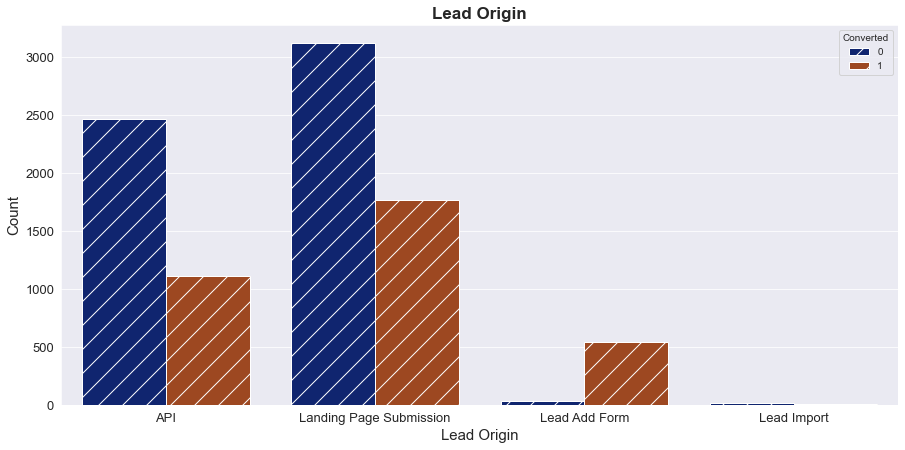

# <font color=darkred> Lead Scoring Case Study - Logistic Regression
##### by: Kumar Sambhawam

## <font color=darkblue>Business Understanding and Problem Description:
#### Business:
An education company named __X Education__ sells online courses to industry professionals. On any given day, many professionals who are interested in the courses land on their website and browse for courses. 
#### Marketing:
 The company markets its courses on several websites and search engines like Google. Once these people land on the website, they might browse the courses or fill up a form for the course or watch some videos. <br>

 When these people fill up a form providing their email address or phone number, they are classified to be a lead. Moreover, the company also gets leads through past referrals.<br>

Once these leads are acquired, employees from the sales team start making calls, writing emails, etc. Through this process, some of the leads get converted while most do not. __The typical lead conversion rate at X education is around 30%.__
 
#### Problem:
Now, although X Education gets a lot of leads, its lead conversion rate is very poor. For example, if, say, they acquire 100 leads in a day, only about 30 of them are converted. 
#### Solution Proposed:
To make this process more efficient, the company wishes to identify the most potential leads, also known as __‘Hot Leads’__. <br>

If they successfully identify this set of leads, the lead conversion rate should go up as the sales team will now be focusing more on communicating with the potential leads rather than making calls to everyone. A typical lead conversion process can be represented using the following funnel:
    


__Lead Conversion Process__ - Demonstrated as a funnel
As you can see, there are a lot of leads generated in the initial stage (top) but only a few of them come out as paying customers from the bottom.<br>

In the middle stage, you need to nurture the potential leads well (i.e. educating the leads about the product, constantly communicating etc. ) in order to get a higher lead conversion.
    
#### Your Job:

X Education has appointed you to help them select the most promising leads, i.e. the leads that are most likely to convert into paying customers. <br>
The company requires you to build a model wherein you need to assign a lead score to each of the leads such that the customers with higher lead score have a higher conversion chance and the customers with lower lead score have a lower conversion chance.

__The CEO, in particular, has given a ballpark of the target lead conversion rate to be around 80%.__


 

## <font color=darkblue>Data Understanding:

You have been provided with a leads dataset from the past with around 9000 data points. This dataset consists of various attributes such as Lead Source, Total Time Spent on Website, Total Visits, Last Activity, etc. which may or may not be useful in ultimately deciding whether a lead will be converted or not. The target variable, in this case, is the column ‘Converted’ which tells whether a past lead was converted or not wherein 1 means it was converted and 0 means it wasn’t converted.

Another thing that you also need to check out for are the levels present in the categorical variables.<br>

__Many of the categorical variables have a level called 'Select' which needs to be handled because it is as good as a null value.__

 

## <font color=darkred>Goal:


__Build a logistic regression model to assign a lead score between 0 and 100 to each of the leads which can be used by the company to target potential leads. A higher score would mean that the lead is hot, i.e. is most likely to convert whereas a lower score would mean that the lead is cold and will mostly not get converted.__


```python
# Supress Warnings
import warnings
warnings.filterwarnings('ignore')

# Importing libraries
import numpy as np
import pandas as pd
import matplotlib.pyplot as plt
import seaborn as sns

# visulaisation
from matplotlib.pyplot import xticks
%matplotlib inline

# Data display coustomization
pd.set_option('display.max_rows', 100)
pd.set_option('display.max_columns', 100)
```

<a id='di'></a>
## <font color=darkred>DATA INSPECTION</font>


```python
leads = pd.DataFrame(pd.read_csv('Leads.csv'))
leads.head() 
```


<div>
 
<table border="1" class="dataframe">
  <thead>
    <tr style="text-align: right;">
      <th></th>
      <th>Prospect ID</th>
      <th>Lead Number</th>
      <th>Lead Origin</th>
      <th>Lead Source</th>
      <th>Do Not Email</th>
      <th>Do Not Call</th>
      <th>Converted</th>
      <th>TotalVisits</th>
      <th>Total Time Spent on Website</th>
      <th>Page Views Per Visit</th>
      <th>Last Activity</th>
      <th>Country</th>
      <th>Specialization</th>
      <th>How did you hear about X Education</th>
      <th>What is your current occupation</th>
      <th>What matters most to you in choosing a course</th>
      <th>Search</th>
      <th>Magazine</th>
      <th>Newspaper Article</th>
      <th>X Education Forums</th>
      <th>Newspaper</th>
      <th>Digital Advertisement</th>
      <th>Through Recommendations</th>
      <th>Receive More Updates About Our Courses</th>
      <th>Tags</th>
      <th>Lead Quality</th>
      <th>Update me on Supply Chain Content</th>
      <th>Get updates on DM Content</th>
      <th>Lead Profile</th>
      <th>City</th>
      <th>Asymmetrique Activity Index</th>
      <th>Asymmetrique Profile Index</th>
      <th>Asymmetrique Activity Score</th>
      <th>Asymmetrique Profile Score</th>
      <th>I agree to pay the amount through cheque</th>
      <th>A free copy of Mastering The Interview</th>
      <th>Last Notable Activity</th>
    </tr>
  </thead>
  <tbody>
    <tr>
      <th>0</th>
      <td>7927b2df-8bba-4d29-b9a2-b6e0beafe620</td>
      <td>660737</td>
      <td>API</td>
      <td>Olark Chat</td>
      <td>No</td>
      <td>No</td>
      <td>0</td>
      <td>0.0</td>
      <td>0</td>
      <td>0.0</td>
      <td>Page Visited on Website</td>
      <td>NaN</td>
      <td>Select</td>
      <td>Select</td>
      <td>Unemployed</td>
      <td>Better Career Prospects</td>
      <td>No</td>
      <td>No</td>
      <td>No</td>
      <td>No</td>
      <td>No</td>
      <td>No</td>
      <td>No</td>
      <td>No</td>
      <td>Interested in other courses</td>
      <td>Low in Relevance</td>
      <td>No</td>
      <td>No</td>
      <td>Select</td>
      <td>Select</td>
      <td>02.Medium</td>
      <td>02.Medium</td>
      <td>15.0</td>
      <td>15.0</td>
      <td>No</td>
      <td>No</td>
      <td>Modified</td>
    </tr>
    <tr>
      <th>1</th>
      <td>2a272436-5132-4136-86fa-dcc88c88f482</td>
      <td>660728</td>
      <td>API</td>
      <td>Organic Search</td>
      <td>No</td>
      <td>No</td>
      <td>0</td>
      <td>5.0</td>
      <td>674</td>
      <td>2.5</td>
      <td>Email Opened</td>
      <td>India</td>
      <td>Select</td>
      <td>Select</td>
      <td>Unemployed</td>
      <td>Better Career Prospects</td>
      <td>No</td>
      <td>No</td>
      <td>No</td>
      <td>No</td>
      <td>No</td>
      <td>No</td>
      <td>No</td>
      <td>No</td>
      <td>Ringing</td>
      <td>NaN</td>
      <td>No</td>
      <td>No</td>
      <td>Select</td>
      <td>Select</td>
      <td>02.Medium</td>
      <td>02.Medium</td>
      <td>15.0</td>
      <td>15.0</td>
      <td>No</td>
      <td>No</td>
      <td>Email Opened</td>
    </tr>
    <tr>
      <th>2</th>
      <td>8cc8c611-a219-4f35-ad23-fdfd2656bd8a</td>
      <td>660727</td>
      <td>Landing Page Submission</td>
      <td>Direct Traffic</td>
      <td>No</td>
      <td>No</td>
      <td>1</td>
      <td>2.0</td>
      <td>1532</td>
      <td>2.0</td>
      <td>Email Opened</td>
      <td>India</td>
      <td>Business Administration</td>
      <td>Select</td>
      <td>Student</td>
      <td>Better Career Prospects</td>
      <td>No</td>
      <td>No</td>
      <td>No</td>
      <td>No</td>
      <td>No</td>
      <td>No</td>
      <td>No</td>
      <td>No</td>
      <td>Will revert after reading the email</td>
      <td>Might be</td>
      <td>No</td>
      <td>No</td>
      <td>Potential Lead</td>
      <td>Mumbai</td>
      <td>02.Medium</td>
      <td>01.High</td>
      <td>14.0</td>
      <td>20.0</td>
      <td>No</td>
      <td>Yes</td>
      <td>Email Opened</td>
    </tr>
    <tr>
      <th>3</th>
      <td>0cc2df48-7cf4-4e39-9de9-19797f9b38cc</td>
      <td>660719</td>
      <td>Landing Page Submission</td>
      <td>Direct Traffic</td>
      <td>No</td>
      <td>No</td>
      <td>0</td>
      <td>1.0</td>
      <td>305</td>
      <td>1.0</td>
      <td>Unreachable</td>
      <td>India</td>
      <td>Media and Advertising</td>
      <td>Word Of Mouth</td>
      <td>Unemployed</td>
      <td>Better Career Prospects</td>
      <td>No</td>
      <td>No</td>
      <td>No</td>
      <td>No</td>
      <td>No</td>
      <td>No</td>
      <td>No</td>
      <td>No</td>
      <td>Ringing</td>
      <td>Not Sure</td>
      <td>No</td>
      <td>No</td>
      <td>Select</td>
      <td>Mumbai</td>
      <td>02.Medium</td>
      <td>01.High</td>
      <td>13.0</td>
      <td>17.0</td>
      <td>No</td>
      <td>No</td>
      <td>Modified</td>
    </tr>
    <tr>
      <th>4</th>
      <td>3256f628-e534-4826-9d63-4a8b88782852</td>
      <td>660681</td>
      <td>Landing Page Submission</td>
      <td>Google</td>
      <td>No</td>
      <td>No</td>
      <td>1</td>
      <td>2.0</td>
      <td>1428</td>
      <td>1.0</td>
      <td>Converted to Lead</td>
      <td>India</td>
      <td>Select</td>
      <td>Other</td>
      <td>Unemployed</td>
      <td>Better Career Prospects</td>
      <td>No</td>
      <td>No</td>
      <td>No</td>
      <td>No</td>
      <td>No</td>
      <td>No</td>
      <td>No</td>
      <td>No</td>
      <td>Will revert after reading the email</td>
      <td>Might be</td>
      <td>No</td>
      <td>No</td>
      <td>Select</td>
      <td>Mumbai</td>
      <td>02.Medium</td>
      <td>01.High</td>
      <td>15.0</td>
      <td>18.0</td>
      <td>No</td>
      <td>No</td>
      <td>Modified</td>
    </tr>
  </tbody>
</table>
</div>


```python
leads.info()
```

    <class 'pandas.core.frame.DataFrame'>
    RangeIndex: 9240 entries, 0 to 9239
    Data columns (total 37 columns):
     #   Column                                         Non-Null Count  Dtype  
    ---  ------                                         --------------  -----  
     0   Prospect ID                                    9240 non-null   object 
     1   Lead Number                                    9240 non-null   int64  
     2   Lead Origin                                    9240 non-null   object 
     3   Lead Source                                    9204 non-null   object 
     4   Do Not Email                                   9240 non-null   object 
     5   Do Not Call                                    9240 non-null   object 
     6   Converted                                      9240 non-null   int64  
     7   TotalVisits                                    9103 non-null   float64
     8   Total Time Spent on Website                    9240 non-null   int64  
     9   Page Views Per Visit                           9103 non-null   float64
     10  Last Activity                                  9137 non-null   object 
     11  Country                                        6779 non-null   object 
     12  Specialization                                 7802 non-null   object 
     13  How did you hear about X Education             7033 non-null   object 
     14  What is your current occupation                6550 non-null   object 
     15  What matters most to you in choosing a course  6531 non-null   object 
     16  Search                                         9240 non-null   object 
     17  Magazine                                       9240 non-null   object 
     18  Newspaper Article                              9240 non-null   object 
     19  X Education Forums                             9240 non-null   object 
     20  Newspaper                                      9240 non-null   object 
     21  Digital Advertisement                          9240 non-null   object 
     22  Through Recommendations                        9240 non-null   object 
     23  Receive More Updates About Our Courses         9240 non-null   object 
     24  Tags                                           5887 non-null   object 
     25  Lead Quality                                   4473 non-null   object 
     26  Update me on Supply Chain Content              9240 non-null   object 
     27  Get updates on DM Content                      9240 non-null   object 
     28  Lead Profile                                   6531 non-null   object 
     29  City                                           7820 non-null   object 
     30  Asymmetrique Activity Index                    5022 non-null   object 
     31  Asymmetrique Profile Index                     5022 non-null   object 
     32  Asymmetrique Activity Score                    5022 non-null   float64
     33  Asymmetrique Profile Score                     5022 non-null   float64
     34  I agree to pay the amount through cheque       9240 non-null   object 
     35  A free copy of Mastering The Interview         9240 non-null   object 
     36  Last Notable Activity                          9240 non-null   object 
    dtypes: float64(4), int64(3), object(30)
    memory usage: 2.6+ MB
    

- #### <font color=darkblue>We have been provided with 37 features and 9240 records</font>


<a id='dc'></a>
## <font color=darkred>DATA CLEANING</font>


### <font color=darkred>Dropping sales-team generated features:</font>

- These columns are generated after the sales team got in touch with the aspirant and after analysis of this interaction; As this data won't be available for a new prospect, we drop these to eliminate any model bias.


```python
leads = leads.drop(['Last Activity','Lead Quality','Tags','Lead Profile','Asymmetrique Activity Index','Asymmetrique Activity Score','Asymmetrique Profile Score','Asymmetrique Profile Index'],axis=1)
```

- ### <font color=darkred>Missing Value Analysis</font>


#### <font color=darkblue>Many of the categorical variables have a level called 'Select' which needs to be handled because it is as good as a null value. (the user did not select any option)


```python
leads = leads.replace('Select', np.nan)
```


```python
import missingno as msno
msno.bar(leads)
```


    <matplotlib.axes._subplots.AxesSubplot at 0x1cc70092a88>


- #### <font color=darkblue>Dropping columns with more than 60% missing values</font>


```python
leads = leads.loc[:, leads.isnull().mean()*100<60]
```


```python
round(100*(leads.isnull().mean()), 2)
```


    Prospect ID                                       0.00
    Lead Number                                       0.00
    Lead Origin                                       0.00
    Lead Source                                       0.39
    Do Not Email                                      0.00
    Do Not Call                                       0.00
    Converted                                         0.00
    TotalVisits                                       1.48
    Total Time Spent on Website                       0.00
    Page Views Per Visit                              1.48
    Country                                          26.63
    Specialization                                   36.58
    What is your current occupation                  29.11
    What matters most to you in choosing a course    29.32
    Search                                            0.00
    Magazine                                          0.00
    Newspaper Article                                 0.00
    X Education Forums                                0.00
    Newspaper                                         0.00
    Digital Advertisement                             0.00
    Through Recommendations                           0.00
    Receive More Updates About Our Courses            0.00
    Update me on Supply Chain Content                 0.00
    Get updates on DM Content                         0.00
    City                                             39.71
    I agree to pay the amount through cheque          0.00
    A free copy of Mastering The Interview            0.00
    Last Notable Activity                             0.00
    dtype: float64


### <font color=darkblue>Column-wise missing value analysis</font>

- #### <font color=darkred>Country:


```python
round(100*(leads.Country.isnull().mean()), 2)
```


    26.63


```python
leads.Country.value_counts(normalize=True,dropna = False)*100
```


    India                   70.259740
    NaN                     26.634199
    United States            0.746753
    United Arab Emirates     0.573593
    Singapore                0.259740
    Saudi Arabia             0.227273
    United Kingdom           0.162338
    Australia                0.140693
    Qatar                    0.108225
    Hong Kong                0.075758
    Bahrain                  0.075758
    France                   0.064935
    Oman                     0.064935
    unknown                  0.054113
    South Africa             0.043290
    Canada                   0.043290
    Nigeria                  0.043290
    Germany                  0.043290
    Kuwait                   0.043290
    Sweden                   0.032468
    Uganda                   0.021645
    Bangladesh               0.021645
    Belgium                  0.021645
    China                    0.021645
    Ghana                    0.021645
    Netherlands              0.021645
    Philippines              0.021645
    Asia/Pacific Region      0.021645
    Italy                    0.021645
    Kenya                    0.010823
    Tanzania                 0.010823
    Denmark                  0.010823
    Indonesia                0.010823
    Sri Lanka                0.010823
    Malaysia                 0.010823
    Liberia                  0.010823
    Switzerland              0.010823
    Russia                   0.010823
    Vietnam                  0.010823
    Name: Country, dtype: float64


##### <font color=darkblue> Imputation with Mode: India.


```python
leads['Country'] = leads['Country'].replace(np.nan, 'India')
```

- #### <font color=darkred>Specialization:


```python
round(100*(leads.Specialization.isnull().mean()), 2)
```


    36.58


```python
leads.Specialization.value_counts(normalize=True,dropna = False)*100
```


    NaN                                  36.580087
    Finance Management                   10.562771
    Human Resource Management             9.177489
    Marketing Management                  9.069264
    Operations Management                 5.443723
    Business Administration               4.361472
    IT Projects Management                3.961039
    Supply Chain Management               3.777056
    Banking, Investment And Insurance     3.658009
    Media and Advertising                 2.196970
    Travel and Tourism                    2.196970
    International Business                1.926407
    Healthcare Management                 1.720779
    Hospitality Management                1.233766
    E-COMMERCE                            1.212121
    Retail Management                     1.082251
    Rural and Agribusiness                0.790043
    E-Business                            0.616883
    Services Excellence                   0.432900
    Name: Specialization, dtype: float64


##### <font color=darkblue>We shall bucket all categories less than 5% into 'Others' category</font>


```python
leads.Specialization = leads.Specialization.replace(['Media and Advertising', 'Travel and Tourism', 'International Business', 'Pay per Click Ads', 'Press_Release',
  'Healthcare Management', 'Hospitality Management', 'E-COMMERCE', 'Rural and Agribusiness', 'E-Business', 'Services Excellence', 'Retail Management'], 'Others')
```


```python
leads.Specialization.value_counts(normalize=True, dropna = False)*100
```


    NaN                                  36.580087
    Others                               13.409091
    Finance Management                   10.562771
    Human Resource Management             9.177489
    Marketing Management                  9.069264
    Operations Management                 5.443723
    Business Administration               4.361472
    IT Projects Management                3.961039
    Supply Chain Management               3.777056
    Banking, Investment And Insurance     3.658009
    Name: Specialization, dtype: float64


##### <font color=darkblue>No dominant category, we shall name missing values as 'Not Selected'</font>


```python
leads.Specialization = leads.Specialization.replace(np.nan, 'Not Selected')
```

- #### <font color=darkred>What is your current occupation


```python
round(100*(leads['What is your current occupation'].isnull().mean()), 2)
```


    29.11


```python
leads['What is your current occupation'].value_counts(normalize=True,dropna = False)*100
```


    Unemployed              60.606061
    NaN                     29.112554
    Working Professional     7.640693
    Student                  2.272727
    Other                    0.173160
    Housewife                0.108225
    Businessman              0.086580
    Name: What is your current occupation, dtype: float64


##### <font color=darkblue> Imputation with Mode: Unemployed.


```python
leads['What is your current occupation'] = leads['What is your current occupation'].replace(np.nan, 'Unemployed') 
```

- #### <font color=darkred>What matters most to you in choosing a course


```python
round(100*(leads['What matters most to you in choosing a course'].isnull().mean()), 2)
```


    29.32


```python
leads['What matters most to you in choosing a course'].value_counts(normalize=True,dropna = False)*100
```


    Better Career Prospects      70.649351
    NaN                          29.318182
    Flexibility & Convenience     0.021645
    Other                         0.010823
    Name: What matters most to you in choosing a course, dtype: float64


##### <font color=darkblue> Imputation with Mode: 'Better Career Prospects'.


```python
leads['What matters most to you in choosing a course'] = leads['What matters most to you in choosing a course'].replace(np.nan, 'Better Career Prospects') 
```

- #### <font color=darkred>City                                             


```python
round(100*(leads.City.isnull().mean()), 2)
```


    39.71


```python
leads['City'].value_counts(normalize=True,dropna = False)*100
```


    NaN                            39.707792
    Mumbai                         34.870130
    Thane & Outskirts               8.138528
    Other Cities                    7.424242
    Other Cities of Maharashtra     4.945887
    Other Metro Cities              4.112554
    Tier II Cities                  0.800866
    Name: City, dtype: float64


##### <font color=darkblue>Imputation with Mode: 'Mumbai'.


```python
leads['City'] = leads['City'].replace(np.nan, 'Mumbai')
```

- #### <font color=darkred> Rest missing values are under 2% so we can drop these rows.


```python
leads.dropna(inplace = True)
```


```python
msno.bar(leads)
```


    <matplotlib.axes._subplots.AxesSubplot at 0x1cc72dd9308>


- ##### <font color=darkblue>Dealt with all missing values, Retained 9074/9240 (98.2%) records.

<a id='eda'></a>
## <font color=darkred>EDA</font>

- ### <font color=darkred> UNIVARIATE ANALYSIS

- #### <font color=darkred> Target variable: 'Converted'


```python
leads['Converted'].mean()*100
```


    37.85541106458012


- ##### <font color=darkblue>Around 38% of our data are converted leads

- #### <font color=darkred> Lead Origin:


```python
sns.set_style("darkgrid")
plt.figure(figsize=(15,7))
sns.countplot(x = "Lead Origin", hue = "Converted", data = leads, palette="dark", hatch="/")
plt.title("Lead Origin",size = 17, fontweight="bold")
plt.xlabel("Lead Origin",size = 15)
plt.ylabel("Count",size = 15)
plt.xticks(size = 13)
plt.yticks(size = 13)
```


    (array([   0.,  500., 1000., 1500., 2000., 2500., 3000., 3500.]),
     <a list of 8 Text major ticklabel objects>)





##### <font color=darkblue>Inferences:

    
| Category | Lead Amount | Conversion Rate | 
| :- | :- | :- |
|API| High | Medium (~30%)|
|Landing Page Submission| High | Medium (~35%)|
|Landing Add Form| Low | Very High (~90%)|
|Lead Import| Very Low | Insignificant |

__Focus more on improving lead conversion from 'API' and 'Landing Page Submission' origin and generate more leads from 'Lead Add Form'__

- #### <font color=darkred> Lead Source:


```python
sns.set_style("darkgrid")
plt.figure(figsize=(15,7))
sns.countplot(x = "Lead Source", hue = "Converted", data = leads, palette="rocket", hatch="/")
plt.title("Lead Source",size = 17, fontweight="bold")
plt.xlabel("Lead Source",size = 15)
plt.ylabel("Count",size = 15)
plt.xticks(size = 13,rotation=90)
plt.yticks(size = 13)
```


    (array([   0.,  250.,  500.,  750., 1000., 1250., 1500., 1750., 2000.]),
     <a list of 9 Text major ticklabel objects>)


##### <font color=darkblue>Bucketing insignificant categories into "Others"


```python
leads['Lead Source'] = leads['Lead Source'].replace(['google'], 'Google')
leads['Lead Source'] = leads['Lead Source'].replace(['Facebook','Click2call', 'Live Chat', 'NC_EDM', 'Pay per Click Ads', 'Press_Release',
  'Social Media', 'WeLearn', 'bing', 'blog', 'testone', 'welearnblog_Home', 'youtubechannel'], 'Others')
```


```python
sns.set_style("darkgrid")
plt.figure(figsize=(15,7))
sns.countplot(x = "Lead Source", hue = "Converted", data = leads, palette="rocket", hatch="/")
plt.title("Lead Source",size = 17, fontweight="bold")
plt.xlabel("Lead Source",size = 15)
plt.ylabel("Count",size = 15)
plt.xticks(size = 13,rotation=90)
plt.yticks(size = 13)
```


    (array([   0.,  250.,  500.,  750., 1000., 1250., 1500., 1750., 2000.]),
     <a list of 9 Text major ticklabel objects>)


##### <font color=darkblue>Inferences:

    
| Category | Lead Amount | Conversion Rate | 
| :- | :- | :- |
|Olark Chat| High | Medium (~23%)|
|Organic Search | Medium | Medium (~36%)|
|Direct Traffic | High | Medium (~32%)|
|Google| High |  Medium (~39%)|
|Referal Sites| Low | Insignificant |
|Reference | Low | High |
|Wellingak Website| Very Low | Very High |
|Others| Insignificant | Insignificant |    
    
__Focus on improving lead converion from 'Olark Chat', 'Organic Search', 'Direct Traffic', and 'Google' and generate more leads through 'Reference' and 'Welingak Website'__

- #### <font color=darkred> Do not call:


```python
sns.set_style("darkgrid")
plt.figure(figsize=(15,7))
sns.countplot(x = "Do Not Call", hue = "Converted", data = leads, palette="rocket", hatch="/")
plt.title("Do Not Call",size = 17, fontweight="bold")
plt.xlabel("Do Not Call",size = 15)
plt.ylabel("Count",size = 15)
plt.xticks(size = 13,rotation=90)
plt.yticks(size = 13)
```


    (array([   0., 1000., 2000., 3000., 4000., 5000., 6000.]),
     <a list of 7 Text major ticklabel objects>)


```python
leads['Do Not Call'].value_counts()
```


    No     9072
    Yes       2
    Name: Do Not Call, dtype: int64


##### <font color=darkblue>This column is insensitive, not much variance, hence we shall drop it:


```python
leads = leads.drop(['Do Not Call'],axis=1)
```

- #### <font color=darkred> Do not Email:


```python
sns.set_style("darkgrid")
plt.figure(figsize=(15,7))
sns.countplot(x = "Do Not Email", hue = "Converted", data = leads, palette="rocket", hatch="/")
plt.title("Do Not Email",size = 17, fontweight="bold")
plt.xlabel("Do Not Email",size = 15)
plt.ylabel("Count",size = 15)
plt.xticks(size = 13,rotation=90)
plt.yticks(size = 13)
```


    (array([   0., 1000., 2000., 3000., 4000., 5000., 6000.]),
     <a list of 7 Text major ticklabel objects>)


```python
leads['Do Not Email'].value_counts()
```


    No     8358
    Yes     716
    Name: Do Not Email, dtype: int64


##### <font color=darkblue>This column is insensitive, not much variance, most values are 'No', hence we shall drop it:


```python
leads = leads.drop(['Do Not Email'],axis=1)
```

- #### <font color=darkred> Total Visits:


```python
sns.boxplot(y = 'TotalVisits', x = 'Converted', data = leads)
```


    <matplotlib.axes._subplots.AxesSubplot at 0x2ded6d6eec8>


##### <font color=darkblue>Too many ouliers, let's handle them first:


```python
leads['TotalVisits'].describe(percentiles=[0.05,.25, .5, .75, .90, .95, .99])
```


    count    9074.000000
    mean        3.456028
    std         4.858802
    min         0.000000
    5%          0.000000
    25%         1.000000
    50%         3.000000
    75%         5.000000
    90%         7.000000
    95%        10.000000
    99%        17.000000
    max       251.000000
    Name: TotalVisits, dtype: float64


##### <font color=darkblue>Capping High range outliers to upper fence at 95%ile


```python
leads['TotalVisits'].quantile([0.95]).values[0]
```


    10.0


```python
leads['TotalVisits'][leads['TotalVisits'] >= leads['TotalVisits'].quantile([0.95]).values[0]] = leads['TotalVisits'].quantile([0.95]).values[0]
```


```python
sns.boxplot(y = 'TotalVisits', x = 'Converted', data = leads)
```


    <matplotlib.axes._subplots.AxesSubplot at 0x2ded6df7308>


##### <font color=darkblue>Inferences:
- Median for converted and not converted leads are the same.

__No prominent pattern observed in Total Visits.__

- #### <font color=darkred> Total time spent on website:


```python
sns.boxplot(y = 'Total Time Spent on Website', x = 'Converted', data = leads, palette='magma')
```


    <matplotlib.axes._subplots.AxesSubplot at 0x2ded6e72808>


##### <font color=darkblue>Inferences:
- People spending more time on the website have more chances of getting converted.

__Focus should be given on making the website more user friendly and engaging content should be displayed to make leads spend more time.__

- #### <font color=darkred> Page views per visit:


```python
sns.boxplot(y = 'Page Views Per Visit', x = 'Converted', data = leads)
```


    <matplotlib.axes._subplots.AxesSubplot at 0x1cc72f2e208>


##### <font color=darkblue>Too many ouliers, let's handle them first:


```python
leads['Page Views Per Visit'].describe(percentiles=[0.05,.25, .5, .75, .90, .95, .99])
```


    count    9074.000000
    mean        2.370151
    std         2.160871
    min         0.000000
    5%          0.000000
    25%         1.000000
    50%         2.000000
    75%         3.200000
    90%         5.000000
    95%         6.000000
    99%         9.000000
    max        55.000000
    Name: Page Views Per Visit, dtype: float64


##### <font color=darkblue>Capping High range outliers to upper fence at 99%ile


```python
leads['Page Views Per Visit'][leads['Page Views Per Visit'] >= leads['Page Views Per Visit'].quantile([0.99]).values[0]] = leads['Page Views Per Visit'].quantile([0.9]).values[0]
```


```python
sns.boxplot(y = 'Page Views Per Visit', x = 'Converted', data = leads)
```


    <matplotlib.axes._subplots.AxesSubplot at 0x1cc733cfd48>


##### <font color=darkblue>Inferences:
- Median for converted and not converted leads are the same.

__No prominent pattern observed in Page Views Per Visit.__

- #### <font color=darkred>Country:


```python
sns.set_style("darkgrid")
plt.figure(figsize=(15,7))
sns.countplot(x = "Country", hue = "Converted", data = leads, palette="dark")
plt.title("Country",size = 17, fontweight="bold")
plt.xlabel("Country",size = 15)
plt.ylabel("Count",size = 15)
plt.xticks(size = 13,rotation=90)
plt.yticks(size = 13)
```


    (array([   0., 1000., 2000., 3000., 4000., 5000., 6000.]),
     <a list of 7 Text major ticklabel objects>)


##### <font color=darkblue>This column is insensitive, not much variance,most values are 'India', hence we shall drop it:


```python
leads = leads.drop(['Country'],axis=1)
```

- #### <font color=darkred>Specialization:


```python
sns.set_style("darkgrid")
plt.figure(figsize=(15,7))
sns.countplot(x = "Specialization", hue = "Converted", data = leads, palette="dark")
plt.title("Specialization",size = 17, fontweight="bold")
plt.xlabel("Specialization",size = 15)
plt.ylabel("Count",size = 15)
plt.xticks(size = 13,rotation=90)
plt.yticks(size = 13)
```


    (array([   0.,  500., 1000., 1500., 2000., 2500., 3000.]),
     <a list of 7 Text major ticklabel objects>)


##### <font color=darkblue> Inference
- It can be seen that almost all the specializations have a similar conversion rate of 40-50%
- Conversion rate of a person who has selected a specialization is almost twice as one who hasn't (~25%)

__Selecting a prefered specialization should be made a mandatory field to filter out focussed candidates.__

- #### <font color=darkred>What is your current occupation:


```python
sns.set_style("darkgrid")
plt.figure(figsize=(15,7))
sns.countplot(x = "What is your current occupation", hue = "Converted", data = leads, palette="magma")
plt.title("What is your current occupation",size = 17, fontweight="bold")
plt.xlabel("Occupation",size = 15)
plt.ylabel("Count",size = 15)
plt.xticks(size = 13,rotation=0)
plt.yticks(size = 13)
```


    (array([   0., 1000., 2000., 3000., 4000., 5000., 6000.]),
     <a list of 7 Text major ticklabel objects>)


##### <font color=darkblue>Inference
1. Conversion rate for 'Working Professionals' is very high.
2. Most leads are 'Unemployed' and have around 30-35% conversion rate.

__More working professionals should be approched__

- #### <font color=darkred>What matters most to you in choosing a course:


```python
leads['What matters most to you in choosing a course'].value_counts()
```


    Better Career Prospects      9072
    Flexibility & Convenience       1
    Other                           1
    Name: What matters most to you in choosing a course, dtype: int64


##### <font color=darkblue>This column is insensitive, not much variance,most values are 'Better Career Prospects', hence we shall drop it:


```python
leads = leads.drop(['What matters most to you in choosing a course'],axis=1)
```

- #### <font color=darkred>Search:


```python
leads['Search'].value_counts()
```


    No     9060
    Yes      14
    Name: Search, dtype: int64


##### <font color=darkblue>This column is insensitive, not much variance,most values are 'No', hence we shall drop it:


```python
leads = leads.drop(['Search'],axis=1)
```

- #### <font color=darkred>Magazine:


```python
leads['Magazine'].value_counts()
```


    No    9074
    Name: Magazine, dtype: int64


##### <font color=darkblue>This column is insensitive, no variance at all ,all values are 'No', hence we shall drop it:


```python
leads = leads.drop(['Magazine'],axis=1)
```

- #### <font color=darkred>Newspaper Article:


```python
leads['Newspaper Article'].value_counts()
```


    No     9072
    Yes       2
    Name: Newspaper Article, dtype: int64


##### <font color=darkblue>This column is insensitive, almost no variance ,all values but 2 are 'No', hence we shall drop it:


```python
leads = leads.drop(['Newspaper Article'],axis=1)
```

- #### <font color=darkred>Newspaper:


```python
leads['Newspaper'].value_counts()
```


    No     9073
    Yes       1
    Name: Newspaper, dtype: int64


##### <font color=darkblue>This column is insensitive, almost no variance ,all values but 1 are 'No', hence we shall drop it:


```python
leads = leads.drop(['Newspaper'],axis=1)
```

- #### <font color=darkred>X Education Forums:


```python
leads['X Education Forums'].value_counts()
```


    No     9073
    Yes       1
    Name: X Education Forums, dtype: int64


##### <font color=darkblue>This column is insensitive, almost no variance ,all values but 1 are 'No', hence we shall drop it:


```python
leads = leads.drop(['X Education Forums'],axis=1)
```

- #### <font color=darkred>This following columns are also insensitive, and show almost no variance , hence we shall drop all of these too:


```python
leads = leads.drop(['Lead Number','Digital Advertisement','Through Recommendations','Receive More Updates About Our Courses','Update me on Supply Chain Content',
           'Get updates on DM Content','I agree to pay the amount through cheque','A free copy of Mastering The Interview'],axis=1)
```

- #### <font color=darkred>City:


```python
sns.set_style("darkgrid")
plt.figure(figsize=(15,7))
sns.countplot(x = "City", hue = "Converted", data = leads, palette="dark")
plt.title("City",size = 17, fontweight="bold")
plt.xlabel("City",size = 15)
plt.ylabel("Count",size = 15)
plt.xticks(size = 13,rotation=90)
plt.yticks(size = 13)
```


    (array([   0., 1000., 2000., 3000., 4000., 5000.]),
     <a list of 6 Text major ticklabel objects>)


##### <font color=darkblue>Inference
- Most leads are from Mumbai with around 30% conversion rate.


```python
leads.info()
```

    <class 'pandas.core.frame.DataFrame'>
    Int64Index: 9074 entries, 0 to 9239
    Data columns (total 12 columns):
     #   Column                           Non-Null Count  Dtype  
    ---  ------                           --------------  -----  
     0   Prospect ID                      9074 non-null   object 
     1   Lead Origin                      9074 non-null   object 
     2   Lead Source                      9074 non-null   object 
     3   Do Not Email                     9074 non-null   object 
     4   Converted                        9074 non-null   int64  
     5   TotalVisits                      9074 non-null   float64
     6   Total Time Spent on Website      9074 non-null   int64  
     7   Page Views Per Visit             9074 non-null   float64
     8   Specialization                   9074 non-null   object 
     9   What is your current occupation  9074 non-null   object 
     10  City                             9074 non-null   object 
     11  Last Notable Activity            9074 non-null   object 
    dtypes: float64(2), int64(2), object(8)
    memory usage: 1.2+ MB
    

##### <font color=darkblue>We are finally left with 1 categorical target variable, and 9 features- 3 numerical and 6 categorical. (ignoring Prospect ID) 


<a id='modelling'></a>
## <font color=darkred>MODELLING</font>

- ### <font color=darkred>Data Preparation</font>

- #### <font color=darkblue>Categorical Features: Dummification / One-Hot Encoding</font>
    - Creating dummies of 10 categorical features.


```python
dummies = pd.get_dummies(leads[['Lead Origin', 'Lead Source','Specialization','What is your current occupation',
                              'City','Last Notable Activity']], drop_first=True)

leads = pd.concat([leads, dummies], axis=1)

leads = leads.drop(['Lead Origin', 'Lead Source', 'Specialization','What is your current occupation','City','Last Notable Activity'], axis = 1)
```


    ---------------------------------------------------------------------------

    KeyError                                  Traceback (most recent call last)

    <ipython-input-61-6c66e2a1f562> in <module>
          1 dummies = pd.get_dummies(leads[['Lead Origin', 'Lead Source','Specialization','What is your current occupation',
    ----> 2                               'City','Last Notable Activity']], drop_first=True)
          3 
          4 leads = pd.concat([leads, dummies], axis=1)
          5 
    

    ~\anaconda3\lib\site-packages\pandas\core\frame.py in __getitem__(self, key)
       2804             if is_iterator(key):
       2805                 key = list(key)
    -> 2806             indexer = self.loc._get_listlike_indexer(key, axis=1, raise_missing=True)[1]
       2807 
       2808         # take() does not accept boolean indexers
    

    ~\anaconda3\lib\site-packages\pandas\core\indexing.py in _get_listlike_indexer(self, key, axis, raise_missing)
       1551 
       1552         self._validate_read_indexer(
    -> 1553             keyarr, indexer, o._get_axis_number(axis), raise_missing=raise_missing
       1554         )
       1555         return keyarr, indexer
    

    ~\anaconda3\lib\site-packages\pandas\core\indexing.py in _validate_read_indexer(self, key, indexer, axis, raise_missing)
       1638             if missing == len(indexer):
       1639                 axis_name = self.obj._get_axis_name(axis)
    -> 1640                 raise KeyError(f"None of [{key}] are in the [{axis_name}]")
       1641 
       1642             # We (temporarily) allow for some missing keys with .loc, except in
    

    KeyError: "None of [Index(['Lead Origin', 'Lead Source', 'Specialization',\n       'What is your current occupation', 'City', 'Last Notable Activity'],\n      dtype='object')] are in the [columns]"


```python
leads.info()
```

##### <font color=darkblue>We now have 1 categorical target variable, and 47 features- 3 numerical and 44 categorical. (ignoring Prospect ID)  


- ### <font color=darkred>Splitting Data</font>


```python
# feature map
X = leads.drop(['Prospect ID','Converted'], axis=1)
# target
y = leads['Converted']

# 70-30 split
from sklearn.model_selection import train_test_split
X_train, X_test, y_train, y_test = train_test_split(X, y, train_size=0.7, test_size=0.3, random_state=42)
```

- ### <font color=darkred>Scaling</font>

    - 3 numerical features


```python
from sklearn.preprocessing import StandardScaler

scaler = StandardScaler()

X_train[['TotalVisits','Total Time Spent on Website','Page Views Per Visit']] = scaler.fit_transform(X_train[['TotalVisits','Total Time Spent on Website','Page Views Per Visit']])

X_train.head()
```


<div>
 
<table border="1" class="dataframe">
  <thead>
    <tr style="text-align: right;">
      <th></th>
      <th>TotalVisits</th>
      <th>Total Time Spent on Website</th>
      <th>Page Views Per Visit</th>
      <th>Lead Origin_Landing Page Submission</th>
      <th>Lead Origin_Lead Add Form</th>
      <th>Lead Origin_Lead Import</th>
      <th>Lead Source_Google</th>
      <th>Lead Source_Olark Chat</th>
      <th>Lead Source_Organic Search</th>
      <th>Lead Source_Others</th>
      <th>Lead Source_Reference</th>
      <th>Lead Source_Referral Sites</th>
      <th>Lead Source_Welingak Website</th>
      <th>Specialization_Business Administration</th>
      <th>Specialization_Finance Management</th>
      <th>Specialization_Human Resource Management</th>
      <th>Specialization_IT Projects Management</th>
      <th>Specialization_Marketing Management</th>
      <th>Specialization_Not Selected</th>
      <th>Specialization_Operations Management</th>
      <th>Specialization_Others</th>
      <th>Specialization_Supply Chain Management</th>
      <th>What is your current occupation_Housewife</th>
      <th>What is your current occupation_Other</th>
      <th>What is your current occupation_Student</th>
      <th>What is your current occupation_Unemployed</th>
      <th>What is your current occupation_Working Professional</th>
      <th>City_Other Cities</th>
      <th>City_Other Cities of Maharashtra</th>
      <th>City_Other Metro Cities</th>
      <th>City_Thane &amp; Outskirts</th>
      <th>City_Tier II Cities</th>
      <th>Last Notable Activity_Email Bounced</th>
      <th>Last Notable Activity_Email Link Clicked</th>
      <th>Last Notable Activity_Email Marked Spam</th>
      <th>Last Notable Activity_Email Opened</th>
      <th>Last Notable Activity_Email Received</th>
      <th>Last Notable Activity_Form Submitted on Website</th>
      <th>Last Notable Activity_Had a Phone Conversation</th>
      <th>Last Notable Activity_Modified</th>
      <th>Last Notable Activity_Olark Chat Conversation</th>
      <th>Last Notable Activity_Page Visited on Website</th>
      <th>Last Notable Activity_Resubscribed to emails</th>
      <th>Last Notable Activity_SMS Sent</th>
      <th>Last Notable Activity_Unreachable</th>
      <th>Last Notable Activity_Unsubscribed</th>
      <th>Last Notable Activity_View in browser link Clicked</th>
    </tr>
  </thead>
  <tbody>
    <tr>
      <th>1943</th>
      <td>-0.432839</td>
      <td>1.704380</td>
      <td>-0.153953</td>
      <td>1</td>
      <td>0</td>
      <td>0</td>
      <td>0</td>
      <td>0</td>
      <td>0</td>
      <td>0</td>
      <td>0</td>
      <td>0</td>
      <td>0</td>
      <td>0</td>
      <td>0</td>
      <td>0</td>
      <td>0</td>
      <td>1</td>
      <td>0</td>
      <td>0</td>
      <td>0</td>
      <td>0</td>
      <td>0</td>
      <td>0</td>
      <td>0</td>
      <td>1</td>
      <td>0</td>
      <td>0</td>
      <td>0</td>
      <td>0</td>
      <td>0</td>
      <td>0</td>
      <td>0</td>
      <td>0</td>
      <td>0</td>
      <td>1</td>
      <td>0</td>
      <td>0</td>
      <td>0</td>
      <td>0</td>
      <td>0</td>
      <td>0</td>
      <td>0</td>
      <td>0</td>
      <td>0</td>
      <td>0</td>
      <td>0</td>
    </tr>
    <tr>
      <th>456</th>
      <td>-0.432839</td>
      <td>-0.789845</td>
      <td>-0.153953</td>
      <td>0</td>
      <td>0</td>
      <td>0</td>
      <td>0</td>
      <td>0</td>
      <td>0</td>
      <td>0</td>
      <td>0</td>
      <td>1</td>
      <td>0</td>
      <td>0</td>
      <td>0</td>
      <td>0</td>
      <td>0</td>
      <td>0</td>
      <td>1</td>
      <td>0</td>
      <td>0</td>
      <td>0</td>
      <td>0</td>
      <td>0</td>
      <td>0</td>
      <td>1</td>
      <td>0</td>
      <td>0</td>
      <td>0</td>
      <td>0</td>
      <td>0</td>
      <td>0</td>
      <td>0</td>
      <td>0</td>
      <td>0</td>
      <td>0</td>
      <td>0</td>
      <td>0</td>
      <td>0</td>
      <td>1</td>
      <td>0</td>
      <td>0</td>
      <td>0</td>
      <td>0</td>
      <td>0</td>
      <td>0</td>
      <td>0</td>
    </tr>
    <tr>
      <th>6547</th>
      <td>0.644762</td>
      <td>-0.176811</td>
      <td>1.481796</td>
      <td>1</td>
      <td>0</td>
      <td>0</td>
      <td>0</td>
      <td>0</td>
      <td>0</td>
      <td>0</td>
      <td>0</td>
      <td>0</td>
      <td>0</td>
      <td>0</td>
      <td>0</td>
      <td>0</td>
      <td>0</td>
      <td>1</td>
      <td>0</td>
      <td>0</td>
      <td>0</td>
      <td>0</td>
      <td>0</td>
      <td>0</td>
      <td>0</td>
      <td>1</td>
      <td>0</td>
      <td>0</td>
      <td>0</td>
      <td>0</td>
      <td>0</td>
      <td>0</td>
      <td>0</td>
      <td>0</td>
      <td>0</td>
      <td>0</td>
      <td>0</td>
      <td>0</td>
      <td>0</td>
      <td>0</td>
      <td>0</td>
      <td>0</td>
      <td>0</td>
      <td>1</td>
      <td>0</td>
      <td>0</td>
      <td>0</td>
    </tr>
    <tr>
      <th>8836</th>
      <td>0.285562</td>
      <td>2.117949</td>
      <td>0.936547</td>
      <td>0</td>
      <td>0</td>
      <td>0</td>
      <td>0</td>
      <td>0</td>
      <td>1</td>
      <td>0</td>
      <td>0</td>
      <td>0</td>
      <td>0</td>
      <td>0</td>
      <td>0</td>
      <td>0</td>
      <td>0</td>
      <td>0</td>
      <td>0</td>
      <td>0</td>
      <td>0</td>
      <td>1</td>
      <td>0</td>
      <td>0</td>
      <td>0</td>
      <td>1</td>
      <td>0</td>
      <td>0</td>
      <td>0</td>
      <td>1</td>
      <td>0</td>
      <td>0</td>
      <td>0</td>
      <td>0</td>
      <td>0</td>
      <td>0</td>
      <td>0</td>
      <td>0</td>
      <td>0</td>
      <td>1</td>
      <td>0</td>
      <td>0</td>
      <td>0</td>
      <td>0</td>
      <td>0</td>
      <td>0</td>
      <td>0</td>
    </tr>
    <tr>
      <th>6529</th>
      <td>0.644762</td>
      <td>0.315446</td>
      <td>1.481796</td>
      <td>1</td>
      <td>0</td>
      <td>0</td>
      <td>0</td>
      <td>0</td>
      <td>1</td>
      <td>0</td>
      <td>0</td>
      <td>0</td>
      <td>0</td>
      <td>0</td>
      <td>0</td>
      <td>0</td>
      <td>0</td>
      <td>0</td>
      <td>0</td>
      <td>0</td>
      <td>1</td>
      <td>0</td>
      <td>0</td>
      <td>0</td>
      <td>0</td>
      <td>0</td>
      <td>1</td>
      <td>0</td>
      <td>0</td>
      <td>1</td>
      <td>0</td>
      <td>0</td>
      <td>0</td>
      <td>0</td>
      <td>0</td>
      <td>0</td>
      <td>0</td>
      <td>0</td>
      <td>0</td>
      <td>0</td>
      <td>0</td>
      <td>0</td>
      <td>0</td>
      <td>1</td>
      <td>0</td>
      <td>0</td>
      <td>0</td>
    </tr>
  </tbody>
</table>
</div>


- ### <font color=darkred>Model Building</font>

- #### <font color=darkred>Building model with all 47 features</font>


```python
import statsmodels.api as sm

# Logistic regression model
classifer = sm.GLM(y_train,(sm.add_constant(X_train)), family = sm.families.Binomial())
classifer.fit().summary()
```


<table class="simpletable">
<caption>Generalized Linear Model Regression Results</caption>
<tr>
  <th>Dep. Variable:</th>       <td>Converted</td>    <th>  No. Observations:  </th>  <td>  6351</td> 
</tr>
<tr>
  <th>Model:</th>                  <td>GLM</td>       <th>  Df Residuals:      </th>  <td>  6305</td> 
</tr>
<tr>
  <th>Model Family:</th>        <td>Binomial</td>     <th>  Df Model:          </th>  <td>    45</td> 
</tr>
<tr>
  <th>Link Function:</th>         <td>logit</td>      <th>  Scale:             </th> <td>  1.0000</td>
</tr>
<tr>
  <th>Method:</th>                <td>IRLS</td>       <th>  Log-Likelihood:    </th> <td> -2620.0</td>
</tr>
<tr>
  <th>Date:</th>            <td>Sun, 25 Oct 2020</td> <th>  Deviance:          </th> <td>  5239.9</td>
</tr>
<tr>
  <th>Time:</th>                <td>17:39:26</td>     <th>  Pearson chi2:      </th> <td>6.45e+03</td>
</tr>
<tr>
  <th>No. Iterations:</th>         <td>21</td>        <th>                     </th>     <td> </td>   
</tr>
<tr>
  <th>Covariance Type:</th>     <td>nonrobust</td>    <th>                     </th>     <td> </td>   
</tr>
</table>
<table class="simpletable">
<tr>
                            <td></td>                              <th>coef</th>     <th>std err</th>      <th>z</th>      <th>P>|z|</th>  <th>[0.025</th>    <th>0.975]</th>  
</tr>
<tr>
  <th>const</th>                                                <td>   22.3883</td> <td> 4.82e+04</td> <td>    0.000</td> <td> 1.000</td> <td>-9.44e+04</td> <td> 9.45e+04</td>
</tr>
<tr>
  <th>TotalVisits</th>                                          <td>    0.3133</td> <td>    0.055</td> <td>    5.731</td> <td> 0.000</td> <td>    0.206</td> <td>    0.420</td>
</tr>
<tr>
  <th>Total Time Spent on Website</th>                          <td>    1.1031</td> <td>    0.040</td> <td>   27.266</td> <td> 0.000</td> <td>    1.024</td> <td>    1.182</td>
</tr>
<tr>
  <th>Page Views Per Visit</th>                                 <td>   -0.2205</td> <td>    0.060</td> <td>   -3.705</td> <td> 0.000</td> <td>   -0.337</td> <td>   -0.104</td>
</tr>
<tr>
  <th>Lead Origin_Landing Page Submission</th>                  <td>   -1.0014</td> <td>    0.137</td> <td>   -7.336</td> <td> 0.000</td> <td>   -1.269</td> <td>   -0.734</td>
</tr>
<tr>
  <th>Lead Origin_Lead Add Form</th>                            <td>    0.7114</td> <td>    1.087</td> <td>    0.654</td> <td> 0.513</td> <td>   -1.420</td> <td>    2.843</td>
</tr>
<tr>
  <th>Lead Origin_Lead Import</th>                              <td>    0.7662</td> <td>    0.836</td> <td>    0.917</td> <td> 0.359</td> <td>   -0.872</td> <td>    2.404</td>
</tr>
<tr>
  <th>Lead Source_Google</th>                                   <td>    0.3712</td> <td>    0.096</td> <td>    3.853</td> <td> 0.000</td> <td>    0.182</td> <td>    0.560</td>
</tr>
<tr>
  <th>Lead Source_Olark Chat</th>                               <td>    1.3122</td> <td>    0.158</td> <td>    8.319</td> <td> 0.000</td> <td>    1.003</td> <td>    1.621</td>
</tr>
<tr>
  <th>Lead Source_Organic Search</th>                           <td>    0.1405</td> <td>    0.129</td> <td>    1.089</td> <td> 0.276</td> <td>   -0.112</td> <td>    0.393</td>
</tr>
<tr>
  <th>Lead Source_Others</th>                                   <td>    0.6162</td> <td>    0.671</td> <td>    0.918</td> <td> 0.359</td> <td>   -0.699</td> <td>    1.932</td>
</tr>
<tr>
  <th>Lead Source_Reference</th>                                <td>    2.9668</td> <td>    1.112</td> <td>    2.667</td> <td> 0.008</td> <td>    0.787</td> <td>    5.147</td>
</tr>
<tr>
  <th>Lead Source_Referral Sites</th>                           <td>    0.0429</td> <td>    0.329</td> <td>    0.130</td> <td> 0.896</td> <td>   -0.601</td> <td>    0.687</td>
</tr>
<tr>
  <th>Lead Source_Welingak Website</th>                         <td>    6.3144</td> <td>    1.489</td> <td>    4.240</td> <td> 0.000</td> <td>    3.395</td> <td>    9.233</td>
</tr>
<tr>
  <th>Specialization_Business Administration</th>               <td>   -0.1468</td> <td>    0.236</td> <td>   -0.623</td> <td> 0.533</td> <td>   -0.608</td> <td>    0.315</td>
</tr>
<tr>
  <th>Specialization_Finance Management</th>                    <td>   -0.2042</td> <td>    0.203</td> <td>   -1.004</td> <td> 0.315</td> <td>   -0.603</td> <td>    0.194</td>
</tr>
<tr>
  <th>Specialization_Human Resource Management</th>             <td>   -0.0702</td> <td>    0.207</td> <td>   -0.340</td> <td> 0.734</td> <td>   -0.475</td> <td>    0.335</td>
</tr>
<tr>
  <th>Specialization_IT Projects Management</th>                <td>   -0.2387</td> <td>    0.247</td> <td>   -0.965</td> <td> 0.334</td> <td>   -0.723</td> <td>    0.246</td>
</tr>
<tr>
  <th>Specialization_Marketing Management</th>                  <td>    0.0179</td> <td>    0.206</td> <td>    0.087</td> <td> 0.931</td> <td>   -0.386</td> <td>    0.421</td>
</tr>
<tr>
  <th>Specialization_Not Selected</th>                          <td>   -1.3024</td> <td>    0.211</td> <td>   -6.161</td> <td> 0.000</td> <td>   -1.717</td> <td>   -0.888</td>
</tr>
<tr>
  <th>Specialization_Operations Management</th>                 <td>   -0.2544</td> <td>    0.230</td> <td>   -1.107</td> <td> 0.268</td> <td>   -0.705</td> <td>    0.196</td>
</tr>
<tr>
  <th>Specialization_Others</th>                                <td>   -0.2979</td> <td>    0.198</td> <td>   -1.503</td> <td> 0.133</td> <td>   -0.686</td> <td>    0.091</td>
</tr>
<tr>
  <th>Specialization_Supply Chain Management</th>               <td>   -0.1187</td> <td>    0.246</td> <td>   -0.483</td> <td> 0.629</td> <td>   -0.601</td> <td>    0.363</td>
</tr>
<tr>
  <th>What is your current occupation_Housewife</th>            <td>   22.7344</td> <td> 1.58e+04</td> <td>    0.001</td> <td> 0.999</td> <td>-3.09e+04</td> <td> 3.09e+04</td>
</tr>
<tr>
  <th>What is your current occupation_Other</th>                <td>    0.1583</td> <td>    1.180</td> <td>    0.134</td> <td> 0.893</td> <td>   -2.155</td> <td>    2.471</td>
</tr>
<tr>
  <th>What is your current occupation_Student</th>              <td>   -0.2427</td> <td>    0.997</td> <td>   -0.243</td> <td> 0.808</td> <td>   -2.197</td> <td>    1.712</td>
</tr>
<tr>
  <th>What is your current occupation_Unemployed</th>           <td>   -0.6988</td> <td>    0.973</td> <td>   -0.718</td> <td> 0.473</td> <td>   -2.607</td> <td>    1.209</td>
</tr>
<tr>
  <th>What is your current occupation_Working Professional</th> <td>    2.0967</td> <td>    0.994</td> <td>    2.110</td> <td> 0.035</td> <td>    0.149</td> <td>    4.044</td>
</tr>
<tr>
  <th>City_Other Cities</th>                                    <td>   -0.0151</td> <td>    0.139</td> <td>   -0.109</td> <td> 0.914</td> <td>   -0.288</td> <td>    0.258</td>
</tr>
<tr>
  <th>City_Other Cities of Maharashtra</th>                     <td>    0.0576</td> <td>    0.165</td> <td>    0.350</td> <td> 0.726</td> <td>   -0.265</td> <td>    0.380</td>
</tr>
<tr>
  <th>City_Other Metro Cities</th>                              <td>   -0.0255</td> <td>    0.175</td> <td>   -0.146</td> <td> 0.884</td> <td>   -0.368</td> <td>    0.317</td>
</tr>
<tr>
  <th>City_Thane & Outskirts</th>                               <td>   -0.0396</td> <td>    0.130</td> <td>   -0.304</td> <td> 0.761</td> <td>   -0.295</td> <td>    0.216</td>
</tr>
<tr>
  <th>City_Tier II Cities</th>                                  <td>    0.1044</td> <td>    0.398</td> <td>    0.262</td> <td> 0.793</td> <td>   -0.675</td> <td>    0.884</td>
</tr>
<tr>
  <th>Last Notable Activity_Email Bounced</th>                  <td>  -23.5105</td> <td> 4.82e+04</td> <td>   -0.000</td> <td> 1.000</td> <td>-9.45e+04</td> <td> 9.44e+04</td>
</tr>
<tr>
  <th>Last Notable Activity_Email Link Clicked</th>             <td>  -22.6429</td> <td> 4.82e+04</td> <td>   -0.000</td> <td> 1.000</td> <td>-9.45e+04</td> <td> 9.44e+04</td>
</tr>
<tr>
  <th>Last Notable Activity_Email Marked Spam</th>              <td>   -1.6608</td> <td> 6.82e+04</td> <td>-2.44e-05</td> <td> 1.000</td> <td>-1.34e+05</td> <td> 1.34e+05</td>
</tr>
<tr>
  <th>Last Notable Activity_Email Opened</th>                   <td>  -22.0738</td> <td> 4.82e+04</td> <td>   -0.000</td> <td> 1.000</td> <td>-9.45e+04</td> <td> 9.44e+04</td>
</tr>
<tr>
  <th>Last Notable Activity_Email Received</th>                 <td>   -1.9986</td> <td> 6.82e+04</td> <td>-2.93e-05</td> <td> 1.000</td> <td>-1.34e+05</td> <td> 1.34e+05</td>
</tr>
<tr>
  <th>Last Notable Activity_Form Submitted on Website</th>      <td>  -42.7079</td> <td> 6.82e+04</td> <td>   -0.001</td> <td> 1.000</td> <td>-1.34e+05</td> <td> 1.34e+05</td>
</tr>
<tr>
  <th>Last Notable Activity_Had a Phone Conversation</th>       <td>  -19.4486</td> <td> 4.82e+04</td> <td>   -0.000</td> <td> 1.000</td> <td>-9.45e+04</td> <td> 9.44e+04</td>
</tr>
<tr>
  <th>Last Notable Activity_Modified</th>                       <td>  -22.7767</td> <td> 4.82e+04</td> <td>   -0.000</td> <td> 1.000</td> <td>-9.45e+04</td> <td> 9.44e+04</td>
</tr>
<tr>
  <th>Last Notable Activity_Olark Chat Conversation</th>        <td>  -23.3319</td> <td> 4.82e+04</td> <td>   -0.000</td> <td> 1.000</td> <td>-9.45e+04</td> <td> 9.44e+04</td>
</tr>
<tr>
  <th>Last Notable Activity_Page Visited on Website</th>        <td>  -22.7734</td> <td> 4.82e+04</td> <td>   -0.000</td> <td> 1.000</td> <td>-9.45e+04</td> <td> 9.44e+04</td>
</tr>
<tr>
  <th>Last Notable Activity_Resubscribed to emails</th>         <td>-2.845e-13</td> <td> 4.04e-10</td> <td>   -0.001</td> <td> 0.999</td> <td>-7.91e-10</td> <td> 7.91e-10</td>
</tr>
<tr>
  <th>Last Notable Activity_SMS Sent</th>                       <td>  -20.6667</td> <td> 4.82e+04</td> <td>   -0.000</td> <td> 1.000</td> <td>-9.45e+04</td> <td> 9.44e+04</td>
</tr>
<tr>
  <th>Last Notable Activity_Unreachable</th>                    <td>  -20.5067</td> <td> 4.82e+04</td> <td>   -0.000</td> <td> 1.000</td> <td>-9.45e+04</td> <td> 9.44e+04</td>
</tr>
<tr>
  <th>Last Notable Activity_Unsubscribed</th>                   <td>  -22.3524</td> <td> 4.82e+04</td> <td>   -0.000</td> <td> 1.000</td> <td>-9.45e+04</td> <td> 9.44e+04</td>
</tr>
<tr>
  <th>Last Notable Activity_View in browser link Clicked</th>   <td>         0</td> <td>        0</td> <td>      nan</td> <td>   nan</td> <td>        0</td> <td>        0</td>
</tr>
</table>


#### <font color=darkred>Coarse Tuning with RFE</font>
- Reducing 47 features to Top 15.


```python
from sklearn.linear_model import LogisticRegression
classifer = LogisticRegression()

from sklearn.feature_selection import RFE
rfe = RFE(classifer, 15)             # running RFE with 15 variables as output
rfe = rfe.fit(X_train, y_train)
```


```python
list(zip(X_train.columns, rfe.support_, rfe.ranking_))
```


    [('TotalVisits', False, 10),
     ('Total Time Spent on Website', True, 1),
     ('Page Views Per Visit', False, 11),
     ('Lead Origin_Landing Page Submission', True, 1),
     ('Lead Origin_Lead Add Form', True, 1),
     ('Lead Origin_Lead Import', True, 1),
     ('Lead Source_Google', False, 7),
     ('Lead Source_Olark Chat', True, 1),
     ('Lead Source_Organic Search', False, 18),
     ('Lead Source_Others', False, 8),
     ('Lead Source_Reference', True, 1),
     ('Lead Source_Referral Sites', False, 31),
     ('Lead Source_Welingak Website', True, 1),
     ('Specialization_Business Administration', False, 24),
     ('Specialization_Finance Management', False, 16),
     ('Specialization_Human Resource Management', False, 28),
     ('Specialization_IT Projects Management', False, 15),
     ('Specialization_Marketing Management', False, 19),
     ('Specialization_Not Selected', True, 1),
     ('Specialization_Operations Management', False, 14),
     ('Specialization_Others', False, 13),
     ('Specialization_Supply Chain Management', False, 25),
     ('What is your current occupation_Housewife', True, 1),
     ('What is your current occupation_Other', False, 9),
     ('What is your current occupation_Student', False, 3),
     ('What is your current occupation_Unemployed', False, 2),
     ('What is your current occupation_Working Professional', True, 1),
     ('City_Other Cities', False, 29),
     ('City_Other Cities of Maharashtra', False, 23),
     ('City_Other Metro Cities', False, 26),
     ('City_Thane & Outskirts', False, 27),
     ('City_Tier II Cities', False, 22),
     ('Last Notable Activity_Email Bounced', True, 1),
     ('Last Notable Activity_Email Link Clicked', False, 5),
     ('Last Notable Activity_Email Marked Spam', False, 20),
     ('Last Notable Activity_Email Opened', False, 30),
     ('Last Notable Activity_Email Received', False, 21),
     ('Last Notable Activity_Form Submitted on Website', False, 17),
     ('Last Notable Activity_Had a Phone Conversation', True, 1),
     ('Last Notable Activity_Modified', False, 4),
     ('Last Notable Activity_Olark Chat Conversation', True, 1),
     ('Last Notable Activity_Page Visited on Website', False, 6),
     ('Last Notable Activity_Resubscribed to emails', False, 32),
     ('Last Notable Activity_SMS Sent', True, 1),
     ('Last Notable Activity_Unreachable', True, 1),
     ('Last Notable Activity_Unsubscribed', False, 12),
     ('Last Notable Activity_View in browser link Clicked', False, 33)]


##### <font color=darkblue> Selected features TOP 15 after RFE


```python
col = X_train.columns[rfe.support_]
col
```


    Index(['Total Time Spent on Website', 'Lead Origin_Landing Page Submission',
           'Lead Origin_Lead Add Form', 'Lead Origin_Lead Import',
           'Lead Source_Olark Chat', 'Lead Source_Reference',
           'Lead Source_Welingak Website', 'Specialization_Not Selected',
           'What is your current occupation_Housewife',
           'What is your current occupation_Working Professional',
           'Last Notable Activity_Email Bounced',
           'Last Notable Activity_Had a Phone Conversation',
           'Last Notable Activity_Olark Chat Conversation',
           'Last Notable Activity_SMS Sent', 'Last Notable Activity_Unreachable'],
          dtype='object')


##### <font color=darkblue> Dropped features


```python
X_train.columns[~rfe.support_]
```


    Index(['TotalVisits', 'Page Views Per Visit', 'Lead Source_Google',
           'Lead Source_Organic Search', 'Lead Source_Others',
           'Lead Source_Referral Sites', 'Specialization_Business Administration',
           'Specialization_Finance Management',
           'Specialization_Human Resource Management',
           'Specialization_IT Projects Management',
           'Specialization_Marketing Management',
           'Specialization_Operations Management', 'Specialization_Others',
           'Specialization_Supply Chain Management',
           'What is your current occupation_Other',
           'What is your current occupation_Student',
           'What is your current occupation_Unemployed', 'City_Other Cities',
           'City_Other Cities of Maharashtra', 'City_Other Metro Cities',
           'City_Thane & Outskirts', 'City_Tier II Cities',
           'Last Notable Activity_Email Link Clicked',
           'Last Notable Activity_Email Marked Spam',
           'Last Notable Activity_Email Opened',
           'Last Notable Activity_Email Received',
           'Last Notable Activity_Form Submitted on Website',
           'Last Notable Activity_Modified',
           'Last Notable Activity_Page Visited on Website',
           'Last Notable Activity_Resubscribed to emails',
           'Last Notable Activity_Unsubscribed',
           'Last Notable Activity_View in browser link Clicked'],
          dtype='object')


##### <font color=darkblue>Building a model with these Top 15 features


```python
X_train_sm = sm.add_constant(X_train[col])
logm2 = sm.GLM(y_train,X_train_sm, family = sm.families.Binomial())
res = logm2.fit()
res.summary()
```


<table class="simpletable">
<caption>Generalized Linear Model Regression Results</caption>
<tr>
  <th>Dep. Variable:</th>       <td>Converted</td>    <th>  No. Observations:  </th>  <td>  6351</td> 
</tr>
<tr>
  <th>Model:</th>                  <td>GLM</td>       <th>  Df Residuals:      </th>  <td>  6335</td> 
</tr>
<tr>
  <th>Model Family:</th>        <td>Binomial</td>     <th>  Df Model:          </th>  <td>    15</td> 
</tr>
<tr>
  <th>Link Function:</th>         <td>logit</td>      <th>  Scale:             </th> <td>  1.0000</td>
</tr>
<tr>
  <th>Method:</th>                <td>IRLS</td>       <th>  Log-Likelihood:    </th> <td> -2688.9</td>
</tr>
<tr>
  <th>Date:</th>            <td>Sun, 25 Oct 2020</td> <th>  Deviance:          </th> <td>  5377.7</td>
</tr>
<tr>
  <th>Time:</th>                <td>17:39:29</td>     <th>  Pearson chi2:      </th> <td>6.54e+03</td>
</tr>
<tr>
  <th>No. Iterations:</th>         <td>21</td>        <th>                     </th>     <td> </td>   
</tr>
<tr>
  <th>Covariance Type:</th>     <td>nonrobust</td>    <th>                     </th>     <td> </td>   
</tr>
</table>
<table class="simpletable">
<tr>
                            <td></td>                              <th>coef</th>     <th>std err</th>      <th>z</th>      <th>P>|z|</th>  <th>[0.025</th>    <th>0.975]</th>  
</tr>
<tr>
  <th>const</th>                                                <td>   -0.4695</td> <td>    0.122</td> <td>   -3.839</td> <td> 0.000</td> <td>   -0.709</td> <td>   -0.230</td>
</tr>
<tr>
  <th>Total Time Spent on Website</th>                          <td>    1.1190</td> <td>    0.040</td> <td>   28.117</td> <td> 0.000</td> <td>    1.041</td> <td>    1.197</td>
</tr>
<tr>
  <th>Lead Origin_Landing Page Submission</th>                  <td>   -1.2058</td> <td>    0.127</td> <td>   -9.517</td> <td> 0.000</td> <td>   -1.454</td> <td>   -0.957</td>
</tr>
<tr>
  <th>Lead Origin_Lead Add Form</th>                            <td>    0.7808</td> <td>    1.013</td> <td>    0.771</td> <td> 0.441</td> <td>   -1.204</td> <td>    2.766</td>
</tr>
<tr>
  <th>Lead Origin_Lead Import</th>                              <td>    1.0238</td> <td>    0.503</td> <td>    2.034</td> <td> 0.042</td> <td>    0.037</td> <td>    2.010</td>
</tr>
<tr>
  <th>Lead Source_Olark Chat</th>                               <td>    0.9345</td> <td>    0.120</td> <td>    7.803</td> <td> 0.000</td> <td>    0.700</td> <td>    1.169</td>
</tr>
<tr>
  <th>Lead Source_Reference</th>                                <td>    2.5441</td> <td>    1.034</td> <td>    2.461</td> <td> 0.014</td> <td>    0.518</td> <td>    4.570</td>
</tr>
<tr>
  <th>Lead Source_Welingak Website</th>                         <td>    5.9057</td> <td>    1.432</td> <td>    4.125</td> <td> 0.000</td> <td>    3.100</td> <td>    8.711</td>
</tr>
<tr>
  <th>Specialization_Not Selected</th>                          <td>   -1.2876</td> <td>    0.121</td> <td>  -10.643</td> <td> 0.000</td> <td>   -1.525</td> <td>   -1.050</td>
</tr>
<tr>
  <th>What is your current occupation_Housewife</th>            <td>   23.4403</td> <td> 1.53e+04</td> <td>    0.002</td> <td> 0.999</td> <td>-3.01e+04</td> <td> 3.01e+04</td>
</tr>
<tr>
  <th>What is your current occupation_Working Professional</th> <td>    2.7349</td> <td>    0.205</td> <td>   13.342</td> <td> 0.000</td> <td>    2.333</td> <td>    3.137</td>
</tr>
<tr>
  <th>Last Notable Activity_Email Bounced</th>                  <td>   -1.0946</td> <td>    0.533</td> <td>   -2.052</td> <td> 0.040</td> <td>   -2.140</td> <td>   -0.049</td>
</tr>
<tr>
  <th>Last Notable Activity_Had a Phone Conversation</th>       <td>    3.1204</td> <td>    1.140</td> <td>    2.737</td> <td> 0.006</td> <td>    0.886</td> <td>    5.355</td>
</tr>
<tr>
  <th>Last Notable Activity_Olark Chat Conversation</th>        <td>   -0.7215</td> <td>    0.294</td> <td>   -2.454</td> <td> 0.014</td> <td>   -1.298</td> <td>   -0.145</td>
</tr>
<tr>
  <th>Last Notable Activity_SMS Sent</th>                       <td>    1.7045</td> <td>    0.078</td> <td>   21.720</td> <td> 0.000</td> <td>    1.551</td> <td>    1.858</td>
</tr>
<tr>
  <th>Last Notable Activity_Unreachable</th>                    <td>    1.9460</td> <td>    0.526</td> <td>    3.702</td> <td> 0.000</td> <td>    0.916</td> <td>    2.976</td>
</tr>
</table>


##### <font color=darkblue>'What is your current occupation_Housewife' has very high p-value, must drop it as it is insignificant.


```python
col = col.drop('What is your current occupation_Housewife',1)
```


```python
# rebuilding the model
X_train_sm = sm.add_constant(X_train[col])
logm2 = sm.GLM(y_train,X_train_sm, family = sm.families.Binomial())
res = logm2.fit()
res.summary()
```


<table class="simpletable">
<caption>Generalized Linear Model Regression Results</caption>
<tr>
  <th>Dep. Variable:</th>       <td>Converted</td>    <th>  No. Observations:  </th>  <td>  6351</td> 
</tr>
<tr>
  <th>Model:</th>                  <td>GLM</td>       <th>  Df Residuals:      </th>  <td>  6336</td> 
</tr>
<tr>
  <th>Model Family:</th>        <td>Binomial</td>     <th>  Df Model:          </th>  <td>    14</td> 
</tr>
<tr>
  <th>Link Function:</th>         <td>logit</td>      <th>  Scale:             </th> <td>  1.0000</td>
</tr>
<tr>
  <th>Method:</th>                <td>IRLS</td>       <th>  Log-Likelihood:    </th> <td> -2696.4</td>
</tr>
<tr>
  <th>Date:</th>            <td>Sun, 25 Oct 2020</td> <th>  Deviance:          </th> <td>  5392.7</td>
</tr>
<tr>
  <th>Time:</th>                <td>17:39:29</td>     <th>  Pearson chi2:      </th> <td>6.55e+03</td>
</tr>
<tr>
  <th>No. Iterations:</th>          <td>7</td>        <th>                     </th>     <td> </td>   
</tr>
<tr>
  <th>Covariance Type:</th>     <td>nonrobust</td>    <th>                     </th>     <td> </td>   
</tr>
</table>
<table class="simpletable">
<tr>
                            <td></td>                              <th>coef</th>     <th>std err</th>      <th>z</th>      <th>P>|z|</th>  <th>[0.025</th>    <th>0.975]</th>  
</tr>
<tr>
  <th>const</th>                                                <td>   -0.4653</td> <td>    0.122</td> <td>   -3.807</td> <td> 0.000</td> <td>   -0.705</td> <td>   -0.226</td>
</tr>
<tr>
  <th>Total Time Spent on Website</th>                          <td>    1.1177</td> <td>    0.040</td> <td>   28.126</td> <td> 0.000</td> <td>    1.040</td> <td>    1.196</td>
</tr>
<tr>
  <th>Lead Origin_Landing Page Submission</th>                  <td>   -1.1996</td> <td>    0.127</td> <td>   -9.476</td> <td> 0.000</td> <td>   -1.448</td> <td>   -0.951</td>
</tr>
<tr>
  <th>Lead Origin_Lead Add Form</th>                            <td>    0.7792</td> <td>    1.013</td> <td>    0.769</td> <td> 0.442</td> <td>   -1.206</td> <td>    2.764</td>
</tr>
<tr>
  <th>Lead Origin_Lead Import</th>                              <td>    1.0199</td> <td>    0.503</td> <td>    2.027</td> <td> 0.043</td> <td>    0.034</td> <td>    2.006</td>
</tr>
<tr>
  <th>Lead Source_Olark Chat</th>                               <td>    0.9332</td> <td>    0.120</td> <td>    7.797</td> <td> 0.000</td> <td>    0.699</td> <td>    1.168</td>
</tr>
<tr>
  <th>Lead Source_Reference</th>                                <td>    2.5547</td> <td>    1.033</td> <td>    2.472</td> <td> 0.013</td> <td>    0.529</td> <td>    4.580</td>
</tr>
<tr>
  <th>Lead Source_Welingak Website</th>                         <td>    5.9057</td> <td>    1.431</td> <td>    4.126</td> <td> 0.000</td> <td>    3.100</td> <td>    8.711</td>
</tr>
<tr>
  <th>Specialization_Not Selected</th>                          <td>   -1.2899</td> <td>    0.121</td> <td>  -10.669</td> <td> 0.000</td> <td>   -1.527</td> <td>   -1.053</td>
</tr>
<tr>
  <th>What is your current occupation_Working Professional</th> <td>    2.7279</td> <td>    0.205</td> <td>   13.314</td> <td> 0.000</td> <td>    2.326</td> <td>    3.129</td>
</tr>
<tr>
  <th>Last Notable Activity_Email Bounced</th>                  <td>   -1.1001</td> <td>    0.533</td> <td>   -2.063</td> <td> 0.039</td> <td>   -2.145</td> <td>   -0.055</td>
</tr>
<tr>
  <th>Last Notable Activity_Had a Phone Conversation</th>       <td>    3.1114</td> <td>    1.140</td> <td>    2.730</td> <td> 0.006</td> <td>    0.877</td> <td>    5.345</td>
</tr>
<tr>
  <th>Last Notable Activity_Olark Chat Conversation</th>        <td>   -0.7243</td> <td>    0.294</td> <td>   -2.464</td> <td> 0.014</td> <td>   -1.300</td> <td>   -0.148</td>
</tr>
<tr>
  <th>Last Notable Activity_SMS Sent</th>                       <td>    1.6973</td> <td>    0.078</td> <td>   21.650</td> <td> 0.000</td> <td>    1.544</td> <td>    1.851</td>
</tr>
<tr>
  <th>Last Notable Activity_Unreachable</th>                    <td>    1.9388</td> <td>    0.526</td> <td>    3.689</td> <td> 0.000</td> <td>    0.909</td> <td>    2.969</td>
</tr>
</table>


##### <font color=darkblue>'Lead Origin_Lead Add Form' has very high p-value, must drop it as it is insignificant.


```python
col = col.drop('Lead Origin_Lead Add Form',1)
```


```python
# rebuilding the model
X_train_sm = sm.add_constant(X_train[col])
logm2 = sm.GLM(y_train,X_train_sm, family = sm.families.Binomial())
res = logm2.fit()
res.summary()
```


<table class="simpletable">
<caption>Generalized Linear Model Regression Results</caption>
<tr>
  <th>Dep. Variable:</th>       <td>Converted</td>    <th>  No. Observations:  </th>  <td>  6351</td> 
</tr>
<tr>
  <th>Model:</th>                  <td>GLM</td>       <th>  Df Residuals:      </th>  <td>  6337</td> 
</tr>
<tr>
  <th>Model Family:</th>        <td>Binomial</td>     <th>  Df Model:          </th>  <td>    13</td> 
</tr>
<tr>
  <th>Link Function:</th>         <td>logit</td>      <th>  Scale:             </th> <td>  1.0000</td>
</tr>
<tr>
  <th>Method:</th>                <td>IRLS</td>       <th>  Log-Likelihood:    </th> <td> -2696.7</td>
</tr>
<tr>
  <th>Date:</th>            <td>Sun, 25 Oct 2020</td> <th>  Deviance:          </th> <td>  5393.3</td>
</tr>
<tr>
  <th>Time:</th>                <td>17:39:29</td>     <th>  Pearson chi2:      </th> <td>6.55e+03</td>
</tr>
<tr>
  <th>No. Iterations:</th>          <td>7</td>        <th>                     </th>     <td> </td>   
</tr>
<tr>
  <th>Covariance Type:</th>     <td>nonrobust</td>    <th>                     </th>     <td> </td>   
</tr>
</table>
<table class="simpletable">
<tr>
                            <td></td>                              <th>coef</th>     <th>std err</th>      <th>z</th>      <th>P>|z|</th>  <th>[0.025</th>    <th>0.975]</th>  
</tr>
<tr>
  <th>const</th>                                                <td>   -0.4586</td> <td>    0.122</td> <td>   -3.761</td> <td> 0.000</td> <td>   -0.698</td> <td>   -0.220</td>
</tr>
<tr>
  <th>Total Time Spent on Website</th>                          <td>    1.1175</td> <td>    0.040</td> <td>   28.130</td> <td> 0.000</td> <td>    1.040</td> <td>    1.195</td>
</tr>
<tr>
  <th>Lead Origin_Landing Page Submission</th>                  <td>   -1.2060</td> <td>    0.126</td> <td>   -9.545</td> <td> 0.000</td> <td>   -1.454</td> <td>   -0.958</td>
</tr>
<tr>
  <th>Lead Origin_Lead Import</th>                              <td>    1.0150</td> <td>    0.503</td> <td>    2.017</td> <td> 0.044</td> <td>    0.029</td> <td>    2.001</td>
</tr>
<tr>
  <th>Lead Source_Olark Chat</th>                               <td>    0.9322</td> <td>    0.120</td> <td>    7.792</td> <td> 0.000</td> <td>    0.698</td> <td>    1.167</td>
</tr>
<tr>
  <th>Lead Source_Reference</th>                                <td>    3.3296</td> <td>    0.234</td> <td>   14.254</td> <td> 0.000</td> <td>    2.872</td> <td>    3.787</td>
</tr>
<tr>
  <th>Lead Source_Welingak Website</th>                         <td>    6.6829</td> <td>    1.015</td> <td>    6.586</td> <td> 0.000</td> <td>    4.694</td> <td>    8.672</td>
</tr>
<tr>
  <th>Specialization_Not Selected</th>                          <td>   -1.2949</td> <td>    0.121</td> <td>  -10.721</td> <td> 0.000</td> <td>   -1.532</td> <td>   -1.058</td>
</tr>
<tr>
  <th>What is your current occupation_Working Professional</th> <td>    2.7269</td> <td>    0.205</td> <td>   13.306</td> <td> 0.000</td> <td>    2.325</td> <td>    3.129</td>
</tr>
<tr>
  <th>Last Notable Activity_Email Bounced</th>                  <td>   -1.1002</td> <td>    0.533</td> <td>   -2.063</td> <td> 0.039</td> <td>   -2.145</td> <td>   -0.055</td>
</tr>
<tr>
  <th>Last Notable Activity_Had a Phone Conversation</th>       <td>    3.1097</td> <td>    1.140</td> <td>    2.728</td> <td> 0.006</td> <td>    0.875</td> <td>    5.344</td>
</tr>
<tr>
  <th>Last Notable Activity_Olark Chat Conversation</th>        <td>   -0.7257</td> <td>    0.294</td> <td>   -2.469</td> <td> 0.014</td> <td>   -1.302</td> <td>   -0.150</td>
</tr>
<tr>
  <th>Last Notable Activity_SMS Sent</th>                       <td>    1.6973</td> <td>    0.078</td> <td>   21.648</td> <td> 0.000</td> <td>    1.544</td> <td>    1.851</td>
</tr>
<tr>
  <th>Last Notable Activity_Unreachable</th>                    <td>    1.9372</td> <td>    0.526</td> <td>    3.685</td> <td> 0.000</td> <td>    0.907</td> <td>    2.967</td>
</tr>
</table>


##### <font color=darkblue>All values are significant, checking for VIF.


```python
# Check for the VIF values of the feature variables. 
from statsmodels.stats.outliers_influence import variance_inflation_factor
```


```python
# Create a dataframe that will contain the names of all the feature variables and their respective VIFs
vif = pd.DataFrame()
vif['Features'] = X_train[col].columns
vif['VIF'] = [variance_inflation_factor(X_train[col].values, i) for i in range(X_train[col].shape[1])]
vif['VIF'] = round(vif['VIF'], 2)
vif = vif.sort_values(by = "VIF", ascending = False)
vif
```


<div>
 
<table border="1" class="dataframe">
  <thead>
    <tr style="text-align: right;">
      <th></th>
      <th>Features</th>
      <th>VIF</th>
    </tr>
  </thead>
  <tbody>
    <tr>
      <th>3</th>
      <td>Lead Source_Olark Chat</td>
      <td>1.88</td>
    </tr>
    <tr>
      <th>6</th>
      <td>Specialization_Not Selected</td>
      <td>1.83</td>
    </tr>
    <tr>
      <th>11</th>
      <td>Last Notable Activity_SMS Sent</td>
      <td>1.38</td>
    </tr>
    <tr>
      <th>0</th>
      <td>Total Time Spent on Website</td>
      <td>1.29</td>
    </tr>
    <tr>
      <th>1</th>
      <td>Lead Origin_Landing Page Submission</td>
      <td>1.24</td>
    </tr>
    <tr>
      <th>4</th>
      <td>Lead Source_Reference</td>
      <td>1.19</td>
    </tr>
    <tr>
      <th>7</th>
      <td>What is your current occupation_Working Profes...</td>
      <td>1.17</td>
    </tr>
    <tr>
      <th>5</th>
      <td>Lead Source_Welingak Website</td>
      <td>1.08</td>
    </tr>
    <tr>
      <th>10</th>
      <td>Last Notable Activity_Olark Chat Conversation</td>
      <td>1.06</td>
    </tr>
    <tr>
      <th>2</th>
      <td>Lead Origin_Lead Import</td>
      <td>1.01</td>
    </tr>
    <tr>
      <th>8</th>
      <td>Last Notable Activity_Email Bounced</td>
      <td>1.01</td>
    </tr>
    <tr>
      <th>9</th>
      <td>Last Notable Activity_Had a Phone Conversation</td>
      <td>1.00</td>
    </tr>
    <tr>
      <th>12</th>
      <td>Last Notable Activity_Unreachable</td>
      <td>1.00</td>
    </tr>
  </tbody>
</table>
</div>


##### <font color=darkblue>All values are within VIF range, no multicollinearity exists.


```python
vif.reset_index(inplace=True)
vif.index += 1
```

### <font color=darkred>Final Model with 13 features:


```python
vif[['Features']]
```


<div>
 
<table border="1" class="dataframe">
  <thead>
    <tr style="text-align: right;">
      <th></th>
      <th>Features</th>
    </tr>
  </thead>
  <tbody>
    <tr>
      <th>1</th>
      <td>Lead Source_Olark Chat</td>
    </tr>
    <tr>
      <th>2</th>
      <td>Specialization_Not Selected</td>
    </tr>
    <tr>
      <th>3</th>
      <td>Last Notable Activity_SMS Sent</td>
    </tr>
    <tr>
      <th>4</th>
      <td>Total Time Spent on Website</td>
    </tr>
    <tr>
      <th>5</th>
      <td>Lead Origin_Landing Page Submission</td>
    </tr>
    <tr>
      <th>6</th>
      <td>Lead Source_Reference</td>
    </tr>
    <tr>
      <th>7</th>
      <td>What is your current occupation_Working Profes...</td>
    </tr>
    <tr>
      <th>8</th>
      <td>Lead Source_Welingak Website</td>
    </tr>
    <tr>
      <th>9</th>
      <td>Last Notable Activity_Olark Chat Conversation</td>
    </tr>
    <tr>
      <th>10</th>
      <td>Lead Origin_Lead Import</td>
    </tr>
    <tr>
      <th>11</th>
      <td>Last Notable Activity_Email Bounced</td>
    </tr>
    <tr>
      <th>12</th>
      <td>Last Notable Activity_Had a Phone Conversation</td>
    </tr>
    <tr>
      <th>13</th>
      <td>Last Notable Activity_Unreachable</td>
    </tr>
  </tbody>
</table>
</div>


### <font color=darkred>Predictions on train set


```python
y_train_pred = res.predict(X_train_sm)
y_train_pred[:10]
```


    1943    0.559726
    456     0.066849
    6547    0.458875
    8836    0.870822
    6529    0.957392
    7798    0.394931
    2349    0.119286
    5057    0.449247
    3954    0.099968
    4523    0.890201
    dtype: float64


```python
y_train_pred = y_train_pred.values.reshape(-1)
y_train_pred[:10]
```


    array([0.55972585, 0.06684905, 0.45887495, 0.87082247, 0.95739206,
           0.3949311 , 0.11928573, 0.44924722, 0.09996844, 0.89020074])


##### <font color=darkblue>Creating a dataframe with the actual Target variable and the predicted probabilities


```python
y_train_pred_final = pd.DataFrame({'Converted':y_train.values, 'Converted_prob':y_train_pred})
y_train_pred_final['Prospect ID'] = y_train.index
y_train_pred_final.head()
```


<div>
 
<table border="1" class="dataframe">
  <thead>
    <tr style="text-align: right;">
      <th></th>
      <th>Converted</th>
      <th>Converted_prob</th>
      <th>Prospect ID</th>
    </tr>
  </thead>
  <tbody>
    <tr>
      <th>0</th>
      <td>0</td>
      <td>0.559726</td>
      <td>1943</td>
    </tr>
    <tr>
      <th>1</th>
      <td>0</td>
      <td>0.066849</td>
      <td>456</td>
    </tr>
    <tr>
      <th>2</th>
      <td>0</td>
      <td>0.458875</td>
      <td>6547</td>
    </tr>
    <tr>
      <th>3</th>
      <td>0</td>
      <td>0.870822</td>
      <td>8836</td>
    </tr>
    <tr>
      <th>4</th>
      <td>1</td>
      <td>0.957392</td>
      <td>6529</td>
    </tr>
  </tbody>
</table>
</div>


##### <font color=darkblue>Assigning labels taking cut=off as 0.5


```python
y_train_pred_final['predicted'] = y_train_pred_final.Converted_prob.map(lambda x: 1 if x > 0.5 else 0)

# Let's see the head
y_train_pred_final.head()
```


<div>
 
<table border="1" class="dataframe">
  <thead>
    <tr style="text-align: right;">
      <th></th>
      <th>Converted</th>
      <th>Converted_prob</th>
      <th>Prospect ID</th>
      <th>predicted</th>
    </tr>
  </thead>
  <tbody>
    <tr>
      <th>0</th>
      <td>0</td>
      <td>0.559726</td>
      <td>1943</td>
      <td>1</td>
    </tr>
    <tr>
      <th>1</th>
      <td>0</td>
      <td>0.066849</td>
      <td>456</td>
      <td>0</td>
    </tr>
    <tr>
      <th>2</th>
      <td>0</td>
      <td>0.458875</td>
      <td>6547</td>
      <td>0</td>
    </tr>
    <tr>
      <th>3</th>
      <td>0</td>
      <td>0.870822</td>
      <td>8836</td>
      <td>1</td>
    </tr>
    <tr>
      <th>4</th>
      <td>1</td>
      <td>0.957392</td>
      <td>6529</td>
      <td>1</td>
    </tr>
  </tbody>
</table>
</div>


##### <font color=darkblue>Computing Evaluation Metrics taking cut=off as 0.5


```python
from sklearn import metrics

# Confusion matrix 
confusion = metrics.confusion_matrix(y_train_pred_final.Converted, y_train_pred_final.predicted )
print(confusion)
```

    [[3578  399]
     [ 851 1523]]
    


```python
# Let's check the overall accuracy.
print("ACCURACY:")
print(metrics.accuracy_score(y_train_pred_final.Converted, y_train_pred_final.predicted))
```

    ACCURACY:
    0.8031806014800819
    


```python
TP = confusion[1,1] # true positive 
TN = confusion[0,0] # true negatives
FP = confusion[0,1] # false positives
FN = confusion[1,0] # false negatives


print("SENSITIVITY / RECALL:")

print(TP / float(TP+FN))
```

    SENSITIVITY / RECALL:
    0.6415332771693345
    


```python
print("SPECIFICITY:")

print(TN / float(TN+FP))
```

    SPECIFICITY:
    0.8996731204425447
    


```python
print("PRECISION:")

print(TP/ float(TP+FP))
```

    PRECISION:
    0.7924037460978148
    


```python
print("F1 SCORE:")

print(metrics.f1_score(y_train_pred_final.Converted, y_train_pred_final.predicted))
```

    F1 SCORE:
    0.7090316573556799
    

### <font color=darkred>Plotting the ROC Curve
An ROC curve demonstrates several things:

- It shows the tradeoff between sensitivity and specificity (any increase in sensitivity will be accompanied by a decrease in specificity).
- The closer the curve follows the left-hand border and then the top border of the ROC space, the more accurate the test.
- The closer the curve comes to the 45-degree diagonal of the ROC space, the less accurate the test.


```python
def draw_roc( actual, probs ):
    fpr, tpr, thresholds = metrics.roc_curve( actual, probs,
                                              drop_intermediate = False )
    auc_score = metrics.roc_auc_score( actual, probs )
    plt.figure(figsize=(5, 5))
    plt.plot( fpr, tpr, label='ROC curve (area = %0.2f)' % auc_score )
    plt.plot([0, 1], [0, 1], 'k--')
    plt.xlim([0.0, 1.0])
    plt.ylim([0.0, 1.05])
    plt.xlabel('False Positive Rate or [1 - True Negative Rate]')
    plt.ylabel('True Positive Rate')
    plt.title('Receiver operating characteristic')
    plt.legend(loc="lower right")
    plt.show()

    return None
```


```python
draw_roc(y_train_pred_final.Converted, y_train_pred_final.Converted_prob)
```


### <font color=darkred> Finding Optimal Cutoff Point
##### <font color=darkblue>  Optimal cutoff probability is that prob where we get balanced sensitivity and specificity


```python
# Let's create columns with different probability cutoffs 
numbers = [float(x)/10 for x in range(10)]
for i in numbers:
    y_train_pred_final[i]= y_train_pred_final.Converted_prob.map(lambda x: 1 if x > i else 0)
y_train_pred_final.head()
```


<div>
 
<table border="1" class="dataframe">
  <thead>
    <tr style="text-align: right;">
      <th></th>
      <th>Converted</th>
      <th>Converted_prob</th>
      <th>Prospect ID</th>
      <th>predicted</th>
      <th>0.0</th>
      <th>0.1</th>
      <th>0.2</th>
      <th>0.3</th>
      <th>0.4</th>
      <th>0.5</th>
      <th>0.6</th>
      <th>0.7</th>
      <th>0.8</th>
      <th>0.9</th>
    </tr>
  </thead>
  <tbody>
    <tr>
      <th>0</th>
      <td>0</td>
      <td>0.559726</td>
      <td>1943</td>
      <td>1</td>
      <td>1</td>
      <td>1</td>
      <td>1</td>
      <td>1</td>
      <td>1</td>
      <td>1</td>
      <td>0</td>
      <td>0</td>
      <td>0</td>
      <td>0</td>
    </tr>
    <tr>
      <th>1</th>
      <td>0</td>
      <td>0.066849</td>
      <td>456</td>
      <td>0</td>
      <td>1</td>
      <td>0</td>
      <td>0</td>
      <td>0</td>
      <td>0</td>
      <td>0</td>
      <td>0</td>
      <td>0</td>
      <td>0</td>
      <td>0</td>
    </tr>
    <tr>
      <th>2</th>
      <td>0</td>
      <td>0.458875</td>
      <td>6547</td>
      <td>0</td>
      <td>1</td>
      <td>1</td>
      <td>1</td>
      <td>1</td>
      <td>1</td>
      <td>0</td>
      <td>0</td>
      <td>0</td>
      <td>0</td>
      <td>0</td>
    </tr>
    <tr>
      <th>3</th>
      <td>0</td>
      <td>0.870822</td>
      <td>8836</td>
      <td>1</td>
      <td>1</td>
      <td>1</td>
      <td>1</td>
      <td>1</td>
      <td>1</td>
      <td>1</td>
      <td>1</td>
      <td>1</td>
      <td>1</td>
      <td>0</td>
    </tr>
    <tr>
      <th>4</th>
      <td>1</td>
      <td>0.957392</td>
      <td>6529</td>
      <td>1</td>
      <td>1</td>
      <td>1</td>
      <td>1</td>
      <td>1</td>
      <td>1</td>
      <td>1</td>
      <td>1</td>
      <td>1</td>
      <td>1</td>
      <td>1</td>
    </tr>
  </tbody>
</table>
</div>


```python
# Now let's calculate accuracy sensitivity and specificity for various probability cutoffs.
cutoff_df = pd.DataFrame( columns = ['prob','accuracy','sensi','speci'])
from sklearn.metrics import confusion_matrix

# TP = confusion[1,1] # true positive 
# TN = confusion[0,0] # true negatives
# FP = confusion[0,1] # false positives
# FN = confusion[1,0] # false negatives

num = [0.0,0.1,0.2,0.3,0.4,0.5,0.6,0.7,0.8,0.9]
for i in num:
    cm1 = metrics.confusion_matrix(y_train_pred_final.Converted, y_train_pred_final[i] )
    total1=sum(sum(cm1))
    accuracy = (cm1[0,0]+cm1[1,1])/total1
    
    speci = cm1[0,0]/(cm1[0,0]+cm1[0,1])
    sensi = cm1[1,1]/(cm1[1,0]+cm1[1,1])
    cutoff_df.loc[i] =[ i ,accuracy,sensi,speci]
print(cutoff_df)
```

         prob  accuracy     sensi     speci
    0.0   0.0  0.373799  1.000000  0.000000
    0.1   0.1  0.560227  0.965880  0.318079
    0.2   0.2  0.775154  0.883319  0.710586
    0.3   0.3  0.790427  0.840354  0.760624
    0.4   0.4  0.803338  0.744735  0.838320
    0.5   0.5  0.803181  0.641533  0.899673
    0.6   0.6  0.800189  0.579612  0.931858
    0.7   0.7  0.779877  0.491997  0.951722
    0.8   0.8  0.760353  0.407751  0.970832
    0.9   0.9  0.718155  0.268324  0.986673
    

_Let's plot accuracy sensitivity and specificity for various probabilities._


```python
cutoff_df.plot.line(x='prob', y=['accuracy','sensi','speci'],figsize=(15,7))
plt.grid(color='black',alpha=0.8 ,ls = '-.')
plt.xticks([0.1,0.2,0.3,0.346,0.4,0.5,0.6,0.7,0.8,0.9,1.0], rotation=90)
plt.show()
```


##### <font color=darkblue>Intersection is around 0.346, taking this as cutoff will give a balanced model, but we need to maximise SENSITIVITY or RECALL as we are ok if a uninterested aspirant is approched, but we can't afford to not approach interested candidates as we will be losing business, hence we will take 0.3 as our cutoff as we need a combination of balance as well as a good RECALL in our model. 

##### <font color=darkblue>Assigning labels taking cut=off as 0.3


```python
y_train_pred_final['final_predicted'] = y_train_pred_final.Converted_prob.map( lambda x: 1 if x > 0.3 else 0)

y_train_pred_final.head()
```


<div>
 
<table border="1" class="dataframe">
  <thead>
    <tr style="text-align: right;">
      <th></th>
      <th>Converted</th>
      <th>Converted_prob</th>
      <th>Prospect ID</th>
      <th>predicted</th>
      <th>0.0</th>
      <th>0.1</th>
      <th>0.2</th>
      <th>0.3</th>
      <th>0.4</th>
      <th>0.5</th>
      <th>0.6</th>
      <th>0.7</th>
      <th>0.8</th>
      <th>0.9</th>
      <th>final_predicted</th>
    </tr>
  </thead>
  <tbody>
    <tr>
      <th>0</th>
      <td>0</td>
      <td>0.559726</td>
      <td>1943</td>
      <td>1</td>
      <td>1</td>
      <td>1</td>
      <td>1</td>
      <td>1</td>
      <td>1</td>
      <td>1</td>
      <td>0</td>
      <td>0</td>
      <td>0</td>
      <td>0</td>
      <td>1</td>
    </tr>
    <tr>
      <th>1</th>
      <td>0</td>
      <td>0.066849</td>
      <td>456</td>
      <td>0</td>
      <td>1</td>
      <td>0</td>
      <td>0</td>
      <td>0</td>
      <td>0</td>
      <td>0</td>
      <td>0</td>
      <td>0</td>
      <td>0</td>
      <td>0</td>
      <td>0</td>
    </tr>
    <tr>
      <th>2</th>
      <td>0</td>
      <td>0.458875</td>
      <td>6547</td>
      <td>0</td>
      <td>1</td>
      <td>1</td>
      <td>1</td>
      <td>1</td>
      <td>1</td>
      <td>0</td>
      <td>0</td>
      <td>0</td>
      <td>0</td>
      <td>0</td>
      <td>1</td>
    </tr>
    <tr>
      <th>3</th>
      <td>0</td>
      <td>0.870822</td>
      <td>8836</td>
      <td>1</td>
      <td>1</td>
      <td>1</td>
      <td>1</td>
      <td>1</td>
      <td>1</td>
      <td>1</td>
      <td>1</td>
      <td>1</td>
      <td>1</td>
      <td>0</td>
      <td>1</td>
    </tr>
    <tr>
      <th>4</th>
      <td>1</td>
      <td>0.957392</td>
      <td>6529</td>
      <td>1</td>
      <td>1</td>
      <td>1</td>
      <td>1</td>
      <td>1</td>
      <td>1</td>
      <td>1</td>
      <td>1</td>
      <td>1</td>
      <td>1</td>
      <td>1</td>
      <td>1</td>
    </tr>
  </tbody>
</table>
</div>


### <font color=darkblue>Assigning Lead Score: Probx100


```python
y_train_pred_final['Lead_Score'] = y_train_pred_final.Converted_prob.map( lambda x: round(x*100))

y_train_pred_final.head()
```


<div>
 
<table border="1" class="dataframe">
  <thead>
    <tr style="text-align: right;">
      <th></th>
      <th>Converted</th>
      <th>Converted_prob</th>
      <th>Prospect ID</th>
      <th>predicted</th>
      <th>0.0</th>
      <th>0.1</th>
      <th>0.2</th>
      <th>0.3</th>
      <th>0.4</th>
      <th>0.5</th>
      <th>0.6</th>
      <th>0.7</th>
      <th>0.8</th>
      <th>0.9</th>
      <th>final_predicted</th>
      <th>Lead_Score</th>
    </tr>
  </thead>
  <tbody>
    <tr>
      <th>0</th>
      <td>0</td>
      <td>0.559726</td>
      <td>1943</td>
      <td>1</td>
      <td>1</td>
      <td>1</td>
      <td>1</td>
      <td>1</td>
      <td>1</td>
      <td>1</td>
      <td>0</td>
      <td>0</td>
      <td>0</td>
      <td>0</td>
      <td>1</td>
      <td>56</td>
    </tr>
    <tr>
      <th>1</th>
      <td>0</td>
      <td>0.066849</td>
      <td>456</td>
      <td>0</td>
      <td>1</td>
      <td>0</td>
      <td>0</td>
      <td>0</td>
      <td>0</td>
      <td>0</td>
      <td>0</td>
      <td>0</td>
      <td>0</td>
      <td>0</td>
      <td>0</td>
      <td>7</td>
    </tr>
    <tr>
      <th>2</th>
      <td>0</td>
      <td>0.458875</td>
      <td>6547</td>
      <td>0</td>
      <td>1</td>
      <td>1</td>
      <td>1</td>
      <td>1</td>
      <td>1</td>
      <td>0</td>
      <td>0</td>
      <td>0</td>
      <td>0</td>
      <td>0</td>
      <td>1</td>
      <td>46</td>
    </tr>
    <tr>
      <th>3</th>
      <td>0</td>
      <td>0.870822</td>
      <td>8836</td>
      <td>1</td>
      <td>1</td>
      <td>1</td>
      <td>1</td>
      <td>1</td>
      <td>1</td>
      <td>1</td>
      <td>1</td>
      <td>1</td>
      <td>1</td>
      <td>0</td>
      <td>1</td>
      <td>87</td>
    </tr>
    <tr>
      <th>4</th>
      <td>1</td>
      <td>0.957392</td>
      <td>6529</td>
      <td>1</td>
      <td>1</td>
      <td>1</td>
      <td>1</td>
      <td>1</td>
      <td>1</td>
      <td>1</td>
      <td>1</td>
      <td>1</td>
      <td>1</td>
      <td>1</td>
      <td>1</td>
      <td>96</td>
    </tr>
  </tbody>
</table>
</div>


##### <font color=darkblue>Computing Evaluation Metrics taking cut=off as 0.3


```python
# Let's check the overall accuracy.
print("ACCURACY:")
print(metrics.accuracy_score(y_train_pred_final.Converted, y_train_pred_final.final_predicted))

confusion2 = metrics.confusion_matrix(y_train_pred_final.Converted, y_train_pred_final.final_predicted )
confusion2

TP = confusion2[1,1] # true positive 
TN = confusion2[0,0] # true negatives
FP = confusion2[0,1] # false positives
FN = confusion2[1,0] # false negatives
```

    ACCURACY:
    0.7904267044559912
    


```python
print("SENSITIVITY / RECALL:")

print(TP / float(TP+FN))
```

    SENSITIVITY / RECALL:
    0.8403538331929233
    


```python
print("SPECIFICITY:")

print(TN / float(TN+FP))
```

    SPECIFICITY:
    0.7606235856172995
    


```python
print("PRECISION:")

print(TP/ float(TP+FP))
```

    PRECISION:
    0.6769596199524941
    


```python
print("F1 SCORE:")

print(metrics.f1_score(y_train_pred_final.Converted, y_train_pred_final.predicted))
```

    F1 SCORE:
    


    ---------------------------------------------------------------------------

    NameError                                 Traceback (most recent call last)

    <ipython-input-1-ba73b3a4d1c4> in <module>
          1 print("F1 SCORE:")
          2 
    ----> 3 print(metrics.f1_score(y_train_pred_final.Converted, y_train_pred_final.predicted))
    

    NameError: name 'metrics' is not defined


### Finally, our 13-feature model was able to obtain:

#### Training Scores:
                - ACCURACY:               79.04%
                - SPECIFICITY:            76.06%
                - SENSITIVITY / RECALL:   84.03%
                - PRECISION:              67.70%
                - F1 SCORE:               70.90%


### <font color=darkred> Predictions on the test set


##### <font color=darkblue>Preparing Test Set
    - Scaling


```python
X_test[['TotalVisits','Total Time Spent on Website','Page Views Per Visit']] = scaler.transform(X_test[['TotalVisits','Total Time Spent on Website','Page Views Per Visit']])

X_train.head()
```


<div>
 
<table border="1" class="dataframe">
  <thead>
    <tr style="text-align: right;">
      <th></th>
      <th>TotalVisits</th>
      <th>Total Time Spent on Website</th>
      <th>Page Views Per Visit</th>
      <th>Lead Origin_Landing Page Submission</th>
      <th>Lead Origin_Lead Add Form</th>
      <th>Lead Origin_Lead Import</th>
      <th>Lead Source_Google</th>
      <th>Lead Source_Olark Chat</th>
      <th>Lead Source_Organic Search</th>
      <th>Lead Source_Others</th>
      <th>Lead Source_Reference</th>
      <th>Lead Source_Referral Sites</th>
      <th>Lead Source_Welingak Website</th>
      <th>Specialization_Business Administration</th>
      <th>Specialization_Finance Management</th>
      <th>Specialization_Human Resource Management</th>
      <th>Specialization_IT Projects Management</th>
      <th>Specialization_Marketing Management</th>
      <th>Specialization_Not Selected</th>
      <th>Specialization_Operations Management</th>
      <th>Specialization_Others</th>
      <th>Specialization_Supply Chain Management</th>
      <th>What is your current occupation_Housewife</th>
      <th>What is your current occupation_Other</th>
      <th>What is your current occupation_Student</th>
      <th>What is your current occupation_Unemployed</th>
      <th>What is your current occupation_Working Professional</th>
      <th>City_Other Cities</th>
      <th>City_Other Cities of Maharashtra</th>
      <th>City_Other Metro Cities</th>
      <th>City_Thane &amp; Outskirts</th>
      <th>City_Tier II Cities</th>
      <th>Last Notable Activity_Email Bounced</th>
      <th>Last Notable Activity_Email Link Clicked</th>
      <th>Last Notable Activity_Email Marked Spam</th>
      <th>Last Notable Activity_Email Opened</th>
      <th>Last Notable Activity_Email Received</th>
      <th>Last Notable Activity_Form Submitted on Website</th>
      <th>Last Notable Activity_Had a Phone Conversation</th>
      <th>Last Notable Activity_Modified</th>
      <th>Last Notable Activity_Olark Chat Conversation</th>
      <th>Last Notable Activity_Page Visited on Website</th>
      <th>Last Notable Activity_Resubscribed to emails</th>
      <th>Last Notable Activity_SMS Sent</th>
      <th>Last Notable Activity_Unreachable</th>
      <th>Last Notable Activity_Unsubscribed</th>
      <th>Last Notable Activity_View in browser link Clicked</th>
    </tr>
  </thead>
  <tbody>
    <tr>
      <th>1943</th>
      <td>-0.432839</td>
      <td>1.704380</td>
      <td>-0.153953</td>
      <td>1</td>
      <td>0</td>
      <td>0</td>
      <td>0</td>
      <td>0</td>
      <td>0</td>
      <td>0</td>
      <td>0</td>
      <td>0</td>
      <td>0</td>
      <td>0</td>
      <td>0</td>
      <td>0</td>
      <td>0</td>
      <td>1</td>
      <td>0</td>
      <td>0</td>
      <td>0</td>
      <td>0</td>
      <td>0</td>
      <td>0</td>
      <td>0</td>
      <td>1</td>
      <td>0</td>
      <td>0</td>
      <td>0</td>
      <td>0</td>
      <td>0</td>
      <td>0</td>
      <td>0</td>
      <td>0</td>
      <td>0</td>
      <td>1</td>
      <td>0</td>
      <td>0</td>
      <td>0</td>
      <td>0</td>
      <td>0</td>
      <td>0</td>
      <td>0</td>
      <td>0</td>
      <td>0</td>
      <td>0</td>
      <td>0</td>
    </tr>
    <tr>
      <th>456</th>
      <td>-0.432839</td>
      <td>-0.789845</td>
      <td>-0.153953</td>
      <td>0</td>
      <td>0</td>
      <td>0</td>
      <td>0</td>
      <td>0</td>
      <td>0</td>
      <td>0</td>
      <td>0</td>
      <td>1</td>
      <td>0</td>
      <td>0</td>
      <td>0</td>
      <td>0</td>
      <td>0</td>
      <td>0</td>
      <td>1</td>
      <td>0</td>
      <td>0</td>
      <td>0</td>
      <td>0</td>
      <td>0</td>
      <td>0</td>
      <td>1</td>
      <td>0</td>
      <td>0</td>
      <td>0</td>
      <td>0</td>
      <td>0</td>
      <td>0</td>
      <td>0</td>
      <td>0</td>
      <td>0</td>
      <td>0</td>
      <td>0</td>
      <td>0</td>
      <td>0</td>
      <td>1</td>
      <td>0</td>
      <td>0</td>
      <td>0</td>
      <td>0</td>
      <td>0</td>
      <td>0</td>
      <td>0</td>
    </tr>
    <tr>
      <th>6547</th>
      <td>0.644762</td>
      <td>-0.176811</td>
      <td>1.481796</td>
      <td>1</td>
      <td>0</td>
      <td>0</td>
      <td>0</td>
      <td>0</td>
      <td>0</td>
      <td>0</td>
      <td>0</td>
      <td>0</td>
      <td>0</td>
      <td>0</td>
      <td>0</td>
      <td>0</td>
      <td>0</td>
      <td>1</td>
      <td>0</td>
      <td>0</td>
      <td>0</td>
      <td>0</td>
      <td>0</td>
      <td>0</td>
      <td>0</td>
      <td>1</td>
      <td>0</td>
      <td>0</td>
      <td>0</td>
      <td>0</td>
      <td>0</td>
      <td>0</td>
      <td>0</td>
      <td>0</td>
      <td>0</td>
      <td>0</td>
      <td>0</td>
      <td>0</td>
      <td>0</td>
      <td>0</td>
      <td>0</td>
      <td>0</td>
      <td>0</td>
      <td>1</td>
      <td>0</td>
      <td>0</td>
      <td>0</td>
    </tr>
    <tr>
      <th>8836</th>
      <td>0.285562</td>
      <td>2.117949</td>
      <td>0.936547</td>
      <td>0</td>
      <td>0</td>
      <td>0</td>
      <td>0</td>
      <td>0</td>
      <td>1</td>
      <td>0</td>
      <td>0</td>
      <td>0</td>
      <td>0</td>
      <td>0</td>
      <td>0</td>
      <td>0</td>
      <td>0</td>
      <td>0</td>
      <td>0</td>
      <td>0</td>
      <td>0</td>
      <td>1</td>
      <td>0</td>
      <td>0</td>
      <td>0</td>
      <td>1</td>
      <td>0</td>
      <td>0</td>
      <td>0</td>
      <td>1</td>
      <td>0</td>
      <td>0</td>
      <td>0</td>
      <td>0</td>
      <td>0</td>
      <td>0</td>
      <td>0</td>
      <td>0</td>
      <td>0</td>
      <td>1</td>
      <td>0</td>
      <td>0</td>
      <td>0</td>
      <td>0</td>
      <td>0</td>
      <td>0</td>
      <td>0</td>
    </tr>
    <tr>
      <th>6529</th>
      <td>0.644762</td>
      <td>0.315446</td>
      <td>1.481796</td>
      <td>1</td>
      <td>0</td>
      <td>0</td>
      <td>0</td>
      <td>0</td>
      <td>1</td>
      <td>0</td>
      <td>0</td>
      <td>0</td>
      <td>0</td>
      <td>0</td>
      <td>0</td>
      <td>0</td>
      <td>0</td>
      <td>0</td>
      <td>0</td>
      <td>0</td>
      <td>1</td>
      <td>0</td>
      <td>0</td>
      <td>0</td>
      <td>0</td>
      <td>0</td>
      <td>1</td>
      <td>0</td>
      <td>0</td>
      <td>1</td>
      <td>0</td>
      <td>0</td>
      <td>0</td>
      <td>0</td>
      <td>0</td>
      <td>0</td>
      <td>0</td>
      <td>0</td>
      <td>0</td>
      <td>0</td>
      <td>0</td>
      <td>0</td>
      <td>0</td>
      <td>1</td>
      <td>0</td>
      <td>0</td>
      <td>0</td>
    </tr>
  </tbody>
</table>
</div>


    - Retaining only selected features 


```python
X_test = X_test[col]
X_test.head()
```


<div>
 
<table border="1" class="dataframe">
  <thead>
    <tr style="text-align: right;">
      <th></th>
      <th>Total Time Spent on Website</th>
      <th>Lead Origin_Landing Page Submission</th>
      <th>Lead Origin_Lead Import</th>
      <th>Lead Source_Olark Chat</th>
      <th>Lead Source_Reference</th>
      <th>Lead Source_Welingak Website</th>
      <th>Specialization_Not Selected</th>
      <th>What is your current occupation_Working Professional</th>
      <th>Last Notable Activity_Email Bounced</th>
      <th>Last Notable Activity_Had a Phone Conversation</th>
      <th>Last Notable Activity_Olark Chat Conversation</th>
      <th>Last Notable Activity_SMS Sent</th>
      <th>Last Notable Activity_Unreachable</th>
    </tr>
  </thead>
  <tbody>
    <tr>
      <th>465</th>
      <td>-0.250009</td>
      <td>1</td>
      <td>0</td>
      <td>0</td>
      <td>0</td>
      <td>0</td>
      <td>0</td>
      <td>0</td>
      <td>0</td>
      <td>0</td>
      <td>0</td>
      <td>0</td>
      <td>0</td>
    </tr>
    <tr>
      <th>5424</th>
      <td>0.361195</td>
      <td>1</td>
      <td>0</td>
      <td>0</td>
      <td>0</td>
      <td>0</td>
      <td>0</td>
      <td>0</td>
      <td>0</td>
      <td>0</td>
      <td>0</td>
      <td>0</td>
      <td>0</td>
    </tr>
    <tr>
      <th>3503</th>
      <td>-0.892323</td>
      <td>0</td>
      <td>0</td>
      <td>1</td>
      <td>0</td>
      <td>0</td>
      <td>1</td>
      <td>0</td>
      <td>0</td>
      <td>0</td>
      <td>0</td>
      <td>0</td>
      <td>0</td>
    </tr>
    <tr>
      <th>4465</th>
      <td>-0.892323</td>
      <td>0</td>
      <td>0</td>
      <td>1</td>
      <td>0</td>
      <td>0</td>
      <td>1</td>
      <td>0</td>
      <td>0</td>
      <td>0</td>
      <td>0</td>
      <td>0</td>
      <td>0</td>
    </tr>
    <tr>
      <th>5394</th>
      <td>-0.592210</td>
      <td>0</td>
      <td>0</td>
      <td>1</td>
      <td>0</td>
      <td>0</td>
      <td>0</td>
      <td>0</td>
      <td>0</td>
      <td>0</td>
      <td>0</td>
      <td>0</td>
      <td>0</td>
    </tr>
  </tbody>
</table>
</div>


    - Making test set ready for prediction 


```python
X_test_sm = sm.add_constant(X_test)
```

    - Making predictions 


```python
y_test_pred = res.predict(X_test_sm)
```


```python
y_pred_1 = pd.DataFrame(y_test_pred)
```


```python
# Converting y_test to dataframe
y_test_df = pd.DataFrame(y_test)
```


```python
# Putting CustID to index
y_test_df['Prospect ID'] = y_test_df.index
```


```python
# Removing index for both dataframes to append them side by side 
y_pred_1.reset_index(drop=True, inplace=True)
y_test_df.reset_index(drop=True, inplace=True)
```


```python
# Appending y_test_df and y_pred_1
y_pred_final = pd.concat([y_test_df, y_pred_1],axis=1)
```


```python
y_pred_final.head()
```


<div>
 
<table border="1" class="dataframe">
  <thead>
    <tr style="text-align: right;">
      <th></th>
      <th>Converted</th>
      <th>Prospect ID</th>
      <th>0</th>
    </tr>
  </thead>
  <tbody>
    <tr>
      <th>0</th>
      <td>0</td>
      <td>465</td>
      <td>0.125209</td>
    </tr>
    <tr>
      <th>1</th>
      <td>0</td>
      <td>5424</td>
      <td>0.220807</td>
    </tr>
    <tr>
      <th>2</th>
      <td>0</td>
      <td>3503</td>
      <td>0.139620</td>
    </tr>
    <tr>
      <th>3</th>
      <td>0</td>
      <td>4465</td>
      <td>0.139620</td>
    </tr>
    <tr>
      <th>4</th>
      <td>0</td>
      <td>5394</td>
      <td>0.453095</td>
    </tr>
  </tbody>
</table>
</div>


```python
# Renaming the column 
y_pred_final= y_pred_final.rename(columns={ 0 : 'Converted_prob'})
```


```python
# Rearranging the columns
y_pred_final = y_pred_final.reindex(['Prospect ID','Converted','Converted_prob'], axis=1)
```


```python
# Let's see the head of y_pred_final
y_pred_final.head()
```


<div>
 
<table border="1" class="dataframe">
  <thead>
    <tr style="text-align: right;">
      <th></th>
      <th>Prospect ID</th>
      <th>Converted</th>
      <th>Converted_prob</th>
    </tr>
  </thead>
  <tbody>
    <tr>
      <th>0</th>
      <td>465</td>
      <td>0</td>
      <td>0.125209</td>
    </tr>
    <tr>
      <th>1</th>
      <td>5424</td>
      <td>0</td>
      <td>0.220807</td>
    </tr>
    <tr>
      <th>2</th>
      <td>3503</td>
      <td>0</td>
      <td>0.139620</td>
    </tr>
    <tr>
      <th>3</th>
      <td>4465</td>
      <td>0</td>
      <td>0.139620</td>
    </tr>
    <tr>
      <th>4</th>
      <td>5394</td>
      <td>0</td>
      <td>0.453095</td>
    </tr>
  </tbody>
</table>
</div>


##### <font color=darkblue>Assigning Lead Scores and listing out the Top 50 Leads based on Lead_Score


```python
y_pred_final['Lead_Score'] = y_pred_final.Converted_prob.map( lambda x: round(x*100))

y_pred_final.sort_values('Lead_Score', ascending=False).head(50)
```


<div>
 
<table border="1" class="dataframe">
  <thead>
    <tr style="text-align: right;">
      <th></th>
      <th>Prospect ID</th>
      <th>Converted</th>
      <th>Converted_prob</th>
      <th>Lead_Score</th>
    </tr>
  </thead>
  <tbody>
    <tr>
      <th>2722</th>
      <td>2042</td>
      <td>1</td>
      <td>0.998164</td>
      <td>100</td>
    </tr>
    <tr>
      <th>347</th>
      <td>4662</td>
      <td>1</td>
      <td>0.996537</td>
      <td>100</td>
    </tr>
    <tr>
      <th>1379</th>
      <td>5697</td>
      <td>1</td>
      <td>0.998164</td>
      <td>100</td>
    </tr>
    <tr>
      <th>1352</th>
      <td>6937</td>
      <td>1</td>
      <td>0.996423</td>
      <td>100</td>
    </tr>
    <tr>
      <th>1345</th>
      <td>8293</td>
      <td>1</td>
      <td>0.999595</td>
      <td>100</td>
    </tr>
    <tr>
      <th>2157</th>
      <td>6179</td>
      <td>1</td>
      <td>0.997293</td>
      <td>100</td>
    </tr>
    <tr>
      <th>68</th>
      <td>8048</td>
      <td>1</td>
      <td>0.998164</td>
      <td>100</td>
    </tr>
    <tr>
      <th>1323</th>
      <td>2458</td>
      <td>1</td>
      <td>0.996423</td>
      <td>100</td>
    </tr>
    <tr>
      <th>1321</th>
      <td>5822</td>
      <td>1</td>
      <td>0.998164</td>
      <td>100</td>
    </tr>
    <tr>
      <th>690</th>
      <td>7736</td>
      <td>1</td>
      <td>0.996272</td>
      <td>100</td>
    </tr>
    <tr>
      <th>1291</th>
      <td>6890</td>
      <td>1</td>
      <td>0.996423</td>
      <td>100</td>
    </tr>
    <tr>
      <th>1418</th>
      <td>8059</td>
      <td>1</td>
      <td>0.998164</td>
      <td>100</td>
    </tr>
    <tr>
      <th>373</th>
      <td>8089</td>
      <td>1</td>
      <td>0.998164</td>
      <td>100</td>
    </tr>
    <tr>
      <th>374</th>
      <td>4068</td>
      <td>1</td>
      <td>0.995639</td>
      <td>100</td>
    </tr>
    <tr>
      <th>1238</th>
      <td>4782</td>
      <td>1</td>
      <td>0.998164</td>
      <td>100</td>
    </tr>
    <tr>
      <th>1648</th>
      <td>1387</td>
      <td>1</td>
      <td>0.996423</td>
      <td>100</td>
    </tr>
    <tr>
      <th>1801</th>
      <td>5794</td>
      <td>1</td>
      <td>0.998164</td>
      <td>100</td>
    </tr>
    <tr>
      <th>1225</th>
      <td>2763</td>
      <td>1</td>
      <td>0.998164</td>
      <td>100</td>
    </tr>
    <tr>
      <th>2210</th>
      <td>2457</td>
      <td>1</td>
      <td>0.996423</td>
      <td>100</td>
    </tr>
    <tr>
      <th>2536</th>
      <td>2680</td>
      <td>1</td>
      <td>0.998164</td>
      <td>100</td>
    </tr>
    <tr>
      <th>2140</th>
      <td>2594</td>
      <td>1</td>
      <td>0.997559</td>
      <td>100</td>
    </tr>
    <tr>
      <th>1436</th>
      <td>1780</td>
      <td>1</td>
      <td>0.998277</td>
      <td>100</td>
    </tr>
    <tr>
      <th>1201</th>
      <td>6647</td>
      <td>1</td>
      <td>0.996067</td>
      <td>100</td>
    </tr>
    <tr>
      <th>2073</th>
      <td>7324</td>
      <td>1</td>
      <td>0.997796</td>
      <td>100</td>
    </tr>
    <tr>
      <th>1687</th>
      <td>2686</td>
      <td>1</td>
      <td>0.998164</td>
      <td>100</td>
    </tr>
    <tr>
      <th>1628</th>
      <td>2684</td>
      <td>1</td>
      <td>0.998164</td>
      <td>100</td>
    </tr>
    <tr>
      <th>2046</th>
      <td>8052</td>
      <td>1</td>
      <td>0.998164</td>
      <td>100</td>
    </tr>
    <tr>
      <th>2653</th>
      <td>6243</td>
      <td>1</td>
      <td>0.998387</td>
      <td>100</td>
    </tr>
    <tr>
      <th>1579</th>
      <td>5803</td>
      <td>1</td>
      <td>0.998164</td>
      <td>100</td>
    </tr>
    <tr>
      <th>1571</th>
      <td>6723</td>
      <td>1</td>
      <td>0.996423</td>
      <td>100</td>
    </tr>
    <tr>
      <th>2059</th>
      <td>2662</td>
      <td>1</td>
      <td>0.998164</td>
      <td>100</td>
    </tr>
    <tr>
      <th>1569</th>
      <td>2357</td>
      <td>1</td>
      <td>0.996423</td>
      <td>100</td>
    </tr>
    <tr>
      <th>1718</th>
      <td>3919</td>
      <td>1</td>
      <td>0.996423</td>
      <td>100</td>
    </tr>
    <tr>
      <th>2601</th>
      <td>2672</td>
      <td>1</td>
      <td>0.998164</td>
      <td>100</td>
    </tr>
    <tr>
      <th>1510</th>
      <td>6633</td>
      <td>1</td>
      <td>0.996423</td>
      <td>100</td>
    </tr>
    <tr>
      <th>2001</th>
      <td>8108</td>
      <td>1</td>
      <td>0.998164</td>
      <td>100</td>
    </tr>
    <tr>
      <th>1475</th>
      <td>3421</td>
      <td>1</td>
      <td>0.996423</td>
      <td>100</td>
    </tr>
    <tr>
      <th>2612</th>
      <td>8098</td>
      <td>1</td>
      <td>0.998164</td>
      <td>100</td>
    </tr>
    <tr>
      <th>2607</th>
      <td>8078</td>
      <td>1</td>
      <td>0.996423</td>
      <td>100</td>
    </tr>
    <tr>
      <th>249</th>
      <td>6538</td>
      <td>1</td>
      <td>0.996423</td>
      <td>100</td>
    </tr>
    <tr>
      <th>2113</th>
      <td>7234</td>
      <td>1</td>
      <td>0.999383</td>
      <td>100</td>
    </tr>
    <tr>
      <th>2603</th>
      <td>7215</td>
      <td>1</td>
      <td>0.998051</td>
      <td>100</td>
    </tr>
    <tr>
      <th>1972</th>
      <td>5791</td>
      <td>1</td>
      <td>0.998164</td>
      <td>100</td>
    </tr>
    <tr>
      <th>2668</th>
      <td>5802</td>
      <td>1</td>
      <td>0.998164</td>
      <td>100</td>
    </tr>
    <tr>
      <th>2293</th>
      <td>6617</td>
      <td>1</td>
      <td>0.996423</td>
      <td>100</td>
    </tr>
    <tr>
      <th>2258</th>
      <td>4784</td>
      <td>1</td>
      <td>0.998164</td>
      <td>100</td>
    </tr>
    <tr>
      <th>963</th>
      <td>3095</td>
      <td>1</td>
      <td>0.996662</td>
      <td>100</td>
    </tr>
    <tr>
      <th>559</th>
      <td>4786</td>
      <td>1</td>
      <td>0.998164</td>
      <td>100</td>
    </tr>
    <tr>
      <th>893</th>
      <td>8055</td>
      <td>1</td>
      <td>0.998164</td>
      <td>100</td>
    </tr>
    <tr>
      <th>728</th>
      <td>3455</td>
      <td>1</td>
      <td>0.996423</td>
      <td>100</td>
    </tr>
  </tbody>
</table>
</div>


##### <font color=darkblue>Assigning labels to test set taking cut=off as 0.3


```python
y_pred_final['final_predicted'] = y_pred_final.Converted_prob.map(lambda x: 1 if x > 0.3 else 0)
```


```python
y_pred_final.head()
```


<div>
 
<table border="1" class="dataframe">
  <thead>
    <tr style="text-align: right;">
      <th></th>
      <th>Prospect ID</th>
      <th>Converted</th>
      <th>Converted_prob</th>
      <th>Lead_Score</th>
      <th>final_predicted</th>
    </tr>
  </thead>
  <tbody>
    <tr>
      <th>0</th>
      <td>465</td>
      <td>0</td>
      <td>0.125209</td>
      <td>13</td>
      <td>0</td>
    </tr>
    <tr>
      <th>1</th>
      <td>5424</td>
      <td>0</td>
      <td>0.220807</td>
      <td>22</td>
      <td>0</td>
    </tr>
    <tr>
      <th>2</th>
      <td>3503</td>
      <td>0</td>
      <td>0.139620</td>
      <td>14</td>
      <td>0</td>
    </tr>
    <tr>
      <th>3</th>
      <td>4465</td>
      <td>0</td>
      <td>0.139620</td>
      <td>14</td>
      <td>0</td>
    </tr>
    <tr>
      <th>4</th>
      <td>5394</td>
      <td>0</td>
      <td>0.453095</td>
      <td>45</td>
      <td>1</td>
    </tr>
  </tbody>
</table>
</div>


##### <font color=darkblue>Computing Evaluation Metrics on test set taking cut=off as 0.3


```python
# Let's check the overall accuracy.
print("ACCURACY:")

metrics.accuracy_score(y_pred_final.Converted, y_pred_final.final_predicted)
```

    ACCURACY:
    


    0.791039294895336


```python
confusion2 = metrics.confusion_matrix(y_pred_final.Converted, y_pred_final.final_predicted )
confusion2
```


    array([[1279,  383],
           [ 186,  875]], dtype=int64)


```python
TP = confusion2[1,1] # true positive 
TN = confusion2[0,0] # true negatives
FP = confusion2[0,1] # false positives
FN = confusion2[1,0] # false negatives
```


```python
print("SENSITIVITY / RECALL:")

print(TP / float(TP+FN))
```

    SENSITIVITY / RECALL:
    0.824693685202639
    


```python
print("SPECIFICITY:")

print(TN / float(TN+FP))
```

    SPECIFICITY:
    0.7695547533092659
    


```python
print("PRECISION:")

print(TP/ float(TP+FP))
```

    PRECISION:
    0.6955484896661367
    


```python
print("F1 SCORE:")

print(metrics.f1_score(y_train_pred_final.Converted, y_train_pred_final.predicted))
```

    F1 SCORE:
    0.7090316573556799
    

### Finally, our 13-feature model was able to obtain:

#### Test Scores:
                - ACCURACY:               79.10%
                - SPECIFICITY:            76.95%
                - SENSITIVITY / RECALL:   82.47%
                - PRECISION:              69.55%
                - F1 SCORE:               70.90%
                
------------------------------------------------------------------------
                                                                Thank you!       

------------------------------------------------------------------------


```python

```
