**Problem Statement**

The loan providing companies find it hard to give loans to the people due to their insufficient or non-existent credit history. Because of that, some consumers use it as their advantage by becoming a defaulter. Suppose you work for a consumer finance company which specialises in lending various types of loans to urban customers. You have to use EDA to analyse the patterns present in the data. This will ensure that the applicants capable of repaying the loan are not rejected.

When the company receives a loan application, the company has to decide for loan approval based on the applicant’s profile. Two types of risks are associated with the bank’s decision:

- If the applicant is likely to repay the loan, then not approving the loan results in a loss of business to the company

- If the applicant is not likely to repay the loan, i.e. he/she is likely to default, then approving the loan may lead to a financial loss for the company.

### This dataset has 3 files as explained below: 

 

1. **'application_data.csv'**  contains all the information of the client at the time of application.
The data is about whether a client has payment difficulties.

 

2. **'previous_application.csv'** contains information about the client’s previous loan data. It contains the data whether the previous application had been Approved, Cancelled, Refused or Unused offer.

 

3. **'columns_description.csv'** is data dictionary which describes the meaning of the variables.

### Importing the necessary libraries & files


```python
import pandas as pd
import numpy as np
import matplotlib.pyplot as plt
%matplotlib inline
import seaborn as sns
import plotly.express as px
import plotly.graph_objs as go
import warnings
warnings.filterwarnings('ignore')

data = pd.read_csv('../input/riskanalytics/application_data.csv')
data_prev = pd.read_csv('../input/riskanalytics/previous_application.csv')
```


```python
pd.set_option("display.max_columns",100)
pd.set_option("display.max_rows",100)
```


```python
data.head()
```


<div>
<style scoped>
    .dataframe tbody tr th:only-of-type {
        vertical-align: middle;
    }

    .dataframe tbody tr th {
        vertical-align: top;
    }

    .dataframe thead th {
        text-align: right;
    }
</style>
<table border="1" class="dataframe">
  <thead>
    <tr style="text-align: right;">
      <th></th>
      <th>SK_ID_CURR</th>
      <th>TARGET</th>
      <th>NAME_CONTRACT_TYPE</th>
      <th>CODE_GENDER</th>
      <th>FLAG_OWN_CAR</th>
      <th>FLAG_OWN_REALTY</th>
      <th>CNT_CHILDREN</th>
      <th>AMT_INCOME_TOTAL</th>
      <th>AMT_CREDIT</th>
      <th>AMT_ANNUITY</th>
      <th>AMT_GOODS_PRICE</th>
      <th>NAME_TYPE_SUITE</th>
      <th>NAME_INCOME_TYPE</th>
      <th>NAME_EDUCATION_TYPE</th>
      <th>NAME_FAMILY_STATUS</th>
      <th>NAME_HOUSING_TYPE</th>
      <th>REGION_POPULATION_RELATIVE</th>
      <th>DAYS_BIRTH</th>
      <th>DAYS_EMPLOYED</th>
      <th>DAYS_REGISTRATION</th>
      <th>DAYS_ID_PUBLISH</th>
      <th>OWN_CAR_AGE</th>
      <th>FLAG_MOBIL</th>
      <th>FLAG_EMP_PHONE</th>
      <th>FLAG_WORK_PHONE</th>
      <th>FLAG_CONT_MOBILE</th>
      <th>FLAG_PHONE</th>
      <th>FLAG_EMAIL</th>
      <th>OCCUPATION_TYPE</th>
      <th>CNT_FAM_MEMBERS</th>
      <th>REGION_RATING_CLIENT</th>
      <th>REGION_RATING_CLIENT_W_CITY</th>
      <th>WEEKDAY_APPR_PROCESS_START</th>
      <th>HOUR_APPR_PROCESS_START</th>
      <th>REG_REGION_NOT_LIVE_REGION</th>
      <th>REG_REGION_NOT_WORK_REGION</th>
      <th>LIVE_REGION_NOT_WORK_REGION</th>
      <th>REG_CITY_NOT_LIVE_CITY</th>
      <th>REG_CITY_NOT_WORK_CITY</th>
      <th>LIVE_CITY_NOT_WORK_CITY</th>
      <th>ORGANIZATION_TYPE</th>
      <th>EXT_SOURCE_1</th>
      <th>EXT_SOURCE_2</th>
      <th>EXT_SOURCE_3</th>
      <th>APARTMENTS_AVG</th>
      <th>BASEMENTAREA_AVG</th>
      <th>YEARS_BEGINEXPLUATATION_AVG</th>
      <th>YEARS_BUILD_AVG</th>
      <th>COMMONAREA_AVG</th>
      <th>ELEVATORS_AVG</th>
      <th>...</th>
      <th>APARTMENTS_MEDI</th>
      <th>BASEMENTAREA_MEDI</th>
      <th>YEARS_BEGINEXPLUATATION_MEDI</th>
      <th>YEARS_BUILD_MEDI</th>
      <th>COMMONAREA_MEDI</th>
      <th>ELEVATORS_MEDI</th>
      <th>ENTRANCES_MEDI</th>
      <th>FLOORSMAX_MEDI</th>
      <th>FLOORSMIN_MEDI</th>
      <th>LANDAREA_MEDI</th>
      <th>LIVINGAPARTMENTS_MEDI</th>
      <th>LIVINGAREA_MEDI</th>
      <th>NONLIVINGAPARTMENTS_MEDI</th>
      <th>NONLIVINGAREA_MEDI</th>
      <th>FONDKAPREMONT_MODE</th>
      <th>HOUSETYPE_MODE</th>
      <th>TOTALAREA_MODE</th>
      <th>WALLSMATERIAL_MODE</th>
      <th>EMERGENCYSTATE_MODE</th>
      <th>OBS_30_CNT_SOCIAL_CIRCLE</th>
      <th>DEF_30_CNT_SOCIAL_CIRCLE</th>
      <th>OBS_60_CNT_SOCIAL_CIRCLE</th>
      <th>DEF_60_CNT_SOCIAL_CIRCLE</th>
      <th>DAYS_LAST_PHONE_CHANGE</th>
      <th>FLAG_DOCUMENT_2</th>
      <th>FLAG_DOCUMENT_3</th>
      <th>FLAG_DOCUMENT_4</th>
      <th>FLAG_DOCUMENT_5</th>
      <th>FLAG_DOCUMENT_6</th>
      <th>FLAG_DOCUMENT_7</th>
      <th>FLAG_DOCUMENT_8</th>
      <th>FLAG_DOCUMENT_9</th>
      <th>FLAG_DOCUMENT_10</th>
      <th>FLAG_DOCUMENT_11</th>
      <th>FLAG_DOCUMENT_12</th>
      <th>FLAG_DOCUMENT_13</th>
      <th>FLAG_DOCUMENT_14</th>
      <th>FLAG_DOCUMENT_15</th>
      <th>FLAG_DOCUMENT_16</th>
      <th>FLAG_DOCUMENT_17</th>
      <th>FLAG_DOCUMENT_18</th>
      <th>FLAG_DOCUMENT_19</th>
      <th>FLAG_DOCUMENT_20</th>
      <th>FLAG_DOCUMENT_21</th>
      <th>AMT_REQ_CREDIT_BUREAU_HOUR</th>
      <th>AMT_REQ_CREDIT_BUREAU_DAY</th>
      <th>AMT_REQ_CREDIT_BUREAU_WEEK</th>
      <th>AMT_REQ_CREDIT_BUREAU_MON</th>
      <th>AMT_REQ_CREDIT_BUREAU_QRT</th>
      <th>AMT_REQ_CREDIT_BUREAU_YEAR</th>
    </tr>
  </thead>
  <tbody>
    <tr>
      <th>0</th>
      <td>100002</td>
      <td>1</td>
      <td>Cash loans</td>
      <td>M</td>
      <td>N</td>
      <td>Y</td>
      <td>0</td>
      <td>202500.0</td>
      <td>406597.5</td>
      <td>24700.5</td>
      <td>351000.0</td>
      <td>Unaccompanied</td>
      <td>Working</td>
      <td>Secondary / secondary special</td>
      <td>Single / not married</td>
      <td>House / apartment</td>
      <td>0.018801</td>
      <td>-9461</td>
      <td>-637</td>
      <td>-3648.0</td>
      <td>-2120</td>
      <td>NaN</td>
      <td>1</td>
      <td>1</td>
      <td>0</td>
      <td>1</td>
      <td>1</td>
      <td>0</td>
      <td>Laborers</td>
      <td>1.0</td>
      <td>2</td>
      <td>2</td>
      <td>WEDNESDAY</td>
      <td>10</td>
      <td>0</td>
      <td>0</td>
      <td>0</td>
      <td>0</td>
      <td>0</td>
      <td>0</td>
      <td>Business Entity Type 3</td>
      <td>0.083037</td>
      <td>0.262949</td>
      <td>0.139376</td>
      <td>0.0247</td>
      <td>0.0369</td>
      <td>0.9722</td>
      <td>0.6192</td>
      <td>0.0143</td>
      <td>0.00</td>
      <td>...</td>
      <td>0.0250</td>
      <td>0.0369</td>
      <td>0.9722</td>
      <td>0.6243</td>
      <td>0.0144</td>
      <td>0.00</td>
      <td>0.0690</td>
      <td>0.0833</td>
      <td>0.1250</td>
      <td>0.0375</td>
      <td>0.0205</td>
      <td>0.0193</td>
      <td>0.0000</td>
      <td>0.00</td>
      <td>reg oper account</td>
      <td>block of flats</td>
      <td>0.0149</td>
      <td>Stone, brick</td>
      <td>No</td>
      <td>2.0</td>
      <td>2.0</td>
      <td>2.0</td>
      <td>2.0</td>
      <td>-1134.0</td>
      <td>0</td>
      <td>1</td>
      <td>0</td>
      <td>0</td>
      <td>0</td>
      <td>0</td>
      <td>0</td>
      <td>0</td>
      <td>0</td>
      <td>0</td>
      <td>0</td>
      <td>0</td>
      <td>0</td>
      <td>0</td>
      <td>0</td>
      <td>0</td>
      <td>0</td>
      <td>0</td>
      <td>0</td>
      <td>0</td>
      <td>0.0</td>
      <td>0.0</td>
      <td>0.0</td>
      <td>0.0</td>
      <td>0.0</td>
      <td>1.0</td>
    </tr>
    <tr>
      <th>1</th>
      <td>100003</td>
      <td>0</td>
      <td>Cash loans</td>
      <td>F</td>
      <td>N</td>
      <td>N</td>
      <td>0</td>
      <td>270000.0</td>
      <td>1293502.5</td>
      <td>35698.5</td>
      <td>1129500.0</td>
      <td>Family</td>
      <td>State servant</td>
      <td>Higher education</td>
      <td>Married</td>
      <td>House / apartment</td>
      <td>0.003541</td>
      <td>-16765</td>
      <td>-1188</td>
      <td>-1186.0</td>
      <td>-291</td>
      <td>NaN</td>
      <td>1</td>
      <td>1</td>
      <td>0</td>
      <td>1</td>
      <td>1</td>
      <td>0</td>
      <td>Core staff</td>
      <td>2.0</td>
      <td>1</td>
      <td>1</td>
      <td>MONDAY</td>
      <td>11</td>
      <td>0</td>
      <td>0</td>
      <td>0</td>
      <td>0</td>
      <td>0</td>
      <td>0</td>
      <td>School</td>
      <td>0.311267</td>
      <td>0.622246</td>
      <td>NaN</td>
      <td>0.0959</td>
      <td>0.0529</td>
      <td>0.9851</td>
      <td>0.7960</td>
      <td>0.0605</td>
      <td>0.08</td>
      <td>...</td>
      <td>0.0968</td>
      <td>0.0529</td>
      <td>0.9851</td>
      <td>0.7987</td>
      <td>0.0608</td>
      <td>0.08</td>
      <td>0.0345</td>
      <td>0.2917</td>
      <td>0.3333</td>
      <td>0.0132</td>
      <td>0.0787</td>
      <td>0.0558</td>
      <td>0.0039</td>
      <td>0.01</td>
      <td>reg oper account</td>
      <td>block of flats</td>
      <td>0.0714</td>
      <td>Block</td>
      <td>No</td>
      <td>1.0</td>
      <td>0.0</td>
      <td>1.0</td>
      <td>0.0</td>
      <td>-828.0</td>
      <td>0</td>
      <td>1</td>
      <td>0</td>
      <td>0</td>
      <td>0</td>
      <td>0</td>
      <td>0</td>
      <td>0</td>
      <td>0</td>
      <td>0</td>
      <td>0</td>
      <td>0</td>
      <td>0</td>
      <td>0</td>
      <td>0</td>
      <td>0</td>
      <td>0</td>
      <td>0</td>
      <td>0</td>
      <td>0</td>
      <td>0.0</td>
      <td>0.0</td>
      <td>0.0</td>
      <td>0.0</td>
      <td>0.0</td>
      <td>0.0</td>
    </tr>
    <tr>
      <th>2</th>
      <td>100004</td>
      <td>0</td>
      <td>Revolving loans</td>
      <td>M</td>
      <td>Y</td>
      <td>Y</td>
      <td>0</td>
      <td>67500.0</td>
      <td>135000.0</td>
      <td>6750.0</td>
      <td>135000.0</td>
      <td>Unaccompanied</td>
      <td>Working</td>
      <td>Secondary / secondary special</td>
      <td>Single / not married</td>
      <td>House / apartment</td>
      <td>0.010032</td>
      <td>-19046</td>
      <td>-225</td>
      <td>-4260.0</td>
      <td>-2531</td>
      <td>26.0</td>
      <td>1</td>
      <td>1</td>
      <td>1</td>
      <td>1</td>
      <td>1</td>
      <td>0</td>
      <td>Laborers</td>
      <td>1.0</td>
      <td>2</td>
      <td>2</td>
      <td>MONDAY</td>
      <td>9</td>
      <td>0</td>
      <td>0</td>
      <td>0</td>
      <td>0</td>
      <td>0</td>
      <td>0</td>
      <td>Government</td>
      <td>NaN</td>
      <td>0.555912</td>
      <td>0.729567</td>
      <td>NaN</td>
      <td>NaN</td>
      <td>NaN</td>
      <td>NaN</td>
      <td>NaN</td>
      <td>NaN</td>
      <td>...</td>
      <td>NaN</td>
      <td>NaN</td>
      <td>NaN</td>
      <td>NaN</td>
      <td>NaN</td>
      <td>NaN</td>
      <td>NaN</td>
      <td>NaN</td>
      <td>NaN</td>
      <td>NaN</td>
      <td>NaN</td>
      <td>NaN</td>
      <td>NaN</td>
      <td>NaN</td>
      <td>NaN</td>
      <td>NaN</td>
      <td>NaN</td>
      <td>NaN</td>
      <td>NaN</td>
      <td>0.0</td>
      <td>0.0</td>
      <td>0.0</td>
      <td>0.0</td>
      <td>-815.0</td>
      <td>0</td>
      <td>0</td>
      <td>0</td>
      <td>0</td>
      <td>0</td>
      <td>0</td>
      <td>0</td>
      <td>0</td>
      <td>0</td>
      <td>0</td>
      <td>0</td>
      <td>0</td>
      <td>0</td>
      <td>0</td>
      <td>0</td>
      <td>0</td>
      <td>0</td>
      <td>0</td>
      <td>0</td>
      <td>0</td>
      <td>0.0</td>
      <td>0.0</td>
      <td>0.0</td>
      <td>0.0</td>
      <td>0.0</td>
      <td>0.0</td>
    </tr>
    <tr>
      <th>3</th>
      <td>100006</td>
      <td>0</td>
      <td>Cash loans</td>
      <td>F</td>
      <td>N</td>
      <td>Y</td>
      <td>0</td>
      <td>135000.0</td>
      <td>312682.5</td>
      <td>29686.5</td>
      <td>297000.0</td>
      <td>Unaccompanied</td>
      <td>Working</td>
      <td>Secondary / secondary special</td>
      <td>Civil marriage</td>
      <td>House / apartment</td>
      <td>0.008019</td>
      <td>-19005</td>
      <td>-3039</td>
      <td>-9833.0</td>
      <td>-2437</td>
      <td>NaN</td>
      <td>1</td>
      <td>1</td>
      <td>0</td>
      <td>1</td>
      <td>0</td>
      <td>0</td>
      <td>Laborers</td>
      <td>2.0</td>
      <td>2</td>
      <td>2</td>
      <td>WEDNESDAY</td>
      <td>17</td>
      <td>0</td>
      <td>0</td>
      <td>0</td>
      <td>0</td>
      <td>0</td>
      <td>0</td>
      <td>Business Entity Type 3</td>
      <td>NaN</td>
      <td>0.650442</td>
      <td>NaN</td>
      <td>NaN</td>
      <td>NaN</td>
      <td>NaN</td>
      <td>NaN</td>
      <td>NaN</td>
      <td>NaN</td>
      <td>...</td>
      <td>NaN</td>
      <td>NaN</td>
      <td>NaN</td>
      <td>NaN</td>
      <td>NaN</td>
      <td>NaN</td>
      <td>NaN</td>
      <td>NaN</td>
      <td>NaN</td>
      <td>NaN</td>
      <td>NaN</td>
      <td>NaN</td>
      <td>NaN</td>
      <td>NaN</td>
      <td>NaN</td>
      <td>NaN</td>
      <td>NaN</td>
      <td>NaN</td>
      <td>NaN</td>
      <td>2.0</td>
      <td>0.0</td>
      <td>2.0</td>
      <td>0.0</td>
      <td>-617.0</td>
      <td>0</td>
      <td>1</td>
      <td>0</td>
      <td>0</td>
      <td>0</td>
      <td>0</td>
      <td>0</td>
      <td>0</td>
      <td>0</td>
      <td>0</td>
      <td>0</td>
      <td>0</td>
      <td>0</td>
      <td>0</td>
      <td>0</td>
      <td>0</td>
      <td>0</td>
      <td>0</td>
      <td>0</td>
      <td>0</td>
      <td>NaN</td>
      <td>NaN</td>
      <td>NaN</td>
      <td>NaN</td>
      <td>NaN</td>
      <td>NaN</td>
    </tr>
    <tr>
      <th>4</th>
      <td>100007</td>
      <td>0</td>
      <td>Cash loans</td>
      <td>M</td>
      <td>N</td>
      <td>Y</td>
      <td>0</td>
      <td>121500.0</td>
      <td>513000.0</td>
      <td>21865.5</td>
      <td>513000.0</td>
      <td>Unaccompanied</td>
      <td>Working</td>
      <td>Secondary / secondary special</td>
      <td>Single / not married</td>
      <td>House / apartment</td>
      <td>0.028663</td>
      <td>-19932</td>
      <td>-3038</td>
      <td>-4311.0</td>
      <td>-3458</td>
      <td>NaN</td>
      <td>1</td>
      <td>1</td>
      <td>0</td>
      <td>1</td>
      <td>0</td>
      <td>0</td>
      <td>Core staff</td>
      <td>1.0</td>
      <td>2</td>
      <td>2</td>
      <td>THURSDAY</td>
      <td>11</td>
      <td>0</td>
      <td>0</td>
      <td>0</td>
      <td>0</td>
      <td>1</td>
      <td>1</td>
      <td>Religion</td>
      <td>NaN</td>
      <td>0.322738</td>
      <td>NaN</td>
      <td>NaN</td>
      <td>NaN</td>
      <td>NaN</td>
      <td>NaN</td>
      <td>NaN</td>
      <td>NaN</td>
      <td>...</td>
      <td>NaN</td>
      <td>NaN</td>
      <td>NaN</td>
      <td>NaN</td>
      <td>NaN</td>
      <td>NaN</td>
      <td>NaN</td>
      <td>NaN</td>
      <td>NaN</td>
      <td>NaN</td>
      <td>NaN</td>
      <td>NaN</td>
      <td>NaN</td>
      <td>NaN</td>
      <td>NaN</td>
      <td>NaN</td>
      <td>NaN</td>
      <td>NaN</td>
      <td>NaN</td>
      <td>0.0</td>
      <td>0.0</td>
      <td>0.0</td>
      <td>0.0</td>
      <td>-1106.0</td>
      <td>0</td>
      <td>0</td>
      <td>0</td>
      <td>0</td>
      <td>0</td>
      <td>0</td>
      <td>1</td>
      <td>0</td>
      <td>0</td>
      <td>0</td>
      <td>0</td>
      <td>0</td>
      <td>0</td>
      <td>0</td>
      <td>0</td>
      <td>0</td>
      <td>0</td>
      <td>0</td>
      <td>0</td>
      <td>0</td>
      <td>0.0</td>
      <td>0.0</td>
      <td>0.0</td>
      <td>0.0</td>
      <td>0.0</td>
      <td>0.0</td>
    </tr>
  </tbody>
</table>
<p>5 rows × 122 columns</p>
</div>


```python
print(data.shape)
```

    (307511, 122)
    


```python
data.describe()
```


<div>
<style scoped>
    .dataframe tbody tr th:only-of-type {
        vertical-align: middle;
    }

    .dataframe tbody tr th {
        vertical-align: top;
    }

    .dataframe thead th {
        text-align: right;
    }
</style>
<table border="1" class="dataframe">
  <thead>
    <tr style="text-align: right;">
      <th></th>
      <th>SK_ID_CURR</th>
      <th>TARGET</th>
      <th>CNT_CHILDREN</th>
      <th>AMT_INCOME_TOTAL</th>
      <th>AMT_CREDIT</th>
      <th>AMT_ANNUITY</th>
      <th>AMT_GOODS_PRICE</th>
      <th>REGION_POPULATION_RELATIVE</th>
      <th>DAYS_BIRTH</th>
      <th>DAYS_EMPLOYED</th>
      <th>DAYS_REGISTRATION</th>
      <th>DAYS_ID_PUBLISH</th>
      <th>OWN_CAR_AGE</th>
      <th>FLAG_MOBIL</th>
      <th>FLAG_EMP_PHONE</th>
      <th>FLAG_WORK_PHONE</th>
      <th>FLAG_CONT_MOBILE</th>
      <th>FLAG_PHONE</th>
      <th>FLAG_EMAIL</th>
      <th>CNT_FAM_MEMBERS</th>
      <th>REGION_RATING_CLIENT</th>
      <th>REGION_RATING_CLIENT_W_CITY</th>
      <th>HOUR_APPR_PROCESS_START</th>
      <th>REG_REGION_NOT_LIVE_REGION</th>
      <th>REG_REGION_NOT_WORK_REGION</th>
      <th>LIVE_REGION_NOT_WORK_REGION</th>
      <th>REG_CITY_NOT_LIVE_CITY</th>
      <th>REG_CITY_NOT_WORK_CITY</th>
      <th>LIVE_CITY_NOT_WORK_CITY</th>
      <th>EXT_SOURCE_1</th>
      <th>EXT_SOURCE_2</th>
      <th>EXT_SOURCE_3</th>
      <th>APARTMENTS_AVG</th>
      <th>BASEMENTAREA_AVG</th>
      <th>YEARS_BEGINEXPLUATATION_AVG</th>
      <th>YEARS_BUILD_AVG</th>
      <th>COMMONAREA_AVG</th>
      <th>ELEVATORS_AVG</th>
      <th>ENTRANCES_AVG</th>
      <th>FLOORSMAX_AVG</th>
      <th>FLOORSMIN_AVG</th>
      <th>LANDAREA_AVG</th>
      <th>LIVINGAPARTMENTS_AVG</th>
      <th>LIVINGAREA_AVG</th>
      <th>NONLIVINGAPARTMENTS_AVG</th>
      <th>NONLIVINGAREA_AVG</th>
      <th>APARTMENTS_MODE</th>
      <th>BASEMENTAREA_MODE</th>
      <th>YEARS_BEGINEXPLUATATION_MODE</th>
      <th>YEARS_BUILD_MODE</th>
      <th>...</th>
      <th>LIVINGAPARTMENTS_MODE</th>
      <th>LIVINGAREA_MODE</th>
      <th>NONLIVINGAPARTMENTS_MODE</th>
      <th>NONLIVINGAREA_MODE</th>
      <th>APARTMENTS_MEDI</th>
      <th>BASEMENTAREA_MEDI</th>
      <th>YEARS_BEGINEXPLUATATION_MEDI</th>
      <th>YEARS_BUILD_MEDI</th>
      <th>COMMONAREA_MEDI</th>
      <th>ELEVATORS_MEDI</th>
      <th>ENTRANCES_MEDI</th>
      <th>FLOORSMAX_MEDI</th>
      <th>FLOORSMIN_MEDI</th>
      <th>LANDAREA_MEDI</th>
      <th>LIVINGAPARTMENTS_MEDI</th>
      <th>LIVINGAREA_MEDI</th>
      <th>NONLIVINGAPARTMENTS_MEDI</th>
      <th>NONLIVINGAREA_MEDI</th>
      <th>TOTALAREA_MODE</th>
      <th>OBS_30_CNT_SOCIAL_CIRCLE</th>
      <th>DEF_30_CNT_SOCIAL_CIRCLE</th>
      <th>OBS_60_CNT_SOCIAL_CIRCLE</th>
      <th>DEF_60_CNT_SOCIAL_CIRCLE</th>
      <th>DAYS_LAST_PHONE_CHANGE</th>
      <th>FLAG_DOCUMENT_2</th>
      <th>FLAG_DOCUMENT_3</th>
      <th>FLAG_DOCUMENT_4</th>
      <th>FLAG_DOCUMENT_5</th>
      <th>FLAG_DOCUMENT_6</th>
      <th>FLAG_DOCUMENT_7</th>
      <th>FLAG_DOCUMENT_8</th>
      <th>FLAG_DOCUMENT_9</th>
      <th>FLAG_DOCUMENT_10</th>
      <th>FLAG_DOCUMENT_11</th>
      <th>FLAG_DOCUMENT_12</th>
      <th>FLAG_DOCUMENT_13</th>
      <th>FLAG_DOCUMENT_14</th>
      <th>FLAG_DOCUMENT_15</th>
      <th>FLAG_DOCUMENT_16</th>
      <th>FLAG_DOCUMENT_17</th>
      <th>FLAG_DOCUMENT_18</th>
      <th>FLAG_DOCUMENT_19</th>
      <th>FLAG_DOCUMENT_20</th>
      <th>FLAG_DOCUMENT_21</th>
      <th>AMT_REQ_CREDIT_BUREAU_HOUR</th>
      <th>AMT_REQ_CREDIT_BUREAU_DAY</th>
      <th>AMT_REQ_CREDIT_BUREAU_WEEK</th>
      <th>AMT_REQ_CREDIT_BUREAU_MON</th>
      <th>AMT_REQ_CREDIT_BUREAU_QRT</th>
      <th>AMT_REQ_CREDIT_BUREAU_YEAR</th>
    </tr>
  </thead>
  <tbody>
    <tr>
      <th>count</th>
      <td>307511.000000</td>
      <td>307511.000000</td>
      <td>307511.000000</td>
      <td>3.075110e+05</td>
      <td>3.075110e+05</td>
      <td>307499.000000</td>
      <td>3.072330e+05</td>
      <td>307511.000000</td>
      <td>307511.000000</td>
      <td>307511.000000</td>
      <td>307511.000000</td>
      <td>307511.000000</td>
      <td>104582.000000</td>
      <td>307511.000000</td>
      <td>307511.000000</td>
      <td>307511.000000</td>
      <td>307511.000000</td>
      <td>307511.000000</td>
      <td>307511.000000</td>
      <td>307509.000000</td>
      <td>307511.000000</td>
      <td>307511.000000</td>
      <td>307511.000000</td>
      <td>307511.000000</td>
      <td>307511.000000</td>
      <td>307511.000000</td>
      <td>307511.000000</td>
      <td>307511.000000</td>
      <td>307511.000000</td>
      <td>134133.000000</td>
      <td>3.068510e+05</td>
      <td>246546.000000</td>
      <td>151450.00000</td>
      <td>127568.000000</td>
      <td>157504.000000</td>
      <td>103023.000000</td>
      <td>92646.000000</td>
      <td>143620.000000</td>
      <td>152683.000000</td>
      <td>154491.000000</td>
      <td>98869.000000</td>
      <td>124921.000000</td>
      <td>97312.000000</td>
      <td>153161.000000</td>
      <td>93997.000000</td>
      <td>137829.000000</td>
      <td>151450.000000</td>
      <td>127568.000000</td>
      <td>157504.000000</td>
      <td>103023.000000</td>
      <td>...</td>
      <td>97312.000000</td>
      <td>153161.000000</td>
      <td>93997.000000</td>
      <td>137829.000000</td>
      <td>151450.000000</td>
      <td>127568.000000</td>
      <td>157504.000000</td>
      <td>103023.000000</td>
      <td>92646.000000</td>
      <td>143620.000000</td>
      <td>152683.000000</td>
      <td>154491.000000</td>
      <td>98869.000000</td>
      <td>124921.000000</td>
      <td>97312.000000</td>
      <td>153161.000000</td>
      <td>93997.000000</td>
      <td>137829.000000</td>
      <td>159080.000000</td>
      <td>306490.000000</td>
      <td>306490.000000</td>
      <td>306490.000000</td>
      <td>306490.000000</td>
      <td>307510.000000</td>
      <td>307511.000000</td>
      <td>307511.000000</td>
      <td>307511.000000</td>
      <td>307511.000000</td>
      <td>307511.000000</td>
      <td>307511.000000</td>
      <td>307511.000000</td>
      <td>307511.000000</td>
      <td>307511.000000</td>
      <td>307511.000000</td>
      <td>307511.000000</td>
      <td>307511.000000</td>
      <td>307511.000000</td>
      <td>307511.00000</td>
      <td>307511.000000</td>
      <td>307511.000000</td>
      <td>307511.000000</td>
      <td>307511.000000</td>
      <td>307511.000000</td>
      <td>307511.000000</td>
      <td>265992.000000</td>
      <td>265992.000000</td>
      <td>265992.000000</td>
      <td>265992.000000</td>
      <td>265992.000000</td>
      <td>265992.000000</td>
    </tr>
    <tr>
      <th>mean</th>
      <td>278180.518577</td>
      <td>0.080729</td>
      <td>0.417052</td>
      <td>1.687979e+05</td>
      <td>5.990260e+05</td>
      <td>27108.573909</td>
      <td>5.383962e+05</td>
      <td>0.020868</td>
      <td>-16036.995067</td>
      <td>63815.045904</td>
      <td>-4986.120328</td>
      <td>-2994.202373</td>
      <td>12.061091</td>
      <td>0.999997</td>
      <td>0.819889</td>
      <td>0.199368</td>
      <td>0.998133</td>
      <td>0.281066</td>
      <td>0.056720</td>
      <td>2.152665</td>
      <td>2.052463</td>
      <td>2.031521</td>
      <td>12.063419</td>
      <td>0.015144</td>
      <td>0.050769</td>
      <td>0.040659</td>
      <td>0.078173</td>
      <td>0.230454</td>
      <td>0.179555</td>
      <td>0.502130</td>
      <td>5.143927e-01</td>
      <td>0.510853</td>
      <td>0.11744</td>
      <td>0.088442</td>
      <td>0.977735</td>
      <td>0.752471</td>
      <td>0.044621</td>
      <td>0.078942</td>
      <td>0.149725</td>
      <td>0.226282</td>
      <td>0.231894</td>
      <td>0.066333</td>
      <td>0.100775</td>
      <td>0.107399</td>
      <td>0.008809</td>
      <td>0.028358</td>
      <td>0.114231</td>
      <td>0.087543</td>
      <td>0.977065</td>
      <td>0.759637</td>
      <td>...</td>
      <td>0.105645</td>
      <td>0.105975</td>
      <td>0.008076</td>
      <td>0.027022</td>
      <td>0.117850</td>
      <td>0.087955</td>
      <td>0.977752</td>
      <td>0.755746</td>
      <td>0.044595</td>
      <td>0.078078</td>
      <td>0.149213</td>
      <td>0.225897</td>
      <td>0.231625</td>
      <td>0.067169</td>
      <td>0.101954</td>
      <td>0.108607</td>
      <td>0.008651</td>
      <td>0.028236</td>
      <td>0.102547</td>
      <td>1.422245</td>
      <td>0.143421</td>
      <td>1.405292</td>
      <td>0.100049</td>
      <td>-962.858788</td>
      <td>0.000042</td>
      <td>0.710023</td>
      <td>0.000081</td>
      <td>0.015115</td>
      <td>0.088055</td>
      <td>0.000192</td>
      <td>0.081376</td>
      <td>0.003896</td>
      <td>0.000023</td>
      <td>0.003912</td>
      <td>0.000007</td>
      <td>0.003525</td>
      <td>0.002936</td>
      <td>0.00121</td>
      <td>0.009928</td>
      <td>0.000267</td>
      <td>0.008130</td>
      <td>0.000595</td>
      <td>0.000507</td>
      <td>0.000335</td>
      <td>0.006402</td>
      <td>0.007000</td>
      <td>0.034362</td>
      <td>0.267395</td>
      <td>0.265474</td>
      <td>1.899974</td>
    </tr>
    <tr>
      <th>std</th>
      <td>102790.175348</td>
      <td>0.272419</td>
      <td>0.722121</td>
      <td>2.371231e+05</td>
      <td>4.024908e+05</td>
      <td>14493.737315</td>
      <td>3.694465e+05</td>
      <td>0.013831</td>
      <td>4363.988632</td>
      <td>141275.766519</td>
      <td>3522.886321</td>
      <td>1509.450419</td>
      <td>11.944812</td>
      <td>0.001803</td>
      <td>0.384280</td>
      <td>0.399526</td>
      <td>0.043164</td>
      <td>0.449521</td>
      <td>0.231307</td>
      <td>0.910682</td>
      <td>0.509034</td>
      <td>0.502737</td>
      <td>3.265832</td>
      <td>0.122126</td>
      <td>0.219526</td>
      <td>0.197499</td>
      <td>0.268444</td>
      <td>0.421124</td>
      <td>0.383817</td>
      <td>0.211062</td>
      <td>1.910602e-01</td>
      <td>0.194844</td>
      <td>0.10824</td>
      <td>0.082438</td>
      <td>0.059223</td>
      <td>0.113280</td>
      <td>0.076036</td>
      <td>0.134576</td>
      <td>0.100049</td>
      <td>0.144641</td>
      <td>0.161380</td>
      <td>0.081184</td>
      <td>0.092576</td>
      <td>0.110565</td>
      <td>0.047732</td>
      <td>0.069523</td>
      <td>0.107936</td>
      <td>0.084307</td>
      <td>0.064575</td>
      <td>0.110111</td>
      <td>...</td>
      <td>0.097880</td>
      <td>0.111845</td>
      <td>0.046276</td>
      <td>0.070254</td>
      <td>0.109076</td>
      <td>0.082179</td>
      <td>0.059897</td>
      <td>0.112066</td>
      <td>0.076144</td>
      <td>0.134467</td>
      <td>0.100368</td>
      <td>0.145067</td>
      <td>0.161934</td>
      <td>0.082167</td>
      <td>0.093642</td>
      <td>0.112260</td>
      <td>0.047415</td>
      <td>0.070166</td>
      <td>0.107462</td>
      <td>2.400989</td>
      <td>0.446698</td>
      <td>2.379803</td>
      <td>0.362291</td>
      <td>826.808487</td>
      <td>0.006502</td>
      <td>0.453752</td>
      <td>0.009016</td>
      <td>0.122010</td>
      <td>0.283376</td>
      <td>0.013850</td>
      <td>0.273412</td>
      <td>0.062295</td>
      <td>0.004771</td>
      <td>0.062424</td>
      <td>0.002550</td>
      <td>0.059268</td>
      <td>0.054110</td>
      <td>0.03476</td>
      <td>0.099144</td>
      <td>0.016327</td>
      <td>0.089798</td>
      <td>0.024387</td>
      <td>0.022518</td>
      <td>0.018299</td>
      <td>0.083849</td>
      <td>0.110757</td>
      <td>0.204685</td>
      <td>0.916002</td>
      <td>0.794056</td>
      <td>1.869295</td>
    </tr>
    <tr>
      <th>min</th>
      <td>100002.000000</td>
      <td>0.000000</td>
      <td>0.000000</td>
      <td>2.565000e+04</td>
      <td>4.500000e+04</td>
      <td>1615.500000</td>
      <td>4.050000e+04</td>
      <td>0.000290</td>
      <td>-25229.000000</td>
      <td>-17912.000000</td>
      <td>-24672.000000</td>
      <td>-7197.000000</td>
      <td>0.000000</td>
      <td>0.000000</td>
      <td>0.000000</td>
      <td>0.000000</td>
      <td>0.000000</td>
      <td>0.000000</td>
      <td>0.000000</td>
      <td>1.000000</td>
      <td>1.000000</td>
      <td>1.000000</td>
      <td>0.000000</td>
      <td>0.000000</td>
      <td>0.000000</td>
      <td>0.000000</td>
      <td>0.000000</td>
      <td>0.000000</td>
      <td>0.000000</td>
      <td>0.014568</td>
      <td>8.173617e-08</td>
      <td>0.000527</td>
      <td>0.00000</td>
      <td>0.000000</td>
      <td>0.000000</td>
      <td>0.000000</td>
      <td>0.000000</td>
      <td>0.000000</td>
      <td>0.000000</td>
      <td>0.000000</td>
      <td>0.000000</td>
      <td>0.000000</td>
      <td>0.000000</td>
      <td>0.000000</td>
      <td>0.000000</td>
      <td>0.000000</td>
      <td>0.000000</td>
      <td>0.000000</td>
      <td>0.000000</td>
      <td>0.000000</td>
      <td>...</td>
      <td>0.000000</td>
      <td>0.000000</td>
      <td>0.000000</td>
      <td>0.000000</td>
      <td>0.000000</td>
      <td>0.000000</td>
      <td>0.000000</td>
      <td>0.000000</td>
      <td>0.000000</td>
      <td>0.000000</td>
      <td>0.000000</td>
      <td>0.000000</td>
      <td>0.000000</td>
      <td>0.000000</td>
      <td>0.000000</td>
      <td>0.000000</td>
      <td>0.000000</td>
      <td>0.000000</td>
      <td>0.000000</td>
      <td>0.000000</td>
      <td>0.000000</td>
      <td>0.000000</td>
      <td>0.000000</td>
      <td>-4292.000000</td>
      <td>0.000000</td>
      <td>0.000000</td>
      <td>0.000000</td>
      <td>0.000000</td>
      <td>0.000000</td>
      <td>0.000000</td>
      <td>0.000000</td>
      <td>0.000000</td>
      <td>0.000000</td>
      <td>0.000000</td>
      <td>0.000000</td>
      <td>0.000000</td>
      <td>0.000000</td>
      <td>0.00000</td>
      <td>0.000000</td>
      <td>0.000000</td>
      <td>0.000000</td>
      <td>0.000000</td>
      <td>0.000000</td>
      <td>0.000000</td>
      <td>0.000000</td>
      <td>0.000000</td>
      <td>0.000000</td>
      <td>0.000000</td>
      <td>0.000000</td>
      <td>0.000000</td>
    </tr>
    <tr>
      <th>25%</th>
      <td>189145.500000</td>
      <td>0.000000</td>
      <td>0.000000</td>
      <td>1.125000e+05</td>
      <td>2.700000e+05</td>
      <td>16524.000000</td>
      <td>2.385000e+05</td>
      <td>0.010006</td>
      <td>-19682.000000</td>
      <td>-2760.000000</td>
      <td>-7479.500000</td>
      <td>-4299.000000</td>
      <td>5.000000</td>
      <td>1.000000</td>
      <td>1.000000</td>
      <td>0.000000</td>
      <td>1.000000</td>
      <td>0.000000</td>
      <td>0.000000</td>
      <td>2.000000</td>
      <td>2.000000</td>
      <td>2.000000</td>
      <td>10.000000</td>
      <td>0.000000</td>
      <td>0.000000</td>
      <td>0.000000</td>
      <td>0.000000</td>
      <td>0.000000</td>
      <td>0.000000</td>
      <td>0.334007</td>
      <td>3.924574e-01</td>
      <td>0.370650</td>
      <td>0.05770</td>
      <td>0.044200</td>
      <td>0.976700</td>
      <td>0.687200</td>
      <td>0.007800</td>
      <td>0.000000</td>
      <td>0.069000</td>
      <td>0.166700</td>
      <td>0.083300</td>
      <td>0.018700</td>
      <td>0.050400</td>
      <td>0.045300</td>
      <td>0.000000</td>
      <td>0.000000</td>
      <td>0.052500</td>
      <td>0.040700</td>
      <td>0.976700</td>
      <td>0.699400</td>
      <td>...</td>
      <td>0.054200</td>
      <td>0.042700</td>
      <td>0.000000</td>
      <td>0.000000</td>
      <td>0.058300</td>
      <td>0.043700</td>
      <td>0.976700</td>
      <td>0.691400</td>
      <td>0.007900</td>
      <td>0.000000</td>
      <td>0.069000</td>
      <td>0.166700</td>
      <td>0.083300</td>
      <td>0.018700</td>
      <td>0.051300</td>
      <td>0.045700</td>
      <td>0.000000</td>
      <td>0.000000</td>
      <td>0.041200</td>
      <td>0.000000</td>
      <td>0.000000</td>
      <td>0.000000</td>
      <td>0.000000</td>
      <td>-1570.000000</td>
      <td>0.000000</td>
      <td>0.000000</td>
      <td>0.000000</td>
      <td>0.000000</td>
      <td>0.000000</td>
      <td>0.000000</td>
      <td>0.000000</td>
      <td>0.000000</td>
      <td>0.000000</td>
      <td>0.000000</td>
      <td>0.000000</td>
      <td>0.000000</td>
      <td>0.000000</td>
      <td>0.00000</td>
      <td>0.000000</td>
      <td>0.000000</td>
      <td>0.000000</td>
      <td>0.000000</td>
      <td>0.000000</td>
      <td>0.000000</td>
      <td>0.000000</td>
      <td>0.000000</td>
      <td>0.000000</td>
      <td>0.000000</td>
      <td>0.000000</td>
      <td>0.000000</td>
    </tr>
    <tr>
      <th>50%</th>
      <td>278202.000000</td>
      <td>0.000000</td>
      <td>0.000000</td>
      <td>1.471500e+05</td>
      <td>5.135310e+05</td>
      <td>24903.000000</td>
      <td>4.500000e+05</td>
      <td>0.018850</td>
      <td>-15750.000000</td>
      <td>-1213.000000</td>
      <td>-4504.000000</td>
      <td>-3254.000000</td>
      <td>9.000000</td>
      <td>1.000000</td>
      <td>1.000000</td>
      <td>0.000000</td>
      <td>1.000000</td>
      <td>0.000000</td>
      <td>0.000000</td>
      <td>2.000000</td>
      <td>2.000000</td>
      <td>2.000000</td>
      <td>12.000000</td>
      <td>0.000000</td>
      <td>0.000000</td>
      <td>0.000000</td>
      <td>0.000000</td>
      <td>0.000000</td>
      <td>0.000000</td>
      <td>0.505998</td>
      <td>5.659614e-01</td>
      <td>0.535276</td>
      <td>0.08760</td>
      <td>0.076300</td>
      <td>0.981600</td>
      <td>0.755200</td>
      <td>0.021100</td>
      <td>0.000000</td>
      <td>0.137900</td>
      <td>0.166700</td>
      <td>0.208300</td>
      <td>0.048100</td>
      <td>0.075600</td>
      <td>0.074500</td>
      <td>0.000000</td>
      <td>0.003600</td>
      <td>0.084000</td>
      <td>0.074600</td>
      <td>0.981600</td>
      <td>0.764800</td>
      <td>...</td>
      <td>0.077100</td>
      <td>0.073100</td>
      <td>0.000000</td>
      <td>0.001100</td>
      <td>0.086400</td>
      <td>0.075800</td>
      <td>0.981600</td>
      <td>0.758500</td>
      <td>0.020800</td>
      <td>0.000000</td>
      <td>0.137900</td>
      <td>0.166700</td>
      <td>0.208300</td>
      <td>0.048700</td>
      <td>0.076100</td>
      <td>0.074900</td>
      <td>0.000000</td>
      <td>0.003100</td>
      <td>0.068800</td>
      <td>0.000000</td>
      <td>0.000000</td>
      <td>0.000000</td>
      <td>0.000000</td>
      <td>-757.000000</td>
      <td>0.000000</td>
      <td>1.000000</td>
      <td>0.000000</td>
      <td>0.000000</td>
      <td>0.000000</td>
      <td>0.000000</td>
      <td>0.000000</td>
      <td>0.000000</td>
      <td>0.000000</td>
      <td>0.000000</td>
      <td>0.000000</td>
      <td>0.000000</td>
      <td>0.000000</td>
      <td>0.00000</td>
      <td>0.000000</td>
      <td>0.000000</td>
      <td>0.000000</td>
      <td>0.000000</td>
      <td>0.000000</td>
      <td>0.000000</td>
      <td>0.000000</td>
      <td>0.000000</td>
      <td>0.000000</td>
      <td>0.000000</td>
      <td>0.000000</td>
      <td>1.000000</td>
    </tr>
    <tr>
      <th>75%</th>
      <td>367142.500000</td>
      <td>0.000000</td>
      <td>1.000000</td>
      <td>2.025000e+05</td>
      <td>8.086500e+05</td>
      <td>34596.000000</td>
      <td>6.795000e+05</td>
      <td>0.028663</td>
      <td>-12413.000000</td>
      <td>-289.000000</td>
      <td>-2010.000000</td>
      <td>-1720.000000</td>
      <td>15.000000</td>
      <td>1.000000</td>
      <td>1.000000</td>
      <td>0.000000</td>
      <td>1.000000</td>
      <td>1.000000</td>
      <td>0.000000</td>
      <td>3.000000</td>
      <td>2.000000</td>
      <td>2.000000</td>
      <td>14.000000</td>
      <td>0.000000</td>
      <td>0.000000</td>
      <td>0.000000</td>
      <td>0.000000</td>
      <td>0.000000</td>
      <td>0.000000</td>
      <td>0.675053</td>
      <td>6.636171e-01</td>
      <td>0.669057</td>
      <td>0.14850</td>
      <td>0.112200</td>
      <td>0.986600</td>
      <td>0.823200</td>
      <td>0.051500</td>
      <td>0.120000</td>
      <td>0.206900</td>
      <td>0.333300</td>
      <td>0.375000</td>
      <td>0.085600</td>
      <td>0.121000</td>
      <td>0.129900</td>
      <td>0.003900</td>
      <td>0.027700</td>
      <td>0.143900</td>
      <td>0.112400</td>
      <td>0.986600</td>
      <td>0.823600</td>
      <td>...</td>
      <td>0.131300</td>
      <td>0.125200</td>
      <td>0.003900</td>
      <td>0.023100</td>
      <td>0.148900</td>
      <td>0.111600</td>
      <td>0.986600</td>
      <td>0.825600</td>
      <td>0.051300</td>
      <td>0.120000</td>
      <td>0.206900</td>
      <td>0.333300</td>
      <td>0.375000</td>
      <td>0.086800</td>
      <td>0.123100</td>
      <td>0.130300</td>
      <td>0.003900</td>
      <td>0.026600</td>
      <td>0.127600</td>
      <td>2.000000</td>
      <td>0.000000</td>
      <td>2.000000</td>
      <td>0.000000</td>
      <td>-274.000000</td>
      <td>0.000000</td>
      <td>1.000000</td>
      <td>0.000000</td>
      <td>0.000000</td>
      <td>0.000000</td>
      <td>0.000000</td>
      <td>0.000000</td>
      <td>0.000000</td>
      <td>0.000000</td>
      <td>0.000000</td>
      <td>0.000000</td>
      <td>0.000000</td>
      <td>0.000000</td>
      <td>0.00000</td>
      <td>0.000000</td>
      <td>0.000000</td>
      <td>0.000000</td>
      <td>0.000000</td>
      <td>0.000000</td>
      <td>0.000000</td>
      <td>0.000000</td>
      <td>0.000000</td>
      <td>0.000000</td>
      <td>0.000000</td>
      <td>0.000000</td>
      <td>3.000000</td>
    </tr>
    <tr>
      <th>max</th>
      <td>456255.000000</td>
      <td>1.000000</td>
      <td>19.000000</td>
      <td>1.170000e+08</td>
      <td>4.050000e+06</td>
      <td>258025.500000</td>
      <td>4.050000e+06</td>
      <td>0.072508</td>
      <td>-7489.000000</td>
      <td>365243.000000</td>
      <td>0.000000</td>
      <td>0.000000</td>
      <td>91.000000</td>
      <td>1.000000</td>
      <td>1.000000</td>
      <td>1.000000</td>
      <td>1.000000</td>
      <td>1.000000</td>
      <td>1.000000</td>
      <td>20.000000</td>
      <td>3.000000</td>
      <td>3.000000</td>
      <td>23.000000</td>
      <td>1.000000</td>
      <td>1.000000</td>
      <td>1.000000</td>
      <td>1.000000</td>
      <td>1.000000</td>
      <td>1.000000</td>
      <td>0.962693</td>
      <td>8.549997e-01</td>
      <td>0.896010</td>
      <td>1.00000</td>
      <td>1.000000</td>
      <td>1.000000</td>
      <td>1.000000</td>
      <td>1.000000</td>
      <td>1.000000</td>
      <td>1.000000</td>
      <td>1.000000</td>
      <td>1.000000</td>
      <td>1.000000</td>
      <td>1.000000</td>
      <td>1.000000</td>
      <td>1.000000</td>
      <td>1.000000</td>
      <td>1.000000</td>
      <td>1.000000</td>
      <td>1.000000</td>
      <td>1.000000</td>
      <td>...</td>
      <td>1.000000</td>
      <td>1.000000</td>
      <td>1.000000</td>
      <td>1.000000</td>
      <td>1.000000</td>
      <td>1.000000</td>
      <td>1.000000</td>
      <td>1.000000</td>
      <td>1.000000</td>
      <td>1.000000</td>
      <td>1.000000</td>
      <td>1.000000</td>
      <td>1.000000</td>
      <td>1.000000</td>
      <td>1.000000</td>
      <td>1.000000</td>
      <td>1.000000</td>
      <td>1.000000</td>
      <td>1.000000</td>
      <td>348.000000</td>
      <td>34.000000</td>
      <td>344.000000</td>
      <td>24.000000</td>
      <td>0.000000</td>
      <td>1.000000</td>
      <td>1.000000</td>
      <td>1.000000</td>
      <td>1.000000</td>
      <td>1.000000</td>
      <td>1.000000</td>
      <td>1.000000</td>
      <td>1.000000</td>
      <td>1.000000</td>
      <td>1.000000</td>
      <td>1.000000</td>
      <td>1.000000</td>
      <td>1.000000</td>
      <td>1.00000</td>
      <td>1.000000</td>
      <td>1.000000</td>
      <td>1.000000</td>
      <td>1.000000</td>
      <td>1.000000</td>
      <td>1.000000</td>
      <td>4.000000</td>
      <td>9.000000</td>
      <td>8.000000</td>
      <td>27.000000</td>
      <td>261.000000</td>
      <td>25.000000</td>
    </tr>
  </tbody>
</table>
<p>8 rows × 106 columns</p>
</div>


```python
data.info()
```

    <class 'pandas.core.frame.DataFrame'>
    RangeIndex: 307511 entries, 0 to 307510
    Columns: 122 entries, SK_ID_CURR to AMT_REQ_CREDIT_BUREAU_YEAR
    dtypes: float64(65), int64(41), object(16)
    memory usage: 286.2+ MB
    

## MISSING VALUE ANALYSIS

- Dropping all columns with >45% missing values


```python
data = data.loc[:, data.isnull().mean()*100<45]
```


```python
!pip install missingno
```

    Requirement already satisfied: missingno in /opt/conda/lib/python3.7/site-packages (0.4.2)
    Requirement already satisfied: numpy in /opt/conda/lib/python3.7/site-packages (from missingno) (1.18.5)
    Requirement already satisfied: matplotlib in /opt/conda/lib/python3.7/site-packages (from missingno) (3.2.1)
    Requirement already satisfied: seaborn in /opt/conda/lib/python3.7/site-packages (from missingno) (0.10.0)
    Requirement already satisfied: scipy in /opt/conda/lib/python3.7/site-packages (from missingno) (1.4.1)
    Requirement already satisfied: kiwisolver>=1.0.1 in /opt/conda/lib/python3.7/site-packages (from matplotlib->missingno) (1.2.0)
    Requirement already satisfied: cycler>=0.10 in /opt/conda/lib/python3.7/site-packages (from matplotlib->missingno) (0.10.0)
    Requirement already satisfied: python-dateutil>=2.1 in /opt/conda/lib/python3.7/site-packages (from matplotlib->missingno) (2.8.1)
    Requirement already satisfied: pyparsing!=2.0.4,!=2.1.2,!=2.1.6,>=2.0.1 in /opt/conda/lib/python3.7/site-packages (from matplotlib->missingno) (2.4.7)
    Requirement already satisfied: pandas>=0.22.0 in /opt/conda/lib/python3.7/site-packages (from seaborn->missingno) (1.1.3)
    Requirement already satisfied: six in /opt/conda/lib/python3.7/site-packages (from cycler>=0.10->matplotlib->missingno) (1.14.0)
    Requirement already satisfied: pytz>=2017.2 in /opt/conda/lib/python3.7/site-packages (from pandas>=0.22.0->seaborn->missingno) (2019.3)


```python
import missingno as msno
msno.bar(data)
```


    <matplotlib.axes._subplots.AxesSubplot at 0x7f0386101590>


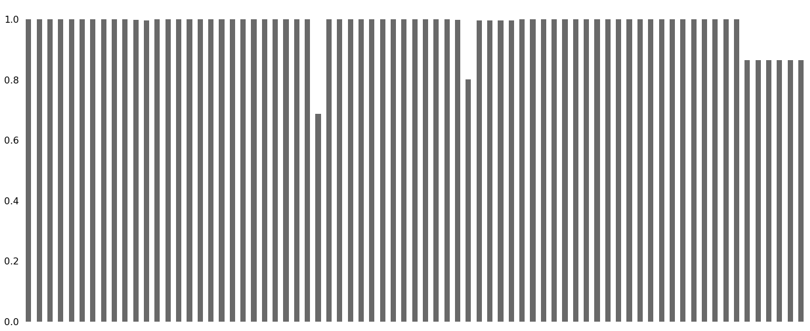


```python
data.isna().mean()*100
```


    SK_ID_CURR                      0.000000
    TARGET                          0.000000
    NAME_CONTRACT_TYPE              0.000000
    CODE_GENDER                     0.000000
    FLAG_OWN_CAR                    0.000000
    FLAG_OWN_REALTY                 0.000000
    CNT_CHILDREN                    0.000000
    AMT_INCOME_TOTAL                0.000000
    AMT_CREDIT                      0.000000
    AMT_ANNUITY                     0.003902
    AMT_GOODS_PRICE                 0.090403
    NAME_TYPE_SUITE                 0.420148
    NAME_INCOME_TYPE                0.000000
    NAME_EDUCATION_TYPE             0.000000
    NAME_FAMILY_STATUS              0.000000
    NAME_HOUSING_TYPE               0.000000
    REGION_POPULATION_RELATIVE      0.000000
    DAYS_BIRTH                      0.000000
    DAYS_EMPLOYED                   0.000000
    DAYS_REGISTRATION               0.000000
    DAYS_ID_PUBLISH                 0.000000
    FLAG_MOBIL                      0.000000
    FLAG_EMP_PHONE                  0.000000
    FLAG_WORK_PHONE                 0.000000
    FLAG_CONT_MOBILE                0.000000
    FLAG_PHONE                      0.000000
    FLAG_EMAIL                      0.000000
    OCCUPATION_TYPE                31.345545
    CNT_FAM_MEMBERS                 0.000650
    REGION_RATING_CLIENT            0.000000
    REGION_RATING_CLIENT_W_CITY     0.000000
    WEEKDAY_APPR_PROCESS_START      0.000000
    HOUR_APPR_PROCESS_START         0.000000
    REG_REGION_NOT_LIVE_REGION      0.000000
    REG_REGION_NOT_WORK_REGION      0.000000
    LIVE_REGION_NOT_WORK_REGION     0.000000
    REG_CITY_NOT_LIVE_CITY          0.000000
    REG_CITY_NOT_WORK_CITY          0.000000
    LIVE_CITY_NOT_WORK_CITY         0.000000
    ORGANIZATION_TYPE               0.000000
    EXT_SOURCE_2                    0.214626
    EXT_SOURCE_3                   19.825307
    OBS_30_CNT_SOCIAL_CIRCLE        0.332021
    DEF_30_CNT_SOCIAL_CIRCLE        0.332021
    OBS_60_CNT_SOCIAL_CIRCLE        0.332021
    DEF_60_CNT_SOCIAL_CIRCLE        0.332021
    DAYS_LAST_PHONE_CHANGE          0.000325
    FLAG_DOCUMENT_2                 0.000000
    FLAG_DOCUMENT_3                 0.000000
    FLAG_DOCUMENT_4                 0.000000
    FLAG_DOCUMENT_5                 0.000000
    FLAG_DOCUMENT_6                 0.000000
    FLAG_DOCUMENT_7                 0.000000
    FLAG_DOCUMENT_8                 0.000000
    FLAG_DOCUMENT_9                 0.000000
    FLAG_DOCUMENT_10                0.000000
    FLAG_DOCUMENT_11                0.000000
    FLAG_DOCUMENT_12                0.000000
    FLAG_DOCUMENT_13                0.000000
    FLAG_DOCUMENT_14                0.000000
    FLAG_DOCUMENT_15                0.000000
    FLAG_DOCUMENT_16                0.000000
    FLAG_DOCUMENT_17                0.000000
    FLAG_DOCUMENT_18                0.000000
    FLAG_DOCUMENT_19                0.000000
    FLAG_DOCUMENT_20                0.000000
    FLAG_DOCUMENT_21                0.000000
    AMT_REQ_CREDIT_BUREAU_HOUR     13.501631
    AMT_REQ_CREDIT_BUREAU_DAY      13.501631
    AMT_REQ_CREDIT_BUREAU_WEEK     13.501631
    AMT_REQ_CREDIT_BUREAU_MON      13.501631
    AMT_REQ_CREDIT_BUREAU_QRT      13.501631
    AMT_REQ_CREDIT_BUREAU_YEAR     13.501631
    dtype: float64


#### OCCUPATION_TYPE Missing values


```python
data.OCCUPATION_TYPE.value_counts(normalize=True)*100
```


    Laborers                 26.139636
    Sales staff              15.205570
    Core staff               13.058924
    Managers                 10.122679
    Drivers                   8.811576
    High skill tech staff     5.390299
    Accountants               4.648067
    Medicine staff            4.043672
    Security staff            3.183498
    Cooking staff             2.816408
    Cleaning staff            2.203960
    Private service staff     1.256158
    Low-skill Laborers        0.991379
    Waiters/barmen staff      0.638499
    Secretaries               0.618132
    Realty agents             0.355722
    HR staff                  0.266673
    IT staff                  0.249147
    Name: OCCUPATION_TYPE, dtype: float64


```python
data[data.OCCUPATION_TYPE.isnull() == True]
```


<div>
<style scoped>
    .dataframe tbody tr th:only-of-type {
        vertical-align: middle;
    }

    .dataframe tbody tr th {
        vertical-align: top;
    }

    .dataframe thead th {
        text-align: right;
    }
</style>
<table border="1" class="dataframe">
  <thead>
    <tr style="text-align: right;">
      <th></th>
      <th>SK_ID_CURR</th>
      <th>TARGET</th>
      <th>NAME_CONTRACT_TYPE</th>
      <th>CODE_GENDER</th>
      <th>FLAG_OWN_CAR</th>
      <th>FLAG_OWN_REALTY</th>
      <th>CNT_CHILDREN</th>
      <th>AMT_INCOME_TOTAL</th>
      <th>AMT_CREDIT</th>
      <th>AMT_ANNUITY</th>
      <th>AMT_GOODS_PRICE</th>
      <th>NAME_TYPE_SUITE</th>
      <th>NAME_INCOME_TYPE</th>
      <th>NAME_EDUCATION_TYPE</th>
      <th>NAME_FAMILY_STATUS</th>
      <th>NAME_HOUSING_TYPE</th>
      <th>REGION_POPULATION_RELATIVE</th>
      <th>DAYS_BIRTH</th>
      <th>DAYS_EMPLOYED</th>
      <th>DAYS_REGISTRATION</th>
      <th>DAYS_ID_PUBLISH</th>
      <th>FLAG_MOBIL</th>
      <th>FLAG_EMP_PHONE</th>
      <th>FLAG_WORK_PHONE</th>
      <th>FLAG_CONT_MOBILE</th>
      <th>FLAG_PHONE</th>
      <th>FLAG_EMAIL</th>
      <th>OCCUPATION_TYPE</th>
      <th>CNT_FAM_MEMBERS</th>
      <th>REGION_RATING_CLIENT</th>
      <th>REGION_RATING_CLIENT_W_CITY</th>
      <th>WEEKDAY_APPR_PROCESS_START</th>
      <th>HOUR_APPR_PROCESS_START</th>
      <th>REG_REGION_NOT_LIVE_REGION</th>
      <th>REG_REGION_NOT_WORK_REGION</th>
      <th>LIVE_REGION_NOT_WORK_REGION</th>
      <th>REG_CITY_NOT_LIVE_CITY</th>
      <th>REG_CITY_NOT_WORK_CITY</th>
      <th>LIVE_CITY_NOT_WORK_CITY</th>
      <th>ORGANIZATION_TYPE</th>
      <th>EXT_SOURCE_2</th>
      <th>EXT_SOURCE_3</th>
      <th>OBS_30_CNT_SOCIAL_CIRCLE</th>
      <th>DEF_30_CNT_SOCIAL_CIRCLE</th>
      <th>OBS_60_CNT_SOCIAL_CIRCLE</th>
      <th>DEF_60_CNT_SOCIAL_CIRCLE</th>
      <th>DAYS_LAST_PHONE_CHANGE</th>
      <th>FLAG_DOCUMENT_2</th>
      <th>FLAG_DOCUMENT_3</th>
      <th>FLAG_DOCUMENT_4</th>
      <th>FLAG_DOCUMENT_5</th>
      <th>FLAG_DOCUMENT_6</th>
      <th>FLAG_DOCUMENT_7</th>
      <th>FLAG_DOCUMENT_8</th>
      <th>FLAG_DOCUMENT_9</th>
      <th>FLAG_DOCUMENT_10</th>
      <th>FLAG_DOCUMENT_11</th>
      <th>FLAG_DOCUMENT_12</th>
      <th>FLAG_DOCUMENT_13</th>
      <th>FLAG_DOCUMENT_14</th>
      <th>FLAG_DOCUMENT_15</th>
      <th>FLAG_DOCUMENT_16</th>
      <th>FLAG_DOCUMENT_17</th>
      <th>FLAG_DOCUMENT_18</th>
      <th>FLAG_DOCUMENT_19</th>
      <th>FLAG_DOCUMENT_20</th>
      <th>FLAG_DOCUMENT_21</th>
      <th>AMT_REQ_CREDIT_BUREAU_HOUR</th>
      <th>AMT_REQ_CREDIT_BUREAU_DAY</th>
      <th>AMT_REQ_CREDIT_BUREAU_WEEK</th>
      <th>AMT_REQ_CREDIT_BUREAU_MON</th>
      <th>AMT_REQ_CREDIT_BUREAU_QRT</th>
      <th>AMT_REQ_CREDIT_BUREAU_YEAR</th>
    </tr>
  </thead>
  <tbody>
    <tr>
      <th>8</th>
      <td>100011</td>
      <td>0</td>
      <td>Cash loans</td>
      <td>F</td>
      <td>N</td>
      <td>Y</td>
      <td>0</td>
      <td>112500.000</td>
      <td>1019610.0</td>
      <td>33826.5</td>
      <td>913500.0</td>
      <td>Children</td>
      <td>Pensioner</td>
      <td>Secondary / secondary special</td>
      <td>Married</td>
      <td>House / apartment</td>
      <td>0.018634</td>
      <td>-20099</td>
      <td>365243</td>
      <td>-7427.0</td>
      <td>-3514</td>
      <td>1</td>
      <td>0</td>
      <td>0</td>
      <td>1</td>
      <td>0</td>
      <td>0</td>
      <td>NaN</td>
      <td>2.0</td>
      <td>2</td>
      <td>2</td>
      <td>WEDNESDAY</td>
      <td>14</td>
      <td>0</td>
      <td>0</td>
      <td>0</td>
      <td>0</td>
      <td>0</td>
      <td>0</td>
      <td>XNA</td>
      <td>0.205747</td>
      <td>0.751724</td>
      <td>1.0</td>
      <td>0.0</td>
      <td>1.0</td>
      <td>0.0</td>
      <td>0.0</td>
      <td>0</td>
      <td>1</td>
      <td>0</td>
      <td>0</td>
      <td>0</td>
      <td>0</td>
      <td>0</td>
      <td>0</td>
      <td>0</td>
      <td>0</td>
      <td>0</td>
      <td>0</td>
      <td>0</td>
      <td>0</td>
      <td>0</td>
      <td>0</td>
      <td>0</td>
      <td>0</td>
      <td>0</td>
      <td>0</td>
      <td>0.0</td>
      <td>0.0</td>
      <td>0.0</td>
      <td>0.0</td>
      <td>0.0</td>
      <td>1.0</td>
    </tr>
    <tr>
      <th>11</th>
      <td>100015</td>
      <td>0</td>
      <td>Cash loans</td>
      <td>F</td>
      <td>N</td>
      <td>Y</td>
      <td>0</td>
      <td>38419.155</td>
      <td>148365.0</td>
      <td>10678.5</td>
      <td>135000.0</td>
      <td>Children</td>
      <td>Pensioner</td>
      <td>Secondary / secondary special</td>
      <td>Married</td>
      <td>House / apartment</td>
      <td>0.015221</td>
      <td>-20417</td>
      <td>365243</td>
      <td>-5246.0</td>
      <td>-2512</td>
      <td>1</td>
      <td>0</td>
      <td>0</td>
      <td>1</td>
      <td>1</td>
      <td>0</td>
      <td>NaN</td>
      <td>2.0</td>
      <td>2</td>
      <td>2</td>
      <td>FRIDAY</td>
      <td>7</td>
      <td>0</td>
      <td>0</td>
      <td>0</td>
      <td>0</td>
      <td>0</td>
      <td>0</td>
      <td>XNA</td>
      <td>0.555183</td>
      <td>0.652897</td>
      <td>0.0</td>
      <td>0.0</td>
      <td>0.0</td>
      <td>0.0</td>
      <td>-2396.0</td>
      <td>0</td>
      <td>0</td>
      <td>0</td>
      <td>0</td>
      <td>1</td>
      <td>0</td>
      <td>0</td>
      <td>0</td>
      <td>0</td>
      <td>0</td>
      <td>0</td>
      <td>0</td>
      <td>0</td>
      <td>0</td>
      <td>0</td>
      <td>0</td>
      <td>0</td>
      <td>0</td>
      <td>0</td>
      <td>0</td>
      <td>0.0</td>
      <td>0.0</td>
      <td>0.0</td>
      <td>0.0</td>
      <td>0.0</td>
      <td>2.0</td>
    </tr>
    <tr>
      <th>23</th>
      <td>100027</td>
      <td>0</td>
      <td>Cash loans</td>
      <td>F</td>
      <td>N</td>
      <td>Y</td>
      <td>0</td>
      <td>83250.000</td>
      <td>239850.0</td>
      <td>23850.0</td>
      <td>225000.0</td>
      <td>Unaccompanied</td>
      <td>Pensioner</td>
      <td>Secondary / secondary special</td>
      <td>Married</td>
      <td>House / apartment</td>
      <td>0.006296</td>
      <td>-24827</td>
      <td>365243</td>
      <td>-9012.0</td>
      <td>-3684</td>
      <td>1</td>
      <td>0</td>
      <td>0</td>
      <td>1</td>
      <td>1</td>
      <td>0</td>
      <td>NaN</td>
      <td>2.0</td>
      <td>3</td>
      <td>3</td>
      <td>FRIDAY</td>
      <td>12</td>
      <td>0</td>
      <td>0</td>
      <td>0</td>
      <td>0</td>
      <td>0</td>
      <td>0</td>
      <td>XNA</td>
      <td>0.624305</td>
      <td>0.669057</td>
      <td>0.0</td>
      <td>0.0</td>
      <td>0.0</td>
      <td>0.0</td>
      <td>-795.0</td>
      <td>0</td>
      <td>0</td>
      <td>0</td>
      <td>0</td>
      <td>1</td>
      <td>0</td>
      <td>0</td>
      <td>0</td>
      <td>0</td>
      <td>0</td>
      <td>0</td>
      <td>0</td>
      <td>0</td>
      <td>0</td>
      <td>0</td>
      <td>0</td>
      <td>0</td>
      <td>0</td>
      <td>0</td>
      <td>0</td>
      <td>0.0</td>
      <td>0.0</td>
      <td>0.0</td>
      <td>0.0</td>
      <td>0.0</td>
      <td>3.0</td>
    </tr>
    <tr>
      <th>28</th>
      <td>100033</td>
      <td>0</td>
      <td>Cash loans</td>
      <td>M</td>
      <td>Y</td>
      <td>Y</td>
      <td>0</td>
      <td>270000.000</td>
      <td>790830.0</td>
      <td>57676.5</td>
      <td>675000.0</td>
      <td>Unaccompanied</td>
      <td>State servant</td>
      <td>Higher education</td>
      <td>Single / not married</td>
      <td>House / apartment</td>
      <td>0.046220</td>
      <td>-9994</td>
      <td>-1796</td>
      <td>-4668.0</td>
      <td>-2661</td>
      <td>1</td>
      <td>1</td>
      <td>0</td>
      <td>1</td>
      <td>0</td>
      <td>1</td>
      <td>NaN</td>
      <td>1.0</td>
      <td>1</td>
      <td>1</td>
      <td>WEDNESDAY</td>
      <td>11</td>
      <td>0</td>
      <td>1</td>
      <td>1</td>
      <td>0</td>
      <td>0</td>
      <td>0</td>
      <td>Military</td>
      <td>0.685011</td>
      <td>0.524496</td>
      <td>0.0</td>
      <td>0.0</td>
      <td>0.0</td>
      <td>0.0</td>
      <td>-849.0</td>
      <td>0</td>
      <td>0</td>
      <td>0</td>
      <td>0</td>
      <td>0</td>
      <td>0</td>
      <td>1</td>
      <td>0</td>
      <td>0</td>
      <td>0</td>
      <td>0</td>
      <td>0</td>
      <td>0</td>
      <td>0</td>
      <td>0</td>
      <td>0</td>
      <td>0</td>
      <td>0</td>
      <td>0</td>
      <td>0</td>
      <td>0.0</td>
      <td>0.0</td>
      <td>0.0</td>
      <td>1.0</td>
      <td>0.0</td>
      <td>1.0</td>
    </tr>
    <tr>
      <th>30</th>
      <td>100035</td>
      <td>0</td>
      <td>Cash loans</td>
      <td>F</td>
      <td>N</td>
      <td>Y</td>
      <td>0</td>
      <td>292500.000</td>
      <td>665892.0</td>
      <td>24592.5</td>
      <td>477000.0</td>
      <td>Unaccompanied</td>
      <td>Commercial associate</td>
      <td>Secondary / secondary special</td>
      <td>Civil marriage</td>
      <td>House / apartment</td>
      <td>0.025164</td>
      <td>-15280</td>
      <td>-2668</td>
      <td>-5266.0</td>
      <td>-3787</td>
      <td>1</td>
      <td>1</td>
      <td>0</td>
      <td>1</td>
      <td>0</td>
      <td>1</td>
      <td>NaN</td>
      <td>2.0</td>
      <td>2</td>
      <td>2</td>
      <td>WEDNESDAY</td>
      <td>13</td>
      <td>0</td>
      <td>0</td>
      <td>0</td>
      <td>0</td>
      <td>0</td>
      <td>0</td>
      <td>Business Entity Type 3</td>
      <td>0.479987</td>
      <td>0.410103</td>
      <td>0.0</td>
      <td>0.0</td>
      <td>0.0</td>
      <td>0.0</td>
      <td>-1634.0</td>
      <td>0</td>
      <td>1</td>
      <td>0</td>
      <td>0</td>
      <td>0</td>
      <td>0</td>
      <td>0</td>
      <td>0</td>
      <td>0</td>
      <td>0</td>
      <td>0</td>
      <td>0</td>
      <td>0</td>
      <td>0</td>
      <td>0</td>
      <td>0</td>
      <td>0</td>
      <td>0</td>
      <td>0</td>
      <td>0</td>
      <td>0.0</td>
      <td>0.0</td>
      <td>0.0</td>
      <td>1.0</td>
      <td>0.0</td>
      <td>5.0</td>
    </tr>
    <tr>
      <th>...</th>
      <td>...</td>
      <td>...</td>
      <td>...</td>
      <td>...</td>
      <td>...</td>
      <td>...</td>
      <td>...</td>
      <td>...</td>
      <td>...</td>
      <td>...</td>
      <td>...</td>
      <td>...</td>
      <td>...</td>
      <td>...</td>
      <td>...</td>
      <td>...</td>
      <td>...</td>
      <td>...</td>
      <td>...</td>
      <td>...</td>
      <td>...</td>
      <td>...</td>
      <td>...</td>
      <td>...</td>
      <td>...</td>
      <td>...</td>
      <td>...</td>
      <td>...</td>
      <td>...</td>
      <td>...</td>
      <td>...</td>
      <td>...</td>
      <td>...</td>
      <td>...</td>
      <td>...</td>
      <td>...</td>
      <td>...</td>
      <td>...</td>
      <td>...</td>
      <td>...</td>
      <td>...</td>
      <td>...</td>
      <td>...</td>
      <td>...</td>
      <td>...</td>
      <td>...</td>
      <td>...</td>
      <td>...</td>
      <td>...</td>
      <td>...</td>
      <td>...</td>
      <td>...</td>
      <td>...</td>
      <td>...</td>
      <td>...</td>
      <td>...</td>
      <td>...</td>
      <td>...</td>
      <td>...</td>
      <td>...</td>
      <td>...</td>
      <td>...</td>
      <td>...</td>
      <td>...</td>
      <td>...</td>
      <td>...</td>
      <td>...</td>
      <td>...</td>
      <td>...</td>
      <td>...</td>
      <td>...</td>
      <td>...</td>
      <td>...</td>
    </tr>
    <tr>
      <th>307486</th>
      <td>456230</td>
      <td>0</td>
      <td>Cash loans</td>
      <td>F</td>
      <td>Y</td>
      <td>Y</td>
      <td>1</td>
      <td>292500.000</td>
      <td>355536.0</td>
      <td>18283.5</td>
      <td>270000.0</td>
      <td>Unaccompanied</td>
      <td>Commercial associate</td>
      <td>Higher education</td>
      <td>Civil marriage</td>
      <td>House / apartment</td>
      <td>0.072508</td>
      <td>-16010</td>
      <td>-1185</td>
      <td>-5034.0</td>
      <td>-4392</td>
      <td>1</td>
      <td>1</td>
      <td>0</td>
      <td>1</td>
      <td>1</td>
      <td>0</td>
      <td>NaN</td>
      <td>3.0</td>
      <td>1</td>
      <td>1</td>
      <td>SATURDAY</td>
      <td>17</td>
      <td>0</td>
      <td>0</td>
      <td>0</td>
      <td>0</td>
      <td>0</td>
      <td>0</td>
      <td>Business Entity Type 2</td>
      <td>0.661025</td>
      <td>0.199771</td>
      <td>0.0</td>
      <td>0.0</td>
      <td>0.0</td>
      <td>0.0</td>
      <td>0.0</td>
      <td>0</td>
      <td>0</td>
      <td>0</td>
      <td>0</td>
      <td>0</td>
      <td>0</td>
      <td>1</td>
      <td>0</td>
      <td>0</td>
      <td>0</td>
      <td>0</td>
      <td>0</td>
      <td>0</td>
      <td>0</td>
      <td>0</td>
      <td>0</td>
      <td>0</td>
      <td>0</td>
      <td>0</td>
      <td>0</td>
      <td>0.0</td>
      <td>0.0</td>
      <td>0.0</td>
      <td>0.0</td>
      <td>1.0</td>
      <td>1.0</td>
    </tr>
    <tr>
      <th>307487</th>
      <td>456231</td>
      <td>0</td>
      <td>Cash loans</td>
      <td>M</td>
      <td>N</td>
      <td>Y</td>
      <td>0</td>
      <td>117000.000</td>
      <td>1071909.0</td>
      <td>31473.0</td>
      <td>936000.0</td>
      <td>Unaccompanied</td>
      <td>Pensioner</td>
      <td>Secondary / secondary special</td>
      <td>Married</td>
      <td>House / apartment</td>
      <td>0.010147</td>
      <td>-23125</td>
      <td>365243</td>
      <td>-5485.0</td>
      <td>-4115</td>
      <td>1</td>
      <td>0</td>
      <td>0</td>
      <td>1</td>
      <td>0</td>
      <td>0</td>
      <td>NaN</td>
      <td>2.0</td>
      <td>2</td>
      <td>2</td>
      <td>WEDNESDAY</td>
      <td>10</td>
      <td>0</td>
      <td>0</td>
      <td>0</td>
      <td>0</td>
      <td>0</td>
      <td>0</td>
      <td>XNA</td>
      <td>0.307082</td>
      <td>0.255332</td>
      <td>0.0</td>
      <td>0.0</td>
      <td>0.0</td>
      <td>0.0</td>
      <td>-846.0</td>
      <td>0</td>
      <td>1</td>
      <td>0</td>
      <td>0</td>
      <td>0</td>
      <td>0</td>
      <td>0</td>
      <td>0</td>
      <td>0</td>
      <td>0</td>
      <td>0</td>
      <td>0</td>
      <td>0</td>
      <td>0</td>
      <td>0</td>
      <td>0</td>
      <td>0</td>
      <td>0</td>
      <td>0</td>
      <td>0</td>
      <td>0.0</td>
      <td>0.0</td>
      <td>0.0</td>
      <td>0.0</td>
      <td>1.0</td>
      <td>8.0</td>
    </tr>
    <tr>
      <th>307500</th>
      <td>456244</td>
      <td>0</td>
      <td>Cash loans</td>
      <td>F</td>
      <td>N</td>
      <td>Y</td>
      <td>0</td>
      <td>261000.000</td>
      <td>1303812.0</td>
      <td>35982.0</td>
      <td>1138500.0</td>
      <td>Unaccompanied</td>
      <td>Working</td>
      <td>Higher education</td>
      <td>Married</td>
      <td>House / apartment</td>
      <td>0.031329</td>
      <td>-20390</td>
      <td>-5326</td>
      <td>-157.0</td>
      <td>-3906</td>
      <td>1</td>
      <td>1</td>
      <td>0</td>
      <td>1</td>
      <td>0</td>
      <td>1</td>
      <td>NaN</td>
      <td>2.0</td>
      <td>2</td>
      <td>2</td>
      <td>FRIDAY</td>
      <td>10</td>
      <td>0</td>
      <td>0</td>
      <td>0</td>
      <td>0</td>
      <td>0</td>
      <td>0</td>
      <td>Business Entity Type 3</td>
      <td>0.789389</td>
      <td>0.337673</td>
      <td>0.0</td>
      <td>0.0</td>
      <td>0.0</td>
      <td>0.0</td>
      <td>-1459.0</td>
      <td>0</td>
      <td>1</td>
      <td>0</td>
      <td>0</td>
      <td>0</td>
      <td>0</td>
      <td>0</td>
      <td>0</td>
      <td>0</td>
      <td>0</td>
      <td>0</td>
      <td>0</td>
      <td>0</td>
      <td>0</td>
      <td>0</td>
      <td>0</td>
      <td>0</td>
      <td>0</td>
      <td>0</td>
      <td>0</td>
      <td>0.0</td>
      <td>0.0</td>
      <td>0.0</td>
      <td>1.0</td>
      <td>0.0</td>
      <td>5.0</td>
    </tr>
    <tr>
      <th>307505</th>
      <td>456249</td>
      <td>0</td>
      <td>Cash loans</td>
      <td>F</td>
      <td>N</td>
      <td>Y</td>
      <td>0</td>
      <td>112500.000</td>
      <td>225000.0</td>
      <td>22050.0</td>
      <td>225000.0</td>
      <td>Unaccompanied</td>
      <td>Pensioner</td>
      <td>Secondary / secondary special</td>
      <td>Single / not married</td>
      <td>House / apartment</td>
      <td>0.022800</td>
      <td>-24384</td>
      <td>365243</td>
      <td>-7369.0</td>
      <td>-2357</td>
      <td>1</td>
      <td>0</td>
      <td>0</td>
      <td>1</td>
      <td>1</td>
      <td>0</td>
      <td>NaN</td>
      <td>1.0</td>
      <td>2</td>
      <td>2</td>
      <td>MONDAY</td>
      <td>15</td>
      <td>0</td>
      <td>0</td>
      <td>0</td>
      <td>0</td>
      <td>0</td>
      <td>0</td>
      <td>XNA</td>
      <td>0.346391</td>
      <td>0.742182</td>
      <td>0.0</td>
      <td>0.0</td>
      <td>0.0</td>
      <td>0.0</td>
      <td>0.0</td>
      <td>0</td>
      <td>0</td>
      <td>0</td>
      <td>0</td>
      <td>1</td>
      <td>0</td>
      <td>0</td>
      <td>0</td>
      <td>0</td>
      <td>0</td>
      <td>0</td>
      <td>0</td>
      <td>0</td>
      <td>0</td>
      <td>0</td>
      <td>0</td>
      <td>0</td>
      <td>0</td>
      <td>0</td>
      <td>0</td>
      <td>0.0</td>
      <td>0.0</td>
      <td>0.0</td>
      <td>2.0</td>
      <td>0.0</td>
      <td>0.0</td>
    </tr>
    <tr>
      <th>307507</th>
      <td>456252</td>
      <td>0</td>
      <td>Cash loans</td>
      <td>F</td>
      <td>N</td>
      <td>Y</td>
      <td>0</td>
      <td>72000.000</td>
      <td>269550.0</td>
      <td>12001.5</td>
      <td>225000.0</td>
      <td>Unaccompanied</td>
      <td>Pensioner</td>
      <td>Secondary / secondary special</td>
      <td>Widow</td>
      <td>House / apartment</td>
      <td>0.025164</td>
      <td>-20775</td>
      <td>365243</td>
      <td>-4388.0</td>
      <td>-4090</td>
      <td>1</td>
      <td>0</td>
      <td>0</td>
      <td>1</td>
      <td>1</td>
      <td>0</td>
      <td>NaN</td>
      <td>1.0</td>
      <td>2</td>
      <td>2</td>
      <td>MONDAY</td>
      <td>8</td>
      <td>0</td>
      <td>0</td>
      <td>0</td>
      <td>0</td>
      <td>0</td>
      <td>0</td>
      <td>XNA</td>
      <td>0.115992</td>
      <td>NaN</td>
      <td>0.0</td>
      <td>0.0</td>
      <td>0.0</td>
      <td>0.0</td>
      <td>0.0</td>
      <td>0</td>
      <td>1</td>
      <td>0</td>
      <td>0</td>
      <td>0</td>
      <td>0</td>
      <td>0</td>
      <td>0</td>
      <td>0</td>
      <td>0</td>
      <td>0</td>
      <td>0</td>
      <td>0</td>
      <td>0</td>
      <td>0</td>
      <td>0</td>
      <td>0</td>
      <td>0</td>
      <td>0</td>
      <td>0</td>
      <td>NaN</td>
      <td>NaN</td>
      <td>NaN</td>
      <td>NaN</td>
      <td>NaN</td>
      <td>NaN</td>
    </tr>
  </tbody>
</table>
<p>96391 rows × 73 columns</p>
</div>


#### - Better to be left missing as imputation with median or mode value will result in loss of data integrity, distort original properties (distribution ratio of categories).

#### EXT_SOURCE_3 Missing values


```python
data.EXT_SOURCE_3.isna().mean()*100
```


    19.825307062186393


#### - Around 20% values missing


```python
data.EXT_SOURCE_3.describe()[1:-1]
```


    mean    0.510853
    std     0.194844
    min     0.000527
    25%     0.370650
    50%     0.535276
    75%     0.669057
    Name: EXT_SOURCE_3, dtype: float64


##### Majority of values b/w 0.37 to 0.67


```python
plt.figure(figsize=(25,3))
sns.boxplot(data.EXT_SOURCE_3)
```


    <matplotlib.axes._subplots.AxesSubplot at 0x7f03837131d0>


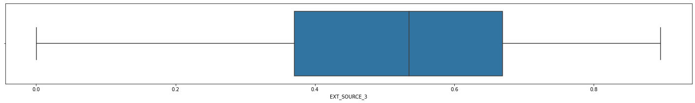


#### -No outliers as such, best to IMPUTE missing values with MEAN


```python
data.EXT_SOURCE_3.mean()
```


    0.5108529061800121


#### AMT_REQ_CREDIT_BUREAU_HOUR Missing values


```python
data.AMT_REQ_CREDIT_BUREAU_HOUR.isna().mean()*100
```


    13.501630835970097


```python
# checking whether the same applications have all the other related fields missing too
data[data.AMT_REQ_CREDIT_BUREAU_HOUR.isnull() == True].iloc[:,-5:].isna().sum()
```


    AMT_REQ_CREDIT_BUREAU_DAY     41519
    AMT_REQ_CREDIT_BUREAU_WEEK    41519
    AMT_REQ_CREDIT_BUREAU_MON     41519
    AMT_REQ_CREDIT_BUREAU_QRT     41519
    AMT_REQ_CREDIT_BUREAU_YEAR    41519
    dtype: int64


#### -As it seems, aroung 13.5% applications have all the Credit Bureau Enquiry frequencies missing.


```python
data.AMT_REQ_CREDIT_BUREAU_HOUR.value_counts(normalize=True)*100
```


    0.0    99.388703
    1.0     0.586484
    2.0     0.021053
    3.0     0.003384
    4.0     0.000376
    Name: AMT_REQ_CREDIT_BUREAU_HOUR, dtype: float64


#### -Safe to impute NAs with 0. 


```python
data.AMT_REQ_CREDIT_BUREAU_DAY.value_counts(normalize=True)*100
```


    0.0    99.440209
    1.0     0.485729
    2.0     0.039851
    3.0     0.016918
    4.0     0.009775
    5.0     0.003384
    6.0     0.003008
    9.0     0.000752
    8.0     0.000376
    Name: AMT_REQ_CREDIT_BUREAU_DAY, dtype: float64


#### -Safe to impute NAs with 0. 


```python
data.AMT_REQ_CREDIT_BUREAU_WEEK.value_counts(normalize=True)*100
```


    0.0    96.790881
    1.0     3.085807
    2.0     0.074814
    3.0     0.021805
    4.0     0.012782
    6.0     0.007519
    5.0     0.003760
    8.0     0.001880
    7.0     0.000752
    Name: AMT_REQ_CREDIT_BUREAU_WEEK, dtype: float64


#### -Safe to impute NAs with 0. 


```python
data.AMT_REQ_CREDIT_BUREAU_MON.value_counts(normalize=True)*100
```


    0.0     83.548753
    1.0     12.461653
    2.0      2.024873
    3.0      0.748519
    4.0      0.404523
    5.0      0.226323
    6.0      0.128951
    7.0      0.112033
    9.0      0.077446
    8.0      0.069551
    10.0     0.049626
    11.0     0.044738
    12.0     0.028948
    13.0     0.027068
    14.0     0.015038
    15.0     0.013158
    16.0     0.008647
    17.0     0.005263
    18.0     0.002256
    19.0     0.001128
    24.0     0.000376
    27.0     0.000376
    22.0     0.000376
    23.0     0.000376
    Name: AMT_REQ_CREDIT_BUREAU_MON, dtype: float64


```python
data.AMT_REQ_CREDIT_BUREAU_MON.median()
```


    0.0


#### -Safe to impute NAs with 0. (median)


```python
data.AMT_REQ_CREDIT_BUREAU_QRT.value_counts(normalize=True)*100
```


    0.0      80.986270
    1.0      12.730458
    2.0       5.418208
    3.0       0.645508
    4.0       0.178953
    5.0       0.024061
    6.0       0.010527
    7.0       0.002632
    8.0       0.002632
    19.0      0.000376
    261.0     0.000376
    Name: AMT_REQ_CREDIT_BUREAU_QRT, dtype: float64


```python
data.AMT_REQ_CREDIT_BUREAU_QRT.median()
```


    0.0


#### -Safe to impute NAs with 0. 


```python
data.AMT_REQ_CREDIT_BUREAU_YEAR.value_counts(normalize=True)*100
```


    0.0     26.993669
    1.0     23.837183
    2.0     18.869740
    3.0     12.642485
    4.0      7.787452
    5.0      4.530963
    6.0      2.619252
    7.0      1.454555
    8.0      0.799648
    9.0      0.412042
    11.0     0.011654
    12.0     0.011279
    10.0     0.008271
    13.0     0.007143
    14.0     0.003760
    17.0     0.002632
    15.0     0.002256
    19.0     0.001504
    18.0     0.001504
    16.0     0.001128
    21.0     0.000376
    23.0     0.000376
    25.0     0.000376
    20.0     0.000376
    22.0     0.000376
    Name: AMT_REQ_CREDIT_BUREAU_YEAR, dtype: float64


```python
data.AMT_REQ_CREDIT_BUREAU_YEAR.median()
```


    1.0


#### -Safe to impute NAs with 1.(median) 

## DATATYPE CHECK


```python
data.info()
```

    <class 'pandas.core.frame.DataFrame'>
    RangeIndex: 307511 entries, 0 to 307510
    Data columns (total 73 columns):
     #   Column                       Non-Null Count   Dtype  
    ---  ------                       --------------   -----  
     0   SK_ID_CURR                   307511 non-null  int64  
     1   TARGET                       307511 non-null  int64  
     2   NAME_CONTRACT_TYPE           307511 non-null  object 
     3   CODE_GENDER                  307511 non-null  object 
     4   FLAG_OWN_CAR                 307511 non-null  object 
     5   FLAG_OWN_REALTY              307511 non-null  object 
     6   CNT_CHILDREN                 307511 non-null  int64  
     7   AMT_INCOME_TOTAL             307511 non-null  float64
     8   AMT_CREDIT                   307511 non-null  float64
     9   AMT_ANNUITY                  307499 non-null  float64
     10  AMT_GOODS_PRICE              307233 non-null  float64
     11  NAME_TYPE_SUITE              306219 non-null  object 
     12  NAME_INCOME_TYPE             307511 non-null  object 
     13  NAME_EDUCATION_TYPE          307511 non-null  object 
     14  NAME_FAMILY_STATUS           307511 non-null  object 
     15  NAME_HOUSING_TYPE            307511 non-null  object 
     16  REGION_POPULATION_RELATIVE   307511 non-null  float64
     17  DAYS_BIRTH                   307511 non-null  int64  
     18  DAYS_EMPLOYED                307511 non-null  int64  
     19  DAYS_REGISTRATION            307511 non-null  float64
     20  DAYS_ID_PUBLISH              307511 non-null  int64  
     21  FLAG_MOBIL                   307511 non-null  int64  
     22  FLAG_EMP_PHONE               307511 non-null  int64  
     23  FLAG_WORK_PHONE              307511 non-null  int64  
     24  FLAG_CONT_MOBILE             307511 non-null  int64  
     25  FLAG_PHONE                   307511 non-null  int64  
     26  FLAG_EMAIL                   307511 non-null  int64  
     27  OCCUPATION_TYPE              211120 non-null  object 
     28  CNT_FAM_MEMBERS              307509 non-null  float64
     29  REGION_RATING_CLIENT         307511 non-null  int64  
     30  REGION_RATING_CLIENT_W_CITY  307511 non-null  int64  
     31  WEEKDAY_APPR_PROCESS_START   307511 non-null  object 
     32  HOUR_APPR_PROCESS_START      307511 non-null  int64  
     33  REG_REGION_NOT_LIVE_REGION   307511 non-null  int64  
     34  REG_REGION_NOT_WORK_REGION   307511 non-null  int64  
     35  LIVE_REGION_NOT_WORK_REGION  307511 non-null  int64  
     36  REG_CITY_NOT_LIVE_CITY       307511 non-null  int64  
     37  REG_CITY_NOT_WORK_CITY       307511 non-null  int64  
     38  LIVE_CITY_NOT_WORK_CITY      307511 non-null  int64  
     39  ORGANIZATION_TYPE            307511 non-null  object 
     40  EXT_SOURCE_2                 306851 non-null  float64
     41  EXT_SOURCE_3                 246546 non-null  float64
     42  OBS_30_CNT_SOCIAL_CIRCLE     306490 non-null  float64
     43  DEF_30_CNT_SOCIAL_CIRCLE     306490 non-null  float64
     44  OBS_60_CNT_SOCIAL_CIRCLE     306490 non-null  float64
     45  DEF_60_CNT_SOCIAL_CIRCLE     306490 non-null  float64
     46  DAYS_LAST_PHONE_CHANGE       307510 non-null  float64
     47  FLAG_DOCUMENT_2              307511 non-null  int64  
     48  FLAG_DOCUMENT_3              307511 non-null  int64  
     49  FLAG_DOCUMENT_4              307511 non-null  int64  
     50  FLAG_DOCUMENT_5              307511 non-null  int64  
     51  FLAG_DOCUMENT_6              307511 non-null  int64  
     52  FLAG_DOCUMENT_7              307511 non-null  int64  
     53  FLAG_DOCUMENT_8              307511 non-null  int64  
     54  FLAG_DOCUMENT_9              307511 non-null  int64  
     55  FLAG_DOCUMENT_10             307511 non-null  int64  
     56  FLAG_DOCUMENT_11             307511 non-null  int64  
     57  FLAG_DOCUMENT_12             307511 non-null  int64  
     58  FLAG_DOCUMENT_13             307511 non-null  int64  
     59  FLAG_DOCUMENT_14             307511 non-null  int64  
     60  FLAG_DOCUMENT_15             307511 non-null  int64  
     61  FLAG_DOCUMENT_16             307511 non-null  int64  
     62  FLAG_DOCUMENT_17             307511 non-null  int64  
     63  FLAG_DOCUMENT_18             307511 non-null  int64  
     64  FLAG_DOCUMENT_19             307511 non-null  int64  
     65  FLAG_DOCUMENT_20             307511 non-null  int64  
     66  FLAG_DOCUMENT_21             307511 non-null  int64  
     67  AMT_REQ_CREDIT_BUREAU_HOUR   265992 non-null  float64
     68  AMT_REQ_CREDIT_BUREAU_DAY    265992 non-null  float64
     69  AMT_REQ_CREDIT_BUREAU_WEEK   265992 non-null  float64
     70  AMT_REQ_CREDIT_BUREAU_MON    265992 non-null  float64
     71  AMT_REQ_CREDIT_BUREAU_QRT    265992 non-null  float64
     72  AMT_REQ_CREDIT_BUREAU_YEAR   265992 non-null  float64
    dtypes: float64(20), int64(41), object(12)
    memory usage: 171.3+ MB
    

### TARGET DataType


```python
data.TARGET.value_counts()
```


    0    282686
    1     24825
    Name: TARGET, dtype: int64


#### -Should clearly be a category and not int64.


```python
data.TARGET = data.TARGET.astype('category')
```


```python
data.TARGET.dtype
```


    CategoricalDtype(categories=[0, 1], ordered=False)


### CNT_CHILDREN DataType


```python
data.CNT_CHILDREN.nunique()
```


    15


```python
data.CNT_CHILDREN.dtype
```


    dtype('int64')


#### -Should be a category and not int64.


```python
data.CNT_CHILDREN = data.CNT_CHILDREN.astype('category')
```

Shouldn't be category


```python
data.CNT_CHILDREN.dtype
```


    CategoricalDtype(categories=[0, 1, 2, 3, 4, 5, 6, 7, 8, 9, 10, 11, 12, 14, 19], ordered=False)


### Same way any column with less than 50 unique values should be made a category.


```python
for col in data.columns:
    if data[col].nunique() < 50:
        data[col] = data[col].astype('category')
```


```python
data.info()
```

    <class 'pandas.core.frame.DataFrame'>
    RangeIndex: 307511 entries, 0 to 307510
    Data columns (total 73 columns):
     #   Column                       Non-Null Count   Dtype   
    ---  ------                       --------------   -----   
     0   SK_ID_CURR                   307511 non-null  int64   
     1   TARGET                       307511 non-null  category
     2   NAME_CONTRACT_TYPE           307511 non-null  category
     3   CODE_GENDER                  307511 non-null  category
     4   FLAG_OWN_CAR                 307511 non-null  category
     5   FLAG_OWN_REALTY              307511 non-null  category
     6   CNT_CHILDREN                 307511 non-null  category
     7   AMT_INCOME_TOTAL             307511 non-null  float64 
     8   AMT_CREDIT                   307511 non-null  float64 
     9   AMT_ANNUITY                  307499 non-null  float64 
     10  AMT_GOODS_PRICE              307233 non-null  float64 
     11  NAME_TYPE_SUITE              306219 non-null  category
     12  NAME_INCOME_TYPE             307511 non-null  category
     13  NAME_EDUCATION_TYPE          307511 non-null  category
     14  NAME_FAMILY_STATUS           307511 non-null  category
     15  NAME_HOUSING_TYPE            307511 non-null  category
     16  REGION_POPULATION_RELATIVE   307511 non-null  float64 
     17  DAYS_BIRTH                   307511 non-null  int64   
     18  DAYS_EMPLOYED                307511 non-null  int64   
     19  DAYS_REGISTRATION            307511 non-null  float64 
     20  DAYS_ID_PUBLISH              307511 non-null  int64   
     21  FLAG_MOBIL                   307511 non-null  category
     22  FLAG_EMP_PHONE               307511 non-null  category
     23  FLAG_WORK_PHONE              307511 non-null  category
     24  FLAG_CONT_MOBILE             307511 non-null  category
     25  FLAG_PHONE                   307511 non-null  category
     26  FLAG_EMAIL                   307511 non-null  category
     27  OCCUPATION_TYPE              211120 non-null  category
     28  CNT_FAM_MEMBERS              307509 non-null  category
     29  REGION_RATING_CLIENT         307511 non-null  category
     30  REGION_RATING_CLIENT_W_CITY  307511 non-null  category
     31  WEEKDAY_APPR_PROCESS_START   307511 non-null  category
     32  HOUR_APPR_PROCESS_START      307511 non-null  category
     33  REG_REGION_NOT_LIVE_REGION   307511 non-null  category
     34  REG_REGION_NOT_WORK_REGION   307511 non-null  category
     35  LIVE_REGION_NOT_WORK_REGION  307511 non-null  category
     36  REG_CITY_NOT_LIVE_CITY       307511 non-null  category
     37  REG_CITY_NOT_WORK_CITY       307511 non-null  category
     38  LIVE_CITY_NOT_WORK_CITY      307511 non-null  category
     39  ORGANIZATION_TYPE            307511 non-null  object  
     40  EXT_SOURCE_2                 306851 non-null  float64 
     41  EXT_SOURCE_3                 246546 non-null  float64 
     42  OBS_30_CNT_SOCIAL_CIRCLE     306490 non-null  category
     43  DEF_30_CNT_SOCIAL_CIRCLE     306490 non-null  category
     44  OBS_60_CNT_SOCIAL_CIRCLE     306490 non-null  category
     45  DEF_60_CNT_SOCIAL_CIRCLE     306490 non-null  category
     46  DAYS_LAST_PHONE_CHANGE       307510 non-null  float64 
     47  FLAG_DOCUMENT_2              307511 non-null  category
     48  FLAG_DOCUMENT_3              307511 non-null  category
     49  FLAG_DOCUMENT_4              307511 non-null  category
     50  FLAG_DOCUMENT_5              307511 non-null  category
     51  FLAG_DOCUMENT_6              307511 non-null  category
     52  FLAG_DOCUMENT_7              307511 non-null  category
     53  FLAG_DOCUMENT_8              307511 non-null  category
     54  FLAG_DOCUMENT_9              307511 non-null  category
     55  FLAG_DOCUMENT_10             307511 non-null  category
     56  FLAG_DOCUMENT_11             307511 non-null  category
     57  FLAG_DOCUMENT_12             307511 non-null  category
     58  FLAG_DOCUMENT_13             307511 non-null  category
     59  FLAG_DOCUMENT_14             307511 non-null  category
     60  FLAG_DOCUMENT_15             307511 non-null  category
     61  FLAG_DOCUMENT_16             307511 non-null  category
     62  FLAG_DOCUMENT_17             307511 non-null  category
     63  FLAG_DOCUMENT_18             307511 non-null  category
     64  FLAG_DOCUMENT_19             307511 non-null  category
     65  FLAG_DOCUMENT_20             307511 non-null  category
     66  FLAG_DOCUMENT_21             307511 non-null  category
     67  AMT_REQ_CREDIT_BUREAU_HOUR   265992 non-null  category
     68  AMT_REQ_CREDIT_BUREAU_DAY    265992 non-null  category
     69  AMT_REQ_CREDIT_BUREAU_WEEK   265992 non-null  category
     70  AMT_REQ_CREDIT_BUREAU_MON    265992 non-null  category
     71  AMT_REQ_CREDIT_BUREAU_QRT    265992 non-null  category
     72  AMT_REQ_CREDIT_BUREAU_YEAR   265992 non-null  category
    dtypes: category(59), float64(9), int64(4), object(1)
    memory usage: 50.2+ MB
    

### Correcting Date values

- Converting them into positive YEAR values.


```python
data.DAYS_BIRTH
```


    0         -9461
    1        -16765
    2        -19046
    3        -19005
    4        -19932
              ...  
    307506    -9327
    307507   -20775
    307508   -14966
    307509   -11961
    307510   -16856
    Name: DAYS_BIRTH, Length: 307511, dtype: int64


```python
data.DAYS_BIRTH = round(data.DAYS_BIRTH.abs()/365,0)
```


```python
data.DAYS_EMPLOYED = round(data.DAYS_EMPLOYED.abs()/365,0)
```


```python
data.DAYS_REGISTRATION = round(data.DAYS_REGISTRATION.abs()/365,0)
```


```python
data.DAYS_ID_PUBLISH = round(data.DAYS_ID_PUBLISH.abs()/365,0)
```


```python
data.DAYS_EMPLOYED
```


    0            2.0
    1            3.0
    2            1.0
    3            8.0
    4            8.0
               ...  
    307506       1.0
    307507    1001.0
    307508      22.0
    307509      13.0
    307510       3.0
    Name: DAYS_EMPLOYED, Length: 307511, dtype: float64


```python
data.DAYS_REGISTRATION
```


    0         10.0
    1          3.0
    2         12.0
    3         27.0
    4         12.0
              ... 
    307506    23.0
    307507    12.0
    307508    18.0
    307509     7.0
    307510    14.0
    Name: DAYS_REGISTRATION, Length: 307511, dtype: float64


```python
data.DAYS_ID_PUBLISH
```


    0          6.0
    1          1.0
    2          7.0
    3          7.0
    4          9.0
              ... 
    307506     5.0
    307507    11.0
    307508    14.0
    307509     3.0
    307510     1.0
    Name: DAYS_ID_PUBLISH, Length: 307511, dtype: float64


## OUTLIER ANALYSIS

#### AMT_CREDIT


```python
plt.figure(figsize = (20, 3))
sns.boxplot(data['AMT_CREDIT'])
plt.show()
print(data['AMT_CREDIT'].describe(),end='\n\n')
iqr = (data['AMT_CREDIT'].quantile(0.75) - data['AMT_CREDIT'].quantile(0.25))*1.5+data['AMT_CREDIT'].quantile(0.75)

print(f'\033[1m - Anything above {iqr} is an outlier')
```


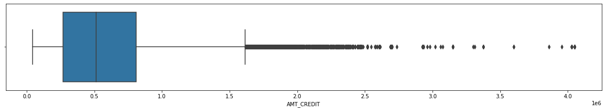


    count    3.075110e+05
    mean     5.990260e+05
    std      4.024908e+05
    min      4.500000e+04
    25%      2.700000e+05
    50%      5.135310e+05
    75%      8.086500e+05
    max      4.050000e+06
    Name: AMT_CREDIT, dtype: float64
    
     - Anything above 1616625.0 is an outlier
    

#### AMT_ANNUITY


```python
plt.figure(figsize = (20, 3))
sns.boxplot(data['AMT_ANNUITY'])
plt.show()
print(data['AMT_ANNUITY'].describe(),end='\n\n')
iqr = (data['AMT_ANNUITY'].quantile(0.75) - data['AMT_ANNUITY'].quantile(0.25))*1.5+data['AMT_ANNUITY'].quantile(0.75)

print(f'\033[1m - Anything above {iqr} is an outlier')
```


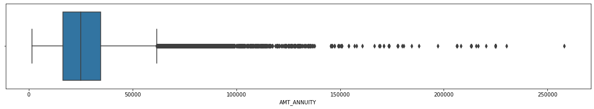


    count    307499.000000
    mean      27108.573909
    std       14493.737315
    min        1615.500000
    25%       16524.000000
    50%       24903.000000
    75%       34596.000000
    max      258025.500000
    Name: AMT_ANNUITY, dtype: float64
    
     - Anything above 61704.0 is an outlier
    

#### AMT_INCOME_TOTAL


```python
plt.figure(figsize = (20, 3))
sns.boxplot(data['AMT_INCOME_TOTAL'])
plt.show()
data['AMT_INCOME_TOTAL'].quantile([0.1,0.25,0.5,0.75,0.9,.95,.99,1])

print(data['AMT_INCOME_TOTAL'].describe(),end='\n\n')
iqr = (data['AMT_INCOME_TOTAL'].quantile(0.75) - data['AMT_INCOME_TOTAL'].quantile(0.25))*1.5+data['AMT_INCOME_TOTAL'].quantile(0.75)

print(f'\033[1m - Anything above {iqr} is an outlier')
```


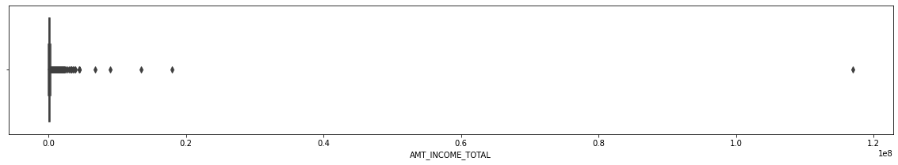


    count    3.075110e+05
    mean     1.687979e+05
    std      2.371231e+05
    min      2.565000e+04
    25%      1.125000e+05
    50%      1.471500e+05
    75%      2.025000e+05
    max      1.170000e+08
    Name: AMT_INCOME_TOTAL, dtype: float64
    
     - Anything above 337500.0 is an outlier
    

#### EXT_SOURCE_2


```python
plt.figure(figsize = (20, 3))
sns.boxplot(data['EXT_SOURCE_2'])
plt.show()
round(data['EXT_SOURCE_2'].describe(),2)

print(f'\033[1m - No outliers')
```


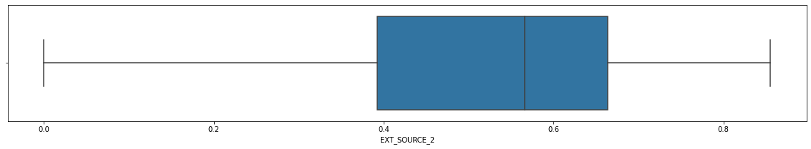


     - No outliers
    

#### AMT_GOODS_PRICE


```python
plt.figure(figsize = (20, 3))
sns.boxplot(data['AMT_GOODS_PRICE'])
plt.show()
data['AMT_GOODS_PRICE'].quantile([0.1,0.25,0.5,0.75,0.9,.95,.99,1])

print(data['AMT_GOODS_PRICE'].describe(),end='\n\n')
iqr = (data['AMT_GOODS_PRICE'].quantile(0.75) - data['AMT_GOODS_PRICE'].quantile(0.25))*1.5+data['AMT_GOODS_PRICE'].quantile(0.75)

print(f'\033[1m - Anything above {iqr} is an outlier')
```


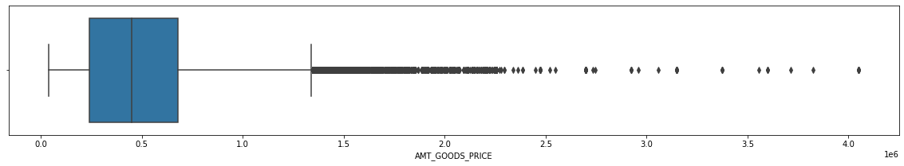


    count    3.072330e+05
    mean     5.383962e+05
    std      3.694465e+05
    min      4.050000e+04
    25%      2.385000e+05
    50%      4.500000e+05
    75%      6.795000e+05
    max      4.050000e+06
    Name: AMT_GOODS_PRICE, dtype: float64
    
     - Anything above 1341000.0 is an outlier
    

### Visualizing these columns before outlier handling


```python
from scipy.stats import norm
plt.figure(figsize=(12,8))
sns.set_style('darkgrid')
plt.subplot(2,2,1)
sns.distplot(data.AMT_INCOME_TOTAL, bins = 20 ,fit=norm, rug=True, rug_kws={"color": "r"},kde =False)


plt.subplot(2,2,2)
sns.distplot(data.AMT_GOODS_PRICE, bins = 20 ,fit=norm, rug=True, rug_kws={"color": "r"},kde =False)


plt.subplot(2,2,3)
sns.distplot(data.AMT_CREDIT, bins = 20 ,fit=norm, rug=True, rug_kws={"color": "r"},kde =False)


plt.subplot(2,2,4)
sns.distplot(data.AMT_ANNUITY, bins = 20 ,fit=norm, rug=True, rug_kws={"color": "r"},kde =False)
plt.tight_layout(pad=3.0)
```


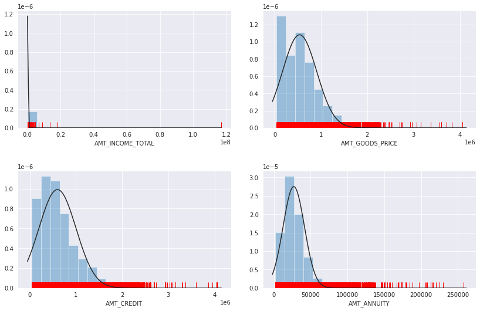


#### - Normal behaviour is being shadowed by outliers.

### Handling Outliers: Tukey's Fences
Using above method let's drop the outliers 
[Q1 - K(Q3-Q1],[Q3 - K(Q3-Q1]

#### Finding upper fence = 75th quantile + IQR


```python
df_IQR = pd.DataFrame({"AMT_ANNUITY":data.AMT_ANNUITY.quantile(.75) + 1.5*(data.AMT_ANNUITY.quantile(.75) - data.AMT_ANNUITY.quantile(.25)),
            "AMT_CREDIT":data.AMT_CREDIT.quantile(.75) + 1.5*(data.AMT_CREDIT.quantile(.75) - data.AMT_CREDIT.quantile(.25)),
            "AMT_GOODS_PRICE":data.AMT_GOODS_PRICE.quantile(.75) + 1.5*(data.AMT_GOODS_PRICE.quantile(.75) - data.AMT_GOODS_PRICE.quantile(.25)),
            "AMT_INCOME_TOTAL":data.AMT_INCOME_TOTAL.quantile(.75) + 1.5*(data.AMT_INCOME_TOTAL.quantile(.75) - data.AMT_INCOME_TOTAL.quantile(.25))}
            ,index =["Upper Fence"])
df_IQR
```


<div>
<style scoped>
    .dataframe tbody tr th:only-of-type {
        vertical-align: middle;
    }

    .dataframe tbody tr th {
        vertical-align: top;
    }

    .dataframe thead th {
        text-align: right;
    }
</style>
<table border="1" class="dataframe">
  <thead>
    <tr style="text-align: right;">
      <th></th>
      <th>AMT_ANNUITY</th>
      <th>AMT_CREDIT</th>
      <th>AMT_GOODS_PRICE</th>
      <th>AMT_INCOME_TOTAL</th>
    </tr>
  </thead>
  <tbody>
    <tr>
      <th>Upper Fence</th>
      <td>61704.0</td>
      <td>1616625.0</td>
      <td>1341000.0</td>
      <td>337500.0</td>
    </tr>
  </tbody>
</table>
</div>


```python
AMT_Statistics = data[['AMT_ANNUITY','AMT_CREDIT','AMT_GOODS_PRICE','AMT_INCOME_TOTAL']].describe().append(df_IQR)
AMT_Statistics
```


<div>
<style scoped>
    .dataframe tbody tr th:only-of-type {
        vertical-align: middle;
    }

    .dataframe tbody tr th {
        vertical-align: top;
    }

    .dataframe thead th {
        text-align: right;
    }
</style>
<table border="1" class="dataframe">
  <thead>
    <tr style="text-align: right;">
      <th></th>
      <th>AMT_ANNUITY</th>
      <th>AMT_CREDIT</th>
      <th>AMT_GOODS_PRICE</th>
      <th>AMT_INCOME_TOTAL</th>
    </tr>
  </thead>
  <tbody>
    <tr>
      <th>count</th>
      <td>307499.000000</td>
      <td>3.075110e+05</td>
      <td>3.072330e+05</td>
      <td>3.075110e+05</td>
    </tr>
    <tr>
      <th>mean</th>
      <td>27108.573909</td>
      <td>5.990260e+05</td>
      <td>5.383962e+05</td>
      <td>1.687979e+05</td>
    </tr>
    <tr>
      <th>std</th>
      <td>14493.737315</td>
      <td>4.024908e+05</td>
      <td>3.694465e+05</td>
      <td>2.371231e+05</td>
    </tr>
    <tr>
      <th>min</th>
      <td>1615.500000</td>
      <td>4.500000e+04</td>
      <td>4.050000e+04</td>
      <td>2.565000e+04</td>
    </tr>
    <tr>
      <th>25%</th>
      <td>16524.000000</td>
      <td>2.700000e+05</td>
      <td>2.385000e+05</td>
      <td>1.125000e+05</td>
    </tr>
    <tr>
      <th>50%</th>
      <td>24903.000000</td>
      <td>5.135310e+05</td>
      <td>4.500000e+05</td>
      <td>1.471500e+05</td>
    </tr>
    <tr>
      <th>75%</th>
      <td>34596.000000</td>
      <td>8.086500e+05</td>
      <td>6.795000e+05</td>
      <td>2.025000e+05</td>
    </tr>
    <tr>
      <th>max</th>
      <td>258025.500000</td>
      <td>4.050000e+06</td>
      <td>4.050000e+06</td>
      <td>1.170000e+08</td>
    </tr>
    <tr>
      <th>Upper Fence</th>
      <td>61704.000000</td>
      <td>1.616625e+06</td>
      <td>1.341000e+06</td>
      <td>3.375000e+05</td>
    </tr>
  </tbody>
</table>
</div>


- Since, max values are greater than upper fence of the column values so we need to drop outliers


```python
data.shape
```


    (307511, 73)


```python
AMT_Statistics.iloc[-1,-4]
data = data[(data.AMT_INCOME_TOTAL <= AMT_Statistics.iloc[-1,-1])]
print(data.shape)
data = data[(data.AMT_GOODS_PRICE <= AMT_Statistics.iloc[-1,-2])]
print(data.shape)
data = data[(data.AMT_CREDIT <= AMT_Statistics.iloc[-1,-3])]
print(data.shape)
data = data[(data.AMT_ANNUITY <= AMT_Statistics.iloc[-1,-4])]
print(data.shape)
# data.AMT_ANNUITY
```

    (293476, 73)
    (281563, 73)
    (281504, 73)
    (278716, 73)
    

##### Let's check the distribution of the Data point after dropping outliers


```python
from scipy.stats import norm
plt.figure(figsize=(12,8))
plt.subplot(2,2,1)
sns.distplot(data.AMT_INCOME_TOTAL, bins = 20 ,fit=norm, rug=True, rug_kws={"color": "r"},kde =False)


plt.subplot(2,2,2)
sns.distplot(data.AMT_GOODS_PRICE, bins = 20 ,fit=norm, rug=True, rug_kws={"color": "r"},kde =False)


plt.subplot(2,2,3)
sns.distplot(data.AMT_CREDIT, bins = 20 ,fit=norm, rug=True, rug_kws={"color": "r"},kde =False)


plt.subplot(2,2,4)
sns.distplot(data.AMT_ANNUITY, bins = 20 ,fit=norm, rug=True, rug_kws={"color": "r"},kde =False)
plt.tight_layout(pad=3.0)
```


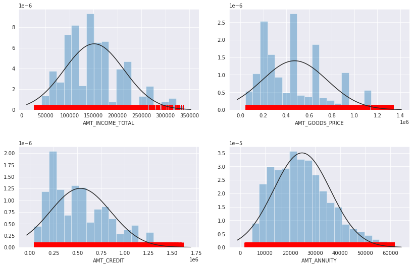


#### - Normal behaviour is observed after outlier filtering.


```python
data.TARGET = data.TARGET.astype(int)
```

## UNIVARIATE ANALYSIS

### Categorical Univariate

#### Generic funtion for categorical univariate plotting.


```python
def data_exploration_cat(data,col,label_rotation=False,horizontal_layout=True,desc=False):
        
    temp = data[col].value_counts()
    df = pd.DataFrame({col: temp.index,'Number of Applicants': temp.values})
    plt.figure(figsize = (6,6))
        
    if(horizontal_layout):
        fig, (ax1, ax2) = plt.subplots(ncols=2, figsize=(12,6))
    else:
        fig, (ax1, ax2) = plt.subplots(nrows=2, figsize=(12,14))
    
    g = sns.barplot(ax = ax1, x = col, y='Number of Applicants', data = df)
    
    if(label_rotation):
        g.set_xticklabels(g.get_xticklabels(),rotation=90)
    for p in g.patches:
        g.annotate(format(p.get_height(), '.2f'), (p.get_x() + p.get_width() / 2., p.get_height()), 
               ha = 'center', va = 'center', xytext = (0, 10), textcoords = 'offset points')
    
    cat_perc = data[[col, 'TARGET']].groupby([col],as_index=False).mean()
    cat_perc.sort_values(by='TARGET', ascending=False, inplace=True)
   
    g = sns.barplot(ax = ax2, x = col, y='TARGET', order=cat_perc[col], data=cat_perc)
   
    if(label_rotation):
        g.set_xticklabels(g.get_xticklabels(),rotation=90)
    
    for p in g.patches:
        g.annotate(format(p.get_height(), '.2f'), (p.get_x() + p.get_width() / 2., p.get_height()), 
               ha = 'center', va = 'center', xytext = (0, 10), textcoords = 'offset points')
    
    plt.ylabel('Percent of target with value 1 [%]', fontsize=10)
    plt.tick_params(axis='both', which='major', labelsize=10)
    
    
    if(desc):
        temp = data[col].value_counts(normalize=True)
        for i in range(temp.shape[0]):
            print(f"{temp.index[i]} has total proportion of {round(temp.values[i]*100,2)} % in the columns",end="\n\n")    

```

##### NAME_CONTRACT_TYPE


```python
data.NAME_CONTRACT_TYPE.value_counts()
```


    Cash loans         251585
    Revolving loans     27131
    Name: NAME_CONTRACT_TYPE, dtype: int64


- Only two categories exist, both are significant.


```python
data_exploration_cat(data,"NAME_CONTRACT_TYPE",desc=True);
```

    Cash loans has total proportion of 90.27 % in the columns
    
    Revolving loans has total proportion of 9.73 % in the columns
    
    


    <Figure size 432x432 with 0 Axes>


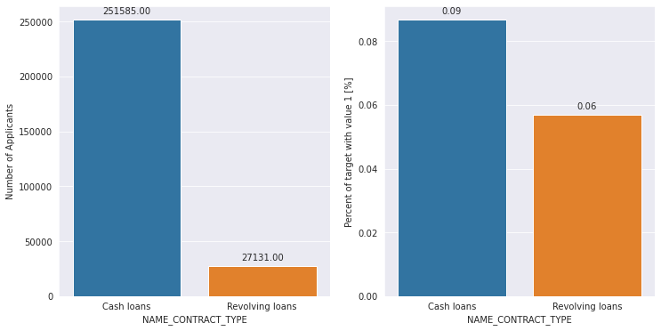


- Revolving loan is kind of credit card loan, which can be repaid again and again while cash loan is one time deal.
- Also, from Above Charts One can infer that the though the proportion of Revolving loan is low about 10% but the larger amout of the revolving loan are not repaid.

##### CNT_CHILDREN


```python
data.CNT_CHILDREN.value_counts()
```


    0     195613
    1      55195
    2      24092
    3       3324
    4        373
    5         77
    6         21
    7          7
    14         3
    19         2
    12         2
    10         2
    9          2
    8          2
    11         1
    Name: CNT_CHILDREN, dtype: int64


- Categories with less than 100 records are insignificant for analysis, dropping them.


```python
frequency_df = pd.DataFrame(data['CNT_CHILDREN'].value_counts()).reset_index()
frequency_df.columns=['CNT_CHILDREN','count']

drop_list = list(frequency_df[frequency_df['count']<100]['CNT_CHILDREN'])
print(frequency_df)
print(drop_list)
```

       CNT_CHILDREN   count
    0             0  195613
    1             1   55195
    2             2   24092
    3             3    3324
    4             4     373
    5             5      77
    6             6      21
    7             7       7
    8            14       3
    9            19       2
    10           12       2
    11           10       2
    12            9       2
    13            8       2
    14           11       1
    [5, 6, 7, 14, 19, 12, 10, 9, 8, 11]
    


```python
data1= data
data1['CNT_CHILDREN'] = data1['CNT_CHILDREN'].astype(int)

for col in drop_list:
    data1 = data1[~(data1['CNT_CHILDREN']==col)]
    
print(pd.DataFrame(data1['CNT_CHILDREN'].value_counts()))
```

       CNT_CHILDREN
    0        195613
    1         55195
    2         24092
    3          3324
    4           373
    


```python
data_exploration_cat(data1,"CNT_CHILDREN", "likelyhood",horizontal_layout=True);
```


    <Figure size 432x432 with 0 Axes>


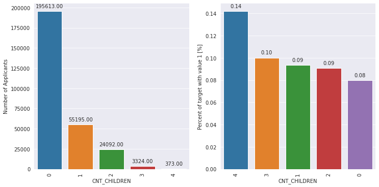


- A general trend can be observed that usually more children translates as more probablity of a default.

##### NAME_INCOME_TYPE


```python
data.NAME_INCOME_TYPE.value_counts()
```


    Working                 147109
    Commercial associate     60587
    Pensioner                52048
    State servant            18930
    Unemployed                  19
    Student                     17
    Maternity leave              3
    Businessman                  3
    Name: NAME_INCOME_TYPE, dtype: int64


- Categories with less than 100 records are insignificant for analysis, dropping them.


```python
frequency_df = pd.DataFrame(data['NAME_INCOME_TYPE'].value_counts()).reset_index()
frequency_df.columns=['NAME_INCOME_TYPE','count']

drop_list = list(frequency_df[frequency_df['count']<100]['NAME_INCOME_TYPE'])
print(frequency_df)
print(drop_list)

data1= data
data1['NAME_INCOME_TYPE'] = data1['NAME_INCOME_TYPE'].astype('object')

for col in drop_list:
    data1 = data1[~(data1['NAME_INCOME_TYPE']==col)]
    
print(pd.DataFrame(data1['NAME_INCOME_TYPE'].value_counts()))
```

           NAME_INCOME_TYPE   count
    0               Working  147109
    1  Commercial associate   60587
    2             Pensioner   52048
    3         State servant   18930
    4            Unemployed      19
    5               Student      17
    6       Maternity leave       3
    7           Businessman       3
    ['Unemployed', 'Student', 'Maternity leave', 'Businessman']
                          NAME_INCOME_TYPE
    Working                         147109
    Commercial associate             60587
    Pensioner                        52048
    State servant                    18930
    


```python
data_exploration_cat(data1,"NAME_INCOME_TYPE", "likelyhood");
```


    <Figure size 432x432 with 0 Axes>


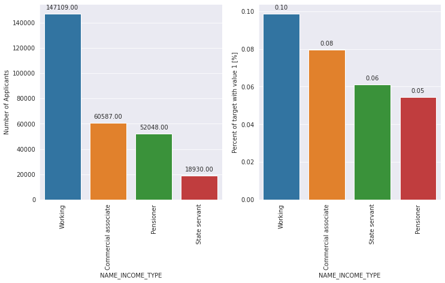


- Most of applicants for loans are income from Working, followed by Commercial associate, Pensioner and State servant.

- The applicants of Working type have almost 10% probabilty of not returning loans, followed by Commercial associates. The rest of types of incomes are under the average of 8% for not returning loans.

### Numerical Univariate

#### Generic function for numerical univariate plotting,


```python
# Plot distribution of multiple features, with TARGET = 1/0 on the same graph
def plot_univariate_num(var,nrow=2,ncol=2):
    i = 0
    df1 = data.loc[data['TARGET'] == 1]
    df2 = data.loc[data['TARGET'] != 1]

    sns.set_style('whitegrid')
    plt.figure()
    fig, ax = plt.subplots(nrow,ncol,figsize=(14,6*nrow))

    for feature in var:
        i += 1
        plt.subplot(nrow,ncol,i)
        sns.distplot(df1[feature], hist=False,label="Non-Defaulted")
        sns.distplot(df2[feature], hist = False, label="Defauted")
        plt.ylabel('Density plot', fontsize=12)
        plt.xlabel(feature, fontsize=12)
        locs, labels = plt.xticks()
        plt.tick_params(axis='both', which='major', labelsize=12)
    plt.show();
```

##### AMT_ANNUITY


```python
var = ['AMT_ANNUITY']
plot_univariate_num(var,nrow=1,ncol=1)
```


    <Figure size 432x288 with 0 Axes>


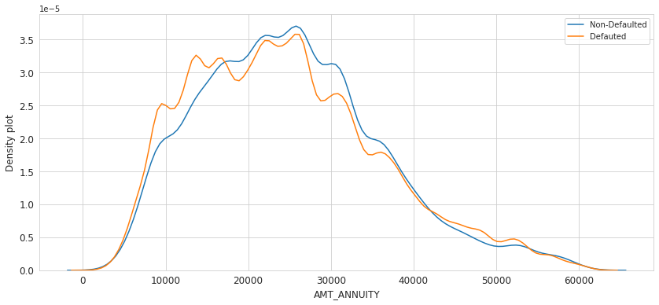


##### Binning Analysis


```python
bin_labels= ['Low3','Low2', 'Low1',"Low0","High0" ,"High1","High2", "High3"]
print(pd.qcut(data.AMT_ANNUITY,q=[0, .125, .25, .375 ,.5 , .625, .75, .875, 1]).value_counts(sort=False),end="\n\n")
      
data['Annuity Group'] = pd.qcut(data.AMT_ANNUITY,q=[0, .125, .25, .375 ,.5 , .625, .75, .875, 1],
                              labels=bin_labels)

for group in bin_labels:
    print(f"{round(data[data['Annuity Group']==group].TARGET.sum()*100/len(data[data['Annuity Group']==group]),2)} % of {group} Annuity group defaulted",end="\n\n")   
```

    (1615.499, 11659.5]    34845
    (11659.5, 15952.5]     34876
    (15952.5, 19953.0]     34947
    (19953.0, 23719.5]     34813
    (23719.5, 27004.5]     34763
    (27004.5, 31653.0]     35392
    (31653.0, 38263.5]     34274
    (38263.5, 61659.0]     34806
    Name: AMT_ANNUITY, dtype: int64
    
    6.9 % of Low3 Annuity group defaulted
    
    7.15 % of Low2 Annuity group defaulted
    
    8.74 % of Low1 Annuity group defaulted
    
    8.86 % of Low0 Annuity group defaulted
    
    8.91 % of High0 Annuity group defaulted
    
    9.85 % of High1 Annuity group defaulted
    
    8.67 % of High2 Annuity group defaulted
    
    7.92 % of High3 Annuity group defaulted
    
    

#### Inferences:- 
- It is observed that usually as the annuity amount goes on increasing, the defaulter % tends to increase as well.(Low3 -> High1)

##### AMT_CREDIT


```python
var = ['AMT_CREDIT']
plot_univariate_num(var,nrow=1,ncol=1)
```


    <Figure size 432x288 with 0 Axes>


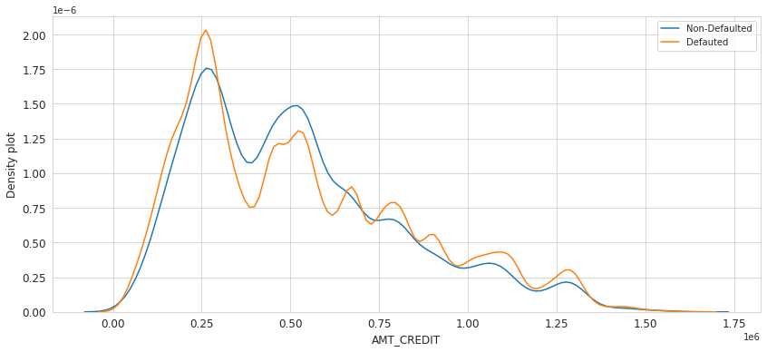


##### Binning Analysis


```python
bin_labels= ['Low3','Low2', 'Low1',"Low0","High0" ,"High1","High2", "High3"]
print(pd.qcut(data.AMT_CREDIT,q=[0, .125, .25, .375 ,.5 , .625, .75, .875, 1]).value_counts(sort=False),end="\n\n")
      
data['Credit Group'] = pd.qcut(data.AMT_CREDIT,q=[0, .125, .25, .375 ,.5 , .625, .75, .875, 1],
                              labels=bin_labels)

for group in bin_labels:
    print(f"{round(data[data['Credit Group']==group].TARGET.sum()*100/len(data[data['Credit Group']==group]),2)} % of {group} Credit group defaulted",end="\n\n")   
```

    (44999.999, 193572.0]    34877
    (193572.0, 269550.0]     35279
    (269550.0, 343800.0]     34572
    (343800.0, 474048.0]     34713
    (474048.0, 578979.0]     34768
    (578979.0, 755190.0]     37966
    (755190.0, 943425.0]     31726
    (943425.0, 1615018.5]    34815
    Name: AMT_CREDIT, dtype: int64
    
    6.83 % of Low3 Credit group defaulted
    
    7.89 % of Low2 Credit group defaulted
    
    8.89 % of Low1 Credit group defaulted
    
    10.21 % of Low0 Credit group defaulted
    
    9.89 % of High0 Credit group defaulted
    
    9.07 % of High1 Credit group defaulted
    
    7.36 % of High2 Credit group defaulted
    
    6.78 % of High3 Credit group defaulted
    
    

#### Inferences:- 
- It is observed that the Low0 (3.4lac-4.7lac) credit group defaults the most, closely followed by the High0 (4.7lac-5.7lac) group

##### AMT_INCOME_TOTAL


```python
var = ['AMT_INCOME_TOTAL']
plot_univariate_num(var,nrow=1,ncol=1)
```


    <Figure size 432x288 with 0 Axes>


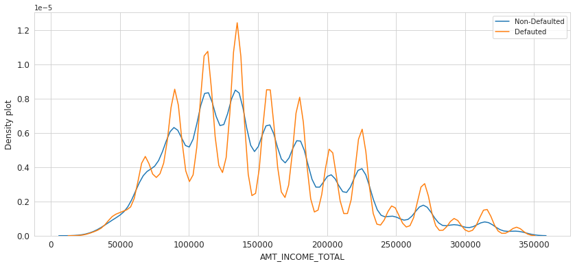


##### Binning Analysis


```python
bin_labels= ['Low3','Low2', 'Low1',"Low0","High0" ,"High1","High2", "High3"]
print(pd.qcut(data.AMT_INCOME_TOTAL,q=[0, .125, .25, .375 ,.5 , .625, .75, .875, 1]).value_counts(sort=False),end="\n\n")
      
data['Income Group'] = pd.qcut(data.AMT_INCOME_TOTAL,q=[0, .125, .25, .375 ,.5 , .625, .75, .875, 1],
                              labels=bin_labels)

for group in bin_labels:
    print(f"{round(data[data['Income Group']==group].TARGET.sum()*100/len(data[data['Income Group']==group]),2)} % of {group} Income group defaulted",end="\n\n")   
```

    (25649.999, 85500.0]    35020
    (85500.0, 112500.0]     64624
    (112500.0, 121500.0]     6537
    (121500.0, 135000.0]    41102
    (135000.0, 157500.0]    32302
    (157500.0, 180000.0]    30550
    (180000.0, 225000.0]    40728
    (225000.0, 337500.0]    27853
    Name: AMT_INCOME_TOTAL, dtype: int64
    
    8.18 % of Low3 Income group defaulted
    
    8.55 % of Low2 Income group defaulted
    
    9.22 % of Low1 Income group defaulted
    
    8.49 % of Low0 Income group defaulted
    
    8.91 % of High0 Income group defaulted
    
    8.6 % of High1 Income group defaulted
    
    8.16 % of High2 Income group defaulted
    
    7.33 % of High3 Income group defaulted
    
    

#### Inferences:- 
- It is observed that the Low1 (1.2lac-1.3lac) Income group defaults the most, closely followed by the High0 (1.35lac-1.57lac) group

##### EXT_SOURCE columns (act like credit scores)


```python
var = ['EXT_SOURCE_2','EXT_SOURCE_3']
plot_univariate_num(var,nrow=1)
```


    <Figure size 432x288 with 0 Axes>


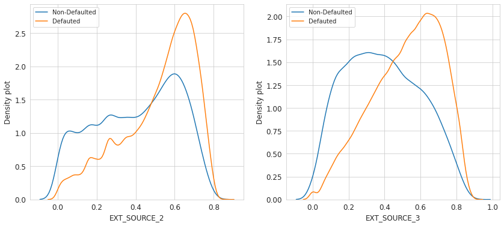


- A general trend can be observed that these score values are lower for defaulters as compared to the non-defaulters. 

##### Binning Analysis


```python
bin_labels= ['Low3','Low2', 'Low1',"Low0","High0" ,"High1","High2", "High3"]
print(pd.qcut(data.EXT_SOURCE_2,q=[0, .125, .25, .375 ,.5 , .625, .75, .875, 1]).value_counts(sort=False),end="\n\n")
      
data['Score Group'] = pd.qcut(data.EXT_SOURCE_2,q=[0, .125, .25, .375 ,.5 , .625, .75, .875, 1],
                              labels=bin_labels)

for group in bin_labels:
    print(f"{round(data[data['Score Group']==group].TARGET.sum()*100/len(data[data['Score Group']==group]),2)} % of {group} Score group defaulted",end="\n\n")   
```

    (-0.0009999183, 0.246]    34762
    (0.246, 0.381]            34762
    (0.381, 0.487]            34761
    (0.487, 0.558]            34764
    (0.558, 0.612]            34760
    (0.612, 0.658]            34763
    (0.658, 0.706]            34759
    (0.706, 0.855]            34762
    Name: EXT_SOURCE_2, dtype: int64
    
    17.89 % of Low3 Score group defaulted
    
    11.51 % of Low2 Score group defaulted
    
    9.17 % of Low1 Score group defaulted
    
    7.81 % of Low0 Score group defaulted
    
    6.84 % of High0 Score group defaulted
    
    5.76 % of High1 Score group defaulted
    
    4.71 % of High2 Score group defaulted
    
    3.35 % of High3 Score group defaulted
    
    

#### Inferences:-
- There is a clear trend of higher Score groups defaulting less and vice versa.

## BIVARIATE ANALYSIS

##### Visualizing Correlations


```python
# Converting the object type columns into category and finally encoding to numerical values using cat codes.
df_corr = data.copy()
df_corr[df_corr.select_dtypes(include='category').columns] = df_corr.select_dtypes(include='category').astype('category').apply(lambda x: x.cat.codes)

col = [c for c in df_corr if c[:4] != 'FLAG' and c[:3] != 'REG' and c[:5] != 'SK_ID' and c[:7] != 'AMT_REQ' and c[:4] != 'NAME' and c[-1:-7] != 'CIRCLE']

df_corr = df_corr[col].corr()

df_corr = df_corr.where(np.triu(np.ones(df_corr.shape),k=1).astype(np.bool))

plt.figure(figsize=(15,8))
sns.heatmap(df_corr,annot=True,cmap='Reds',fmt='.2f' )
plt.show()
```


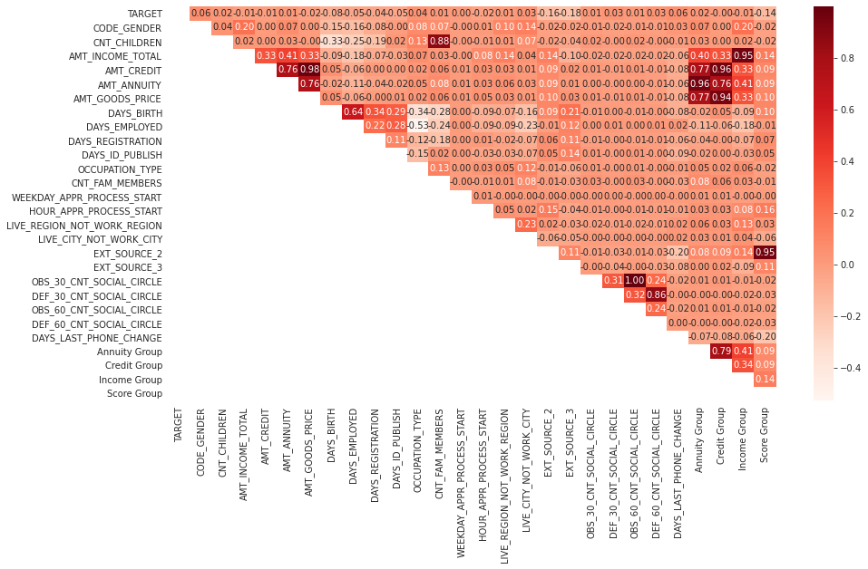


##### Splitting dataframe on TARGET column


```python
df1 = data[data['TARGET']==1]
df2 = data[data['TARGET']!=1]
```

### Education v/s Family Status


```python
plt.figure(figsize=(17,12))

df_agg = pd.crosstab(df1['NAME_EDUCATION_TYPE'], df1['NAME_FAMILY_STATUS'],margins=True)
df_agg1 = pd.crosstab(df2['NAME_EDUCATION_TYPE'], df2['NAME_FAMILY_STATUS'],margins=True)

plt.subplot(2,2,1)
sns.heatmap(df_agg.iloc[:-2,:-2],annot =True, fmt ='d',cmap='GnBu', linewidths=.5)
plt.title('Default Applicant Counts on basis of their Education & Family Status',fontsize=15)
plt.xlabel('Family Status',fontsize=13)
plt.ylabel('Education',fontsize=13)

plt.subplot(2,2,2)
sns.heatmap(df_agg1.iloc[:-2,:-2],annot =True, fmt ='d',cmap='GnBu', linewidths=.5)
plt.title('Non-Default Applicant Counts on basis of their Education & Family Status',fontsize=15)
plt.xlabel('Family Status',fontsize=13)
plt.ylabel('',fontsize=13)
plt.tight_layout()
plt.show()
```


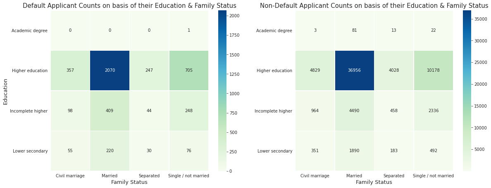


#### Inferences:
- Married applicants going for Higher Education default more often. 
- Also, the Married and Higher Education category are the category which need to be taken into concern, while the Academic Degree applicant won't default often.

### Occupation v/s Income Status


```python
df_agg = pd.crosstab(df1['OCCUPATION_TYPE'],df1['NAME_INCOME_TYPE'], margins=True)
df_agg1 = pd.crosstab(df2['OCCUPATION_TYPE'],df2['NAME_INCOME_TYPE'], margins=True)

plt.figure(figsize=(17,12))

plt.subplot(221)
sns.heatmap(df_agg.iloc[:-2,:-2],annot =True, fmt ='1',cmap='summer_r',linewidths=.5)
plt.title('Default Applicant Counts on basis of their Occupation & Income Category',fontsize=14)
plt.xlabel('Income Category',fontsize=13)
plt.xticks(fontsize=13, rotation=30)
plt.yticks(fontsize=13)
plt.ylabel('OCCUPATION',fontsize=13)

plt.subplot(2,2,2)
sns.heatmap(df_agg1.iloc[:-2,:-2],annot =True, fmt ='1',cmap='summer_r',linewidths=.5)
plt.title('Non-default Applicant Counts on basis of their Occupation & Income Category',fontsize=14)
plt.xlabel('Income Category',fontsize=13)
plt.xticks(fontsize=13, rotation=30)
plt.yticks(fontsize=13)
plt.ylabel('',fontsize=13)
plt.tight_layout()
plt.show()

```


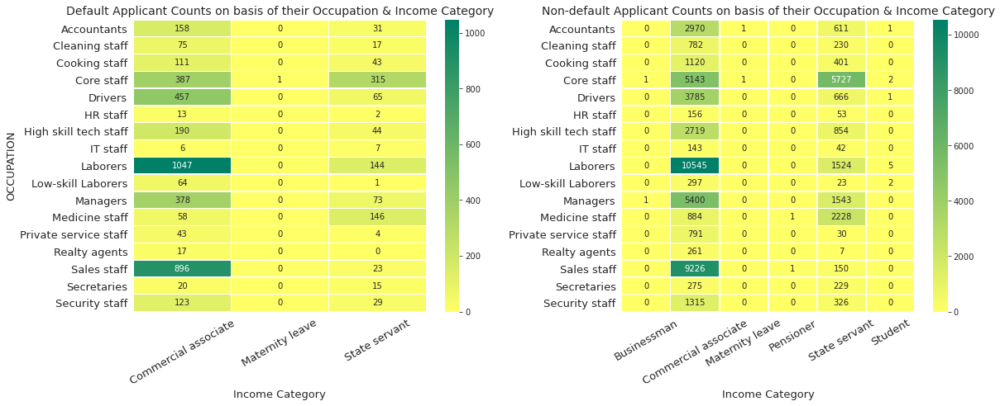


####  Inference:-
- People belonging to Income Categories: Pensioner and Student are unlikely to take loan or any services in terms of Credit card or Cash loan.
- Where as applicants on Maternity leave rarely opt for Loan as the risk of not being able to pay the Debt will be high ,also, the Default rate will go high if the organization starts providing them loan.
- While the applicants belonging to Commercial Associate and State Servent, and working as Labourers and Sales Staff,are most likely to avail the Loan Facility and also, the Default rate is also, high in these categories.

##### Drilling down more on correlations


```python
sns.pairplot(df1[['AMT_GOODS_PRICE','AMT_CREDIT','AMT_ANNUITY','AMT_INCOME_TOTAL']] )
plt.show()
```


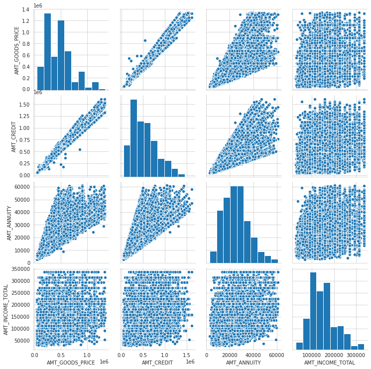


```python
df1 = data[['AMT_ANNUITY','AMT_CREDIT','AMT_GOODS_PRICE','AMT_INCOME_TOTAL','EXT_SOURCE_2','EXT_SOURCE_3']].loc[data['TARGET'] == 1]
corr =df1.corr()
corr =corr.where(np.triu(np.ones(corr.shape),k=1).astype(np.bool))
corr_df=corr.unstack().reset_index()
corr_df.columns = ['var1','var2','correlation']
corr_df.dropna(subset=['correlation'],inplace=True)
corr_df['correlation_abs']=corr_df['correlation'].abs()
corr_df.sort_values("correlation_abs",ascending=False,inplace=True)
corr_df = corr_df.reset_index(drop=True)
corr_df = pd.pivot_table(data = corr_df,index ='var1',columns='var2', values='correlation')
sns.heatmap(corr_df, annot =True,cmap='RdBu_r')
plt.show()
```


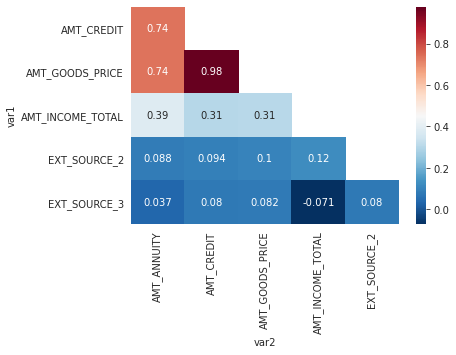


## Insights on MERGING with Previous Application File


```python
data_prev.head(5)
```


<div>
<style scoped>
    .dataframe tbody tr th:only-of-type {
        vertical-align: middle;
    }

    .dataframe tbody tr th {
        vertical-align: top;
    }

    .dataframe thead th {
        text-align: right;
    }
</style>
<table border="1" class="dataframe">
  <thead>
    <tr style="text-align: right;">
      <th></th>
      <th>SK_ID_PREV</th>
      <th>SK_ID_CURR</th>
      <th>NAME_CONTRACT_TYPE</th>
      <th>AMT_ANNUITY</th>
      <th>AMT_APPLICATION</th>
      <th>AMT_CREDIT</th>
      <th>AMT_DOWN_PAYMENT</th>
      <th>AMT_GOODS_PRICE</th>
      <th>WEEKDAY_APPR_PROCESS_START</th>
      <th>HOUR_APPR_PROCESS_START</th>
      <th>FLAG_LAST_APPL_PER_CONTRACT</th>
      <th>NFLAG_LAST_APPL_IN_DAY</th>
      <th>RATE_DOWN_PAYMENT</th>
      <th>RATE_INTEREST_PRIMARY</th>
      <th>RATE_INTEREST_PRIVILEGED</th>
      <th>NAME_CASH_LOAN_PURPOSE</th>
      <th>NAME_CONTRACT_STATUS</th>
      <th>DAYS_DECISION</th>
      <th>NAME_PAYMENT_TYPE</th>
      <th>CODE_REJECT_REASON</th>
      <th>NAME_TYPE_SUITE</th>
      <th>NAME_CLIENT_TYPE</th>
      <th>NAME_GOODS_CATEGORY</th>
      <th>NAME_PORTFOLIO</th>
      <th>NAME_PRODUCT_TYPE</th>
      <th>CHANNEL_TYPE</th>
      <th>SELLERPLACE_AREA</th>
      <th>NAME_SELLER_INDUSTRY</th>
      <th>CNT_PAYMENT</th>
      <th>NAME_YIELD_GROUP</th>
      <th>PRODUCT_COMBINATION</th>
      <th>DAYS_FIRST_DRAWING</th>
      <th>DAYS_FIRST_DUE</th>
      <th>DAYS_LAST_DUE_1ST_VERSION</th>
      <th>DAYS_LAST_DUE</th>
      <th>DAYS_TERMINATION</th>
      <th>NFLAG_INSURED_ON_APPROVAL</th>
    </tr>
  </thead>
  <tbody>
    <tr>
      <th>0</th>
      <td>2030495</td>
      <td>271877</td>
      <td>Consumer loans</td>
      <td>1730.430</td>
      <td>17145.0</td>
      <td>17145.0</td>
      <td>0.0</td>
      <td>17145.0</td>
      <td>SATURDAY</td>
      <td>15</td>
      <td>Y</td>
      <td>1</td>
      <td>0.0</td>
      <td>0.182832</td>
      <td>0.867336</td>
      <td>XAP</td>
      <td>Approved</td>
      <td>-73</td>
      <td>Cash through the bank</td>
      <td>XAP</td>
      <td>NaN</td>
      <td>Repeater</td>
      <td>Mobile</td>
      <td>POS</td>
      <td>XNA</td>
      <td>Country-wide</td>
      <td>35</td>
      <td>Connectivity</td>
      <td>12.0</td>
      <td>middle</td>
      <td>POS mobile with interest</td>
      <td>365243.0</td>
      <td>-42.0</td>
      <td>300.0</td>
      <td>-42.0</td>
      <td>-37.0</td>
      <td>0.0</td>
    </tr>
    <tr>
      <th>1</th>
      <td>2802425</td>
      <td>108129</td>
      <td>Cash loans</td>
      <td>25188.615</td>
      <td>607500.0</td>
      <td>679671.0</td>
      <td>NaN</td>
      <td>607500.0</td>
      <td>THURSDAY</td>
      <td>11</td>
      <td>Y</td>
      <td>1</td>
      <td>NaN</td>
      <td>NaN</td>
      <td>NaN</td>
      <td>XNA</td>
      <td>Approved</td>
      <td>-164</td>
      <td>XNA</td>
      <td>XAP</td>
      <td>Unaccompanied</td>
      <td>Repeater</td>
      <td>XNA</td>
      <td>Cash</td>
      <td>x-sell</td>
      <td>Contact center</td>
      <td>-1</td>
      <td>XNA</td>
      <td>36.0</td>
      <td>low_action</td>
      <td>Cash X-Sell: low</td>
      <td>365243.0</td>
      <td>-134.0</td>
      <td>916.0</td>
      <td>365243.0</td>
      <td>365243.0</td>
      <td>1.0</td>
    </tr>
    <tr>
      <th>2</th>
      <td>2523466</td>
      <td>122040</td>
      <td>Cash loans</td>
      <td>15060.735</td>
      <td>112500.0</td>
      <td>136444.5</td>
      <td>NaN</td>
      <td>112500.0</td>
      <td>TUESDAY</td>
      <td>11</td>
      <td>Y</td>
      <td>1</td>
      <td>NaN</td>
      <td>NaN</td>
      <td>NaN</td>
      <td>XNA</td>
      <td>Approved</td>
      <td>-301</td>
      <td>Cash through the bank</td>
      <td>XAP</td>
      <td>Spouse, partner</td>
      <td>Repeater</td>
      <td>XNA</td>
      <td>Cash</td>
      <td>x-sell</td>
      <td>Credit and cash offices</td>
      <td>-1</td>
      <td>XNA</td>
      <td>12.0</td>
      <td>high</td>
      <td>Cash X-Sell: high</td>
      <td>365243.0</td>
      <td>-271.0</td>
      <td>59.0</td>
      <td>365243.0</td>
      <td>365243.0</td>
      <td>1.0</td>
    </tr>
    <tr>
      <th>3</th>
      <td>2819243</td>
      <td>176158</td>
      <td>Cash loans</td>
      <td>47041.335</td>
      <td>450000.0</td>
      <td>470790.0</td>
      <td>NaN</td>
      <td>450000.0</td>
      <td>MONDAY</td>
      <td>7</td>
      <td>Y</td>
      <td>1</td>
      <td>NaN</td>
      <td>NaN</td>
      <td>NaN</td>
      <td>XNA</td>
      <td>Approved</td>
      <td>-512</td>
      <td>Cash through the bank</td>
      <td>XAP</td>
      <td>NaN</td>
      <td>Repeater</td>
      <td>XNA</td>
      <td>Cash</td>
      <td>x-sell</td>
      <td>Credit and cash offices</td>
      <td>-1</td>
      <td>XNA</td>
      <td>12.0</td>
      <td>middle</td>
      <td>Cash X-Sell: middle</td>
      <td>365243.0</td>
      <td>-482.0</td>
      <td>-152.0</td>
      <td>-182.0</td>
      <td>-177.0</td>
      <td>1.0</td>
    </tr>
    <tr>
      <th>4</th>
      <td>1784265</td>
      <td>202054</td>
      <td>Cash loans</td>
      <td>31924.395</td>
      <td>337500.0</td>
      <td>404055.0</td>
      <td>NaN</td>
      <td>337500.0</td>
      <td>THURSDAY</td>
      <td>9</td>
      <td>Y</td>
      <td>1</td>
      <td>NaN</td>
      <td>NaN</td>
      <td>NaN</td>
      <td>Repairs</td>
      <td>Refused</td>
      <td>-781</td>
      <td>Cash through the bank</td>
      <td>HC</td>
      <td>NaN</td>
      <td>Repeater</td>
      <td>XNA</td>
      <td>Cash</td>
      <td>walk-in</td>
      <td>Credit and cash offices</td>
      <td>-1</td>
      <td>XNA</td>
      <td>24.0</td>
      <td>high</td>
      <td>Cash Street: high</td>
      <td>NaN</td>
      <td>NaN</td>
      <td>NaN</td>
      <td>NaN</td>
      <td>NaN</td>
      <td>NaN</td>
    </tr>
  </tbody>
</table>
</div>


```python
data_prev.info()
```

    <class 'pandas.core.frame.DataFrame'>
    RangeIndex: 1670214 entries, 0 to 1670213
    Data columns (total 37 columns):
     #   Column                       Non-Null Count    Dtype  
    ---  ------                       --------------    -----  
     0   SK_ID_PREV                   1670214 non-null  int64  
     1   SK_ID_CURR                   1670214 non-null  int64  
     2   NAME_CONTRACT_TYPE           1670214 non-null  object 
     3   AMT_ANNUITY                  1297979 non-null  float64
     4   AMT_APPLICATION              1670214 non-null  float64
     5   AMT_CREDIT                   1670213 non-null  float64
     6   AMT_DOWN_PAYMENT             774370 non-null   float64
     7   AMT_GOODS_PRICE              1284699 non-null  float64
     8   WEEKDAY_APPR_PROCESS_START   1670214 non-null  object 
     9   HOUR_APPR_PROCESS_START      1670214 non-null  int64  
     10  FLAG_LAST_APPL_PER_CONTRACT  1670214 non-null  object 
     11  NFLAG_LAST_APPL_IN_DAY       1670214 non-null  int64  
     12  RATE_DOWN_PAYMENT            774370 non-null   float64
     13  RATE_INTEREST_PRIMARY        5951 non-null     float64
     14  RATE_INTEREST_PRIVILEGED     5951 non-null     float64
     15  NAME_CASH_LOAN_PURPOSE       1670214 non-null  object 
     16  NAME_CONTRACT_STATUS         1670214 non-null  object 
     17  DAYS_DECISION                1670214 non-null  int64  
     18  NAME_PAYMENT_TYPE            1670214 non-null  object 
     19  CODE_REJECT_REASON           1670214 non-null  object 
     20  NAME_TYPE_SUITE              849809 non-null   object 
     21  NAME_CLIENT_TYPE             1670214 non-null  object 
     22  NAME_GOODS_CATEGORY          1670214 non-null  object 
     23  NAME_PORTFOLIO               1670214 non-null  object 
     24  NAME_PRODUCT_TYPE            1670214 non-null  object 
     25  CHANNEL_TYPE                 1670214 non-null  object 
     26  SELLERPLACE_AREA             1670214 non-null  int64  
     27  NAME_SELLER_INDUSTRY         1670214 non-null  object 
     28  CNT_PAYMENT                  1297984 non-null  float64
     29  NAME_YIELD_GROUP             1670214 non-null  object 
     30  PRODUCT_COMBINATION          1669868 non-null  object 
     31  DAYS_FIRST_DRAWING           997149 non-null   float64
     32  DAYS_FIRST_DUE               997149 non-null   float64
     33  DAYS_LAST_DUE_1ST_VERSION    997149 non-null   float64
     34  DAYS_LAST_DUE                997149 non-null   float64
     35  DAYS_TERMINATION             997149 non-null   float64
     36  NFLAG_INSURED_ON_APPROVAL    997149 non-null   float64
    dtypes: float64(15), int64(6), object(16)
    memory usage: 471.5+ MB
    


```python
round(data_prev.isnull().sum()*100/data_prev.shape[0],2)
```


    SK_ID_PREV                      0.00
    SK_ID_CURR                      0.00
    NAME_CONTRACT_TYPE              0.00
    AMT_ANNUITY                    22.29
    AMT_APPLICATION                 0.00
    AMT_CREDIT                      0.00
    AMT_DOWN_PAYMENT               53.64
    AMT_GOODS_PRICE                23.08
    WEEKDAY_APPR_PROCESS_START      0.00
    HOUR_APPR_PROCESS_START         0.00
    FLAG_LAST_APPL_PER_CONTRACT     0.00
    NFLAG_LAST_APPL_IN_DAY          0.00
    RATE_DOWN_PAYMENT              53.64
    RATE_INTEREST_PRIMARY          99.64
    RATE_INTEREST_PRIVILEGED       99.64
    NAME_CASH_LOAN_PURPOSE          0.00
    NAME_CONTRACT_STATUS            0.00
    DAYS_DECISION                   0.00
    NAME_PAYMENT_TYPE               0.00
    CODE_REJECT_REASON              0.00
    NAME_TYPE_SUITE                49.12
    NAME_CLIENT_TYPE                0.00
    NAME_GOODS_CATEGORY             0.00
    NAME_PORTFOLIO                  0.00
    NAME_PRODUCT_TYPE               0.00
    CHANNEL_TYPE                    0.00
    SELLERPLACE_AREA                0.00
    NAME_SELLER_INDUSTRY            0.00
    CNT_PAYMENT                    22.29
    NAME_YIELD_GROUP                0.00
    PRODUCT_COMBINATION             0.02
    DAYS_FIRST_DRAWING             40.30
    DAYS_FIRST_DUE                 40.30
    DAYS_LAST_DUE_1ST_VERSION      40.30
    DAYS_LAST_DUE                  40.30
    DAYS_TERMINATION               40.30
    NFLAG_INSURED_ON_APPROVAL      40.30
    dtype: float64


```python
msno.bar(data_prev)
```


    <matplotlib.axes._subplots.AxesSubplot at 0x7f0321318350>


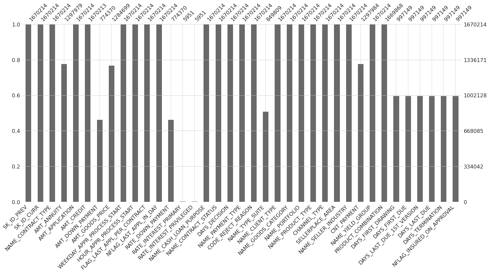


```python
data_prev.head()
```


<div>
<style scoped>
    .dataframe tbody tr th:only-of-type {
        vertical-align: middle;
    }

    .dataframe tbody tr th {
        vertical-align: top;
    }

    .dataframe thead th {
        text-align: right;
    }
</style>
<table border="1" class="dataframe">
  <thead>
    <tr style="text-align: right;">
      <th></th>
      <th>SK_ID_PREV</th>
      <th>SK_ID_CURR</th>
      <th>NAME_CONTRACT_TYPE</th>
      <th>AMT_ANNUITY</th>
      <th>AMT_APPLICATION</th>
      <th>AMT_CREDIT</th>
      <th>AMT_DOWN_PAYMENT</th>
      <th>AMT_GOODS_PRICE</th>
      <th>WEEKDAY_APPR_PROCESS_START</th>
      <th>HOUR_APPR_PROCESS_START</th>
      <th>FLAG_LAST_APPL_PER_CONTRACT</th>
      <th>NFLAG_LAST_APPL_IN_DAY</th>
      <th>RATE_DOWN_PAYMENT</th>
      <th>RATE_INTEREST_PRIMARY</th>
      <th>RATE_INTEREST_PRIVILEGED</th>
      <th>NAME_CASH_LOAN_PURPOSE</th>
      <th>NAME_CONTRACT_STATUS</th>
      <th>DAYS_DECISION</th>
      <th>NAME_PAYMENT_TYPE</th>
      <th>CODE_REJECT_REASON</th>
      <th>NAME_TYPE_SUITE</th>
      <th>NAME_CLIENT_TYPE</th>
      <th>NAME_GOODS_CATEGORY</th>
      <th>NAME_PORTFOLIO</th>
      <th>NAME_PRODUCT_TYPE</th>
      <th>CHANNEL_TYPE</th>
      <th>SELLERPLACE_AREA</th>
      <th>NAME_SELLER_INDUSTRY</th>
      <th>CNT_PAYMENT</th>
      <th>NAME_YIELD_GROUP</th>
      <th>PRODUCT_COMBINATION</th>
      <th>DAYS_FIRST_DRAWING</th>
      <th>DAYS_FIRST_DUE</th>
      <th>DAYS_LAST_DUE_1ST_VERSION</th>
      <th>DAYS_LAST_DUE</th>
      <th>DAYS_TERMINATION</th>
      <th>NFLAG_INSURED_ON_APPROVAL</th>
    </tr>
  </thead>
  <tbody>
    <tr>
      <th>0</th>
      <td>2030495</td>
      <td>271877</td>
      <td>Consumer loans</td>
      <td>1730.430</td>
      <td>17145.0</td>
      <td>17145.0</td>
      <td>0.0</td>
      <td>17145.0</td>
      <td>SATURDAY</td>
      <td>15</td>
      <td>Y</td>
      <td>1</td>
      <td>0.0</td>
      <td>0.182832</td>
      <td>0.867336</td>
      <td>XAP</td>
      <td>Approved</td>
      <td>-73</td>
      <td>Cash through the bank</td>
      <td>XAP</td>
      <td>NaN</td>
      <td>Repeater</td>
      <td>Mobile</td>
      <td>POS</td>
      <td>XNA</td>
      <td>Country-wide</td>
      <td>35</td>
      <td>Connectivity</td>
      <td>12.0</td>
      <td>middle</td>
      <td>POS mobile with interest</td>
      <td>365243.0</td>
      <td>-42.0</td>
      <td>300.0</td>
      <td>-42.0</td>
      <td>-37.0</td>
      <td>0.0</td>
    </tr>
    <tr>
      <th>1</th>
      <td>2802425</td>
      <td>108129</td>
      <td>Cash loans</td>
      <td>25188.615</td>
      <td>607500.0</td>
      <td>679671.0</td>
      <td>NaN</td>
      <td>607500.0</td>
      <td>THURSDAY</td>
      <td>11</td>
      <td>Y</td>
      <td>1</td>
      <td>NaN</td>
      <td>NaN</td>
      <td>NaN</td>
      <td>XNA</td>
      <td>Approved</td>
      <td>-164</td>
      <td>XNA</td>
      <td>XAP</td>
      <td>Unaccompanied</td>
      <td>Repeater</td>
      <td>XNA</td>
      <td>Cash</td>
      <td>x-sell</td>
      <td>Contact center</td>
      <td>-1</td>
      <td>XNA</td>
      <td>36.0</td>
      <td>low_action</td>
      <td>Cash X-Sell: low</td>
      <td>365243.0</td>
      <td>-134.0</td>
      <td>916.0</td>
      <td>365243.0</td>
      <td>365243.0</td>
      <td>1.0</td>
    </tr>
    <tr>
      <th>2</th>
      <td>2523466</td>
      <td>122040</td>
      <td>Cash loans</td>
      <td>15060.735</td>
      <td>112500.0</td>
      <td>136444.5</td>
      <td>NaN</td>
      <td>112500.0</td>
      <td>TUESDAY</td>
      <td>11</td>
      <td>Y</td>
      <td>1</td>
      <td>NaN</td>
      <td>NaN</td>
      <td>NaN</td>
      <td>XNA</td>
      <td>Approved</td>
      <td>-301</td>
      <td>Cash through the bank</td>
      <td>XAP</td>
      <td>Spouse, partner</td>
      <td>Repeater</td>
      <td>XNA</td>
      <td>Cash</td>
      <td>x-sell</td>
      <td>Credit and cash offices</td>
      <td>-1</td>
      <td>XNA</td>
      <td>12.0</td>
      <td>high</td>
      <td>Cash X-Sell: high</td>
      <td>365243.0</td>
      <td>-271.0</td>
      <td>59.0</td>
      <td>365243.0</td>
      <td>365243.0</td>
      <td>1.0</td>
    </tr>
    <tr>
      <th>3</th>
      <td>2819243</td>
      <td>176158</td>
      <td>Cash loans</td>
      <td>47041.335</td>
      <td>450000.0</td>
      <td>470790.0</td>
      <td>NaN</td>
      <td>450000.0</td>
      <td>MONDAY</td>
      <td>7</td>
      <td>Y</td>
      <td>1</td>
      <td>NaN</td>
      <td>NaN</td>
      <td>NaN</td>
      <td>XNA</td>
      <td>Approved</td>
      <td>-512</td>
      <td>Cash through the bank</td>
      <td>XAP</td>
      <td>NaN</td>
      <td>Repeater</td>
      <td>XNA</td>
      <td>Cash</td>
      <td>x-sell</td>
      <td>Credit and cash offices</td>
      <td>-1</td>
      <td>XNA</td>
      <td>12.0</td>
      <td>middle</td>
      <td>Cash X-Sell: middle</td>
      <td>365243.0</td>
      <td>-482.0</td>
      <td>-152.0</td>
      <td>-182.0</td>
      <td>-177.0</td>
      <td>1.0</td>
    </tr>
    <tr>
      <th>4</th>
      <td>1784265</td>
      <td>202054</td>
      <td>Cash loans</td>
      <td>31924.395</td>
      <td>337500.0</td>
      <td>404055.0</td>
      <td>NaN</td>
      <td>337500.0</td>
      <td>THURSDAY</td>
      <td>9</td>
      <td>Y</td>
      <td>1</td>
      <td>NaN</td>
      <td>NaN</td>
      <td>NaN</td>
      <td>Repairs</td>
      <td>Refused</td>
      <td>-781</td>
      <td>Cash through the bank</td>
      <td>HC</td>
      <td>NaN</td>
      <td>Repeater</td>
      <td>XNA</td>
      <td>Cash</td>
      <td>walk-in</td>
      <td>Credit and cash offices</td>
      <td>-1</td>
      <td>XNA</td>
      <td>24.0</td>
      <td>high</td>
      <td>Cash Street: high</td>
      <td>NaN</td>
      <td>NaN</td>
      <td>NaN</td>
      <td>NaN</td>
      <td>NaN</td>
      <td>NaN</td>
    </tr>
  </tbody>
</table>
</div>


```python
data_prev = data_prev.loc[:,data_prev.isnull().mean()*100<45]
```


```python
data_master = pd.merge(data,data_prev,left_on='SK_ID_CURR',right_on='SK_ID_CURR',how='left')
```


```python
data_master.head()
```


<div>
<style scoped>
    .dataframe tbody tr th:only-of-type {
        vertical-align: middle;
    }

    .dataframe tbody tr th {
        vertical-align: top;
    }

    .dataframe thead th {
        text-align: right;
    }
</style>
<table border="1" class="dataframe">
  <thead>
    <tr style="text-align: right;">
      <th></th>
      <th>SK_ID_CURR</th>
      <th>TARGET</th>
      <th>NAME_CONTRACT_TYPE_x</th>
      <th>CODE_GENDER</th>
      <th>FLAG_OWN_CAR</th>
      <th>FLAG_OWN_REALTY</th>
      <th>CNT_CHILDREN</th>
      <th>AMT_INCOME_TOTAL</th>
      <th>AMT_CREDIT_x</th>
      <th>AMT_ANNUITY_x</th>
      <th>AMT_GOODS_PRICE_x</th>
      <th>NAME_TYPE_SUITE</th>
      <th>NAME_INCOME_TYPE</th>
      <th>NAME_EDUCATION_TYPE</th>
      <th>NAME_FAMILY_STATUS</th>
      <th>NAME_HOUSING_TYPE</th>
      <th>REGION_POPULATION_RELATIVE</th>
      <th>DAYS_BIRTH</th>
      <th>DAYS_EMPLOYED</th>
      <th>DAYS_REGISTRATION</th>
      <th>DAYS_ID_PUBLISH</th>
      <th>FLAG_MOBIL</th>
      <th>FLAG_EMP_PHONE</th>
      <th>FLAG_WORK_PHONE</th>
      <th>FLAG_CONT_MOBILE</th>
      <th>FLAG_PHONE</th>
      <th>FLAG_EMAIL</th>
      <th>OCCUPATION_TYPE</th>
      <th>CNT_FAM_MEMBERS</th>
      <th>REGION_RATING_CLIENT</th>
      <th>REGION_RATING_CLIENT_W_CITY</th>
      <th>WEEKDAY_APPR_PROCESS_START_x</th>
      <th>HOUR_APPR_PROCESS_START_x</th>
      <th>REG_REGION_NOT_LIVE_REGION</th>
      <th>REG_REGION_NOT_WORK_REGION</th>
      <th>LIVE_REGION_NOT_WORK_REGION</th>
      <th>REG_CITY_NOT_LIVE_CITY</th>
      <th>REG_CITY_NOT_WORK_CITY</th>
      <th>LIVE_CITY_NOT_WORK_CITY</th>
      <th>ORGANIZATION_TYPE</th>
      <th>EXT_SOURCE_2</th>
      <th>EXT_SOURCE_3</th>
      <th>OBS_30_CNT_SOCIAL_CIRCLE</th>
      <th>DEF_30_CNT_SOCIAL_CIRCLE</th>
      <th>OBS_60_CNT_SOCIAL_CIRCLE</th>
      <th>DEF_60_CNT_SOCIAL_CIRCLE</th>
      <th>DAYS_LAST_PHONE_CHANGE</th>
      <th>FLAG_DOCUMENT_2</th>
      <th>FLAG_DOCUMENT_3</th>
      <th>FLAG_DOCUMENT_4</th>
      <th>...</th>
      <th>FLAG_DOCUMENT_13</th>
      <th>FLAG_DOCUMENT_14</th>
      <th>FLAG_DOCUMENT_15</th>
      <th>FLAG_DOCUMENT_16</th>
      <th>FLAG_DOCUMENT_17</th>
      <th>FLAG_DOCUMENT_18</th>
      <th>FLAG_DOCUMENT_19</th>
      <th>FLAG_DOCUMENT_20</th>
      <th>FLAG_DOCUMENT_21</th>
      <th>AMT_REQ_CREDIT_BUREAU_HOUR</th>
      <th>AMT_REQ_CREDIT_BUREAU_DAY</th>
      <th>AMT_REQ_CREDIT_BUREAU_WEEK</th>
      <th>AMT_REQ_CREDIT_BUREAU_MON</th>
      <th>AMT_REQ_CREDIT_BUREAU_QRT</th>
      <th>AMT_REQ_CREDIT_BUREAU_YEAR</th>
      <th>Annuity Group</th>
      <th>Credit Group</th>
      <th>Income Group</th>
      <th>Score Group</th>
      <th>SK_ID_PREV</th>
      <th>NAME_CONTRACT_TYPE_y</th>
      <th>AMT_ANNUITY_y</th>
      <th>AMT_APPLICATION</th>
      <th>AMT_CREDIT_y</th>
      <th>AMT_GOODS_PRICE_y</th>
      <th>WEEKDAY_APPR_PROCESS_START_y</th>
      <th>HOUR_APPR_PROCESS_START_y</th>
      <th>FLAG_LAST_APPL_PER_CONTRACT</th>
      <th>NFLAG_LAST_APPL_IN_DAY</th>
      <th>NAME_CASH_LOAN_PURPOSE</th>
      <th>NAME_CONTRACT_STATUS</th>
      <th>DAYS_DECISION</th>
      <th>NAME_PAYMENT_TYPE</th>
      <th>CODE_REJECT_REASON</th>
      <th>NAME_CLIENT_TYPE</th>
      <th>NAME_GOODS_CATEGORY</th>
      <th>NAME_PORTFOLIO</th>
      <th>NAME_PRODUCT_TYPE</th>
      <th>CHANNEL_TYPE</th>
      <th>SELLERPLACE_AREA</th>
      <th>NAME_SELLER_INDUSTRY</th>
      <th>CNT_PAYMENT</th>
      <th>NAME_YIELD_GROUP</th>
      <th>PRODUCT_COMBINATION</th>
      <th>DAYS_FIRST_DRAWING</th>
      <th>DAYS_FIRST_DUE</th>
      <th>DAYS_LAST_DUE_1ST_VERSION</th>
      <th>DAYS_LAST_DUE</th>
      <th>DAYS_TERMINATION</th>
      <th>NFLAG_INSURED_ON_APPROVAL</th>
    </tr>
  </thead>
  <tbody>
    <tr>
      <th>0</th>
      <td>100002</td>
      <td>1</td>
      <td>Cash loans</td>
      <td>M</td>
      <td>N</td>
      <td>Y</td>
      <td>0</td>
      <td>202500.0</td>
      <td>406597.5</td>
      <td>24700.5</td>
      <td>351000.0</td>
      <td>Unaccompanied</td>
      <td>Working</td>
      <td>Secondary / secondary special</td>
      <td>Single / not married</td>
      <td>House / apartment</td>
      <td>0.018801</td>
      <td>26.0</td>
      <td>2.0</td>
      <td>10.0</td>
      <td>6.0</td>
      <td>1</td>
      <td>1</td>
      <td>0</td>
      <td>1</td>
      <td>1</td>
      <td>0</td>
      <td>Laborers</td>
      <td>1.0</td>
      <td>2</td>
      <td>2</td>
      <td>WEDNESDAY</td>
      <td>10</td>
      <td>0</td>
      <td>0</td>
      <td>0</td>
      <td>0</td>
      <td>0</td>
      <td>0</td>
      <td>Business Entity Type 3</td>
      <td>0.262949</td>
      <td>0.139376</td>
      <td>2.0</td>
      <td>2.0</td>
      <td>2.0</td>
      <td>2.0</td>
      <td>-1134.0</td>
      <td>0</td>
      <td>1</td>
      <td>0</td>
      <td>...</td>
      <td>0</td>
      <td>0</td>
      <td>0</td>
      <td>0</td>
      <td>0</td>
      <td>0</td>
      <td>0</td>
      <td>0</td>
      <td>0</td>
      <td>0.0</td>
      <td>0.0</td>
      <td>0.0</td>
      <td>0.0</td>
      <td>0.0</td>
      <td>1.0</td>
      <td>High0</td>
      <td>Low0</td>
      <td>High2</td>
      <td>Low2</td>
      <td>1038818.0</td>
      <td>Consumer loans</td>
      <td>9251.775</td>
      <td>179055.0</td>
      <td>179055.0</td>
      <td>179055.0</td>
      <td>SATURDAY</td>
      <td>9.0</td>
      <td>Y</td>
      <td>1.0</td>
      <td>XAP</td>
      <td>Approved</td>
      <td>-606.0</td>
      <td>XNA</td>
      <td>XAP</td>
      <td>New</td>
      <td>Vehicles</td>
      <td>POS</td>
      <td>XNA</td>
      <td>Stone</td>
      <td>500.0</td>
      <td>Auto technology</td>
      <td>24.0</td>
      <td>low_normal</td>
      <td>POS other with interest</td>
      <td>365243.0</td>
      <td>-565.0</td>
      <td>125.0</td>
      <td>-25.0</td>
      <td>-17.0</td>
      <td>0.0</td>
    </tr>
    <tr>
      <th>1</th>
      <td>100003</td>
      <td>0</td>
      <td>Cash loans</td>
      <td>F</td>
      <td>N</td>
      <td>N</td>
      <td>0</td>
      <td>270000.0</td>
      <td>1293502.5</td>
      <td>35698.5</td>
      <td>1129500.0</td>
      <td>Family</td>
      <td>State servant</td>
      <td>Higher education</td>
      <td>Married</td>
      <td>House / apartment</td>
      <td>0.003541</td>
      <td>46.0</td>
      <td>3.0</td>
      <td>3.0</td>
      <td>1.0</td>
      <td>1</td>
      <td>1</td>
      <td>0</td>
      <td>1</td>
      <td>1</td>
      <td>0</td>
      <td>Core staff</td>
      <td>2.0</td>
      <td>1</td>
      <td>1</td>
      <td>MONDAY</td>
      <td>11</td>
      <td>0</td>
      <td>0</td>
      <td>0</td>
      <td>0</td>
      <td>0</td>
      <td>0</td>
      <td>School</td>
      <td>0.622246</td>
      <td>NaN</td>
      <td>1.0</td>
      <td>0.0</td>
      <td>1.0</td>
      <td>0.0</td>
      <td>-828.0</td>
      <td>0</td>
      <td>1</td>
      <td>0</td>
      <td>...</td>
      <td>0</td>
      <td>0</td>
      <td>0</td>
      <td>0</td>
      <td>0</td>
      <td>0</td>
      <td>0</td>
      <td>0</td>
      <td>0</td>
      <td>0.0</td>
      <td>0.0</td>
      <td>0.0</td>
      <td>0.0</td>
      <td>0.0</td>
      <td>0.0</td>
      <td>High2</td>
      <td>High3</td>
      <td>High3</td>
      <td>High1</td>
      <td>1810518.0</td>
      <td>Cash loans</td>
      <td>98356.995</td>
      <td>900000.0</td>
      <td>1035882.0</td>
      <td>900000.0</td>
      <td>FRIDAY</td>
      <td>12.0</td>
      <td>Y</td>
      <td>1.0</td>
      <td>XNA</td>
      <td>Approved</td>
      <td>-746.0</td>
      <td>XNA</td>
      <td>XAP</td>
      <td>Repeater</td>
      <td>XNA</td>
      <td>Cash</td>
      <td>x-sell</td>
      <td>Credit and cash offices</td>
      <td>-1.0</td>
      <td>XNA</td>
      <td>12.0</td>
      <td>low_normal</td>
      <td>Cash X-Sell: low</td>
      <td>365243.0</td>
      <td>-716.0</td>
      <td>-386.0</td>
      <td>-536.0</td>
      <td>-527.0</td>
      <td>1.0</td>
    </tr>
    <tr>
      <th>2</th>
      <td>100003</td>
      <td>0</td>
      <td>Cash loans</td>
      <td>F</td>
      <td>N</td>
      <td>N</td>
      <td>0</td>
      <td>270000.0</td>
      <td>1293502.5</td>
      <td>35698.5</td>
      <td>1129500.0</td>
      <td>Family</td>
      <td>State servant</td>
      <td>Higher education</td>
      <td>Married</td>
      <td>House / apartment</td>
      <td>0.003541</td>
      <td>46.0</td>
      <td>3.0</td>
      <td>3.0</td>
      <td>1.0</td>
      <td>1</td>
      <td>1</td>
      <td>0</td>
      <td>1</td>
      <td>1</td>
      <td>0</td>
      <td>Core staff</td>
      <td>2.0</td>
      <td>1</td>
      <td>1</td>
      <td>MONDAY</td>
      <td>11</td>
      <td>0</td>
      <td>0</td>
      <td>0</td>
      <td>0</td>
      <td>0</td>
      <td>0</td>
      <td>School</td>
      <td>0.622246</td>
      <td>NaN</td>
      <td>1.0</td>
      <td>0.0</td>
      <td>1.0</td>
      <td>0.0</td>
      <td>-828.0</td>
      <td>0</td>
      <td>1</td>
      <td>0</td>
      <td>...</td>
      <td>0</td>
      <td>0</td>
      <td>0</td>
      <td>0</td>
      <td>0</td>
      <td>0</td>
      <td>0</td>
      <td>0</td>
      <td>0</td>
      <td>0.0</td>
      <td>0.0</td>
      <td>0.0</td>
      <td>0.0</td>
      <td>0.0</td>
      <td>0.0</td>
      <td>High2</td>
      <td>High3</td>
      <td>High3</td>
      <td>High1</td>
      <td>2636178.0</td>
      <td>Consumer loans</td>
      <td>64567.665</td>
      <td>337500.0</td>
      <td>348637.5</td>
      <td>337500.0</td>
      <td>SUNDAY</td>
      <td>17.0</td>
      <td>Y</td>
      <td>1.0</td>
      <td>XAP</td>
      <td>Approved</td>
      <td>-828.0</td>
      <td>Cash through the bank</td>
      <td>XAP</td>
      <td>Refreshed</td>
      <td>Furniture</td>
      <td>POS</td>
      <td>XNA</td>
      <td>Stone</td>
      <td>1400.0</td>
      <td>Furniture</td>
      <td>6.0</td>
      <td>middle</td>
      <td>POS industry with interest</td>
      <td>365243.0</td>
      <td>-797.0</td>
      <td>-647.0</td>
      <td>-647.0</td>
      <td>-639.0</td>
      <td>0.0</td>
    </tr>
    <tr>
      <th>3</th>
      <td>100003</td>
      <td>0</td>
      <td>Cash loans</td>
      <td>F</td>
      <td>N</td>
      <td>N</td>
      <td>0</td>
      <td>270000.0</td>
      <td>1293502.5</td>
      <td>35698.5</td>
      <td>1129500.0</td>
      <td>Family</td>
      <td>State servant</td>
      <td>Higher education</td>
      <td>Married</td>
      <td>House / apartment</td>
      <td>0.003541</td>
      <td>46.0</td>
      <td>3.0</td>
      <td>3.0</td>
      <td>1.0</td>
      <td>1</td>
      <td>1</td>
      <td>0</td>
      <td>1</td>
      <td>1</td>
      <td>0</td>
      <td>Core staff</td>
      <td>2.0</td>
      <td>1</td>
      <td>1</td>
      <td>MONDAY</td>
      <td>11</td>
      <td>0</td>
      <td>0</td>
      <td>0</td>
      <td>0</td>
      <td>0</td>
      <td>0</td>
      <td>School</td>
      <td>0.622246</td>
      <td>NaN</td>
      <td>1.0</td>
      <td>0.0</td>
      <td>1.0</td>
      <td>0.0</td>
      <td>-828.0</td>
      <td>0</td>
      <td>1</td>
      <td>0</td>
      <td>...</td>
      <td>0</td>
      <td>0</td>
      <td>0</td>
      <td>0</td>
      <td>0</td>
      <td>0</td>
      <td>0</td>
      <td>0</td>
      <td>0</td>
      <td>0.0</td>
      <td>0.0</td>
      <td>0.0</td>
      <td>0.0</td>
      <td>0.0</td>
      <td>0.0</td>
      <td>High2</td>
      <td>High3</td>
      <td>High3</td>
      <td>High1</td>
      <td>2396755.0</td>
      <td>Consumer loans</td>
      <td>6737.310</td>
      <td>68809.5</td>
      <td>68053.5</td>
      <td>68809.5</td>
      <td>SATURDAY</td>
      <td>15.0</td>
      <td>Y</td>
      <td>1.0</td>
      <td>XAP</td>
      <td>Approved</td>
      <td>-2341.0</td>
      <td>Cash through the bank</td>
      <td>XAP</td>
      <td>Refreshed</td>
      <td>Consumer Electronics</td>
      <td>POS</td>
      <td>XNA</td>
      <td>Country-wide</td>
      <td>200.0</td>
      <td>Consumer electronics</td>
      <td>12.0</td>
      <td>middle</td>
      <td>POS household with interest</td>
      <td>365243.0</td>
      <td>-2310.0</td>
      <td>-1980.0</td>
      <td>-1980.0</td>
      <td>-1976.0</td>
      <td>1.0</td>
    </tr>
    <tr>
      <th>4</th>
      <td>100004</td>
      <td>0</td>
      <td>Revolving loans</td>
      <td>M</td>
      <td>Y</td>
      <td>Y</td>
      <td>0</td>
      <td>67500.0</td>
      <td>135000.0</td>
      <td>6750.0</td>
      <td>135000.0</td>
      <td>Unaccompanied</td>
      <td>Working</td>
      <td>Secondary / secondary special</td>
      <td>Single / not married</td>
      <td>House / apartment</td>
      <td>0.010032</td>
      <td>52.0</td>
      <td>1.0</td>
      <td>12.0</td>
      <td>7.0</td>
      <td>1</td>
      <td>1</td>
      <td>1</td>
      <td>1</td>
      <td>1</td>
      <td>0</td>
      <td>Laborers</td>
      <td>1.0</td>
      <td>2</td>
      <td>2</td>
      <td>MONDAY</td>
      <td>9</td>
      <td>0</td>
      <td>0</td>
      <td>0</td>
      <td>0</td>
      <td>0</td>
      <td>0</td>
      <td>Government</td>
      <td>0.555912</td>
      <td>0.729567</td>
      <td>0.0</td>
      <td>0.0</td>
      <td>0.0</td>
      <td>0.0</td>
      <td>-815.0</td>
      <td>0</td>
      <td>0</td>
      <td>0</td>
      <td>...</td>
      <td>0</td>
      <td>0</td>
      <td>0</td>
      <td>0</td>
      <td>0</td>
      <td>0</td>
      <td>0</td>
      <td>0</td>
      <td>0</td>
      <td>0.0</td>
      <td>0.0</td>
      <td>0.0</td>
      <td>0.0</td>
      <td>0.0</td>
      <td>0.0</td>
      <td>Low3</td>
      <td>Low3</td>
      <td>Low3</td>
      <td>Low0</td>
      <td>1564014.0</td>
      <td>Consumer loans</td>
      <td>5357.250</td>
      <td>24282.0</td>
      <td>20106.0</td>
      <td>24282.0</td>
      <td>FRIDAY</td>
      <td>5.0</td>
      <td>Y</td>
      <td>1.0</td>
      <td>XAP</td>
      <td>Approved</td>
      <td>-815.0</td>
      <td>Cash through the bank</td>
      <td>XAP</td>
      <td>New</td>
      <td>Mobile</td>
      <td>POS</td>
      <td>XNA</td>
      <td>Regional / Local</td>
      <td>30.0</td>
      <td>Connectivity</td>
      <td>4.0</td>
      <td>middle</td>
      <td>POS mobile without interest</td>
      <td>365243.0</td>
      <td>-784.0</td>
      <td>-694.0</td>
      <td>-724.0</td>
      <td>-714.0</td>
      <td>0.0</td>
    </tr>
  </tbody>
</table>
<p>5 rows × 108 columns</p>
</div>


```python
data_master.info()
```

    <class 'pandas.core.frame.DataFrame'>
    Int64Index: 1300833 entries, 0 to 1300832
    Columns: 108 entries, SK_ID_CURR to NFLAG_INSURED_ON_APPROVAL
    dtypes: category(60), float64(28), int64(3), object(17)
    memory usage: 560.8+ MB
    


```python
data_master[data_master.SK_ID_PREV.isna()]
```


<div>
<style scoped>
    .dataframe tbody tr th:only-of-type {
        vertical-align: middle;
    }

    .dataframe tbody tr th {
        vertical-align: top;
    }

    .dataframe thead th {
        text-align: right;
    }
</style>
<table border="1" class="dataframe">
  <thead>
    <tr style="text-align: right;">
      <th></th>
      <th>SK_ID_CURR</th>
      <th>TARGET</th>
      <th>NAME_CONTRACT_TYPE_x</th>
      <th>CODE_GENDER</th>
      <th>FLAG_OWN_CAR</th>
      <th>FLAG_OWN_REALTY</th>
      <th>CNT_CHILDREN</th>
      <th>AMT_INCOME_TOTAL</th>
      <th>AMT_CREDIT_x</th>
      <th>AMT_ANNUITY_x</th>
      <th>AMT_GOODS_PRICE_x</th>
      <th>NAME_TYPE_SUITE</th>
      <th>NAME_INCOME_TYPE</th>
      <th>NAME_EDUCATION_TYPE</th>
      <th>NAME_FAMILY_STATUS</th>
      <th>NAME_HOUSING_TYPE</th>
      <th>REGION_POPULATION_RELATIVE</th>
      <th>DAYS_BIRTH</th>
      <th>DAYS_EMPLOYED</th>
      <th>DAYS_REGISTRATION</th>
      <th>DAYS_ID_PUBLISH</th>
      <th>FLAG_MOBIL</th>
      <th>FLAG_EMP_PHONE</th>
      <th>FLAG_WORK_PHONE</th>
      <th>FLAG_CONT_MOBILE</th>
      <th>FLAG_PHONE</th>
      <th>FLAG_EMAIL</th>
      <th>OCCUPATION_TYPE</th>
      <th>CNT_FAM_MEMBERS</th>
      <th>REGION_RATING_CLIENT</th>
      <th>REGION_RATING_CLIENT_W_CITY</th>
      <th>WEEKDAY_APPR_PROCESS_START_x</th>
      <th>HOUR_APPR_PROCESS_START_x</th>
      <th>REG_REGION_NOT_LIVE_REGION</th>
      <th>REG_REGION_NOT_WORK_REGION</th>
      <th>LIVE_REGION_NOT_WORK_REGION</th>
      <th>REG_CITY_NOT_LIVE_CITY</th>
      <th>REG_CITY_NOT_WORK_CITY</th>
      <th>LIVE_CITY_NOT_WORK_CITY</th>
      <th>ORGANIZATION_TYPE</th>
      <th>EXT_SOURCE_2</th>
      <th>EXT_SOURCE_3</th>
      <th>OBS_30_CNT_SOCIAL_CIRCLE</th>
      <th>DEF_30_CNT_SOCIAL_CIRCLE</th>
      <th>OBS_60_CNT_SOCIAL_CIRCLE</th>
      <th>DEF_60_CNT_SOCIAL_CIRCLE</th>
      <th>DAYS_LAST_PHONE_CHANGE</th>
      <th>FLAG_DOCUMENT_2</th>
      <th>FLAG_DOCUMENT_3</th>
      <th>FLAG_DOCUMENT_4</th>
      <th>...</th>
      <th>FLAG_DOCUMENT_13</th>
      <th>FLAG_DOCUMENT_14</th>
      <th>FLAG_DOCUMENT_15</th>
      <th>FLAG_DOCUMENT_16</th>
      <th>FLAG_DOCUMENT_17</th>
      <th>FLAG_DOCUMENT_18</th>
      <th>FLAG_DOCUMENT_19</th>
      <th>FLAG_DOCUMENT_20</th>
      <th>FLAG_DOCUMENT_21</th>
      <th>AMT_REQ_CREDIT_BUREAU_HOUR</th>
      <th>AMT_REQ_CREDIT_BUREAU_DAY</th>
      <th>AMT_REQ_CREDIT_BUREAU_WEEK</th>
      <th>AMT_REQ_CREDIT_BUREAU_MON</th>
      <th>AMT_REQ_CREDIT_BUREAU_QRT</th>
      <th>AMT_REQ_CREDIT_BUREAU_YEAR</th>
      <th>Annuity Group</th>
      <th>Credit Group</th>
      <th>Income Group</th>
      <th>Score Group</th>
      <th>SK_ID_PREV</th>
      <th>NAME_CONTRACT_TYPE_y</th>
      <th>AMT_ANNUITY_y</th>
      <th>AMT_APPLICATION</th>
      <th>AMT_CREDIT_y</th>
      <th>AMT_GOODS_PRICE_y</th>
      <th>WEEKDAY_APPR_PROCESS_START_y</th>
      <th>HOUR_APPR_PROCESS_START_y</th>
      <th>FLAG_LAST_APPL_PER_CONTRACT</th>
      <th>NFLAG_LAST_APPL_IN_DAY</th>
      <th>NAME_CASH_LOAN_PURPOSE</th>
      <th>NAME_CONTRACT_STATUS</th>
      <th>DAYS_DECISION</th>
      <th>NAME_PAYMENT_TYPE</th>
      <th>CODE_REJECT_REASON</th>
      <th>NAME_CLIENT_TYPE</th>
      <th>NAME_GOODS_CATEGORY</th>
      <th>NAME_PORTFOLIO</th>
      <th>NAME_PRODUCT_TYPE</th>
      <th>CHANNEL_TYPE</th>
      <th>SELLERPLACE_AREA</th>
      <th>NAME_SELLER_INDUSTRY</th>
      <th>CNT_PAYMENT</th>
      <th>NAME_YIELD_GROUP</th>
      <th>PRODUCT_COMBINATION</th>
      <th>DAYS_FIRST_DRAWING</th>
      <th>DAYS_FIRST_DUE</th>
      <th>DAYS_LAST_DUE_1ST_VERSION</th>
      <th>DAYS_LAST_DUE</th>
      <th>DAYS_TERMINATION</th>
      <th>NFLAG_INSURED_ON_APPROVAL</th>
    </tr>
  </thead>
  <tbody>
    <tr>
      <th>60</th>
      <td>100024</td>
      <td>0</td>
      <td>Revolving loans</td>
      <td>M</td>
      <td>Y</td>
      <td>Y</td>
      <td>0</td>
      <td>135000.0</td>
      <td>427500.0</td>
      <td>21375.0</td>
      <td>427500.0</td>
      <td>Unaccompanied</td>
      <td>Working</td>
      <td>Secondary / secondary special</td>
      <td>Married</td>
      <td>House / apartment</td>
      <td>0.015221</td>
      <td>50.0</td>
      <td>12.0</td>
      <td>1.0</td>
      <td>5.0</td>
      <td>1</td>
      <td>1</td>
      <td>0</td>
      <td>1</td>
      <td>0</td>
      <td>0</td>
      <td>Laborers</td>
      <td>2.0</td>
      <td>2</td>
      <td>2</td>
      <td>FRIDAY</td>
      <td>13</td>
      <td>0</td>
      <td>0</td>
      <td>0</td>
      <td>0</td>
      <td>0</td>
      <td>0</td>
      <td>Self-employed</td>
      <td>0.113375</td>
      <td>NaN</td>
      <td>0.0</td>
      <td>0.0</td>
      <td>0.0</td>
      <td>0.0</td>
      <td>-296.0</td>
      <td>0</td>
      <td>0</td>
      <td>0</td>
      <td>...</td>
      <td>0</td>
      <td>0</td>
      <td>0</td>
      <td>0</td>
      <td>0</td>
      <td>0</td>
      <td>0</td>
      <td>0</td>
      <td>0</td>
      <td>NaN</td>
      <td>NaN</td>
      <td>NaN</td>
      <td>NaN</td>
      <td>NaN</td>
      <td>NaN</td>
      <td>Low0</td>
      <td>Low0</td>
      <td>Low0</td>
      <td>Low3</td>
      <td>NaN</td>
      <td>NaN</td>
      <td>NaN</td>
      <td>NaN</td>
      <td>NaN</td>
      <td>NaN</td>
      <td>NaN</td>
      <td>NaN</td>
      <td>NaN</td>
      <td>NaN</td>
      <td>NaN</td>
      <td>NaN</td>
      <td>NaN</td>
      <td>NaN</td>
      <td>NaN</td>
      <td>NaN</td>
      <td>NaN</td>
      <td>NaN</td>
      <td>NaN</td>
      <td>NaN</td>
      <td>NaN</td>
      <td>NaN</td>
      <td>NaN</td>
      <td>NaN</td>
      <td>NaN</td>
      <td>NaN</td>
      <td>NaN</td>
      <td>NaN</td>
      <td>NaN</td>
      <td>NaN</td>
      <td>NaN</td>
    </tr>
    <tr>
      <th>86</th>
      <td>100031</td>
      <td>1</td>
      <td>Cash loans</td>
      <td>F</td>
      <td>N</td>
      <td>Y</td>
      <td>0</td>
      <td>112500.0</td>
      <td>979992.0</td>
      <td>27076.5</td>
      <td>702000.0</td>
      <td>Unaccompanied</td>
      <td>Working</td>
      <td>Secondary / secondary special</td>
      <td>Widow</td>
      <td>House / apartment</td>
      <td>0.018029</td>
      <td>51.0</td>
      <td>7.0</td>
      <td>18.0</td>
      <td>5.0</td>
      <td>1</td>
      <td>1</td>
      <td>0</td>
      <td>1</td>
      <td>0</td>
      <td>0</td>
      <td>Cooking staff</td>
      <td>1.0</td>
      <td>3</td>
      <td>2</td>
      <td>MONDAY</td>
      <td>9</td>
      <td>0</td>
      <td>0</td>
      <td>0</td>
      <td>0</td>
      <td>0</td>
      <td>0</td>
      <td>Business Entity Type 3</td>
      <td>0.548477</td>
      <td>0.190706</td>
      <td>10.0</td>
      <td>1.0</td>
      <td>10.0</td>
      <td>0.0</td>
      <td>-161.0</td>
      <td>0</td>
      <td>1</td>
      <td>0</td>
      <td>...</td>
      <td>0</td>
      <td>0</td>
      <td>0</td>
      <td>1</td>
      <td>0</td>
      <td>0</td>
      <td>0</td>
      <td>0</td>
      <td>0</td>
      <td>0.0</td>
      <td>0.0</td>
      <td>0.0</td>
      <td>0.0</td>
      <td>2.0</td>
      <td>2.0</td>
      <td>High1</td>
      <td>High3</td>
      <td>Low2</td>
      <td>Low0</td>
      <td>NaN</td>
      <td>NaN</td>
      <td>NaN</td>
      <td>NaN</td>
      <td>NaN</td>
      <td>NaN</td>
      <td>NaN</td>
      <td>NaN</td>
      <td>NaN</td>
      <td>NaN</td>
      <td>NaN</td>
      <td>NaN</td>
      <td>NaN</td>
      <td>NaN</td>
      <td>NaN</td>
      <td>NaN</td>
      <td>NaN</td>
      <td>NaN</td>
      <td>NaN</td>
      <td>NaN</td>
      <td>NaN</td>
      <td>NaN</td>
      <td>NaN</td>
      <td>NaN</td>
      <td>NaN</td>
      <td>NaN</td>
      <td>NaN</td>
      <td>NaN</td>
      <td>NaN</td>
      <td>NaN</td>
      <td>NaN</td>
    </tr>
    <tr>
      <th>181</th>
      <td>100058</td>
      <td>0</td>
      <td>Revolving loans</td>
      <td>F</td>
      <td>N</td>
      <td>Y</td>
      <td>0</td>
      <td>54000.0</td>
      <td>135000.0</td>
      <td>6750.0</td>
      <td>135000.0</td>
      <td>Unaccompanied</td>
      <td>State servant</td>
      <td>Higher education</td>
      <td>Married</td>
      <td>House / apartment</td>
      <td>0.014520</td>
      <td>34.0</td>
      <td>3.0</td>
      <td>3.0</td>
      <td>7.0</td>
      <td>1</td>
      <td>1</td>
      <td>0</td>
      <td>0</td>
      <td>0</td>
      <td>0</td>
      <td>Core staff</td>
      <td>2.0</td>
      <td>2</td>
      <td>2</td>
      <td>THURSDAY</td>
      <td>9</td>
      <td>0</td>
      <td>0</td>
      <td>0</td>
      <td>0</td>
      <td>0</td>
      <td>0</td>
      <td>School</td>
      <td>0.450850</td>
      <td>0.479449</td>
      <td>0.0</td>
      <td>0.0</td>
      <td>0.0</td>
      <td>0.0</td>
      <td>0.0</td>
      <td>0</td>
      <td>1</td>
      <td>0</td>
      <td>...</td>
      <td>0</td>
      <td>0</td>
      <td>0</td>
      <td>0</td>
      <td>0</td>
      <td>1</td>
      <td>0</td>
      <td>0</td>
      <td>0</td>
      <td>0.0</td>
      <td>0.0</td>
      <td>0.0</td>
      <td>0.0</td>
      <td>0.0</td>
      <td>0.0</td>
      <td>Low3</td>
      <td>Low3</td>
      <td>Low3</td>
      <td>Low1</td>
      <td>NaN</td>
      <td>NaN</td>
      <td>NaN</td>
      <td>NaN</td>
      <td>NaN</td>
      <td>NaN</td>
      <td>NaN</td>
      <td>NaN</td>
      <td>NaN</td>
      <td>NaN</td>
      <td>NaN</td>
      <td>NaN</td>
      <td>NaN</td>
      <td>NaN</td>
      <td>NaN</td>
      <td>NaN</td>
      <td>NaN</td>
      <td>NaN</td>
      <td>NaN</td>
      <td>NaN</td>
      <td>NaN</td>
      <td>NaN</td>
      <td>NaN</td>
      <td>NaN</td>
      <td>NaN</td>
      <td>NaN</td>
      <td>NaN</td>
      <td>NaN</td>
      <td>NaN</td>
      <td>NaN</td>
      <td>NaN</td>
    </tr>
    <tr>
      <th>236</th>
      <td>100076</td>
      <td>0</td>
      <td>Cash loans</td>
      <td>M</td>
      <td>Y</td>
      <td>N</td>
      <td>0</td>
      <td>180000.0</td>
      <td>315000.0</td>
      <td>9679.5</td>
      <td>315000.0</td>
      <td>NaN</td>
      <td>Commercial associate</td>
      <td>Secondary / secondary special</td>
      <td>Married</td>
      <td>House / apartment</td>
      <td>0.028663</td>
      <td>38.0</td>
      <td>7.0</td>
      <td>15.0</td>
      <td>11.0</td>
      <td>1</td>
      <td>1</td>
      <td>0</td>
      <td>1</td>
      <td>0</td>
      <td>0</td>
      <td>Drivers</td>
      <td>2.0</td>
      <td>2</td>
      <td>2</td>
      <td>MONDAY</td>
      <td>12</td>
      <td>0</td>
      <td>0</td>
      <td>0</td>
      <td>0</td>
      <td>0</td>
      <td>0</td>
      <td>Transport: type 3</td>
      <td>0.584887</td>
      <td>0.095070</td>
      <td>0.0</td>
      <td>0.0</td>
      <td>0.0</td>
      <td>0.0</td>
      <td>-3.0</td>
      <td>0</td>
      <td>0</td>
      <td>0</td>
      <td>...</td>
      <td>0</td>
      <td>0</td>
      <td>0</td>
      <td>0</td>
      <td>0</td>
      <td>0</td>
      <td>0</td>
      <td>0</td>
      <td>0</td>
      <td>0.0</td>
      <td>0.0</td>
      <td>0.0</td>
      <td>0.0</td>
      <td>0.0</td>
      <td>0.0</td>
      <td>Low3</td>
      <td>Low1</td>
      <td>High1</td>
      <td>High0</td>
      <td>NaN</td>
      <td>NaN</td>
      <td>NaN</td>
      <td>NaN</td>
      <td>NaN</td>
      <td>NaN</td>
      <td>NaN</td>
      <td>NaN</td>
      <td>NaN</td>
      <td>NaN</td>
      <td>NaN</td>
      <td>NaN</td>
      <td>NaN</td>
      <td>NaN</td>
      <td>NaN</td>
      <td>NaN</td>
      <td>NaN</td>
      <td>NaN</td>
      <td>NaN</td>
      <td>NaN</td>
      <td>NaN</td>
      <td>NaN</td>
      <td>NaN</td>
      <td>NaN</td>
      <td>NaN</td>
      <td>NaN</td>
      <td>NaN</td>
      <td>NaN</td>
      <td>NaN</td>
      <td>NaN</td>
      <td>NaN</td>
    </tr>
    <tr>
      <th>345</th>
      <td>100096</td>
      <td>1</td>
      <td>Cash loans</td>
      <td>F</td>
      <td>N</td>
      <td>Y</td>
      <td>0</td>
      <td>81000.0</td>
      <td>252000.0</td>
      <td>14593.5</td>
      <td>252000.0</td>
      <td>Unaccompanied</td>
      <td>Pensioner</td>
      <td>Secondary / secondary special</td>
      <td>Married</td>
      <td>House / apartment</td>
      <td>0.028663</td>
      <td>68.0</td>
      <td>1001.0</td>
      <td>15.0</td>
      <td>12.0</td>
      <td>1</td>
      <td>0</td>
      <td>0</td>
      <td>1</td>
      <td>0</td>
      <td>0</td>
      <td>NaN</td>
      <td>2.0</td>
      <td>2</td>
      <td>2</td>
      <td>THURSDAY</td>
      <td>10</td>
      <td>0</td>
      <td>0</td>
      <td>0</td>
      <td>0</td>
      <td>0</td>
      <td>0</td>
      <td>XNA</td>
      <td>0.023952</td>
      <td>0.720944</td>
      <td>1.0</td>
      <td>1.0</td>
      <td>1.0</td>
      <td>1.0</td>
      <td>0.0</td>
      <td>0</td>
      <td>0</td>
      <td>0</td>
      <td>...</td>
      <td>0</td>
      <td>0</td>
      <td>0</td>
      <td>0</td>
      <td>0</td>
      <td>0</td>
      <td>0</td>
      <td>0</td>
      <td>0</td>
      <td>0.0</td>
      <td>0.0</td>
      <td>0.0</td>
      <td>0.0</td>
      <td>0.0</td>
      <td>0.0</td>
      <td>Low2</td>
      <td>Low2</td>
      <td>Low3</td>
      <td>Low3</td>
      <td>NaN</td>
      <td>NaN</td>
      <td>NaN</td>
      <td>NaN</td>
      <td>NaN</td>
      <td>NaN</td>
      <td>NaN</td>
      <td>NaN</td>
      <td>NaN</td>
      <td>NaN</td>
      <td>NaN</td>
      <td>NaN</td>
      <td>NaN</td>
      <td>NaN</td>
      <td>NaN</td>
      <td>NaN</td>
      <td>NaN</td>
      <td>NaN</td>
      <td>NaN</td>
      <td>NaN</td>
      <td>NaN</td>
      <td>NaN</td>
      <td>NaN</td>
      <td>NaN</td>
      <td>NaN</td>
      <td>NaN</td>
      <td>NaN</td>
      <td>NaN</td>
      <td>NaN</td>
      <td>NaN</td>
      <td>NaN</td>
    </tr>
    <tr>
      <th>...</th>
      <td>...</td>
      <td>...</td>
      <td>...</td>
      <td>...</td>
      <td>...</td>
      <td>...</td>
      <td>...</td>
      <td>...</td>
      <td>...</td>
      <td>...</td>
      <td>...</td>
      <td>...</td>
      <td>...</td>
      <td>...</td>
      <td>...</td>
      <td>...</td>
      <td>...</td>
      <td>...</td>
      <td>...</td>
      <td>...</td>
      <td>...</td>
      <td>...</td>
      <td>...</td>
      <td>...</td>
      <td>...</td>
      <td>...</td>
      <td>...</td>
      <td>...</td>
      <td>...</td>
      <td>...</td>
      <td>...</td>
      <td>...</td>
      <td>...</td>
      <td>...</td>
      <td>...</td>
      <td>...</td>
      <td>...</td>
      <td>...</td>
      <td>...</td>
      <td>...</td>
      <td>...</td>
      <td>...</td>
      <td>...</td>
      <td>...</td>
      <td>...</td>
      <td>...</td>
      <td>...</td>
      <td>...</td>
      <td>...</td>
      <td>...</td>
      <td>...</td>
      <td>...</td>
      <td>...</td>
      <td>...</td>
      <td>...</td>
      <td>...</td>
      <td>...</td>
      <td>...</td>
      <td>...</td>
      <td>...</td>
      <td>...</td>
      <td>...</td>
      <td>...</td>
      <td>...</td>
      <td>...</td>
      <td>...</td>
      <td>...</td>
      <td>...</td>
      <td>...</td>
      <td>...</td>
      <td>...</td>
      <td>...</td>
      <td>...</td>
      <td>...</td>
      <td>...</td>
      <td>...</td>
      <td>...</td>
      <td>...</td>
      <td>...</td>
      <td>...</td>
      <td>...</td>
      <td>...</td>
      <td>...</td>
      <td>...</td>
      <td>...</td>
      <td>...</td>
      <td>...</td>
      <td>...</td>
      <td>...</td>
      <td>...</td>
      <td>...</td>
      <td>...</td>
      <td>...</td>
      <td>...</td>
      <td>...</td>
      <td>...</td>
      <td>...</td>
      <td>...</td>
      <td>...</td>
      <td>...</td>
      <td>...</td>
    </tr>
    <tr>
      <th>1299012</th>
      <td>455813</td>
      <td>0</td>
      <td>Cash loans</td>
      <td>F</td>
      <td>N</td>
      <td>Y</td>
      <td>0</td>
      <td>108000.0</td>
      <td>668304.0</td>
      <td>26631.0</td>
      <td>540000.0</td>
      <td>Unaccompanied</td>
      <td>Working</td>
      <td>Secondary / secondary special</td>
      <td>Married</td>
      <td>House / apartment</td>
      <td>0.020713</td>
      <td>64.0</td>
      <td>13.0</td>
      <td>1.0</td>
      <td>13.0</td>
      <td>1</td>
      <td>1</td>
      <td>0</td>
      <td>1</td>
      <td>0</td>
      <td>0</td>
      <td>High skill tech staff</td>
      <td>2.0</td>
      <td>3</td>
      <td>2</td>
      <td>FRIDAY</td>
      <td>11</td>
      <td>0</td>
      <td>0</td>
      <td>0</td>
      <td>0</td>
      <td>0</td>
      <td>0</td>
      <td>Other</td>
      <td>0.555750</td>
      <td>0.757069</td>
      <td>1.0</td>
      <td>0.0</td>
      <td>1.0</td>
      <td>0.0</td>
      <td>0.0</td>
      <td>0</td>
      <td>1</td>
      <td>0</td>
      <td>...</td>
      <td>0</td>
      <td>0</td>
      <td>0</td>
      <td>0</td>
      <td>0</td>
      <td>0</td>
      <td>0</td>
      <td>0</td>
      <td>0</td>
      <td>0.0</td>
      <td>0.0</td>
      <td>0.0</td>
      <td>0.0</td>
      <td>0.0</td>
      <td>0.0</td>
      <td>High0</td>
      <td>High1</td>
      <td>Low2</td>
      <td>Low0</td>
      <td>NaN</td>
      <td>NaN</td>
      <td>NaN</td>
      <td>NaN</td>
      <td>NaN</td>
      <td>NaN</td>
      <td>NaN</td>
      <td>NaN</td>
      <td>NaN</td>
      <td>NaN</td>
      <td>NaN</td>
      <td>NaN</td>
      <td>NaN</td>
      <td>NaN</td>
      <td>NaN</td>
      <td>NaN</td>
      <td>NaN</td>
      <td>NaN</td>
      <td>NaN</td>
      <td>NaN</td>
      <td>NaN</td>
      <td>NaN</td>
      <td>NaN</td>
      <td>NaN</td>
      <td>NaN</td>
      <td>NaN</td>
      <td>NaN</td>
      <td>NaN</td>
      <td>NaN</td>
      <td>NaN</td>
      <td>NaN</td>
    </tr>
    <tr>
      <th>1299603</th>
      <td>455951</td>
      <td>0</td>
      <td>Cash loans</td>
      <td>M</td>
      <td>Y</td>
      <td>N</td>
      <td>2</td>
      <td>247500.0</td>
      <td>1125000.0</td>
      <td>50314.5</td>
      <td>1125000.0</td>
      <td>Unaccompanied</td>
      <td>Working</td>
      <td>Secondary / secondary special</td>
      <td>Married</td>
      <td>House / apartment</td>
      <td>0.028663</td>
      <td>45.0</td>
      <td>15.0</td>
      <td>20.0</td>
      <td>0.0</td>
      <td>1</td>
      <td>1</td>
      <td>0</td>
      <td>1</td>
      <td>0</td>
      <td>0</td>
      <td>NaN</td>
      <td>4.0</td>
      <td>2</td>
      <td>2</td>
      <td>THURSDAY</td>
      <td>16</td>
      <td>0</td>
      <td>0</td>
      <td>0</td>
      <td>0</td>
      <td>0</td>
      <td>0</td>
      <td>Housing</td>
      <td>0.540695</td>
      <td>0.226347</td>
      <td>2.0</td>
      <td>0.0</td>
      <td>2.0</td>
      <td>0.0</td>
      <td>-2582.0</td>
      <td>0</td>
      <td>1</td>
      <td>0</td>
      <td>...</td>
      <td>0</td>
      <td>0</td>
      <td>0</td>
      <td>0</td>
      <td>0</td>
      <td>0</td>
      <td>0</td>
      <td>0</td>
      <td>0</td>
      <td>0.0</td>
      <td>0.0</td>
      <td>0.0</td>
      <td>0.0</td>
      <td>0.0</td>
      <td>1.0</td>
      <td>High3</td>
      <td>High3</td>
      <td>High3</td>
      <td>Low0</td>
      <td>NaN</td>
      <td>NaN</td>
      <td>NaN</td>
      <td>NaN</td>
      <td>NaN</td>
      <td>NaN</td>
      <td>NaN</td>
      <td>NaN</td>
      <td>NaN</td>
      <td>NaN</td>
      <td>NaN</td>
      <td>NaN</td>
      <td>NaN</td>
      <td>NaN</td>
      <td>NaN</td>
      <td>NaN</td>
      <td>NaN</td>
      <td>NaN</td>
      <td>NaN</td>
      <td>NaN</td>
      <td>NaN</td>
      <td>NaN</td>
      <td>NaN</td>
      <td>NaN</td>
      <td>NaN</td>
      <td>NaN</td>
      <td>NaN</td>
      <td>NaN</td>
      <td>NaN</td>
      <td>NaN</td>
      <td>NaN</td>
    </tr>
    <tr>
      <th>1300259</th>
      <td>456113</td>
      <td>0</td>
      <td>Cash loans</td>
      <td>M</td>
      <td>N</td>
      <td>Y</td>
      <td>3</td>
      <td>180000.0</td>
      <td>1096020.0</td>
      <td>56092.5</td>
      <td>900000.0</td>
      <td>Other_B</td>
      <td>Commercial associate</td>
      <td>Secondary / secondary special</td>
      <td>Civil marriage</td>
      <td>House / apartment</td>
      <td>0.032561</td>
      <td>29.0</td>
      <td>6.0</td>
      <td>5.0</td>
      <td>8.0</td>
      <td>1</td>
      <td>1</td>
      <td>0</td>
      <td>1</td>
      <td>1</td>
      <td>0</td>
      <td>NaN</td>
      <td>5.0</td>
      <td>1</td>
      <td>1</td>
      <td>SUNDAY</td>
      <td>15</td>
      <td>0</td>
      <td>0</td>
      <td>0</td>
      <td>0</td>
      <td>0</td>
      <td>0</td>
      <td>Government</td>
      <td>NaN</td>
      <td>NaN</td>
      <td>0.0</td>
      <td>0.0</td>
      <td>0.0</td>
      <td>0.0</td>
      <td>-1780.0</td>
      <td>0</td>
      <td>1</td>
      <td>0</td>
      <td>...</td>
      <td>0</td>
      <td>0</td>
      <td>0</td>
      <td>0</td>
      <td>0</td>
      <td>0</td>
      <td>0</td>
      <td>0</td>
      <td>0</td>
      <td>NaN</td>
      <td>NaN</td>
      <td>NaN</td>
      <td>NaN</td>
      <td>NaN</td>
      <td>NaN</td>
      <td>High3</td>
      <td>High3</td>
      <td>High1</td>
      <td>NaN</td>
      <td>NaN</td>
      <td>NaN</td>
      <td>NaN</td>
      <td>NaN</td>
      <td>NaN</td>
      <td>NaN</td>
      <td>NaN</td>
      <td>NaN</td>
      <td>NaN</td>
      <td>NaN</td>
      <td>NaN</td>
      <td>NaN</td>
      <td>NaN</td>
      <td>NaN</td>
      <td>NaN</td>
      <td>NaN</td>
      <td>NaN</td>
      <td>NaN</td>
      <td>NaN</td>
      <td>NaN</td>
      <td>NaN</td>
      <td>NaN</td>
      <td>NaN</td>
      <td>NaN</td>
      <td>NaN</td>
      <td>NaN</td>
      <td>NaN</td>
      <td>NaN</td>
      <td>NaN</td>
      <td>NaN</td>
      <td>NaN</td>
    </tr>
    <tr>
      <th>1300591</th>
      <td>456187</td>
      <td>0</td>
      <td>Cash loans</td>
      <td>M</td>
      <td>Y</td>
      <td>Y</td>
      <td>1</td>
      <td>315000.0</td>
      <td>1175314.5</td>
      <td>38974.5</td>
      <td>1053000.0</td>
      <td>Unaccompanied</td>
      <td>Working</td>
      <td>Incomplete higher</td>
      <td>Married</td>
      <td>House / apartment</td>
      <td>0.018801</td>
      <td>45.0</td>
      <td>9.0</td>
      <td>24.0</td>
      <td>12.0</td>
      <td>1</td>
      <td>1</td>
      <td>0</td>
      <td>1</td>
      <td>0</td>
      <td>0</td>
      <td>Sales staff</td>
      <td>3.0</td>
      <td>2</td>
      <td>2</td>
      <td>SATURDAY</td>
      <td>13</td>
      <td>0</td>
      <td>0</td>
      <td>0</td>
      <td>0</td>
      <td>0</td>
      <td>0</td>
      <td>Business Entity Type 3</td>
      <td>0.599436</td>
      <td>0.306202</td>
      <td>1.0</td>
      <td>1.0</td>
      <td>1.0</td>
      <td>0.0</td>
      <td>0.0</td>
      <td>0</td>
      <td>0</td>
      <td>0</td>
      <td>...</td>
      <td>0</td>
      <td>0</td>
      <td>0</td>
      <td>0</td>
      <td>0</td>
      <td>0</td>
      <td>0</td>
      <td>0</td>
      <td>0</td>
      <td>0.0</td>
      <td>0.0</td>
      <td>0.0</td>
      <td>0.0</td>
      <td>0.0</td>
      <td>1.0</td>
      <td>High3</td>
      <td>High3</td>
      <td>High3</td>
      <td>High0</td>
      <td>NaN</td>
      <td>NaN</td>
      <td>NaN</td>
      <td>NaN</td>
      <td>NaN</td>
      <td>NaN</td>
      <td>NaN</td>
      <td>NaN</td>
      <td>NaN</td>
      <td>NaN</td>
      <td>NaN</td>
      <td>NaN</td>
      <td>NaN</td>
      <td>NaN</td>
      <td>NaN</td>
      <td>NaN</td>
      <td>NaN</td>
      <td>NaN</td>
      <td>NaN</td>
      <td>NaN</td>
      <td>NaN</td>
      <td>NaN</td>
      <td>NaN</td>
      <td>NaN</td>
      <td>NaN</td>
      <td>NaN</td>
      <td>NaN</td>
      <td>NaN</td>
      <td>NaN</td>
      <td>NaN</td>
      <td>NaN</td>
    </tr>
    <tr>
      <th>1300718</th>
      <td>456229</td>
      <td>0</td>
      <td>Revolving loans</td>
      <td>F</td>
      <td>N</td>
      <td>Y</td>
      <td>1</td>
      <td>270000.0</td>
      <td>180000.0</td>
      <td>9000.0</td>
      <td>180000.0</td>
      <td>Family</td>
      <td>Working</td>
      <td>Secondary / secondary special</td>
      <td>Separated</td>
      <td>With parents</td>
      <td>0.003813</td>
      <td>33.0</td>
      <td>2.0</td>
      <td>5.0</td>
      <td>2.0</td>
      <td>1</td>
      <td>1</td>
      <td>1</td>
      <td>1</td>
      <td>0</td>
      <td>0</td>
      <td>Sales staff</td>
      <td>2.0</td>
      <td>2</td>
      <td>2</td>
      <td>SATURDAY</td>
      <td>18</td>
      <td>1</td>
      <td>1</td>
      <td>0</td>
      <td>1</td>
      <td>1</td>
      <td>0</td>
      <td>Business Entity Type 3</td>
      <td>0.702403</td>
      <td>0.865896</td>
      <td>0.0</td>
      <td>0.0</td>
      <td>0.0</td>
      <td>0.0</td>
      <td>-336.0</td>
      <td>0</td>
      <td>0</td>
      <td>0</td>
      <td>...</td>
      <td>0</td>
      <td>0</td>
      <td>0</td>
      <td>0</td>
      <td>0</td>
      <td>0</td>
      <td>0</td>
      <td>0</td>
      <td>0</td>
      <td>0.0</td>
      <td>0.0</td>
      <td>0.0</td>
      <td>0.0</td>
      <td>0.0</td>
      <td>0.0</td>
      <td>Low3</td>
      <td>Low3</td>
      <td>High3</td>
      <td>High2</td>
      <td>NaN</td>
      <td>NaN</td>
      <td>NaN</td>
      <td>NaN</td>
      <td>NaN</td>
      <td>NaN</td>
      <td>NaN</td>
      <td>NaN</td>
      <td>NaN</td>
      <td>NaN</td>
      <td>NaN</td>
      <td>NaN</td>
      <td>NaN</td>
      <td>NaN</td>
      <td>NaN</td>
      <td>NaN</td>
      <td>NaN</td>
      <td>NaN</td>
      <td>NaN</td>
      <td>NaN</td>
      <td>NaN</td>
      <td>NaN</td>
      <td>NaN</td>
      <td>NaN</td>
      <td>NaN</td>
      <td>NaN</td>
      <td>NaN</td>
      <td>NaN</td>
      <td>NaN</td>
      <td>NaN</td>
      <td>NaN</td>
    </tr>
  </tbody>
</table>
<p>13225 rows × 108 columns</p>
</div>


##### Inference: 13225 applications are from people who have not taken loan before.


```python
data_master = data_master[~(data_master.SK_ID_PREV.isna())]
```

### CREDIT INCREASE %


```python
data_master1 = data_master[~(data_master['AMT_CREDIT_y']==0.00)]
data_master1[~(data_master1['AMT_CREDIT_y'].isnull()==True)]

data_master1['CREDIT % Increase'] = (data_master1['AMT_CREDIT_x']-data_master1['AMT_CREDIT_y'])*100/data_master1['AMT_CREDIT_y']
```


```python
round(data_master1['CREDIT % Increase'].describe(),2)
```


    count    1034974.00
    mean         624.67
    std          963.67
    min          -97.87
    25%           47.64
    50%          273.84
    75%          795.21
    max        35288.02
    Name: CREDIT % Increase, dtype: float64


```python
upper_fence = data_master1['CREDIT % Increase'].quantile(0.75) + (data_master1['CREDIT % Increase'].quantile(0.75) -data_master1['CREDIT % Increase'].quantile(0.25)*1.5)
```


```python
data_master1 = data_master1[data_master1['CREDIT % Increase']<upper_fence]
plt.figure(figsize=(20,3))
sns.set_style('white')
sns.boxplot(data_master1['CREDIT % Increase'])
```


    <matplotlib.axes._subplots.AxesSubplot at 0x7f03838b0610>


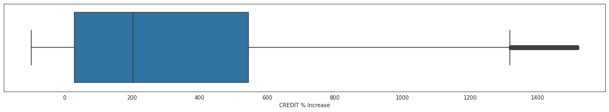


##### Inference: People got a median credit increase of around 200% on their previous loan credit.


```python
data_master1[data_master1['CREDIT % Increase']>0].TARGET.value_counts(normalize=True)*100
```


    0    91.464015
    1     8.535985
    Name: TARGET, dtype: float64


##### Inference: 8.5 % people who got a higher credit than before, defaulted.

### CODE_REJECT_REASON


```python
data_master['CODE_REJECT_REASON'].value_counts()
```


    XAP       1042810
    HC         133253
    LIMIT       43544
    SCO         29635
    CLIENT      20862
    SCOFR       10335
    XNA          3999
    VERIF        2564
    SYSTEM        606
    Name: CODE_REJECT_REASON, dtype: int64


```python
data_master1 = data_master[(data_master['CODE_REJECT_REASON'] != 'XAP') & (data_master['CODE_REJECT_REASON'] != 'XNA')]
```


```python
data_master1.TARGET.mean()*100
```


    11.935265511899965


##### Inference: Around 12% people whose loans were rejected earler, have defaulted in current application.


```python
sns.set_style('darkgrid')
(data_master1.groupby(['CODE_REJECT_REASON']).TARGET.mean()*100).plot.barh()
plt.show()
```


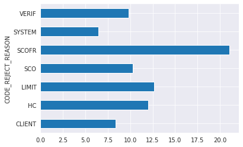


##### Inference: Around 21% people whose loan applications were rejected due to SCOFR previously, have defaulted in current application.

### CHANNEL_TYPE


```python
plt.figure(figsize=(10,7))
data_master.CHANNEL_TYPE.value_counts().plot.pie(autopct='%1.1f%%',fontsize=13,
        shadow=True)
plt.show()
```


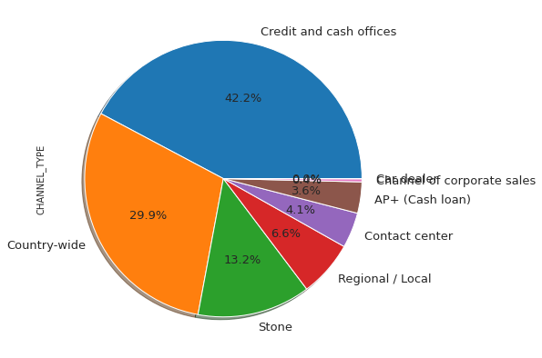


##### Inference: The top 3 channels of acquisition for previous loan applications were Credit and cash offices, Country-wide and Stone.


```python
sns.set_style('darkgrid')
(data_master.groupby(['CHANNEL_TYPE']).TARGET.mean()*100).plot.barh()
plt.show()
```


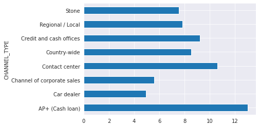


##### Inference: Maximum defaults( 12.6%) were from applicants acquired through AP+(Cash Loan) channel, next (10.7%), the Contact Center channel.

### NAME_SELLER_INDUSTRY


```python
plt.figure(figsize=(10,7))
data_master[data_master['NAME_SELLER_INDUSTRY']!='XNA'].NAME_SELLER_INDUSTRY.value_counts().plot.barh()
plt.show()
```


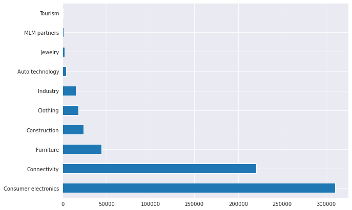


##### Inference: The top 3 industies for the seller for previous loan applications were Consumer Electronics, Connectivity and Furniture.


```python
(data_master[data_master['NAME_SELLER_INDUSTRY']!='XNA'].groupby(['NAME_SELLER_INDUSTRY']).TARGET.mean()*100).plot.barh()
```


    <matplotlib.axes._subplots.AxesSubplot at 0x7f031f7be110>


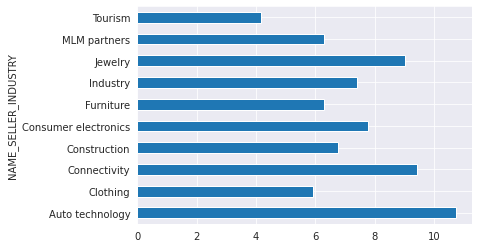


##### Inference: Maximum defaults( 10.6%) were from applicants in the Auto Technology industry, next (9.3%), the Connectivity industry.

### DAYS TERMINATION


```python
# checking whether any loan application has days remaining for termination of loan application.
(data_master[data_master.DAYS_TERMINATION>0]['DAYS_TERMINATION']/365).unique()
```


    array([1000.66575342])


##### Inference: There is clearly some kind of error here, the result shows that all the applications which exist with days remaining on previous application ,have a termination date of the previous application of 1000 years! Hence we'll ignore this (filter).


```python
(data_master[data_master.DAYS_TERMINATION<0]['DAYS_TERMINATION']/365).mean()
```


    -2.6755401427122547


##### Inference: Previous loan applications were on an average terminated 2.6 years before the current application.


# Thanks!

